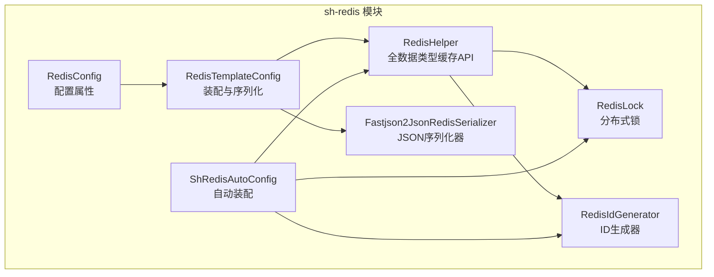
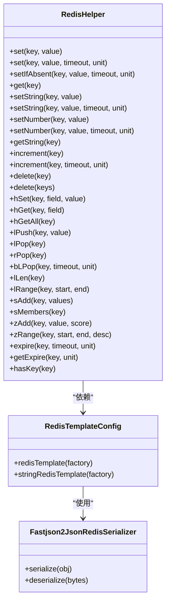
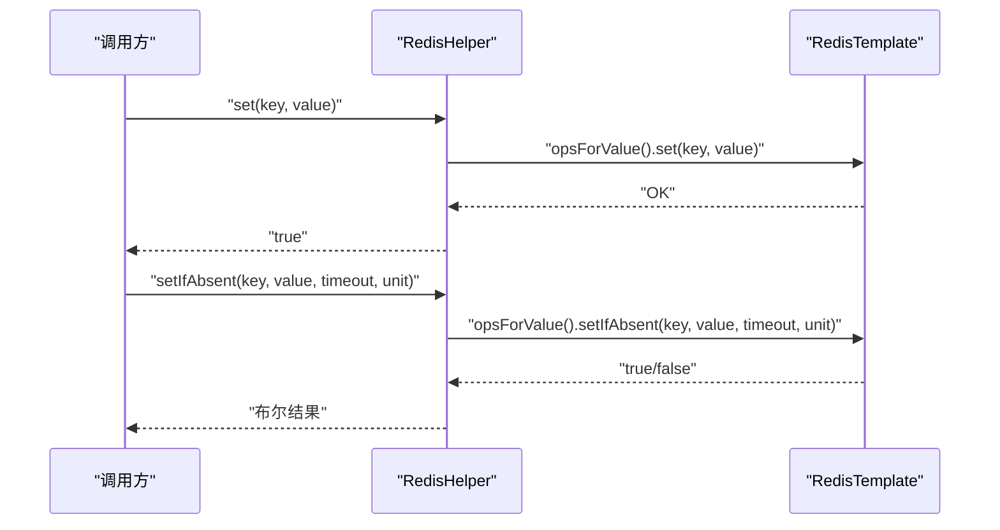
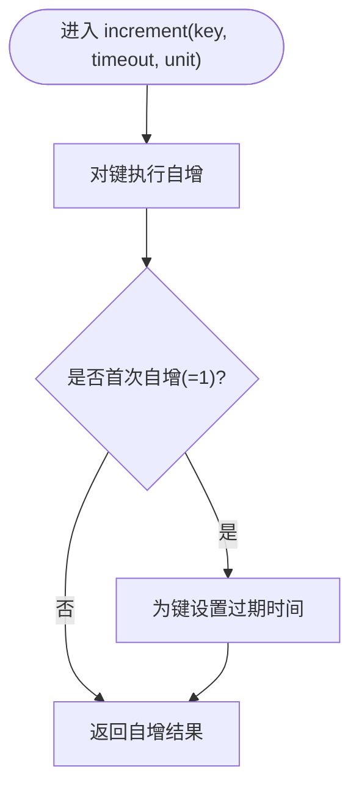
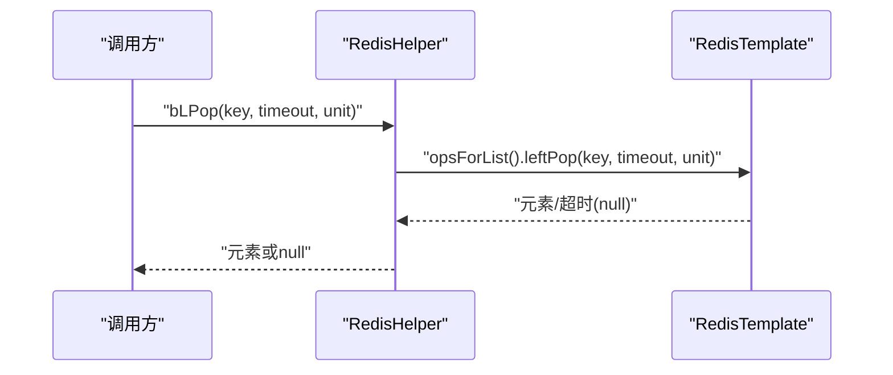
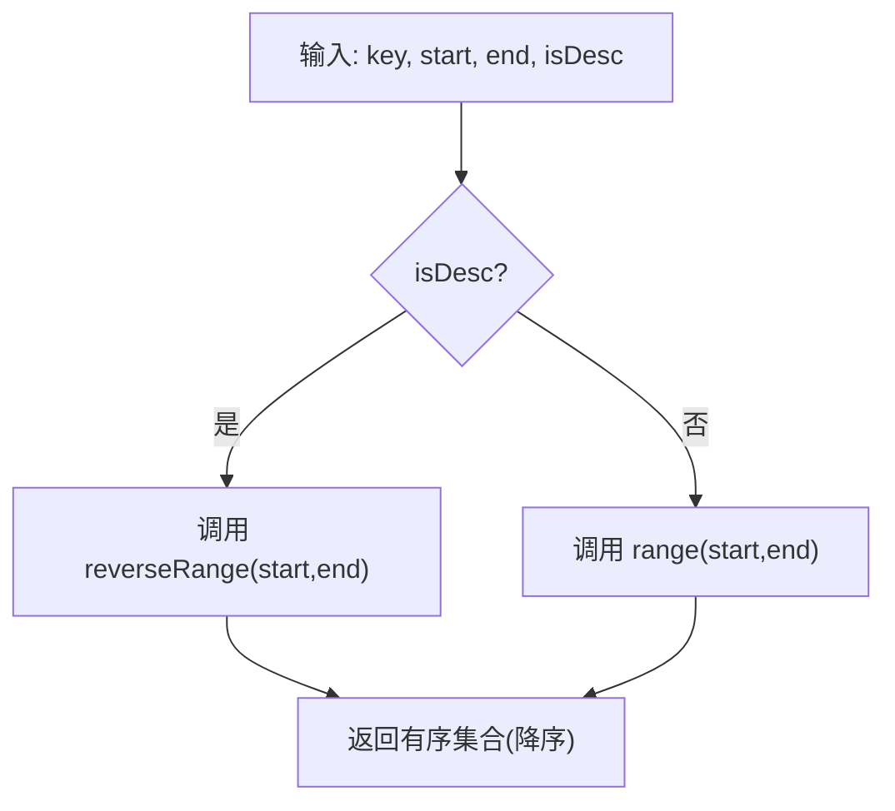
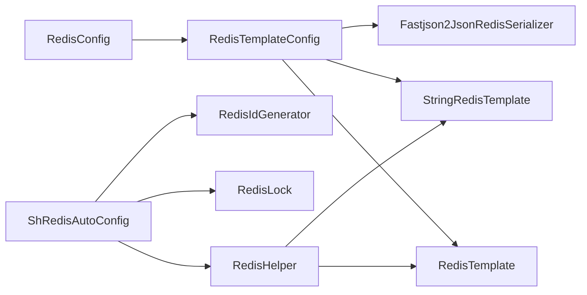

# 缓存操作与数据结构

<cite>
**本文引用的文件**
- [RedisHelper.java](file://sh-redis/src/main/java/com/wkclz/redis/helper/RedisHelper.java)
- [RedisTemplateConfig.java](file://sh-redis/src/main/java/com/wkclz/redis/config/RedisTemplateConfig.java)
- [Fastjson2JsonRedisSerializer.java](file://sh-redis/src/main/java/com/wkclz/redis/serializer/Fastjson2JsonRedisSerializer.java)
- [RedisConfig.java](file://sh-redis/src/main/java/com/wkclz/redis/config/RedisConfig.java)
- [ShRedisAutoConfig.java](file://sh-redis/src/main/java/com/wkclz/redis/ShRedisAutoConfig.java)
- [RedisLock.java](file://sh-redis/src/main/java/com/wkclz/redis/helper/RedisLock.java)
- [RedisIdGenerator.java](file://sh-redis/src/main/java/com/wkclz/redis/helper/RedisIdGenerator.java)
- [US-016-Redis全数据类型缓存操作.md](file://docs/stories/US-016-Redis全数据类型缓存操作.md)
</cite>

## 目录
1. [简介](#简介)
2. [项目结构](#项目结构)
3. [核心组件](#核心组件)
4. [架构总览](#架构总览)
5. [详细组件分析](#详细组件分析)
6. [依赖分析](#依赖分析)
7. [性能考虑](#性能考虑)
8. [故障排查指南](#故障排查指南)
9. [结论](#结论)
10. [附录](#附录)

## 简介
本文件面向业务开发者与架构师，系统化阐述 sh-redis 模块中的 Redis 缓存操作能力，重点围绕 RedisHelper 工具类提供的全数据类型缓存 API，覆盖：
- String/Number 对象存储（set/get/setIfAbsent）
- Hash 哈希（hSet/hGet/hGetAll）
- List 列表（lPush/lPop/rPop/lLen/lRange/bLPop）
- Set 集合（sAdd/sMembers）
- ZSet 有序集合（zAdd/zRange）
- 通用操作（过期时间设置、剩余过期时间查询、键存在性检查、删除）

同时，文档将解释 StringRedisTemplate 与 RedisTemplate 的区别与适用场景，并给出使用示例、异常处理机制、性能优化建议与最佳实践。

## 项目结构
sh-redis 模块采用“配置 + 工具 + 序列化 + 辅助组件”的分层组织方式：
- config：RedisTemplate/StringRedisTemplate 的装配与序列化策略配置
- helper：RedisHelper 缓存工具、RedisLock 分布式锁、RedisIdGenerator ID 生成器
- serializer：基于 fastjson2 的安全序列化器
- ShRedisAutoConfig：自动装配入口

图表来源
- [RedisTemplateConfig.java:1-61](file://sh-redis/src/main/java/com/wkclz/redis/config/RedisTemplateConfig.java#L1-L61)
- [Fastjson2JsonRedisSerializer.java:1-82](file://sh-redis/src/main/java/com/wkclz/redis/serializer/Fastjson2JsonRedisSerializer.java#L1-L82)
- [RedisHelper.java:1-513](file://sh-redis/src/main/java/com/wkclz/redis/helper/RedisHelper.java#L1-L513)
- [RedisLock.java:1-328](file://sh-redis/src/main/java/com/wkclz/redis/helper/RedisLock.java#L1-L328)
- [RedisIdGenerator.java:1-257](file://sh-redis/src/main/java/com/wkclz/redis/helper/RedisIdGenerator.java#L1-L257)
- [RedisConfig.java:1-41](file://sh-redis/src/main/java/com/wkclz/redis/config/RedisConfig.java#L1-L41)
- [ShRedisAutoConfig.java:1-12](file://sh-redis/src/main/java/com/wkclz/redis/ShRedisAutoConfig.java#L1-L12)

章节来源
- [RedisTemplateConfig.java:1-61](file://sh-redis/src/main/java/com/wkclz/redis/config/RedisTemplateConfig.java#L1-L61)
- [RedisHelper.java:1-513](file://sh-redis/src/main/java/com/wkclz/redis/helper/RedisHelper.java#L1-L513)
- [Fastjson2JsonRedisSerializer.java:1-82](file://sh-redis/src/main/java/com/wkclz/redis/serializer/Fastjson2JsonRedisSerializer.java#L1-L82)
- [RedisConfig.java:1-41](file://sh-redis/src/main/java/com/wkclz/redis/config/RedisConfig.java#L1-L41)
- [ShRedisAutoConfig.java:1-12](file://sh-redis/src/main/java/com/wkclz/redis/ShRedisAutoConfig.java#L1-L12)

## 核心组件
- RedisHelper：统一的缓存操作门面，封装 RedisTemplate/StringRedisTemplate 的常用操作，提供幂等、可读性强的 API，并内置异常捕获与日志记录。
- RedisTemplateConfig：负责 RedisTemplate 与 StringRedisTemplate 的 Bean 定义，设置键值序列化策略与 JSON 序列化器。
- Fastjson2JsonRedisSerializer：基于 fastjson2 的安全序列化器，启用 AutoType 白名单过滤，避免反序列化风险。
- RedisLock：基于 SETNX + Lua 原子释放的分布式锁，支持 Watchdog 自动续期与重试获取。
- RedisIdGenerator：基于时间戳 + Redis 自增序列号的 ID 生成器，具备防时间回拨与本地降级策略。

章节来源
- [RedisHelper.java:1-513](file://sh-redis/src/main/java/com/wkclz/redis/helper/RedisHelper.java#L1-L513)
- [RedisTemplateConfig.java:1-61](file://sh-redis/src/main/java/com/wkclz/redis/config/RedisTemplateConfig.java#L1-L61)
- [Fastjson2JsonRedisSerializer.java:1-82](file://sh-redis/src/main/java/com/wkclz/redis/serializer/Fastjson2JsonRedisSerializer.java#L1-L82)
- [RedisLock.java:1-328](file://sh-redis/src/main/java/com/wkclz/redis/helper/RedisLock.java#L1-L328)
- [RedisIdGenerator.java:1-257](file://sh-redis/src/main/java/com/wkclz/redis/helper/RedisIdGenerator.java#L1-L257)

## 架构总览
下图展示 RedisHelper 与底层模板的关系，以及序列化策略如何影响不同数据类型的存储形态。

图表来源
- [RedisHelper.java:1-513](file://sh-redis/src/main/java/com/wkclz/redis/helper/RedisHelper.java#L1-L513)
- [RedisTemplateConfig.java:1-61](file://sh-redis/src/main/java/com/wkclz/redis/config/RedisTemplateConfig.java#L1-L61)
- [Fastjson2JsonRedisSerializer.java:1-82](file://sh-redis/src/main/java/com/wkclz/redis/serializer/Fastjson2JsonRedisSerializer.java#L1-L82)

## 详细组件分析

### RedisHelper：全数据类型缓存 API
RedisHelper 将 Spring Data Redis 的操作抽象为易用的门面方法，覆盖对象存储、字符串/数字、Hash、List、Set、ZSet 与通用操作。每个写操作均包裹 try-catch 并记录错误日志，读操作在键为空时返回空值，避免 NPE。

- 对象存储（RedisTemplate）
  - set(key, value)：保存对象，返回布尔成功标志
  - set(key, value, timeout, unit)：带过期时间的对象存储
  - setIfAbsent(key, value, timeout, unit)：原子性“SETNX + EXPIRE”，适合分布式锁与幂等写入
  - get(key)：读取对象
  - delete(key/keySet)：删除键，支持单键与批量删除
- 字符串/数字（StringRedisTemplate）
  - setString/getString：纯字符串存储与读取
  - setNumber：将数字序列化为字符串存储
  - increment：自增计数，支持首次自增时设置过期时间
- Hash
  - hSet/hGet/hGetAll：字段级读写与全量读取
- List
  - lPush/lPop/rPop：左右侧入栈/出栈
  - bLPop：阻塞式左弹出，支持超时
  - lLen/lRange：长度与区间读取
- Set
  - sAdd/sMembers：添加成员与读取全部成员
- ZSet
  - zAdd：添加有序成员（score）
  - zRange：支持升序/降序范围读取
- 通用
  - expire/getExpire/hasKey：过期时间设置、剩余时间查询、键存在性判断

章节来源
- [RedisHelper.java:28-513](file://sh-redis/src/main/java/com/wkclz/redis/helper/RedisHelper.java#L28-L513)

#### 方法族：对象存储（set/get/delete）

图表来源
- [RedisHelper.java:30-84](file://sh-redis/src/main/java/com/wkclz/redis/helper/RedisHelper.java#L30-L84)

#### 方法族：字符串/数字（setString/setNumber/increment）

图表来源
- [RedisHelper.java:186-214](file://sh-redis/src/main/java/com/wkclz/redis/helper/RedisHelper.java#L186-L214)

#### 数据结构：List 阻塞弹出（bLPop）

图表来源
- [RedisHelper.java:345-352](file://sh-redis/src/main/java/com/wkclz/redis/helper/RedisHelper.java#L345-L352)

#### 数据结构：ZSet 范围读取（zRange）

图表来源
- [RedisHelper.java:447-458](file://sh-redis/src/main/java/com/wkclz/redis/helper/RedisHelper.java#L447-L458)

### RedisTemplate 与 StringRedisTemplate 的区别与适用场景
- RedisTemplate
  - Key/Value 使用泛型，键序列化为 String，值与 Hash 值使用 JSON 序列化器
  - 适用于对象存储、复杂数据结构（Hash/List/Set/ZSet）
- StringRedisTemplate
  - Key/Value 均为 String，适合纯文本/数字计数场景
  - 适用于字符串/数字自增、简单 KV 场景

章节来源
- [RedisTemplateConfig.java:25-59](file://sh-redis/src/main/java/com/wkclz/redis/config/RedisTemplateConfig.java#L25-L59)
- [Fastjson2JsonRedisSerializer.java:16-82](file://sh-redis/src/main/java/com/wkclz/redis/serializer/Fastjson2JsonRedisSerializer.java#L16-L82)

### 序列化策略与安全
- 使用 Fastjson2JsonRedisSerializer，开启 WriteClassName 保留类型信息
- 通过默认白名单与可配置扩展白名单，结合 JSONReader.autoTypeFilter 限制 AutoType 类型，降低反序列化风险
- RedisConfig 提供 auto-type-whitelist 配置项，便于业务类加入白名单

章节来源
- [Fastjson2JsonRedisSerializer.java:16-82](file://sh-redis/src/main/java/com/wkclz/redis/serializer/Fastjson2JsonRedisSerializer.java#L16-L82)
- [RedisConfig.java:25-31](file://sh-redis/src/main/java/com/wkclz/redis/config/RedisConfig.java#L25-L31)

### 使用示例（步骤说明）
以下为常见使用步骤，具体代码请参考对应方法的源码路径：
- 基本对象存储与过期设置
  - set(key, value, timeout, unit)：见 [RedisHelper.java:56-64](file://sh-redis/src/main/java/com/wkclz/redis/helper/RedisHelper.java#L56-L64)
  - setIfAbsent(key, value, timeout, unit)：见 [RedisHelper.java:76-84](file://sh-redis/src/main/java/com/wkclz/redis/helper/RedisHelper.java#L76-L84)
  - get(key)：见 [RedisHelper.java:92-94](file://sh-redis/src/main/java/com/wkclz/redis/helper/RedisHelper.java#L92-L94)
- 字符串/数字与自增
  - setString/getString：见 [RedisHelper.java:105-132](file://sh-redis/src/main/java/com/wkclz/redis/helper/RedisHelper.java#L105-L132)
  - setNumber：见 [RedisHelper.java:141-168](file://sh-redis/src/main/java/com/wkclz/redis/helper/RedisHelper.java#L141-L168)
  - increment：见 [RedisHelper.java:186-214](file://sh-redis/src/main/java/com/wkclz/redis/helper/RedisHelper.java#L186-L214)
- Hash 操作
  - hSet/hGet/hGetAll：见 [RedisHelper.java:258-287](file://sh-redis/src/main/java/com/wkclz/redis/helper/RedisHelper.java#L258-L287)
- List 操作
  - lPush/lPop/rPop/lLen/lRange/bLPop：见 [RedisHelper.java:298-384](file://sh-redis/src/main/java/com/wkclz/redis/helper/RedisHelper.java#L298-L384)
- Set 操作
  - sAdd/sMembers：见 [RedisHelper.java:395-417](file://sh-redis/src/main/java/com/wkclz/redis/helper/RedisHelper.java#L395-L417)
- ZSet 操作
  - zAdd/zRange：见 [RedisHelper.java:429-458](file://sh-redis/src/main/java/com/wkclz/redis/helper/RedisHelper.java#L429-L458)
- 通用操作
  - expire/getExpire/hasKey/delete：见 [RedisHelper.java:470-511](file://sh-redis/src/main/java/com/wkclz/redis/helper/RedisHelper.java#L470-L511)

章节来源
- [RedisHelper.java:28-513](file://sh-redis/src/main/java/com/wkclz/redis/helper/RedisHelper.java#L28-L513)

### 异常处理机制
- 所有写操作（set系列、hSet、lPush、sAdd、zAdd、expire、increment、delete）均使用 try-catch 包裹，发生异常时记录日志并返回失败标志（如 false/0/null），避免异常向上传播
- 读操作（get、hGet、lRange、sMembers、zRange、getExpire、hasKey）在键为空时返回空值或 0，避免 NPE

章节来源
- [RedisHelper.java:37-84](file://sh-redis/src/main/java/com/wkclz/redis/helper/RedisHelper.java#L37-L84)
- [RedisHelper.java:92-94](file://sh-redis/src/main/java/com/wkclz/redis/helper/RedisHelper.java#L92-L94)
- [RedisHelper.java:105-168](file://sh-redis/src/main/java/com/wkclz/redis/helper/RedisHelper.java#L105-L168)
- [RedisHelper.java:258-384](file://sh-redis/src/main/java/com/wkclz/redis/helper/RedisHelper.java#L258-L384)
- [RedisHelper.java:429-511](file://sh-redis/src/main/java/com/wkclz/redis/helper/RedisHelper.java#L429-L511)

## 依赖分析
- RedisHelper 依赖 RedisTemplate 与 StringRedisTemplate
- RedisTemplateConfig 负责装配 RedisTemplate 与 StringRedisTemplate，并注入 Fastjson2JsonRedisSerializer
- RedisConfig 提供 host/port/password/database/auto-type-whitelist 等配置
- ShRedisAutoConfig 触发组件扫描与装配

图表来源
- [RedisConfig.java:14-41](file://sh-redis/src/main/java/com/wkclz/redis/config/RedisConfig.java#L14-L41)
- [RedisTemplateConfig.java:20-61](file://sh-redis/src/main/java/com/wkclz/redis/config/RedisTemplateConfig.java#L20-L61)
- [ShRedisAutoConfig.java:6-12](file://sh-redis/src/main/java/com/wkclz/redis/ShRedisAutoConfig.java#L6-L12)
- [RedisHelper.java:22-26](file://sh-redis/src/main/java/com/wkclz/redis/helper/RedisHelper.java#L22-L26)

章节来源
- [RedisConfig.java:14-41](file://sh-redis/src/main/java/com/wkclz/redis/config/RedisConfig.java#L14-L41)
- [RedisTemplateConfig.java:20-61](file://sh-redis/src/main/java/com/wkclz/redis/config/RedisTemplateConfig.java#L20-L61)
- [ShRedisAutoConfig.java:6-12](file://sh-redis/src/main/java/com/wkclz/redis/ShRedisAutoConfig.java#L6-L12)
- [RedisHelper.java:22-26](file://sh-redis/src/main/java/com/wkclz/redis/helper/RedisHelper.java#L22-L26)

## 性能考虑
- 选择合适的模板
  - 存储对象与复杂结构：使用 RedisTemplate，利用 JSON 序列化器减少手动编解码成本
  - 纯字符串/数字计数：使用 StringRedisTemplate，避免不必要的序列化开销
- 批量操作
  - 使用批量删除（delete(Set keys)）减少网络往返
  - List 的 lPush 支持一次性压入多个元素；Set 的 sAdd 支持一次性添加多个成员
- 过期策略
  - 对热点数据设置合理 TTL，避免内存膨胀
  - 使用 increment 首次自增时设置过期时间，避免冷键长期占用
- 序列化
  - Fastjson2JsonRedisSerializer 已启用 WriteClassName，序列化/反序列化效率较高；仅允许白名单类型，兼顾安全与性能
- 线程模型
  - RedisHelper 的写操作为同步阻塞，建议在业务线程池中调用，避免阻塞 IO 线程

[本节为通用性能建议，不直接分析具体文件]

## 故障排查指南
- 写操作总是返回失败
  - 检查 Redis 连接配置（host/port/password/database）与网络连通性
  - 查看 RedisTemplateConfig 的 Bean 是否正确装配
  - 关注 RedisHelper 中的异常日志，确认是否被 try-catch 捕获
- 反序列化失败或类型不匹配
  - 确认 auto-type-whitelist 是否包含业务类前缀
  - 检查 Fastjson2JsonRedisSerializer 的白名单组合逻辑
- 锁相关问题
  - 使用 RedisLock 的 tryLockWithWatchdog 获取锁，确认 Watchdog 续期线程是否正常
  - 释放锁时使用 Lua 脚本，确保 requestId 匹配，避免误删
- ID 生成异常
  - Redis 不可用时会降级为本地生成策略，检查本地序列号与时间戳逻辑

章节来源
- [RedisHelper.java:37-84](file://sh-redis/src/main/java/com/wkclz/redis/helper/RedisHelper.java#L37-L84)
- [RedisTemplateConfig.java:20-61](file://sh-redis/src/main/java/com/wkclz/redis/config/RedisTemplateConfig.java#L20-L61)
- [Fastjson2JsonRedisSerializer.java:42-55](file://sh-redis/src/main/java/com/wkclz/redis/serializer/Fastjson2JsonRedisSerializer.java#L42-L55)
- [RedisLock.java:166-216](file://sh-redis/src/main/java/com/wkclz/redis/helper/RedisLock.java#L166-L216)
- [RedisIdGenerator.java:117-163](file://sh-redis/src/main/java/com/wkclz/redis/helper/RedisIdGenerator.java#L117-L163)

## 结论
RedisHelper 通过统一的 API 抽象，屏蔽了 RedisTemplate 的复杂性，使业务开发者能够以最小心智成本完成全数据类型的缓存操作。配合安全的序列化策略、完善的异常处理与丰富的通用操作，该工具类在性能与安全性之间取得良好平衡。建议在对象存储场景使用 RedisTemplate，在字符串/数字计数场景使用 StringRedisTemplate，并根据业务需求合理设置过期时间与批量操作策略。

[本节为总结性内容，不直接分析具体文件]

## 附录

### API 一览与参数说明
- 对象存储
  - set(key, value)：保存对象，返回布尔
  - set(key, value, timeout, unit)：带过期时间，返回布尔
  - setIfAbsent(key, value, timeout, unit)：原子性“SETNX + EXPIRE”，返回布尔
  - get(key)：读取对象
  - delete(key)：删除单键，返回布尔
  - delete(keys)：批量删除，返回删除数量
- 字符串/数字
  - setString/getString：纯字符串存取
  - setNumber：数字存取（内部序列化为字符串）
  - increment：自增，支持首次自增时设置过期时间
- Hash
  - hSet/hGet/hGetAll：字段级读写与全量读取
- List
  - lPush/lPop/rPop：左右侧入栈/出栈
  - bLPop：阻塞式左弹出
  - lLen/lRange：长度与区间读取
- Set
  - sAdd：添加成员，返回新增数量
  - sMembers：读取全部成员
- ZSet
  - zAdd：添加有序成员，返回布尔
  - zRange：范围读取，支持升序/降序
- 通用
  - expire：设置过期时间，返回布尔
  - getExpire：查询剩余过期时间
  - hasKey：键存在性检查

章节来源
- [RedisHelper.java:28-513](file://sh-redis/src/main/java/com/wkclz/redis/helper/RedisHelper.java#L28-L513)

### 验收场景参考
- 场景1：set(key, value, 30, TimeUnit.MINUTES) 返回 true，且 key 在 30 分钟后过期
- 场景2：hSet(user:001, name, 张三) 后 hGet(user:001, name) 返回 张三
- 场景3：zAdd(rank, player1, 95.5) 后 zRange(rank, 0, -1, true) 返回按分数降序的集合
- 异常场景：Redis 连接异常时，写操作返回 false 而不抛出异常

章节来源
- [US-016-Redis全数据类型缓存操作.md:74-77](file://docs/stories/US-016-Redis全数据类型缓存操作.md#L74-L77)