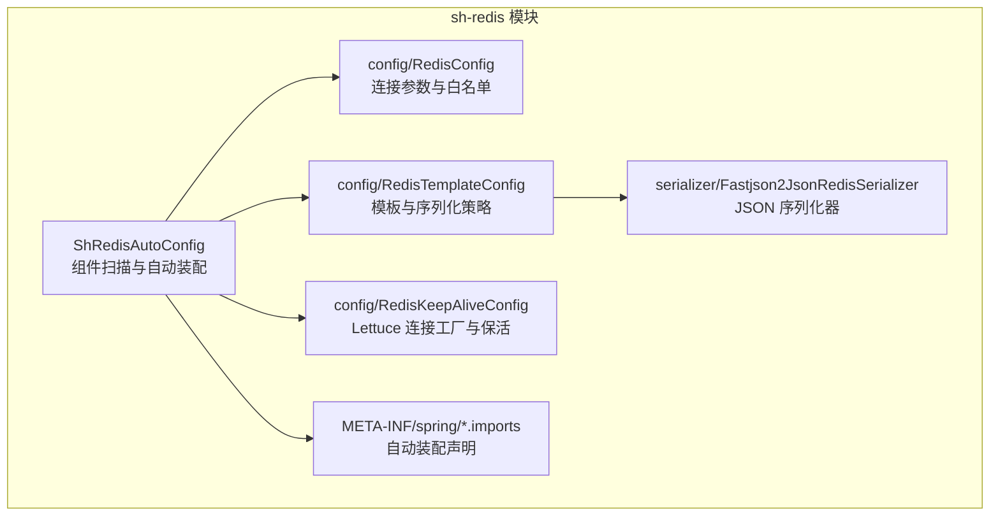
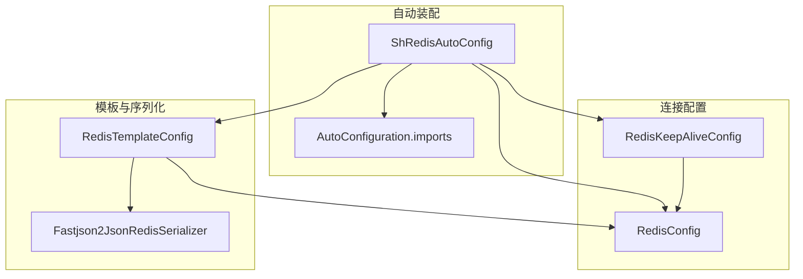
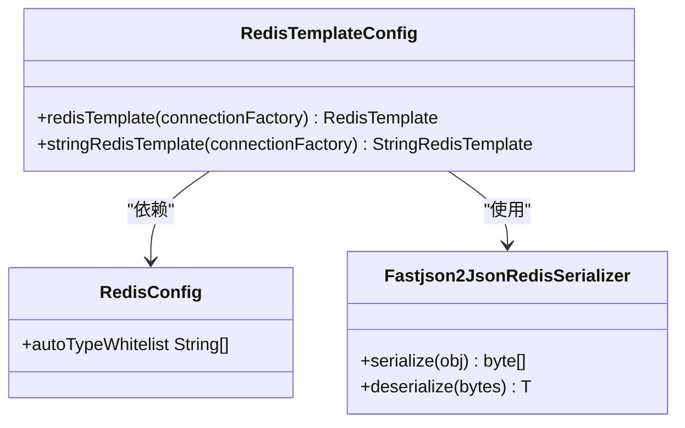
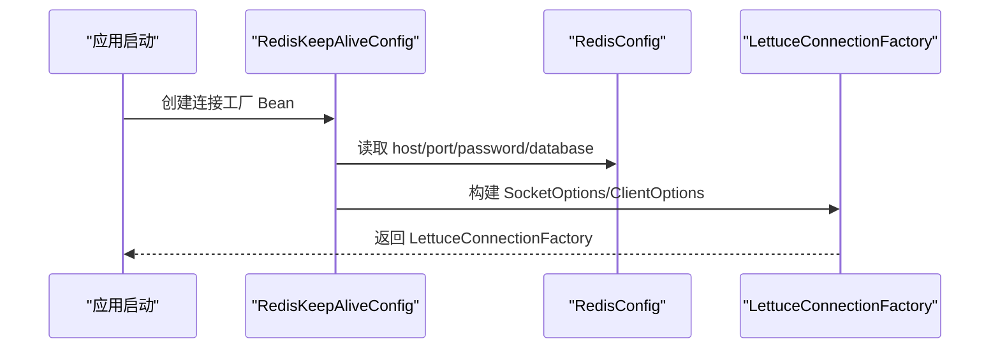
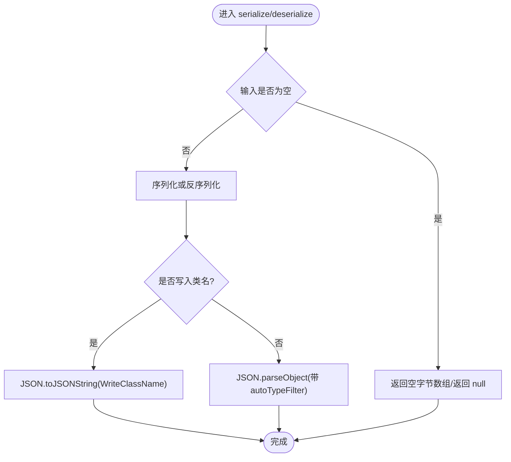
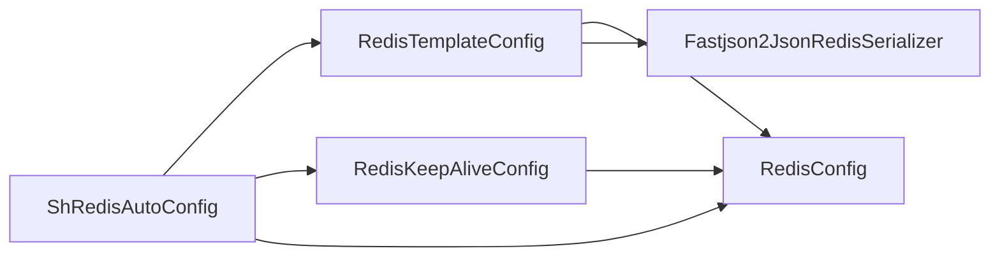

# 连接配置与序列化

<cite>
**本文引用的文件**
- [RedisConfig.java](file://sh-redis/src/main/java/com/wkclz/redis/config/RedisConfig.java)
- [RedisTemplateConfig.java](file://sh-redis/src/main/java/com/wkclz/redis/config/RedisTemplateConfig.java)
- [RedisKeepAliveConfig.java](file://sh-redis/src/main/java/com/wkclz/redis/config/RedisKeepAliveConfig.java)
- [Fastjson2JsonRedisSerializer.java](file://sh-redis/src/main/java/com/wkclz/redis/serializer/Fastjson2JsonRedisSerializer.java)
- [ShRedisAutoConfig.java](file://sh-redis/src/main/java/com/wkclz/redis/ShRedisAutoConfig.java)
- [org.springframework.boot.autoconfigure.AutoConfiguration.imports](file://sh-redis/src/main/resources/META-INF/spring/org.springframework.boot.autoconfigure.AutoConfiguration.imports)
</cite>

## 目录
1. [简介](#简介)
2. [项目结构](#项目结构)
3. [核心组件](#核心组件)
4. [架构总览](#架构总览)
5. [详细组件分析](#详细组件分析)
6. [依赖关系分析](#依赖关系分析)
7. [性能考量](#性能考量)
8. [故障排查指南](#故障排查指南)
9. [结论](#结论)
10. [附录：配置示例与最佳实践](#附录配置示例与最佳实践)

## 简介
本文件围绕 Redis 连接配置与序列化能力，系统性梳理 sh-redis 模块中的关键配置类与序列化器实现，重点覆盖：
- RedisConfig：连接参数与 AutoType 白名单扩展
- RedisTemplateConfig：RedisTemplate 与 StringRedisTemplate 的模板配置，含键值序列化策略与默认操作
- RedisKeepAliveConfig：基于 Lettuce 的心跳与连接稳定性配置
- Fastjson2JsonRedisSerializer：基于 fastjson2 的 JSON 序列化器，含类型安全与白名单机制
- 自动配置集成：Spring Boot 自动装配与组件扫描

## 项目结构
sh-redis 模块采用按职责分层的组织方式，核心文件位于 config 与 serializer 包下，并通过 ShRedisAutoConfig 与自动导入文件完成 Spring Boot 自动装配。

图表来源
- [ShRedisAutoConfig.java:1-12](file://sh-redis/src/main/java/com/wkclz/redis/ShRedisAutoConfig.java#L1-L12)
- [RedisConfig.java:1-41](file://sh-redis/src/main/java/com/wkclz/redis/config/RedisConfig.java#L1-L41)
- [RedisTemplateConfig.java:1-61](file://sh-redis/src/main/java/com/wkclz/redis/config/RedisTemplateConfig.java#L1-L61)
- [RedisKeepAliveConfig.java:1-52](file://sh-redis/src/main/java/com/wkclz/redis/config/RedisKeepAliveConfig.java#L1-L52)
- [Fastjson2JsonRedisSerializer.java:1-82](file://sh-redis/src/main/java/com/wkclz/redis/serializer/Fastjson2JsonRedisSerializer.java#L1-L82)
- [org.springframework.boot.autoconfigure.AutoConfiguration.imports](file://sh-redis/src/main/resources/META-INF/spring/org.springframework.boot.autoconfigure.AutoConfiguration.imports)

章节来源
- [ShRedisAutoConfig.java:1-12](file://sh-redis/src/main/java/com/wkclz/redis/ShRedisAutoConfig.java#L1-L12)
- [org.springframework.boot.autoconfigure.AutoConfiguration.imports](file://sh-redis/src/main/resources/META-INF/spring/org.springframework.boot.autoconfigure.AutoConfiguration.imports)

## 核心组件
- RedisConfig：负责读取连接主机、端口、密码、数据库索引以及 AutoType 白名单扩展；同时提供 RedisMessageListenerContainer Bean，便于订阅监听。
- RedisTemplateConfig：在自动配置中创建 RedisTemplate 与 StringRedisTemplate，统一设置键与哈希键的字符串序列化，值与哈希值采用 Fastjson2JsonRedisSerializer，并注入 RedisConfig 中的白名单。
- RedisKeepAliveConfig：基于 Lettuce 的连接工厂配置，启用 TCP keep-alive、TCP NoDelay、连接超时与命令超时，确保连接稳定与低延迟。
- Fastjson2JsonRedisSerializer：实现 RedisSerializer 接口，使用 fastjson2 进行序列化与反序列化，内置默认白名单与可扩展白名单，防止 AutoType 漏洞风险。

章节来源
- [RedisConfig.java:15-41](file://sh-redis/src/main/java/com/wkclz/redis/config/RedisConfig.java#L15-L41)
- [RedisTemplateConfig.java:22-61](file://sh-redis/src/main/java/com/wkclz/redis/config/RedisTemplateConfig.java#L22-L61)
- [RedisKeepAliveConfig.java:22-50](file://sh-redis/src/main/java/com/wkclz/redis/config/RedisKeepAliveConfig.java#L22-L50)
- [Fastjson2JsonRedisSerializer.java:25-82](file://sh-redis/src/main/java/com/wkclz/redis/serializer/Fastjson2JsonRedisSerializer.java#L25-L82)

## 架构总览
整体架构围绕 Spring Boot 自动装配展开，ShRedisAutoConfig 扫描 com.wkclz.redis 包并注册各配置 Bean；RedisTemplateConfig 依赖 RedisConfig 提供的白名单；RedisKeepAliveConfig 通过 Lettuce 创建连接工厂，供 RedisTemplateConfig 使用。

图表来源
- [ShRedisAutoConfig.java:6-9](file://sh-redis/src/main/java/com/wkclz/redis/ShRedisAutoConfig.java#L6-L9)
- [org.springframework.boot.autoconfigure.AutoConfiguration.imports](file://sh-redis/src/main/resources/META-INF/spring/org.springframework.boot.autoconfigure.AutoConfiguration.imports)
- [RedisConfig.java:14-31](file://sh-redis/src/main/java/com/wkclz/redis/config/RedisConfig.java#L14-L31)
- [RedisTemplateConfig.java:19-46](file://sh-redis/src/main/java/com/wkclz/redis/config/RedisTemplateConfig.java#L19-L46)
- [RedisKeepAliveConfig.java:15-50](file://sh-redis/src/main/java/com/wkclz/redis/config/RedisKeepAliveConfig.java#L15-L50)
- [Fastjson2JsonRedisSerializer.java:25-55](file://sh-redis/src/main/java/com/wkclz/redis/serializer/Fastjson2JsonRedisSerializer.java#L25-L55)

## 详细组件分析

### RedisConfig：连接参数与白名单扩展
- 功能要点
  - 读取连接参数：host、port、password、database
  - 提供 AutoType 白名单扩展项 autoTypeWhitelist，用于扩展业务类的包前缀
  - 提供 RedisMessageListenerContainer Bean，便于订阅消息监听
- 设计考量
  - 使用 Lombok 的 @Data 简化 getter/setter
  - 白名单扩展通过配置项注入，便于业务自定义
- 典型用途
  - 作为其他配置类的依赖，提供统一的连接参数来源

章节来源
- [RedisConfig.java:16-31](file://sh-redis/src/main/java/com/wkclz/redis/config/RedisConfig.java#L16-L31)
- [RedisConfig.java:33-38](file://sh-redis/src/main/java/com/wkclz/redis/config/RedisConfig.java#L33-L38)

### RedisTemplateConfig：模板与序列化策略
- 功能要点
  - 创建 RedisTemplate<String, Object>：键与哈希键使用 StringRedisSerializer，值与哈希值使用 Fastjson2JsonRedisSerializer
  - 创建 StringRedisTemplate：直接使用字符串序列化，适合字符串/数值场景
  - 从 RedisConfig 注入 autoTypeWhitelist，传递给序列化器
- 序列化策略
  - 键序列化：StringRedisSerializer，保证键的可读性与兼容性
  - 值序列化：Fastjson2JsonRedisSerializer，写入时包含类信息，读取时按白名单进行类型解析
- 默认操作
  - afterPropertiesSet() 完成模板初始化

图表来源
- [RedisTemplateConfig.java:22-61](file://sh-redis/src/main/java/com/wkclz/redis/config/RedisTemplateConfig.java#L22-L61)
- [RedisConfig.java:30](file://sh-redis/src/main/java/com/wkclz/redis/config/RedisConfig.java#L30)
- [Fastjson2JsonRedisSerializer.java:25-82](file://sh-redis/src/main/java/com/wkclz/redis/serializer/Fastjson2JsonRedisSerializer.java#L25-L82)

章节来源
- [RedisTemplateConfig.java:31-46](file://sh-redis/src/main/java/com/wkclz/redis/config/RedisTemplateConfig.java#L31-L46)
- [RedisTemplateConfig.java:54-59](file://sh-redis/src/main/java/com/wkclz/redis/config/RedisTemplateConfig.java#L54-L59)

### RedisKeepAliveConfig：连接保活与稳定性
- 功能要点
  - 使用 LettuceConnectionFactory 创建连接工厂
  - 启用 SocketOptions.keepAlive 与 tcpNoDelay，降低网络延迟
  - 设置连接超时与命令超时，确保连接建立与命令执行的可靠性
  - 从 RedisConfig 读取 host、port、password、database
- 设计考量
  - 密码非空时才设置，避免空字符串导致认证失败
  - 命令超时必须小于等于 spring.redis.timeout（由注释提示）

图表来源
- [RedisKeepAliveConfig.java:22-50](file://sh-redis/src/main/java/com/wkclz/redis/config/RedisKeepAliveConfig.java#L22-L50)
- [RedisConfig.java:16-23](file://sh-redis/src/main/java/com/wkclz/redis/config/RedisConfig.java#L16-L23)

章节来源
- [RedisKeepAliveConfig.java:22-50](file://sh-redis/src/main/java/com/wkclz/redis/config/RedisKeepAliveConfig.java#L22-L50)

### Fastjson2JsonRedisSerializer：JSON 序列化器
- 功能要点
  - 写入：使用 JSON.toJSONString，开启 WriteClassName，记录类型信息
  - 读取：使用 JSON.parseObject，结合 autoTypeFilter 仅允许白名单类实例化
  - 白名单：默认包含 com.wkclz.、java.util.、java.lang.、java.time.；可通过 RedisConfig 的 autoTypeWhitelist 扩展
- 安全性
  - 采用 JSONReader.autoTypeFilter 替代 SupportAutoType，限制 AutoType 可用范围，防范 @type 注入风险
- 异常处理
  - 序列化/反序列化异常包装为 SerializationException，便于上层捕获与处理

图表来源
- [Fastjson2JsonRedisSerializer.java:57-80](file://sh-redis/src/main/java/com/wkclz/redis/serializer/Fastjson2JsonRedisSerializer.java#L57-L80)

章节来源
- [Fastjson2JsonRedisSerializer.java:25-82](file://sh-redis/src/main/java/com/wkclz/redis/serializer/Fastjson2JsonRedisSerializer.java#L25-L82)

## 依赖关系分析
- 组件耦合
  - RedisTemplateConfig 依赖 RedisConfig 获取白名单
  - RedisKeepAliveConfig 依赖 RedisConfig 获取连接参数
  - ShRedisAutoConfig 扫描并注册上述 Bean
- 外部依赖
  - Lettuce（连接工厂）
  - fastjson2（序列化）
  - Spring Data Redis（RedisTemplate、StringRedisTemplate、RedisSerializer）

图表来源
- [RedisTemplateConfig.java:22-46](file://sh-redis/src/main/java/com/wkclz/redis/config/RedisTemplateConfig.java#L22-L46)
- [RedisKeepAliveConfig.java:18-50](file://sh-redis/src/main/java/com/wkclz/redis/config/RedisKeepAliveConfig.java#L18-L50)
- [ShRedisAutoConfig.java:6-9](file://sh-redis/src/main/java/com/wkclz/redis/ShRedisAutoConfig.java#L6-L9)

章节来源
- [RedisTemplateConfig.java:22-46](file://sh-redis/src/main/java/com/wkclz/redis/config/RedisTemplateConfig.java#L22-L46)
- [RedisKeepAliveConfig.java:18-50](file://sh-redis/src/main/java/com/wkclz/redis/config/RedisKeepAliveConfig.java#L18-L50)
- [ShRedisAutoConfig.java:6-9](file://sh-redis/src/main/java/com/wkclz/redis/ShRedisAutoConfig.java#L6-L9)

## 性能考量
- 序列化器选择
  - JSON（fastjson2）：跨语言友好、易调试，适合对象存储；注意白名单带来的类型解析开销
  - String 序列化：键/字符串场景首选，零序列化成本
- 连接稳定性
  - TCP keep-alive 与 NoDelay 降低网络抖动影响
  - 合理设置连接超时与命令超时，避免阻塞与资源浪费
- 并发与池化
  - Lettuce 默认具备连接池与异步特性，建议结合业务 QPS 调整命令超时与连接数上限

[本节为通用性能讨论，无需特定文件来源]

## 故障排查指南
- 认证失败
  - 确认密码非空时才设置；空密码可能导致认证失败
- AutoType 安全异常
  - 若遇到反序列化失败或类型不受支持，检查 RedisConfig 的 autoTypeWhitelist 是否包含业务类包前缀
- 超时问题
  - 命令超时需不大于 spring.redis.timeout；否则可能触发超时异常
- 连接不稳定
  - 检查网络环境与防火墙策略；确认 keep-alive 与 tcpNoDelay 已启用

章节来源
- [RedisKeepAliveConfig.java:37-47](file://sh-redis/src/main/java/com/wkclz/redis/config/RedisKeepAliveConfig.java#L37-L47)
- [Fastjson2JsonRedisSerializer.java:46-55](file://sh-redis/src/main/java/com/wkclz/redis/serializer/Fastjson2JsonRedisSerializer.java#L46-L55)

## 结论
该模块通过清晰的职责划分与自动装配机制，提供了稳定可靠的 Redis 连接与序列化能力。RedisConfig 提供统一的连接参数与白名单扩展；RedisTemplateConfig 明确键值序列化策略并集成安全的 JSON 序列化器；RedisKeepAliveConfig 则通过 Lettuce 优化连接稳定性。整体设计兼顾安全性、可维护性与性能。

[本节为总结性内容，无需特定文件来源]

## 附录：配置示例与最佳实践

### Spring Boot 自动配置集成
- 自动装配入口
  - ShRedisAutoConfig 扫描 com.wkclz.redis 包并注册相关 Bean
  - 自动装配声明文件位于 META-INF/spring，确保框架启动时自动加载
- 关键 Bean
  - LettuceConnectionFactory（由 RedisKeepAliveConfig 创建）
  - RedisTemplate<String, Object> 与 StringRedisTemplate（由 RedisTemplateConfig 创建）
  - RedisMessageListenerContainer（由 RedisConfig 创建）

章节来源
- [ShRedisAutoConfig.java:6-9](file://sh-redis/src/main/java/com/wkclz/redis/ShRedisAutoConfig.java#L6-L9)
- [org.springframework.boot.autoconfigure.AutoConfiguration.imports](file://sh-redis/src/main/resources/META-INF/spring/org.springframework.boot.autoconfigure.AutoConfiguration.imports)
- [RedisTemplateConfig.java:31-59](file://sh-redis/src/main/java/com/wkclz/redis/config/RedisTemplateConfig.java#L31-L59)
- [RedisKeepAliveConfig.java:22-50](file://sh-redis/src/main/java/com/wkclz/redis/config/RedisKeepAliveConfig.java#L22-L50)
- [RedisConfig.java:33-38](file://sh-redis/src/main/java/com/wkclz/redis/config/RedisConfig.java#L33-L38)

### 单机模式配置要点
- 连接参数
  - host、port、password（可选）、database
- 序列化策略
  - 键/哈希键：StringRedisSerializer
  - 值/哈希值：Fastjson2JsonRedisSerializer（包含类信息）
- 白名单扩展
  - 在 sh.redis.auto-type-whitelist 中添加业务类包前缀

章节来源
- [RedisConfig.java:16-31](file://sh-redis/src/main/java/com/wkclz/redis/config/RedisConfig.java#L16-L31)
- [RedisTemplateConfig.java:36-45](file://sh-redis/src/main/java/com/wkclz/redis/config/RedisTemplateConfig.java#L36-L45)
- [Fastjson2JsonRedisSerializer.java:46-55](file://sh-redis/src/main/java/com/wkclz/redis/serializer/Fastjson2JsonRedisSerializer.java#L46-L55)

### 集群与哨兵模式说明
- 当前实现
  - RedisKeepAliveConfig 采用 RedisStandaloneConfiguration，适用于单机模式
- 扩展建议
  - 如需集群/哨兵，请参考 Spring Data Redis 的相应配置类（如 RedisClusterConfiguration、SentinelConfiguration），并在 ShRedisAutoConfig 下新增对应 Bean 或替换现有连接工厂 Bean
- 注意事项
  - 保持序列化策略一致（键使用 String 序列化，值使用 JSON 序列化器）
  - 确保 autoTypeWhitelist 覆盖所有业务类包前缀

[本小节为扩展性建议，未直接分析具体文件，故不附加“章节来源”]

### 不同序列化器的性能与适用场景
- JSON（fastjson2）
  - 优点：跨语言、易调试、支持复杂对象
  - 缺点：序列化/反序列化开销略高
  - 适用：对象存储、需要类型保留的场景
- String 序列化
  - 优点：零序列化成本、键/字符串场景首选
  - 适用：字符串/数值、键空间较大的场景
- 二进制序列化（如 JDK/Protostuff）
  - 优点：体积更小、性能更高
  - 缺点：可读性差、跨语言困难
  - 适用：高性能、低延迟、内部服务间通信

[本小节为通用指导，无需特定文件来源]

### 最佳实践
- 安全
  - 明确 autoTypeWhitelist，避免使用通配符
  - 生产环境务必设置密码
- 性能
  - 键使用 String 序列化，减少序列化开销
  - 对热点对象优先考虑 String/数值存储
- 稳定性
  - 启用 keep-alive 与 tcpNoDelay
  - 合理设置连接与命令超时
  - 监控连接池状态与命令耗时

[本小节为通用指导，无需特定文件来源]