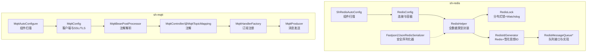
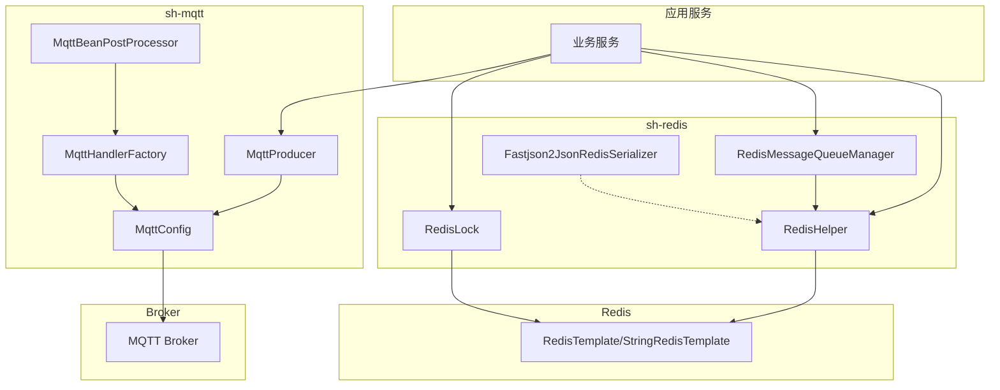
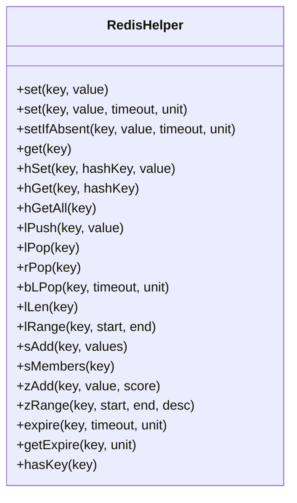
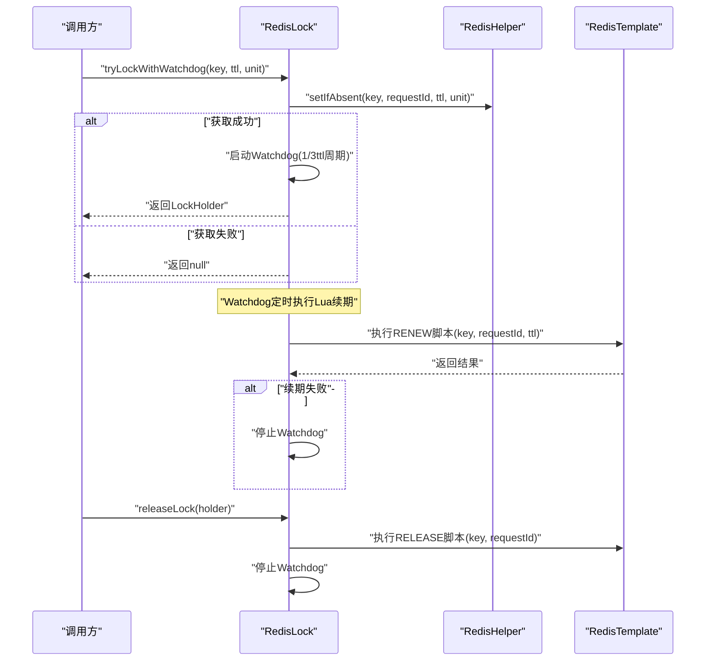
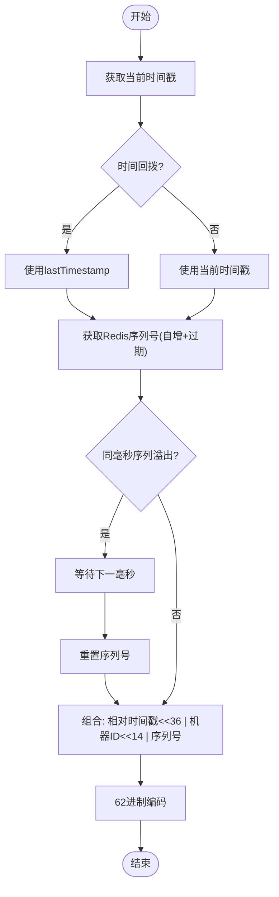
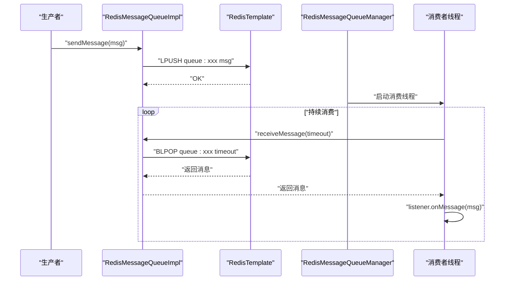
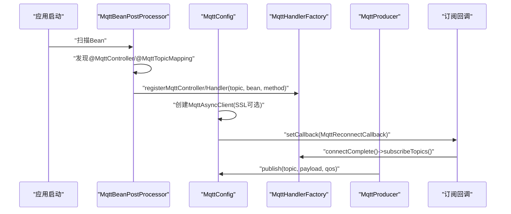
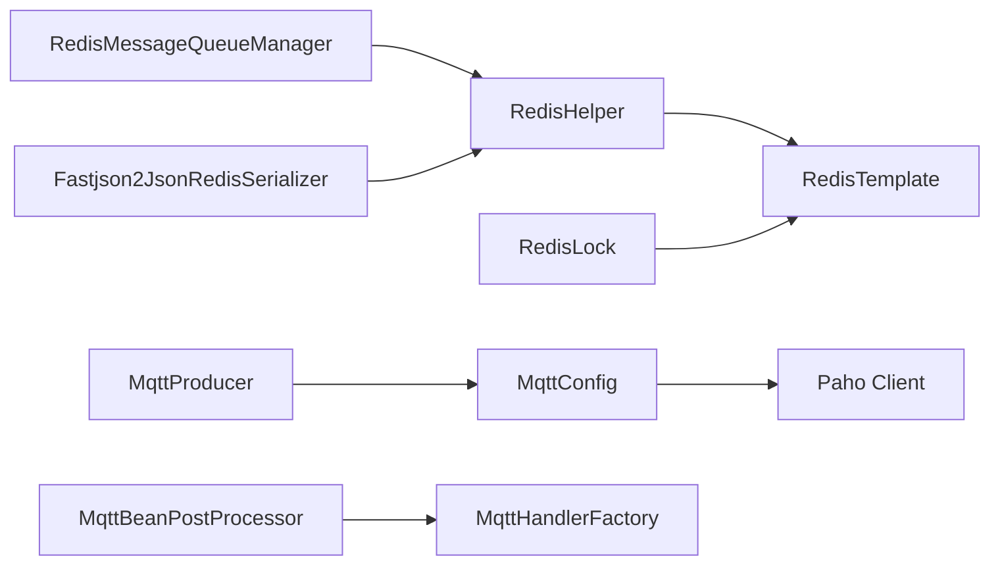

# 缓存与消息模块（sh-redis & sh-mqtt）

<cite>
**本文引用的文件**   
- [ShRedisAutoConfig.java](file://sh-redis/src/main/java/com/wkclz/redis/ShRedisAutoConfig.java)
- [RedisConfig.java](file://sh-redis/src/main/java/com/wkclz/redis/config/RedisConfig.java)
- [RedisHelper.java](file://sh-redis/src/main/java/com/wkclz/redis/helper/RedisHelper.java)
- [RedisLock.java](file://sh-redis/src/main/java/com/wkclz/redis/helper/RedisLock.java)
- [LockHolder.java](file://sh-redis/src/main/java/com/wkclz/redis/helper/LockHolder.java)
- [RedisIdGenerator.java](file://sh-redis/src/main/java/com/wkclz/redis/helper/RedisIdGenerator.java)
- [RedisMessageQueue.java](file://sh-redis/src/main/java/com/wkclz/redis/queue/RedisMessageQueue.java)
- [RedisMessageQueueImpl.java](file://sh-redis/src/main/java/com/wkclz/redis/queue/RedisMessageQueueImpl.java)
- [RedisMessageQueueManager.java](file://sh-redis/src/main/java/com/wkclz/redis/queue/RedisMessageQueueManager.java)
- [Fastjson2JsonRedisSerializer.java](file://sh-redis/src/main/java/com/wkclz/redis/serializer/Fastjson2JsonRedisSerializer.java)
- [MqttAutoConfigure.java](file://sh-mqtt/src/main/java/com/wkclz/mqtt/MqttAutoConfigure.java)
- [MqttConfig.java](file://sh-mqtt/src/main/java/com/wkclz/mqtt/config/MqttConfig.java)
- [MqttBeanPostProcessor.java](file://sh-mqtt/src/main/java/com/wkclz/mqtt/config/MqttBeanPostProcessor.java)
- [MqttController.java](file://sh-mqtt/src/main/java/com/wkclz/mqtt/annotation/MqttController.java)
- [MqttTopicMapping.java](file://sh-mqtt/src/main/java/com/wkclz/mqtt/annotation/MqttTopicMapping.java)
- [MqttHandlerFactory.java](file://sh-mqtt/src/main/java/com/wkclz/mqtt/handler/MqttHandlerFactory.java)
- [MqttProducer.java](file://sh-mqtt/src/main/java/com/wkclz/mqtt/client/MqttProducer.java)
- [MqttConsumerDemo.java](file://sh-mqtt/src/main/java/com/wkclz/mqtt/demo/MqttConsumerDemo.java)
- [MqttProducerDemo.java](file://sh-mqtt/src/main/java/com/wkclz/mqtt/demo/MqttProducerDemo.java)
</cite>

## 目录
1. [简介](#简介)
2. [项目结构](#项目结构)
3. [核心组件](#核心组件)
4. [架构总览](#架构总览)
5. [详细组件分析](#详细组件分析)
6. [依赖分析](#依赖分析)
7. [性能考虑](#性能考虑)
8. [故障排查指南](#故障排查指南)
9. [结论](#结论)
10. [附录](#附录)

## 简介
本技术文档面向 sh-redis 与 sh-mqtt 两个模块，系统性梳理缓存与消息能力的实现与使用方式。内容涵盖：
- Redis 全数据类型缓存操作封装（String、Hash、List、Set、ZSet）
- 分布式锁（含 Watchdog 自动续期与超时策略）
- Redis ID 生成器（结合时间戳与 Redis 自增序列，兼容时间回拨）
- Redis 消息队列（生产者、消费者、管理器与消息管理机制）
- MQTT 注解驱动的消息处理框架（@MqttController、@MqttTopicMapping、订阅与分发）
- SSL/TLS 安全认证与断线重连容错策略
- 完整的消息发布订阅示例与缓存使用最佳实践

## 项目结构
- sh-redis 模块提供 Redis 缓存、分布式锁、ID 生成、消息队列与序列化器等能力，通过自动装配启用组件扫描。
- sh-mqtt 模块提供 MQTT 客户端、注解驱动的消息处理、回调与重连、生产者与示例。

图表来源
- [ShRedisAutoConfig.java:1-12](file://sh-redis/src/main/java/com/wkclz/redis/ShRedisAutoConfig.java#L1-L12)
- [RedisConfig.java:1-41](file://sh-redis/src/main/java/com/wkclz/redis/config/RedisConfig.java#L1-L41)
- [RedisHelper.java:1-513](file://sh-redis/src/main/java/com/wkclz/redis/helper/RedisHelper.java#L1-L513)
- [RedisLock.java:1-328](file://sh-redis/src/main/java/com/wkclz/redis/helper/RedisLock.java#L1-L328)
- [RedisIdGenerator.java:1-257](file://sh-redis/src/main/java/com/wkclz/redis/helper/RedisIdGenerator.java#L1-L257)
- [RedisMessageQueue.java:1-56](file://sh-redis/src/main/java/com/wkclz/redis/queue/RedisMessageQueue.java#L1-L56)
- [RedisMessageQueueImpl.java:1-121](file://sh-redis/src/main/java/com/wkclz/redis/queue/RedisMessageQueueImpl.java#L1-L121)
- [Fastjson2JsonRedisSerializer.java:1-82](file://sh-redis/src/main/java/com/wkclz/redis/serializer/Fastjson2JsonRedisSerializer.java#L1-L82)
- [MqttAutoConfigure.java:1-12](file://sh-mqtt/src/main/java/com/wkclz/mqtt/MqttAutoConfigure.java#L1-L12)
- [MqttConfig.java:1-256](file://sh-mqtt/src/main/java/com/wkclz/mqtt/config/MqttConfig.java#L1-L256)
- [MqttBeanPostProcessor.java:1-64](file://sh-mqtt/src/main/java/com/wkclz/mqtt/config/MqttBeanPostProcessor.java#L1-L64)
- [MqttController.java:1-25](file://sh-mqtt/src/main/java/com/wkclz/mqtt/annotation/MqttController.java#L1-L25)
- [MqttTopicMapping.java:1-21](file://sh-mqtt/src/main/java/com/wkclz/mqtt/annotation/MqttTopicMapping.java#L1-L21)
- [MqttHandlerFactory.java:1-73](file://sh-mqtt/src/main/java/com/wkclz/mqtt/handler/MqttHandlerFactory.java#L1-L73)
- [MqttProducer.java:1-137](file://sh-mqtt/src/main/java/com/wkclz/mqtt/client/MqttProducer.java#L1-L137)

章节来源
- [ShRedisAutoConfig.java:1-12](file://sh-redis/src/main/java/com/wkclz/redis/ShRedisAutoConfig.java#L1-L12)
- [MqttAutoConfigure.java:1-12](file://sh-mqtt/src/main/java/com/wkclz/mqtt/MqttAutoConfigure.java#L1-L12)

## 核心组件
- Redis 缓存封装：提供 String/Number/Hash/List/Set/ZSet 等全数据类型操作，统一异常处理与过期时间管理。
- 分布式锁：基于 SET NX EX 原子操作与 Lua 脚本释放/续期，内置 Watchdog 自动续期与超时策略。
- ID 生成器：基于时间戳 + Redis 自增序列，支持业务类型区分、机器标识、62 进制编码与时间回拨保护。
- 消息队列：基于 List 的阻塞/非阻塞拉取，提供队列管理器与线程池消费模型。
- MQTT 注解框架：通过 BeanPostProcessor 解析 @MqttController 与 @MqttTopicMapping，注册订阅与处理器。
- 安全与重连：MQTT 支持 SSL/TLS 单向认证与自动重连，断线后回调恢复订阅。

章节来源
- [RedisHelper.java:1-513](file://sh-redis/src/main/java/com/wkclz/redis/helper/RedisHelper.java#L1-L513)
- [RedisLock.java:1-328](file://sh-redis/src/main/java/com/wkclz/redis/helper/RedisLock.java#L1-L328)
- [RedisIdGenerator.java:1-257](file://sh-redis/src/main/java/com/wkclz/redis/helper/RedisIdGenerator.java#L1-L257)
- [RedisMessageQueue.java:1-56](file://sh-redis/src/main/java/com/wkclz/redis/queue/RedisMessageQueue.java#L1-L56)
- [RedisMessageQueueImpl.java:1-121](file://sh-redis/src/main/java/com/wkclz/redis/queue/RedisMessageQueueImpl.java#L1-L121)
- [RedisMessageQueueManager.java:1-162](file://sh-redis/src/main/java/com/wkclz/redis/queue/RedisMessageQueueManager.java#L1-L162)
- [MqttConfig.java:1-256](file://sh-mqtt/src/main/java/com/wkclz/mqtt/config/MqttConfig.java#L1-L256)
- [MqttBeanPostProcessor.java:1-64](file://sh-mqtt/src/main/java/com/wkclz/mqtt/config/MqttBeanPostProcessor.java#L1-L64)
- [MqttController.java:1-25](file://sh-mqtt/src/main/java/com/wkclz/mqtt/annotation/MqttController.java#L1-L25)
- [MqttTopicMapping.java:1-21](file://sh-mqtt/src/main/java/com/wkclz/mqtt/annotation/MqttTopicMapping.java#L1-L21)
- [MqttHandlerFactory.java:1-73](file://sh-mqtt/src/main/java/com/wkclz/mqtt/handler/MqttHandlerFactory.java#L1-L73)
- [MqttProducer.java:1-137](file://sh-mqtt/src/main/java/com/wkclz/mqtt/client/MqttProducer.java#L1-L137)

## 架构总览
下图展示 sh-redis 与 sh-mqtt 的关键交互：Redis 提供缓存、锁与队列支撑；MQTT 提供云端/边缘设备的消息通道，二者可独立使用，也可组合使用。

图表来源
- [RedisHelper.java:1-513](file://sh-redis/src/main/java/com/wkclz/redis/helper/RedisHelper.java#L1-L513)
- [RedisLock.java:1-328](file://sh-redis/src/main/java/com/wkclz/redis/helper/RedisLock.java#L1-L328)
- [RedisMessageQueueManager.java:1-162](file://sh-redis/src/main/java/com/wkclz/redis/queue/RedisMessageQueueManager.java#L1-L162)
- [Fastjson2JsonRedisSerializer.java:1-82](file://sh-redis/src/main/java/com/wkclz/redis/serializer/Fastjson2JsonRedisSerializer.java#L1-L82)
- [MqttConfig.java:1-256](file://sh-mqtt/src/main/java/com/wkclz/mqtt/config/MqttConfig.java#L1-L256)
- [MqttBeanPostProcessor.java:1-64](file://sh-mqtt/src/main/java/com/wkclz/mqtt/config/MqttBeanPostProcessor.java#L1-L64)
- [MqttHandlerFactory.java:1-73](file://sh-mqtt/src/main/java/com/wkclz/mqtt/handler/MqttHandlerFactory.java#L1-L73)
- [MqttProducer.java:1-137](file://sh-mqtt/src/main/java/com/wkclz/mqtt/client/MqttProducer.java#L1-L137)

## 详细组件分析

### Redis 缓存封装（全数据类型）
- 设计要点
  - 统一封装 String、Hash、List、Set、ZSet、通用过期与存在性判断等常用操作。
  - 对异常进行捕获与日志记录，返回布尔/计数/对象等语义化结果。
  - 通过 StringRedisTemplate 与 RedisTemplate 分别处理字符串/对象场景。
- 数据结构与复杂度
  - String/Number：O(1) 读写，支持过期时间。
  - Hash：O(1) 单字段读写，O(N) 全量 entries。
  - List：LPUSH/LPOP/BLPOP O(1)，LRANGE O(N)。
  - Set：SADD/MEMBERS O(1)/O(N)。
  - ZSet：ZADD O(logN)，ZRANGE O(logN+k)。
- 最佳实践
  - 明确键空间命名规范，避免键冲突。
  - 对热点数据设置合理过期时间，防止内存膨胀。
  - 大对象建议序列化存储，配合安全序列化器。

图表来源
- [RedisHelper.java:1-513](file://sh-redis/src/main/java/com/wkclz/redis/helper/RedisHelper.java#L1-L513)

章节来源
- [RedisHelper.java:1-513](file://sh-redis/src/main/java/com/wkclz/redis/helper/RedisHelper.java#L1-L513)

### 分布式锁（RedisLock 与 Watchdog）
- 设计要点
  - 基于 SET key value NX EX ttl 原子获取锁。
  - 释放与续期采用 Lua 脚本，保证原子性与幂等。
  - Watchdog 使用单守护线程周期性续期（锁时长的 1/3），异常时停止任务。
  - 支持带重试的获取锁与持有者对象 LockHolder。
- 超时与安全
  - 锁超时自动释放，避免死锁。
  - 续期失败或被他人抢占时主动停止 Watchdog。
- 使用建议
  - 锁粒度尽量细化，避免长时间持有。
  - 业务逻辑应短小、可中断，配合 Watchdog 降低锁竞争风险。

图表来源
- [RedisLock.java:1-328](file://sh-redis/src/main/java/com/wkclz/redis/helper/RedisLock.java#L1-L328)
- [LockHolder.java:1-24](file://sh-redis/src/main/java/com/wkclz/redis/helper/LockHolder.java#L1-L24)

章节来源
- [RedisLock.java:1-328](file://sh-redis/src/main/java/com/wkclz/redis/helper/RedisLock.java#L1-L328)
- [LockHolder.java:1-24](file://sh-redis/src/main/java/com/wkclz/redis/helper/LockHolder.java#L1-L24)

### Redis ID 生成器（时间戳 + Redis 序列）
- 设计要点
  - 采用“相对时间戳 + 机器标识 + 序列号”组合，序列号来自 Redis 自增，过期时间窗口内复用。
  - 支持业务类型前缀与 ID 前缀拼接，62 进制编码缩短 ID。
  - 处理时间回拨：若系统时间倒退，使用 lastTimestamp 保守策略。
  - Redis 不可用时降级为本地自增序列，保证可用性。
- 性能与容量
  - 序列号位宽 14bit，每毫秒最多 16384 个；机器位 6bit，最多 64 台机器。
  - 基于 Redis 的原子自增与过期，天然具备高并发下的单调性与去重特性。

图表来源
- [RedisIdGenerator.java:1-257](file://sh-redis/src/main/java/com/wkclz/redis/helper/RedisIdGenerator.java#L1-L257)

章节来源
- [RedisIdGenerator.java:1-257](file://sh-redis/src/main/java/com/wkclz/redis/helper/RedisIdGenerator.java#L1-L257)

### Redis 消息队列（生产者、消费者与管理器）
- 接口与实现
  - RedisMessageQueue 定义发送、阻塞/非阻塞接收、长度统计与清空。
  - RedisMessageQueueImpl 基于 List 实现 LPUSH/LPOP/BLPOP，利用 RedisTemplate 序列化。
- 管理器与消费模型
  - RedisMessageQueueManager 提供队列实例缓存、订阅注册、线程池消费循环与取消订阅。
  - 消费线程持续阻塞拉取消息，调用业务监听器处理，异常不影响整体流程。
- 最佳实践
  - 队列命名规范化，避免跨模块冲突。
  - 监听器内部处理应快速、幂等，必要时将耗时任务异步化。

图表来源
- [RedisMessageQueue.java:1-56](file://sh-redis/src/main/java/com/wkclz/redis/queue/RedisMessageQueue.java#L1-L56)
- [RedisMessageQueueImpl.java:1-121](file://sh-redis/src/main/java/com/wkclz/redis/queue/RedisMessageQueueImpl.java#L1-L121)
- [RedisMessageQueueManager.java:1-162](file://sh-redis/src/main/java/com/wkclz/redis/queue/RedisMessageQueueManager.java#L1-L162)

章节来源
- [RedisMessageQueue.java:1-56](file://sh-redis/src/main/java/com/wkclz/redis/queue/RedisMessageQueue.java#L1-L56)
- [RedisMessageQueueImpl.java:1-121](file://sh-redis/src/main/java/com/wkclz/redis/queue/RedisMessageQueueImpl.java#L1-L121)
- [RedisMessageQueueManager.java:1-162](file://sh-redis/src/main/java/com/wkclz/redis/queue/RedisMessageQueueManager.java#L1-L162)

### MQTT 注解驱动消息处理框架
- 注解与注册
  - @MqttController 标注类，value 为父 Topic；@MqttTopicMapping 标注方法，value 为子 Topic 或为空（#）。
  - BeanPostProcessor 在初始化后扫描注解，组装真实 Topic 并注册处理器与控制器。
- 订阅与分发
  - MqttHandlerFactory 维护 Topic 到处理器与控制器的映射，支持重复定义检测。
  - 断线重连时回调触发重新订阅，保障消息可达性。
- 生产者与示例
  - MqttProducer 提供同步/延迟发送能力，支持 QoS 选择与 UTF-8 编码。
  - 示例类演示心跳主题的发布与订阅。

图表来源
- [MqttBeanPostProcessor.java:1-64](file://sh-mqtt/src/main/java/com/wkclz/mqtt/config/MqttBeanPostProcessor.java#L1-L64)
- [MqttController.java:1-25](file://sh-mqtt/src/main/java/com/wkclz/mqtt/annotation/MqttController.java#L1-L25)
- [MqttTopicMapping.java:1-21](file://sh-mqtt/src/main/java/com/wkclz/mqtt/annotation/MqttTopicMapping.java#L1-L21)
- [MqttHandlerFactory.java:1-73](file://sh-mqtt/src/main/java/com/wkclz/mqtt/handler/MqttHandlerFactory.java#L1-L73)
- [MqttConfig.java:1-256](file://sh-mqtt/src/main/java/com/wkclz/mqtt/config/MqttConfig.java#L1-L256)
- [MqttProducer.java:1-137](file://sh-mqtt/src/main/java/com/wkclz/mqtt/client/MqttProducer.java#L1-L137)

章节来源
- [MqttBeanPostProcessor.java:1-64](file://sh-mqtt/src/main/java/com/wkclz/mqtt/config/MqttBeanPostProcessor.java#L1-L64)
- [MqttController.java:1-25](file://sh-mqtt/src/main/java/com/wkclz/mqtt/annotation/MqttController.java#L1-L25)
- [MqttTopicMapping.java:1-21](file://sh-mqtt/src/main/java/com/wkclz/mqtt/annotation/MqttTopicMapping.java#L1-L21)
- [MqttHandlerFactory.java:1-73](file://sh-mqtt/src/main/java/com/wkclz/mqtt/handler/MqttHandlerFactory.java#L1-L73)
- [MqttConfig.java:1-256](file://sh-mqtt/src/main/java/com/wkclz/mqtt/config/MqttConfig.java#L1-L256)
- [MqttProducer.java:1-137](file://sh-mqtt/src/main/java/com/wkclz/mqtt/client/MqttProducer.java#L1-L137)

### SSL/TLS 认证与断线重连
- SSL/TLS 单向认证
  - 通过 CA 证书路径加载信任库，使用 BouncyCastle 提供商与 TLS 上下文创建 SocketFactory。
  - 连接选项设置用户名/密码、清理会话、连接超时、自动重连与保活间隔。
- 断线重连
  - MqttReconnectCallback 在重连完成时恢复订阅，记录连接丢失与交付完成事件。
- 最佳实践
  - 证书与密钥妥善保管，避免明文配置泄露。
  - 合理设置保活间隔与自动重连策略，平衡网络开销与可靠性。

章节来源
- [MqttConfig.java:1-256](file://sh-mqtt/src/main/java/com/wkclz/mqtt/config/MqttConfig.java#L1-L256)

### 完整示例：消息发布订阅与缓存使用
- 发布订阅示例
  - 生产者定时发送心跳消息至 keepalive/breath，QoS 可按需调整。
  - 消费者类标注 @MqttController("keepalive") 与 @MqttTopicMapping("breath")，接收并处理消息。
- 缓存使用示例
  - 使用 RedisHelper 进行字符串/对象存取、过期设置、Hash/Lists/Sets/ZSets 操作。
  - 使用 RedisLock 保护临界区，Watchdog 自动续期；使用 RedisIdGenerator 生成全局唯一 ID。
  - 使用 RedisMessageQueueManager 管理队列与消费者线程，实现可靠消息传递。

章节来源
- [MqttProducerDemo.java:1-36](file://sh-mqtt/src/main/java/com/wkclz/mqtt/demo/MqttProducerDemo.java#L1-L36)
- [MqttConsumerDemo.java:1-22](file://sh-mqtt/src/main/java/com/wkclz/mqtt/demo/MqttConsumerDemo.java#L1-L22)
- [RedisHelper.java:1-513](file://sh-redis/src/main/java/com/wkclz/redis/helper/RedisHelper.java#L1-L513)
- [RedisLock.java:1-328](file://sh-redis/src/main/java/com/wkclz/redis/helper/RedisLock.java#L1-L328)
- [RedisIdGenerator.java:1-257](file://sh-redis/src/main/java/com/wkclz/redis/helper/RedisIdGenerator.java#L1-L257)
- [RedisMessageQueueManager.java:1-162](file://sh-redis/src/main/java/com/wkclz/redis/queue/RedisMessageQueueManager.java#L1-L162)

## 依赖分析
- sh-redis
  - 依赖 Spring Data Redis，使用 RedisTemplate/StringRedisTemplate 提供统一访问入口。
  - 通过 RedisConfig 注入连接工厂与消息监听容器，支持发布订阅。
  - 通过 Fastjson2JsonRedisSerializer 提供安全序列化，白名单限制 AutoType。
- sh-mqtt
  - 依赖 Paho MQTT 客户端，支持异步发布与回调。
  - 通过 MqttConfig 统一配置连接参数、SSL/TLS 与自动重连。
  - 通过 BeanPostProcessor 与 HandlerFactory 实现注解驱动的订阅注册。

图表来源
- [RedisHelper.java:1-513](file://sh-redis/src/main/java/com/wkclz/redis/helper/RedisHelper.java#L1-L513)
- [RedisLock.java:1-328](file://sh-redis/src/main/java/com/wkclz/redis/helper/RedisLock.java#L1-L328)
- [RedisMessageQueueManager.java:1-162](file://sh-redis/src/main/java/com/wkclz/redis/queue/RedisMessageQueueManager.java#L1-L162)
- [Fastjson2JsonRedisSerializer.java:1-82](file://sh-redis/src/main/java/com/wkclz/redis/serializer/Fastjson2JsonRedisSerializer.java#L1-L82)
- [MqttProducer.java:1-137](file://sh-mqtt/src/main/java/com/wkclz/mqtt/client/MqttProducer.java#L1-L137)
- [MqttConfig.java:1-256](file://sh-mqtt/src/main/java/com/wkclz/mqtt/config/MqttConfig.java#L1-L256)
- [MqttBeanPostProcessor.java:1-64](file://sh-mqtt/src/main/java/com/wkclz/mqtt/config/MqttBeanPostProcessor.java#L1-L64)
- [MqttHandlerFactory.java:1-73](file://sh-mqtt/src/main/java/com/wkclz/mqtt/handler/MqttHandlerFactory.java#L1-L73)

章节来源
- [RedisConfig.java:1-41](file://sh-redis/src/main/java/com/wkclz/redis/config/RedisConfig.java#L1-L41)
- [MqttConfig.java:1-256](file://sh-mqtt/src/main/java/com/wkclz/mqtt/config/MqttConfig.java#L1-L256)

## 性能考虑
- Redis
  - 优先使用 Pipeline/事务减少网络往返（可在上层封装）。
  - 控制过期时间与键数量，定期清理无用键，避免内存压力。
  - 对大对象序列化与压缩，降低带宽占用。
- 分布式锁
  - Watchdog 续期周期建议为锁时长的 1/3，避免频繁续期与抖动。
  - 锁粒度最小化，业务逻辑尽量短小，避免长时间占用。
- 队列
  - 消费线程池大小与队列容量按吞吐量调优，避免背压。
  - 监听器内部避免阻塞 IO，必要时异步化处理。
- MQTT
  - 合理设置保活间隔与自动重连策略，避免频繁握手。
  - 发布消息批量发送与延迟队列合并，减少网络开销。

## 故障排查指南
- Redis
  - 缓存异常：检查 RedisHelper 方法返回值与日志，确认键空间命名与过期策略。
  - 锁未释放：确认 requestId 与锁键一致，检查 Lua 脚本执行结果与 Watchdog 是否停止。
  - ID 生成异常：检查 Redis 可用性与序列号窗口，观察时间回拨日志。
- 队列
  - 消费停滞：检查消费者线程是否仍在运行，监听器异常是否被捕获。
  - 队列积压：评估消费速率与生产速率，调整线程池与批处理大小。
- MQTT
  - 连接失败：检查端点、用户名/密码、CA 证书路径与网络连通性。
  - 断线未重连：确认自动重连开关与回调订阅恢复逻辑。
  - 订阅未生效：检查注解是否正确、Topic 规范与重复定义。

章节来源
- [RedisHelper.java:1-513](file://sh-redis/src/main/java/com/wkclz/redis/helper/RedisHelper.java#L1-L513)
- [RedisLock.java:1-328](file://sh-redis/src/main/java/com/wkclz/redis/helper/RedisLock.java#L1-L328)
- [RedisIdGenerator.java:1-257](file://sh-redis/src/main/java/com/wkclz/redis/helper/RedisIdGenerator.java#L1-L257)
- [RedisMessageQueueManager.java:1-162](file://sh-redis/src/main/java/com/wkclz/redis/queue/RedisMessageQueueManager.java#L1-L162)
- [MqttConfig.java:1-256](file://sh-mqtt/src/main/java/com/wkclz/mqtt/config/MqttConfig.java#L1-L256)
- [MqttBeanPostProcessor.java:1-64](file://sh-mqtt/src/main/java/com/wkclz/mqtt/config/MqttBeanPostProcessor.java#L1-L64)

## 结论
sh-redis 与 sh-mqtt 模块提供了企业级的缓存、分布式锁、ID 生成、消息队列与 MQTT 注解驱动的发布订阅能力。通过安全序列化、Watchdog 续期、断线重连与注解注册等设计，兼顾了易用性与可靠性。建议在实际工程中遵循命名规范、性能调优与故障排查的最佳实践，以获得稳定高效的运行效果。

## 附录
- 配置项参考（节选）
  - Redis：host/port/password/database/auto-type-whitelist
  - MQTT：enabled/end-point/client-id-prefix/username/password/ca-path/keep-alive-interval/keep-alive-task/instance-id/access-key/secret-key
- 常用操作清单
  - 缓存：set/get/setIfAbsent、过期与存在性判断
  - Hash：hSet/hGet/hGetAll
  - List：lPush/lPop/rPop/bLPop/lLen/lRange
  - Set：sAdd/sMembers
  - ZSet：zAdd/zRange
  - 锁：tryLock/tryLockWithWatchdog/releaseLock/tryLockWithRetry
  - ID：generateIdWithType/generateIdWithPrefix
  - 队列：sendMessage/receiveMessage/receiveMessageNonBlocking/receiveMessage(timeout)/getMessageCount/clear
  - MQTT：send/sendDelay、@MqttController/@MqttTopicMapping、订阅与回调