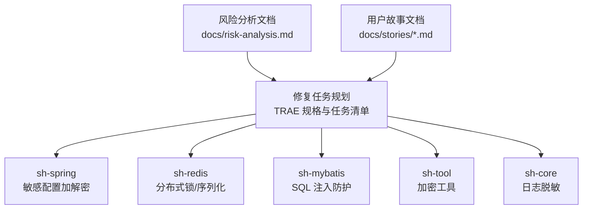
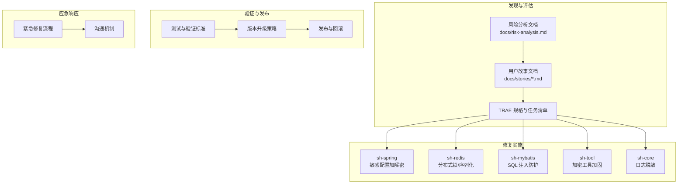
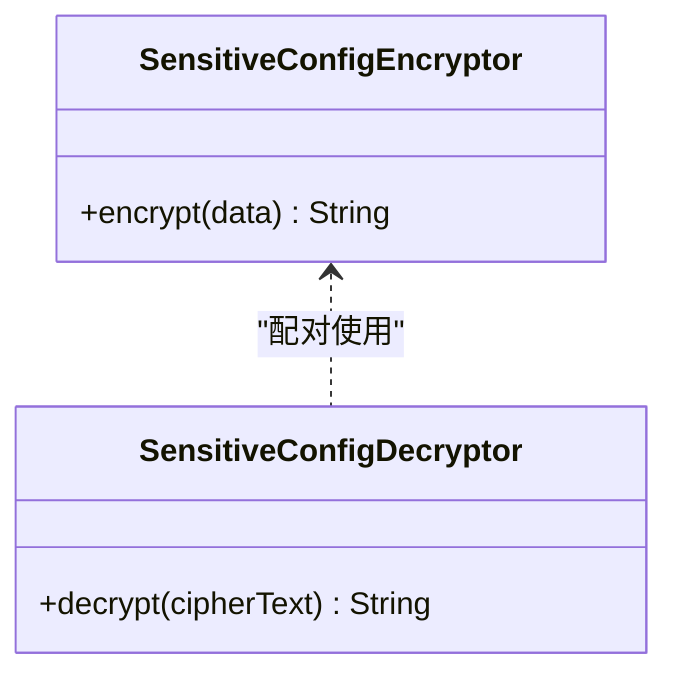
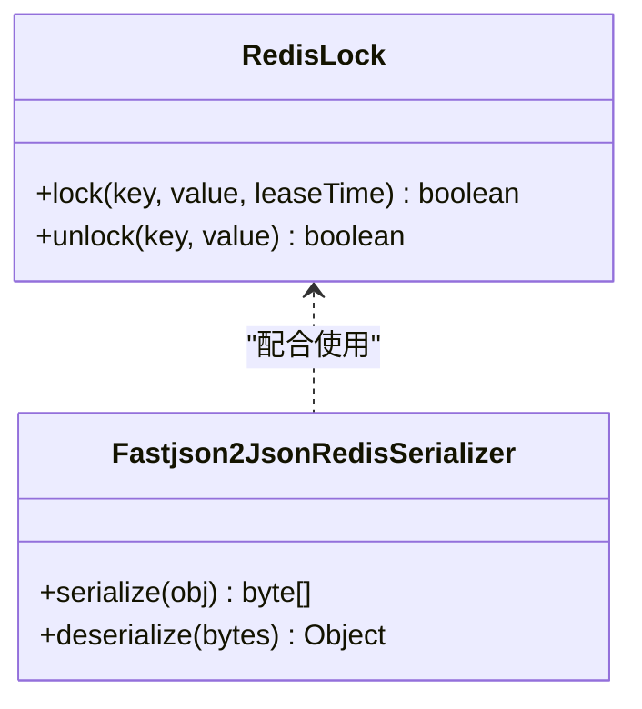
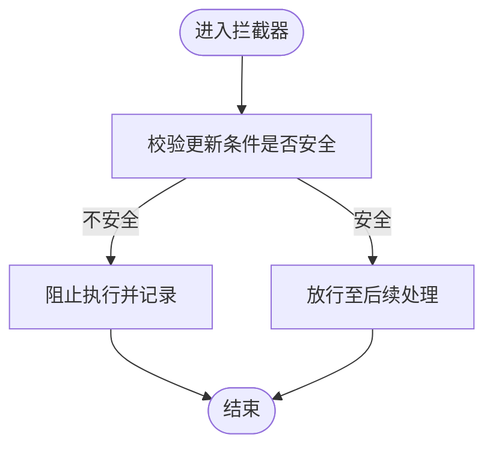
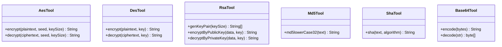
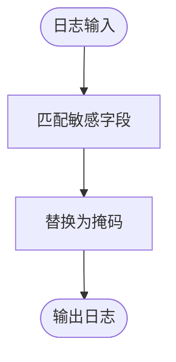
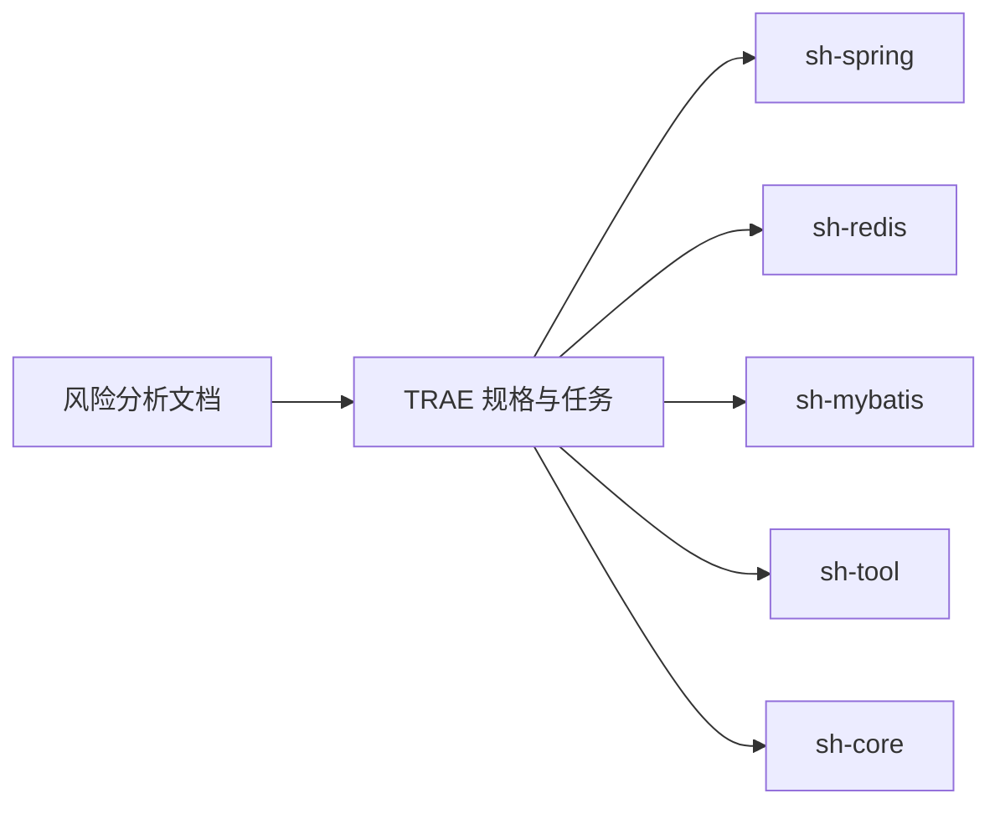

# 安全修复管理

<cite>
**本文引用的文件**
- [README.md](file://README.md)
- [AGENTS.md](file://AGENTS.md)
- [docs/risk-analysis.md](file://docs/risk-analysis.md)
- [docs/stories/US-007-通用Mapper与动态SQL生成.md](file://docs/stories/US-007-通用Mapper与动态SQL生成.md)
- [docs/stories/US-017-Redis分布式锁.md](file://docs/stories/US-017-Redis分布式锁.md)
- [docs/stories/US-027-加密工具集.md](file://docs/stories/US-027-加密工具集.md)
- [sh-spring/src/main/java/com/wkclz/spring/config/SensitiveConfigDecryptor.java](file://sh-spring/src/main/java/com/wkclz/spring/config/SensitiveConfigDecryptor.java)
- [sh-spring/src/main/java/com/wkclz/spring/config/SensitiveConfigEncryptor.java](file://sh-spring/src/main/java/com/wkclz/spring/config/SensitiveConfigEncryptor.java)
- [sh-redis/src/main/java/com/wkclz/redis/helper/RedisLock.java](file://sh-redis/src/main/java/com/wkclz/redis/helper/RedisLock.java)
- [sh-redis/src/main/java/com/wkclz/redis/serializer/Fastjson2JsonRedisSerializer.java](file://sh-redis/src/main/java/com/wkclz/redis/serializer/Fastjson2JsonRedisSerializer.java)
- [sh-mybatis/src/main/java/com/wkclz/mybatis/interceptor/MyBatisUpdateInterceptor.java](file://sh-mybatis/src/main/java/com/wkclz/mybatis/interceptor/MyBatisUpdateInterceptor.java)
- [sh-tool/src/main/java/com/wkclz/tool/tools/AesTool.java](file://sh-tool/src/main/java/com/wkclz/tool/tools/AesTool.java)
- [sh-tool/src/main/java/com/wkclz/tool/tools/DesTool.java](file://sh-tool/src/main/java/com/wkclz/tool/tools/DesTool.java)
- [sh-core/src/main/java/com/wkclz/core/log/MaskingPatternLayout.java](file://sh-core/src/main/java/com/wkclz/core/log/MaskingPatternLayout.java)
- [sh-spring/src/main/java/com/wkclz/spring/utils/MailUtil.java](file://sh-spring/src/main/java/com/wkclz/spring/utils/MailUtil.java)
</cite>

## 目录
1. [引言](#引言)
2. [项目结构](#项目结构)
3. [核心组件](#核心组件)
4. [架构总览](#架构总览)
5. [详细组件分析](#详细组件分析)
6. [依赖关系分析](#依赖关系分析)
7. [性能考量](#性能考量)
8. [故障排查指南](#故障排查指南)
9. [结论](#结论)
10. [附录](#附录)

## 引言
本文件面向 sh-framework 框架的安全修复管理工作，系统化梳理 TRAE 规格与修复文档的管理体系，明确安全漏洞的发现、评估与修复流程；规范修复文档的结构与内容要求；制定版本升级策略与向后兼容性考虑；给出安全补丁的测试与验证标准；介绍漏洞扫描与安全审计的方法；明确紧急修复与常规修复的差异处理；并建立安全事件的应急响应流程与沟通机制。

## 项目结构
围绕安全修复管理，本项目的关键资产与职责分布如下：
- 文档与故事：通过风险分析文档与用户故事文档沉淀风险与需求，形成可追溯的修复依据。
- 核心模块：涉及安全的关键模块包括 sh-spring（敏感配置加解密）、sh-redis（分布式锁与序列化）、sh-mybatis（SQL 注入防护）、sh-tool（加密工具）、sh-core（日志脱敏）等。
- 工具与方法：结合风险分析中的风险汇总矩阵与各模块的实现，构建安全修复的闭环管理。

**章节来源**
- [docs/risk-analysis.md:508-548](file://docs/risk-analysis.md#L508-L548)
- [docs/stories/US-007-通用Mapper与动态SQL生成.md:1-62](file://docs/stories/US-007-通用Mapper与动态SQL生成.md#L1-L62)
- [docs/stories/US-017-Redis分布式锁.md:1-62](file://docs/stories/US-017-Redis分布式锁.md#L1-L62)
- [docs/stories/US-027-加密工具集.md:1-62](file://docs/stories/US-027-加密工具集.md#L1-L62)

## 核心组件
- sh-spring：负责敏感配置的加解密能力，避免明文存储带来的安全风险。
- sh-redis：提供分布式锁与序列化工具，需关注反序列化漏洞与锁过期策略。
- sh-mybatis：涉及动态 SQL 生成与更新拦截，需防范字符串拼接导致的 SQL 注入。
- sh-tool：提供对称/非对称加密与摘要工具，需确保加密模式与密钥管理符合安全基线。
- sh-core：提供日志脱敏布局，保障日志输出的安全性与可运维性。

**章节来源**
- [sh-spring/src/main/java/com/wkclz/spring/config/SensitiveConfigDecryptor.java](file://sh-spring/src/main/java/com/wkclz/spring/config/SensitiveConfigDecryptor.java)
- [sh-spring/src/main/java/com/wkclz/spring/config/SensitiveConfigEncryptor.java](file://sh-spring/src/main/java/com/wkclz/spring/config/SensitiveConfigEncryptor.java)
- [sh-redis/src/main/java/com/wkclz/redis/helper/RedisLock.java](file://sh-redis/src/main/java/com/wkclz/redis/helper/RedisLock.java)
- [sh-redis/src/main/java/com/wkclz/redis/serializer/Fastjson2JsonRedisSerializer.java](file://sh-redis/src/main/java/com/wkclz/redis/serializer/Fastjson2JsonRedisSerializer.java)
- [sh-mybatis/src/main/java/com/wkclz/mybatis/interceptor/MyBatisUpdateInterceptor.java](file://sh-mybatis/src/main/java/com/wkclz/mybatis/interceptor/MyBatisUpdateInterceptor.java)
- [sh-tool/src/main/java/com/wkclz/tool/tools/AesTool.java](file://sh-tool/src/main/java/com/wkclz/tool/tools/AesTool.java)
- [sh-tool/src/main/java/com/wkclz/tool/tools/DesTool.java](file://sh-tool/src/main/java/com/wkclz/tool/tools/DesTool.java)
- [sh-core/src/main/java/com/wkclz/core/log/MaskingPatternLayout.java](file://sh-core/src/main/java/com/wkclz/core/log/MaskingPatternLayout.java)

## 架构总览
安全修复管理的总体架构由“发现—评估—修复—验证—发布—复盘”构成，贯穿文档、模块与流程：

**图表来源**
- [docs/risk-analysis.md:508-548](file://docs/risk-analysis.md#L508-L548)
- [docs/stories/US-007-通用Mapper与动态SQL生成.md:1-62](file://docs/stories/US-007-通用Mapper与动态SQL生成.md#L1-L62)
- [docs/stories/US-017-Redis分布式锁.md:1-62](file://docs/stories/US-017-Redis分布式锁.md#L1-L62)
- [docs/stories/US-027-加密工具集.md:1-62](file://docs/stories/US-027-加密工具集.md#L1-L62)

## 详细组件分析

### 组件一：敏感配置加解密（sh-spring）
- 作用：避免敏感配置以明文形式存储，降低泄露风险。
- 关键实现：加解密器类负责密文与明文之间的转换。
- 安全要点：密钥管理、算法强度、配置项最小化暴露面。

**图表来源**
- [sh-spring/src/main/java/com/wkclz/spring/config/SensitiveConfigEncryptor.java](file://sh-spring/src/main/java/com/wkclz/spring/config/SensitiveConfigEncryptor.java)
- [sh-spring/src/main/java/com/wkclz/spring/config/SensitiveConfigDecryptor.java](file://sh-spring/src/main/java/com/wkclz/spring/config/SensitiveConfigDecryptor.java)

**章节来源**
- [sh-spring/src/main/java/com/wkclz/spring/config/SensitiveConfigEncryptor.java](file://sh-spring/src/main/java/com/wkclz/spring/config/SensitiveConfigEncryptor.java)
- [sh-spring/src/main/java/com/wkclz/spring/config/SensitiveConfigDecryptor.java](file://sh-spring/src/main/java/com/wkclz/spring/config/SensitiveConfigDecryptor.java)
- [docs/risk-analysis.md:518-520](file://docs/risk-analysis.md#L518-L520)

### 组件二：分布式锁与序列化（sh-redis）
- 作用：提供分布式锁与序列化能力，需关注反序列化漏洞与锁过期策略。
- 关键实现：RedisLock 提供加锁/解锁；Fastjson2JsonRedisSerializer 处理序列化。
- 安全要点：锁超时与业务执行匹配、反序列化白名单/黑名单策略。

**图表来源**
- [sh-redis/src/main/java/com/wkclz/redis/helper/RedisLock.java](file://sh-redis/src/main/java/com/wkclz/redis/helper/RedisLock.java)
- [sh-redis/src/main/java/com/wkclz/redis/serializer/Fastjson2JsonRedisSerializer.java](file://sh-redis/src/main/java/com/wkclz/redis/serializer/Fastjson2JsonRedisSerializer.java)

**章节来源**
- [sh-redis/src/main/java/com/wkclz/redis/helper/RedisLock.java](file://sh-redis/src/main/java/com/wkclz/redis/helper/RedisLock.java)
- [sh-redis/src/main/java/com/wkclz/redis/serializer/Fastjson2JsonRedisSerializer.java](file://sh-redis/src/main/java/com/wkclz/redis/serializer/Fastjson2JsonRedisSerializer.java)
- [docs/risk-analysis.md:517-519](file://docs/risk-analysis.md#L517-L519)

### 组件三：SQL 注入防护（sh-mybatis）
- 作用：通过拦截器与动态 SQL 生成，避免字符串拼接引发的注入风险。
- 关键实现：更新拦截器对更新语句进行规范化处理。
- 安全要点：参数化查询、输入校验、最小权限原则。

**图表来源**
- [sh-mybatis/src/main/java/com/wkclz/mybatis/interceptor/MyBatisUpdateInterceptor.java](file://sh-mybatis/src/main/java/com/wkclz/mybatis/interceptor/MyBatisUpdateInterceptor.java)

**章节来源**
- [sh-mybatis/src/main/java/com/wkclz/mybatis/interceptor/MyBatisUpdateInterceptor.java](file://sh-mybatis/src/main/java/com/wkclz/mybatis/interceptor/MyBatisUpdateInterceptor.java)
- [docs/risk-analysis.md:518](file://docs/risk-analysis.md#L518)

### 组件四：加密工具（sh-tool）
- 作用：提供对称/非对称加密与摘要工具，需满足加密模式与密钥管理的安全基线。
- 关键实现：AES/DES/RSA/MD5/SHA/Base64 工具类。
- 安全要点：避免使用 ECB 模式，采用 CBC/GCM 并携带 IV；密钥轮换与存储安全。

**图表来源**
- [sh-tool/src/main/java/com/wkclz/tool/tools/AesTool.java](file://sh-tool/src/main/java/com/wkclz/tool/tools/AesTool.java)
- [sh-tool/src/main/java/com/wkclz/tool/tools/DesTool.java](file://sh-tool/src/main/java/com/wkclz/tool/tools/DesTool.java)
- [docs/stories/US-027-加密工具集.md:1-62](file://docs/stories/US-027-加密工具集.md#L1-L62)

**章节来源**
- [sh-tool/src/main/java/com/wkclz/tool/tools/AesTool.java](file://sh-tool/src/main/java/com/wkclz/tool/tools/AesTool.java)
- [sh-tool/src/main/java/com/wkclz/tool/tools/DesTool.java](file://sh-tool/src/main/java/com/wkclz/tool/tools/DesTool.java)
- [docs/risk-analysis.md:535](file://docs/risk-analysis.md#L535)

### 组件五：日志脱敏（sh-core）
- 作用：在日志输出中对敏感信息进行脱敏，平衡可运维性与安全性。
- 关键实现：日志脱敏布局类负责日志格式化与脱敏策略。
- 安全要点：保留必要可识别信息，避免过度脱敏影响排障。

**图表来源**
- [sh-core/src/main/java/com/wkclz/core/log/MaskingPatternLayout.java](file://sh-core/src/main/java/com/wkclz/core/log/MaskingPatternLayout.java)

**章节来源**
- [sh-core/src/main/java/com/wkclz/core/log/MaskingPatternLayout.java](file://sh-core/src/main/java/com/wkclz/core/log/MaskingPatternLayout.java)
- [docs/risk-analysis.md:532-533](file://docs/risk-analysis.md#L532-L533)

## 依赖关系分析
安全修复管理涉及跨模块协作，关键依赖关系如下：

**图表来源**
- [docs/risk-analysis.md:508-548](file://docs/risk-analysis.md#L508-L548)

**章节来源**
- [docs/risk-analysis.md:508-548](file://docs/risk-analysis.md#L508-L548)

## 性能考量
- 避免在高并发场景下使用 ECB 模式加密，降低模式分析风险。
- 分布式锁应设置合理的过期时间与业务执行匹配，防止死锁与资源泄漏。
- 日志脱敏不应过度影响日志解析与检索效率。
- SQL 注入防护应在保证安全的前提下尽量减少拦截器开销。

## 故障排查指南
- 敏感配置明文存储：确认加解密器是否正确加载与配置，检查密钥与密文对应关系。
- 分布式锁失效：核查锁过期时间、业务执行耗时与看门狗机制。
- SQL 注入风险：审查更新拦截器规则与动态 SQL 生成逻辑。
- 加密工具 ECB 模式：迁移至 CBC/GCM 模式并确保 IV 正确传递。
- 日志脱敏不完整：检查脱敏布局正则与保留策略。

**章节来源**
- [docs/risk-analysis.md:518-520](file://docs/risk-analysis.md#L518-L520)
- [docs/risk-analysis.md:517-519](file://docs/risk-analysis.md#L517-L519)
- [docs/risk-analysis.md:535](file://docs/risk-analysis.md#L535)
- [docs/risk-analysis.md:532-533](file://docs/risk-analysis.md#L532-L533)

## 结论
通过将 TRAE 规格与修复文档体系化，结合模块化的安全组件与严格的测试验证标准，sh-framework 可以建立起从发现到发布的闭环安全修复管理流程。在版本升级与应急响应方面，应坚持最小变更、充分验证与快速回滚的原则，确保系统的安全性与稳定性。

## 附录

### 附录A：TRAE 规格与修复文档模板
- 问题描述：清晰界定漏洞现象与触发条件。
- 影响分析：评估对业务、数据与合规的影响范围。
- 修复方案：明确代码修改点、替代方案与安全基线。
- 验证方法：列出单元测试、集成测试与安全扫描清单。
- 版本升级策略：说明版本号规则、兼容性与回滚策略。
- 应急响应：区分紧急与常规修复的处理时限与审批流程。

### 附录B：安全扫描与审计工具与方法
- 依赖扫描：使用静态分析工具识别已知漏洞与许可证风险。
- 代码审计：重点检查敏感配置存储、加密模式、日志脱敏与反序列化。
- 渗透测试：针对对外接口进行注入与会话安全测试。
- 合规检查：核对许可证兼容性与数据保护要求。

### 附录C：紧急修复与常规修复处理差异
- 紧急修复：快速评估、最小化变更、灰度发布与快速回滚。
- 常规修复：完整评审、全面测试、文档更新与发布说明。

### 附录D：安全事件应急响应流程与沟通机制
- 发现与上报：分级分类、时限要求与责任人。
- 评估与决策：影响评估、修复方案与发布窗口。
- 实施与验证：变更实施、自动化验证与人工复核。
- 通告与复盘：内部通告、外部披露与改进计划。