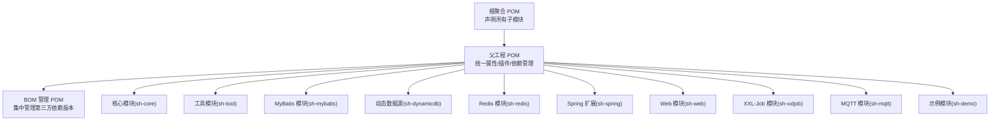
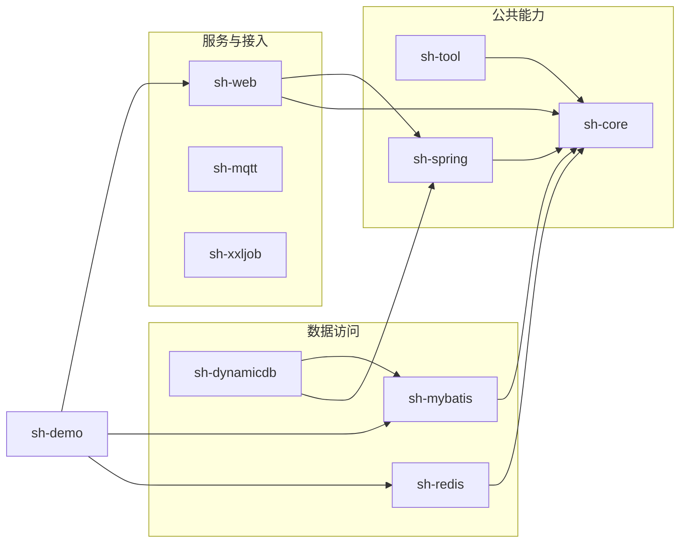
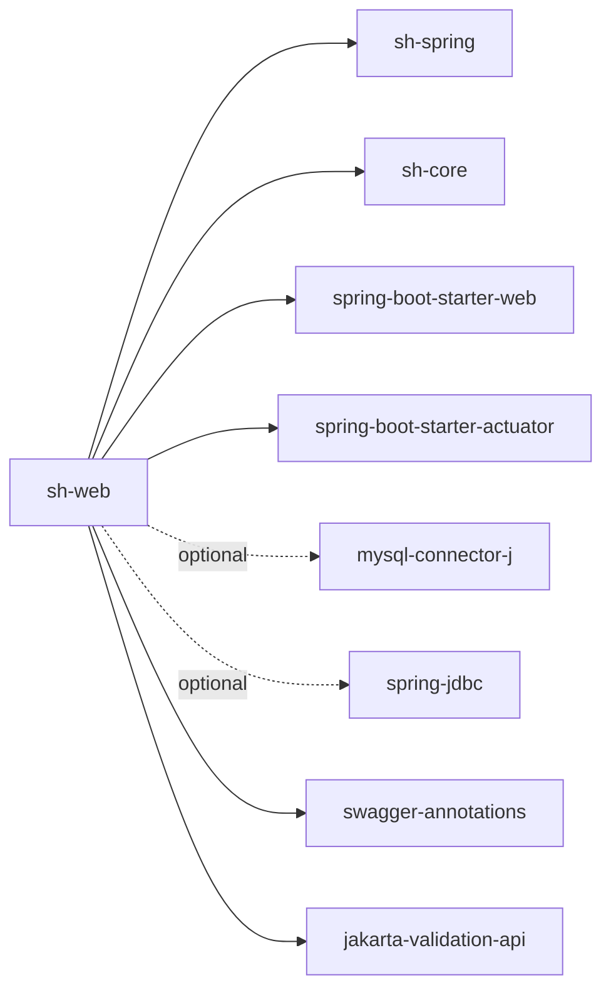

# 模块依赖管理

<cite>
**本文引用的文件**
- [根聚合 POM](file://pom.xml)
- [父工程 POM](file://sh-parent/pom.xml)
- [BOM 管理 POM](file://sh-bom/pom.xml)
- [核心模块 POM](file://sh-core/pom.xml)
- [工具模块 POM](file://sh-tool/pom.xml)
- [MyBatis 模块 POM](file://sh-mybatis/pom.xml)
- [动态数据源模块 POM](file://sh-dynamicdb/pom.xml)
- [Redis 模块 POM](file://sh-redis/pom.xml)
- [Spring 扩展模块 POM](file://sh-spring/pom.xml)
- [Web 模块 POM](file://sh-web/pom.xml)
</cite>

## 目录
1. [引言](#引言)
2. [项目结构](#项目结构)
3. [核心组件](#核心组件)
4. [架构总览](#架构总览)
5. [详细组件分析](#详细组件分析)
6. [依赖分析](#依赖分析)
7. [性能考虑](#性能考虑)
8. [故障排查指南](#故障排查指南)
9. [结论](#结论)
10. [附录](#附录)

## 引言
本文件面向 sh-framework 框架的模块依赖管理，系统阐述模块间依赖关系的设计原则与管理策略，涵盖依赖范围（compile、test、provided 等）的正确使用、传递性依赖的控制与排除、依赖冲突的诊断与解决、可选依赖与依赖调解机制、依赖树可视化与分析工具的使用，以及最佳实践与常见陷阱的规避方法。目标是帮助开发者在不牺牲模块边界的前提下，构建清晰、稳定、可维护的多模块工程。

## 项目结构
sh-framework 采用 Maven 多模块聚合结构，顶层聚合 POM 声明子模块；父工程 POM 统一版本与插件配置，并通过 dependencyManagement 集中管理依赖；BOM 管理 POM 提供第三方依赖的版本与可选排除策略；各功能模块仅声明所需依赖，避免重复版本与冲突。

图表来源
- [根聚合 POM:21-34](file://pom.xml#L21-L34)
- [父工程 POM:32-159](file://sh-parent/pom.xml#L32-L159)

章节来源
- [根聚合 POM:21-34](file://pom.xml#L21-L34)
- [父工程 POM:32-159](file://sh-parent/pom.xml#L32-L159)

## 核心组件
- 根聚合 POM：定义模块清单与基础属性，确保多模块协同构建。
- 父工程 POM：继承 Spring Boot 父 POM，统一编译级别、源码编码、插件与依赖管理；通过 dependencyManagement 导入 BOM 并声明内部模块坐标，形成“版本对齐、职责分离”的依赖治理基础。
- BOM 管理 POM：集中管理第三方依赖版本与默认排除策略，避免传递性依赖带来的冲突与意外升级。
- 功能模块 POM：仅声明必要依赖，遵循“上层模块依赖下层模块、横向模块相互独立”的原则，减少耦合与循环依赖风险。

章节来源
- [根聚合 POM:15-34](file://pom.xml#L15-L34)
- [父工程 POM:7-29](file://sh-parent/pom.xml#L7-L29)
- [BOM 管理 POM:53-280](file://sh-bom/pom.xml#L53-L280)

## 架构总览
下图展示模块间的依赖方向与依赖范围使用策略。上层模块仅依赖下层模块或公共能力模块，测试依赖仅在模块内生效，可选依赖用于按需引入以避免强制传递。

图表来源
- [工具模块 POM:21-70](file://sh-tool/pom.xml#L21-L70)
- [核心模块 POM:22-38](file://sh-core/pom.xml#L22-L38)
- [Spring 扩展模块 POM:21-51](file://sh-spring/pom.xml#L21-L51)
- [MyBatis 模块 POM:21-56](file://sh-mybatis/pom.xml#L21-L56)
- [动态数据源模块 POM:21-38](file://sh-dynamicdb/pom.xml#L21-L38)
- [Redis 模块 POM:22-31](file://sh-redis/pom.xml#L22-L31)
- [Web 模块 POM:21-62](file://sh-web/pom.xml#L21-L62)

## 详细组件分析

### 依赖范围与作用域策略
- compile：默认范围，依赖对编译、测试与运行均有效。适用于模块间共享的 API 或实现。
- test：仅在测试阶段有效，不会传递给下游模块。用于测试框架与断言库。
- provided：由运行环境或容器提供，打包时不包含。在当前代码中未见显式使用，建议在需要“容器提供”场景（如 Servlet API）时谨慎使用。
- runtime：运行时依赖，编译期不需要但运行期需要。当前代码中未见显式使用，建议在 JDBC 驱动等场景使用以避免编译期污染。
- 可选依赖（optional）：用于标记“可选传递”，避免将非必需依赖强制传递给使用者。例如 Web 模块对数据库驱动与 JDBC 的 optional 声明，仅在需要异常处理时才引入。

章节来源
- [Web 模块 POM:39-45](file://sh-web/pom.xml#L39-L45)

### 传递性依赖控制与排除
- 使用 dependencyManagement 集中声明版本，避免传递性依赖导致的版本漂移。
- 对第三方库进行显式排除（exclusions），屏蔽不兼容或高危传递依赖。例如在微信相关依赖中排除 BouncyCastle 的特定构件，防止与运行时 JCE 校验冲突。
- 通过 BOM 导入统一版本，减少跨模块版本差异引发的冲突。

章节来源
- [BOM 管理 POM:75-92](file://sh-bom/pom.xml#L75-L92)

### 可选依赖与依赖调解
- 可选依赖（optional）：用于标记非强制传递的依赖，避免下游模块无谓引入。例如 Web 模块对数据库驱动与 JDBC 的 optional 声明，仅在需要异常处理时才引入。
- 依赖调解：Maven 默认采用“最短路径优先”和“第一声明优先”。通过在父工程中统一声明版本与排除策略，可以有效减少冲突并保证一致性。

章节来源
- [Web 模块 POM:39-45](file://sh-web/pom.xml#L39-L45)
- [父工程 POM:32-159](file://sh-parent/pom.xml#L32-L159)

### 循环依赖的避免与检测
- 设计原则：上层模块仅依赖下层模块，横向模块保持无依赖；核心模块不应反向依赖上层模块。
- 检测手段：使用 Maven 插件或 IDE 工具查看依赖树，识别反向依赖链路。
- 解决方案：拆分公共接口至独立模块，或通过抽象接口与 SPI 机制解耦。

章节来源
- [动态数据源模块 POM:21-38](file://sh-dynamicdb/pom.xml#L21-L38)
- [MyBatis 模块 POM:21-56](file://sh-mybatis/pom.xml#L21-L56)

### 依赖冲突的诊断与解决
- 诊断：使用 Maven 命令查看依赖树，定位冲突版本与传递来源。
- 解决：在父工程中统一版本，或在具体模块中添加针对性的版本锁定与排除。
- 预防：通过 BOM 导入与 dependencyManagement 统一版本，减少冲突面。

章节来源
- [父工程 POM:32-159](file://sh-parent/pom.xml#L32-L159)
- [BOM 管理 POM:53-280](file://sh-bom/pom.xml#L53-L280)

### 依赖树可视化与分析工具
- Maven 依赖树：通过命令行工具生成依赖树，辅助定位冲突与传递来源。
- IDE 支持：IDEA/VS Code 等可直接查看模块依赖关系图，便于发现环依赖与过度传递。
- 自动化检查：在 CI 中加入依赖树与冲突检查步骤，确保每次变更不影响整体稳定性。

## 依赖分析
下图展示 sh-web 模块的典型依赖流向与范围标注，体现“上层依赖下层、可选依赖按需”的设计思路。

图表来源
- [Web 模块 POM:21-62](file://sh-web/pom.xml#L21-L62)

章节来源
- [Web 模块 POM:21-62](file://sh-web/pom.xml#L21-L62)

## 性能考虑
- 减少传递性依赖：通过可选依赖与精确版本管理降低不必要的依赖体积。
- 排除高开销传递依赖：对日志、JSON、工具库等进行有选择的排除，避免重复与冲突。
- 构建优化：统一编译级别与插件配置，缩短构建时间并提升可重复性。

## 故障排查指南
- 冲突症状：运行时报错提示类找不到或版本不匹配。
  - 排查步骤：生成依赖树，定位冲突版本与来源模块；在父工程中统一版本或在模块中排除。
- 可选依赖未生效：下游模块仍出现未声明的依赖。
  - 排查步骤：确认 optional 声明是否正确；检查是否被其他模块间接引入。
- BOM 导入无效：第三方依赖版本未按预期。
  - 排查步骤：确认导入方式与 scope；检查 BOM 版本与模块 revision 是否一致。

章节来源
- [父工程 POM:32-159](file://sh-parent/pom.xml#L32-L159)
- [BOM 管理 POM:53-280](file://sh-bom/pom.xml#L53-L280)
- [Web 模块 POM:39-45](file://sh-web/pom.xml#L39-L45)

## 结论
sh-framework 的依赖管理以“父工程统一治理 + BOM 版本对齐 + 模块最小依赖”为核心策略，结合可选依赖与排除机制，有效降低了循环依赖与依赖地狱的风险。通过持续的依赖树可视化与冲突检查，可在演进过程中保持模块的稳定性与可维护性。

## 附录
- 最佳实践清单
  - 在父工程中集中管理版本与排除策略，模块仅声明必要依赖。
  - 使用可选依赖标识非强制传递的依赖，避免对下游造成负担。
  - 通过 BOM 导入第三方依赖版本，减少跨模块版本漂移。
  - 定期生成并审查依赖树，及时发现潜在冲突与环依赖。
  - 测试依赖仅限模块内使用，避免泄漏到生产产物。
- 常见陷阱
  - 忽视传递性依赖：导致意外引入不兼容或高开销依赖。
  - 在模块中重复声明版本：破坏统一治理，引发冲突。
  - 将上层模块作为依赖：破坏模块边界，增加耦合。
  - 滥用 provided/runtime：影响编译与运行时行为，带来隐患。