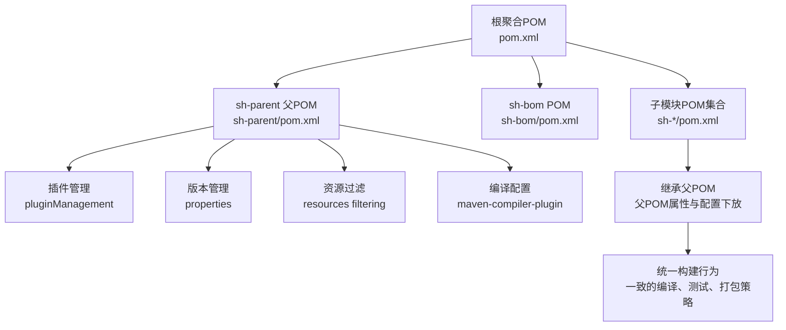
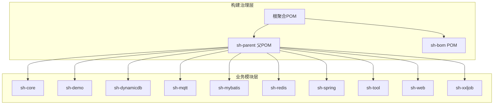
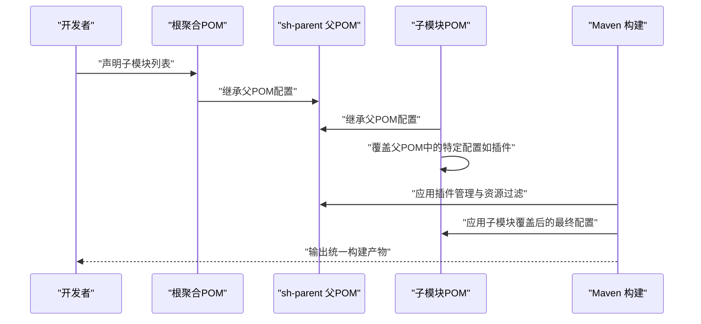
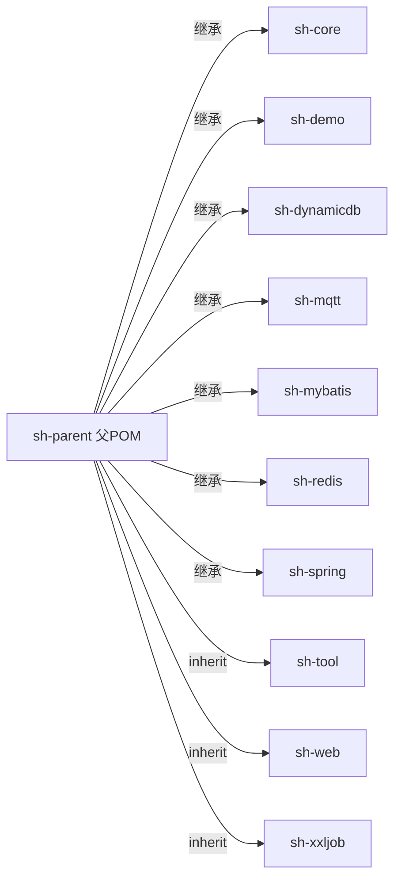

# 父POM配置

<cite>
**本文引用的文件**
- [根聚合POM](file://pom.xml)
- [sh-parent 父POM](file://sh-parent/pom.xml)
- [sh-bom POM](file://sh-bom/pom.xml)
- [sh-core 模块POM](file://sh-core/pom.xml)
- [sh-demo 模块POM](file://sh-demo/pom.xml)
- [sh-dynamicdb 模块POM](file://sh-dynamicdb/pom.xml)
- [sh-mqtt 模块POM](file://sh-mqtt/pom.xml)
- [sh-mybatis 模块POM](file://sh-mybatis/pom.xml)
- [sh-redis 模块POM](file://sh-redis/pom.xml)
- [sh-spring 模块POM](file://sh-spring/pom.xml)
- [sh-tool 模块POM](file://sh-tool/pom.xml)
- [sh-web 模块POM](file://sh-web/pom.xml)
- [sh-xxljob 模块POM](file://sh-xxljob/pom.xml)
</cite>

## 目录
1. [简介](#简介)
2. [项目结构](#项目结构)
3. [核心组件](#核心组件)
4. [架构总览](#架构总览)
5. [详细组件分析](#详细组件分析)
6. [依赖分析](#依赖分析)
7. [性能考虑](#性能考虑)
8. [故障排除指南](#故障排除指南)
9. [结论](#结论)
10. [附录](#附录)

## 简介
本文件聚焦于 sh-framework 的父POM（sh-parent）配置，系统性阐述其在框架中的角色、设计理念与实践方法。sh-parent 作为统一的父级构建配置，负责集中管理版本、插件、资源过滤、编译选项以及模块间依赖约束，确保各子模块在一致性、可维护性和可复用性方面保持统一。

## 项目结构
sh-framework 采用多模块 Maven 聚合工程组织方式，顶层聚合POM负责声明子模块并统一生命周期；sh-parent 作为父POM被各子模块继承，提供统一的构建与发布策略。BOM（Bill of Materials）模块用于对外发布依赖坐标与版本约束，供外部项目引入。

图表来源
- [根聚合POM](file://pom.xml)
- [sh-parent 父POM](file://sh-parent/pom.xml)
- [sh-bom POM](file://sh-bom/pom.xml)
- [sh-core 模块POM](file://sh-core/pom.xml)
- [sh-demo 模块POM](file://sh-demo/pom.xml)
- [sh-dynamicdb 模块POM](file://sh-dynamicdb/pom.xml)
- [sh-mqtt 模块POM](file://sh-mqtt/pom.xml)
- [sh-mybatis 模块POM](file://sh-mybatis/pom.xml)
- [sh-redis 模块POM](file://sh-redis/pom.xml)
- [sh-spring 模块POM](file://sh-spring/pom.xml)
- [sh-tool 模块POM](file://sh-tool/pom.xml)
- [sh-web 模块POM](file://sh-web/pom.xml)
- [sh-xxljob 模块POM](file://sh-xxljob/pom.xml)

章节来源
- [根聚合POM](file://pom.xml)
- [sh-parent 父POM](file://sh-parent/pom.xml)

## 核心组件
- 父POM（sh-parent）
  - 统一版本管理：通过 properties 集中声明第三方库与工具类版本，避免子模块重复定义。
  - 插件管理：在 pluginManagement 中声明常用插件及其版本，确保子模块继承后获得一致的构建行为。
  - 资源过滤：开启资源过滤，支持在打包阶段替换占位符，便于环境差异化配置。
  - 编译配置：统一 Java 版本、编码、编译参数，保证跨模块编译一致性。
  - 依赖约束：在 dependencyManagement 中对关键依赖进行版本锁定，减少传递性依赖导致的不一致。
- 子模块POM
  - 仅声明必要的依赖与插件，无需重复指定版本，降低维护成本。
  - 可按需覆盖父POM中的配置（如插件执行目标、资源过滤策略），实现“继承+扩展”的灵活组合。
- BOM（sh-bom）
  - 对外发布统一的依赖坐标与版本，供外部项目引入，避免版本漂移。

章节来源
- [sh-parent 父POM](file://sh-parent/pom.xml)
- [sh-bom POM](file://sh-bom/pom.xml)

## 架构总览
sh-parent 在整体架构中的定位是“构建与发布治理中枢”。它向上承接根聚合POM的模块声明，向下为各子模块提供统一的构建基线。BOM 则面向外部生态，提供稳定的依赖契约。

图表来源
- [根聚合POM](file://pom.xml)
- [sh-parent 父POM](file://sh-parent/pom.xml)
- [sh-bom POM](file://sh-bom/pom.xml)
- [sh-core 模块POM](file://sh-core/pom.xml)
- [sh-demo 模块POM](file://sh-demo/pom.xml)
- [sh-dynamicdb 模块POM](file://sh-dynamicdb/pom.xml)
- [sh-mqtt 模块POM](file://sh-mqtt/pom.xml)
- [sh-mybatis 模块POM](file://sh-mybatis/pom.xml)
- [sh-redis 模块POM](file://sh-redis/pom.xml)
- [sh-spring 模块POM](file://sh-spring/pom.xml)
- [sh-tool 模块POM](file://sh-tool/pom.xml)
- [sh-web 模块POM](file://sh-web/pom.xml)
- [sh-xxljob 模块POM](file://sh-xxljob/pom.xml)

## 详细组件分析

### 父POM（sh-parent）设计与职责
- 设计理念
  - “集中管理、最小暴露”：将版本、插件、编译与资源策略集中在父POM，子模块仅声明所需依赖，减少重复配置。
  - “可覆盖、可扩展”：允许子模块在自身POM中覆盖父POM的默认值，满足特定场景需求。
  - “强约束、低耦合”：通过 dependencyManagement 锁定关键依赖版本，避免模块间差异导致的运行时问题。
- 关键配置域
  - 版本管理（properties）：统一管理 JDK、Spring Boot、MyBatis、日志与工具类等版本号。
  - 插件管理（pluginManagement）：统一 maven-compiler-plugin、maven-resources-plugin、maven-surefire-plugin、jacoco-maven-plugin、maven-jar-plugin、maven-source-plugin、maven-javadoc-plugin、maven-deploy-plugin 等插件的版本与执行策略。
  - 资源过滤（resources）：启用过滤，支持在打包阶段替换占位符，便于不同环境注入配置。
  - 编译配置（maven-compiler-plugin）：统一源码与目标兼容级别、编码、参数与测试编译策略。
  - 依赖约束（dependencyManagement）：对核心依赖进行版本锁定，避免传递性依赖导致的不一致。
- 继承链路
  - 根聚合POM -> sh-parent -> 各子模块POM
  - 子模块通过 <parent> 元素继承 sh-parent，从而获得上述统一配置。

章节来源
- [sh-parent 父POM](file://sh-parent/pom.xml)

### 子模块继承与覆盖机制
- 继承原则
  - 子模块只需在自身POM中声明 <parent> 指向 sh-parent，即可继承全部配置。
  - 若子模块需要不同的插件行为或资源策略，可在自身POM中重新声明对应插件，并覆盖父POM中的配置。
- 覆盖示例（路径参考）
  - 在子模块POM中重新声明 maven-compiler-plugin，以调整编译参数或目标版本。
  - 在子模块POM中重新声明 maven-resources-plugin，以自定义资源过滤规则或输出目录。
  - 在子模块POM中重新声明 maven-surefire-plugin，以调整测试执行策略或报告生成。
- 冲突解决
  - 当父POM与子模块同时声明同一插件时，子模块的声明优先于父POM。
  - 当父POM与子模块同时声明同一依赖时，子模块的版本优先于父POM的 dependencyManagement 锁定。

章节来源
- [sh-parent 父POM](file://sh-parent/pom.xml)
- [sh-core 模块POM](file://sh-core/pom.xml)
- [sh-demo 模块POM](file://sh-demo/pom.xml)
- [sh-dynamicdb 模块POM](file://sh-dynamicdb/pom.xml)
- [sh-mqtt 模块POM](file://sh-mqtt/pom.xml)
- [sh-mybatis 模块POM](file://sh-mybatis/pom.xml)
- [sh-redis 模块POM](file://sh-redis/pom.xml)
- [sh-spring 模块POM](file://sh-spring/pom.xml)
- [sh-tool 模块POM](file://sh-tool/pom.xml)
- [sh-web 模块POM](file://sh-web/pom.xml)
- [sh-xxljob 模块POM](file://sh-xxljob/pom.xml)

### BOM（sh-bom）与外部依赖契约
- 角色定位
  - 提供对外发布的依赖坐标与版本，确保外部项目引入时不会出现版本漂移。
- 使用方式
  - 外部项目在 <dependencyManagement> 中引入 sh-bom，随后在 <dependencies> 中仅声明坐标，不带版本号，版本由 BOM 统一管理。
- 与父POM的关系
  - sh-bom 与 sh-parent 分属两条独立的治理线：前者面向外部生态，后者面向内部模块。

章节来源
- [sh-bom POM](file://sh-bom/pom.xml)

### 关键流程：从父POM到子模块的配置下放

图表来源
- [根聚合POM](file://pom.xml)
- [sh-parent 父POM](file://sh-parent/pom.xml)
- [sh-core 模块POM](file://sh-core/pom.xml)

## 依赖分析
- 继承链路
  - 根聚合POM -> sh-parent -> 各子模块POM
- 依赖关系
  - 子模块通过 dependencyManagement 间接受控于父POM，避免版本冲突。
  - BOM 与父POM相互独立，分别服务于内部治理与外部生态。
- 耦合与内聚
  - 父POM高内聚地封装了构建与发布策略，子模块低耦合地消费这些能力。
  - 通过 pluginManagement 与 properties 的集中管理，提升模块间的构建一致性。

图表来源
- [sh-parent 父POM](file://sh-parent/pom.xml)
- [sh-core 模块POM](file://sh-core/pom.xml)
- [sh-demo 模块POM](file://sh-demo/pom.xml)
- [sh-dynamicdb 模块POM](file://sh-dynamicdb/pom.xml)
- [sh-mqtt 模块POM](file://sh-mqtt/pom.xml)
- [sh-mybatis 模块POM](file://sh-mybatis/pom.xml)
- [sh-redis 模块POM](file://sh-redis/pom.xml)
- [sh-spring 模块POM](file://sh-spring/pom.xml)
- [sh-tool 模块POM](file://sh-tool/pom.xml)
- [sh-web 模块POM](file://sh-web/pom.xml)
- [sh-xxljob 模块POM](file://sh-xxljob/pom.xml)

章节来源
- [sh-parent 父POM](file://sh-parent/pom.xml)
- [sh-core 模块POM](file://sh-core/pom.xml)
- [sh-demo 模块POM](file://sh-demo/pom.xml)
- [sh-dynamicdb 模块POM](file://sh-dynamicdb/pom.xml)
- [sh-mqtt 模块POM](file://sh-mqtt/pom.xml)
- [sh-mybatis 模块POM](file://sh-mybatis/pom.xml)
- [sh-redis 模块POM](file://sh-redis/pom.xml)
- [sh-spring 模块POM](file://sh-spring/pom.xml)
- [sh-tool 模块POM](file://sh-tool/pom.xml)
- [sh-web 模块POM](file://sh-web/pom.xml)
- [sh-xxljob 模块POM](file://sh-xxljob/pom.xml)

## 性能考虑
- 构建性能优化建议
  - 将高频使用的插件版本固定在父POM，减少子模块重复解析与下载。
  - 合理设置资源过滤范围，避免不必要的文件被过滤与复制。
  - 在 CI/CD 中利用 Maven 的增量构建与并行策略，结合父POM的统一配置提升整体效率。
- 版本管理与缓存
  - 通过 properties 集中管理版本，有助于本地与远程仓库缓存命中率提升。
  - 对于频繁更新的依赖，建议在父POM中明确更新策略，避免频繁触发全量构建。

## 故障排除指南
- 常见问题与排查
  - 子模块未正确继承父POM：检查子模块POM 是否声明了正确的 <parent> 与坐标信息。
  - 插件行为异常：确认子模块是否覆盖了父POM中的插件配置，必要时回退或精简覆盖范围。
  - 资源过滤失效：检查子模块是否启用了资源过滤，或是否与父POM的过滤规则冲突。
  - 版本冲突：通过 dependencyManagement 或在子模块显式声明版本解决。
- 定位步骤
  - 使用 mvn help:effective-pom 查看最终生效的 POM 配置。
  - 使用 mvn dependency:tree 分析依赖树，识别冲突来源。
  - 使用 mvn -X 输出详细日志，定位插件执行阶段的问题。

章节来源
- [sh-parent 父POM](file://sh-parent/pom.xml)
- [sh-core 模块POM](file://sh-core/pom.xml)
- [sh-demo 模块POM](file://sh-demo/pom.xml)
- [sh-dynamicdb 模块POM](file://sh-dynamicdb/pom.xml)
- [sh-mqtt 模块POM](file://sh-mqtt/pom.xml)
- [sh-mybatis 模块POM](file://sh-mybatis/pom.xml)
- [sh-redis 模块POM](file://sh-redis/pom.xml)
- [sh-spring 模块POM](file://sh-spring/pom.xml)
- [sh-tool 模块POM](file://sh-tool/pom.xml)
- [sh-web 模块POM](file://sh-web/pom.xml)
- [sh-xxljob 模块POM](file://sh-xxljob/pom.xml)

## 结论
sh-parent 通过集中管理版本、插件、资源过滤与编译配置，实现了对 sh-framework 内部模块的统一治理。配合 BOM 的外部依赖契约，既保障了内部一致性，又提升了对外输出的稳定性。子模块在继承的基础上进行有限覆盖，形成“统一基线 + 个性扩展”的平衡模式，适合中大型团队在多模块场景下的持续演进。

## 附录
- 实践清单
  - 在新增子模块时，确保继承 sh-parent 并仅声明必要依赖。
  - 如需覆盖父POM，请尽量限定在最小范围内，避免影响其他模块。
  - 定期审查父POM中的版本与插件配置，保持与主流生态同步。
- 参考路径
  - [sh-parent 父POM](file://sh-parent/pom.xml)
  - [sh-bom POM](file://sh-bom/pom.xml)
  - [根聚合POM](file://pom.xml)