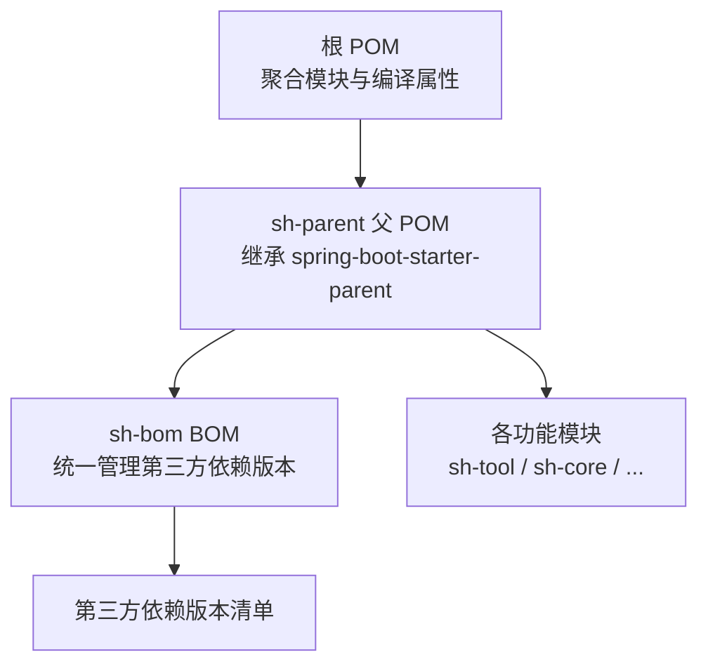
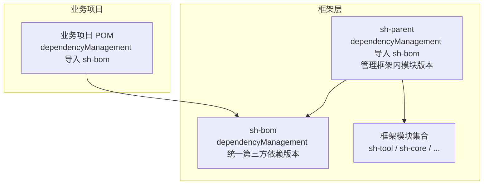
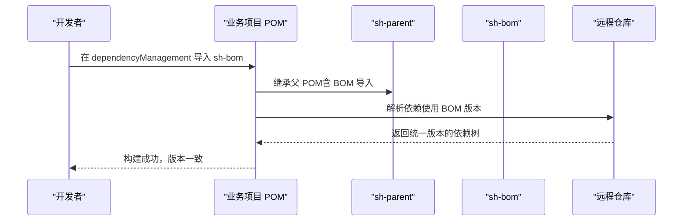
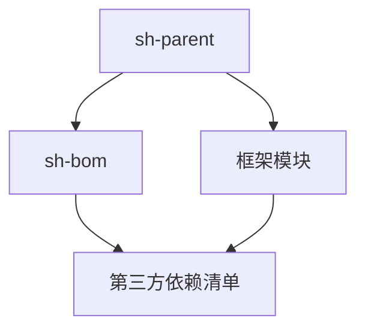

# 版本管理（BOM）

<cite>
**本文引用的文件**
- [pom.xml（根工程）](file://pom.xml)
- [pom.xml（sh-parent 父 POM）](file://sh-parent/pom.xml)
- [pom.xml（sh-bom BOM）](file://sh-bom/pom.xml)
- [SKILL.md（sh-bom 模块知识库）](file://.agents/skills/sh-bom/SKILL.md)
- [AGENTS.md（已知问题与注意事项）](file://AGENTS.md)
</cite>

## 目录
1. [简介](#简介)
2. [项目结构](#项目结构)
3. [核心组件](#核心组件)
4. [架构总览](#架构总览)
5. [详细组件分析](#详细组件分析)
6. [依赖分析](#依赖分析)
7. [性能考虑](#性能考虑)
8. [故障排查指南](#故障排查指南)
9. [结论](#结论)
10. [附录](#附录)

## 简介
本文件面向 sh-framework 框架的版本管理与发布，聚焦 sh-bom 模块的作用与配置方法，阐述如何通过 BOM 统一管理所有子模块的第三方依赖版本；说明版本号命名规范、升级策略与兼容性保障；解释 BOM 在多模块项目中的继承关系与传递性依赖管理；给出版本锁定最佳实践以避免版本冲突与“依赖地狱”；并提供版本发布的流程与自动化工具使用建议。

## 项目结构
sh-framework 采用多模块聚合工程组织，其中：
- 根 POM 声明所有子模块，统一编译属性与打包方式；
- sh-parent 作为父 POM，继承 spring-boot-starter-parent，并在 dependencyManagement 中导入 sh-bom，同时管理插件与构建行为；
- sh-bom 为纯 POM 模块，仅通过 dependencyManagement 统一管理第三方依赖版本，不包含任何 Java 代码。

图表来源
- [pom.xml（根工程）:1-36](file://pom.xml#L1-L36)
- [pom.xml（sh-parent 父 POM）:1-247](file://sh-parent/pom.xml#L1-L247)
- [pom.xml（sh-bom BOM）:1-285](file://sh-bom/pom.xml#L1-L285)

章节来源
- [pom.xml（根工程）:1-36](file://pom.xml#L1-L36)
- [pom.xml（sh-parent 父 POM）:1-247](file://sh-parent/pom.xml#L1-L247)
- [pom.xml（sh-bom BOM）:1-285](file://sh-bom/pom.xml#L1-L285)

## 核心组件
- sh-bom：通过 dependencyManagement 统一管理第三方依赖版本，避免子模块重复声明版本，降低版本漂移风险。
- sh-parent：集中管理框架内模块版本（${revision}），并在构建阶段对 POM 进行扁平化处理，提升可维护性。
- 根 POM：声明模块聚合关系与公共编译属性。

章节来源
- [pom.xml（sh-bom BOM）:1-285](file://sh-bom/pom.xml#L1-L285)
- [pom.xml（sh-parent 父 POM）:1-247](file://sh-parent/pom.xml#L1-L247)
- [pom.xml（根工程）:1-36](file://pom.xml#L1-L36)

## 架构总览
sh-bom 在框架内的角色是“版本中枢”，业务项目只需在 dependencyManagement 中 import sh-bom，即可获得统一的版本约束。sh-parent 则负责将框架内各模块版本与 BOM 解耦，通过 ${revision} 统一对外发布。

图表来源
- [pom.xml（sh-parent 父 POM）:32-159](file://sh-parent/pom.xml#L32-L159)
- [pom.xml（sh-bom BOM）:53-280](file://sh-bom/pom.xml#L53-L280)
- [pom.xml（根工程）:21-34](file://pom.xml#L21-L34)

## 详细组件分析

### sh-bom 模块配置与作用
- 作用定位：纯 POM 模块，仅通过 dependencyManagement 统一管理第三方依赖版本，不包含任何 Java 代码。
- 版本来源：在 properties 中集中定义各依赖版本变量，在 dependencyManagement 中引用这些变量，形成“版本中枢”。
- 典型策略：
  - 显式排除潜在冲突依赖（如微信模块排除旧版 BouncyCastle，统一使用新版）；
  - 对特定模块强制指定版本（如 AOP starter、MySQL Connector/J 的 compile 作用域）；
  - Redis 相关依赖版本继承 Spring Boot BOM，确保与 Spring Boot 版本兼容。

章节来源
- [pom.xml（sh-bom BOM）:1-285](file://sh-bom/pom.xml#L1-L285)
- [SKILL.md（sh-bom 模块知识库）:1-141](file://.agents/skills/sh-bom/SKILL.md#L1-L141)

### sh-parent 父 POM 的版本管理职责
- 通过 ${revision} 统一管理框架内模块版本，避免在各模块中重复维护版本号；
- 在 dependencyManagement 中导入 sh-bom，使所有子模块共享第三方依赖版本；
- 使用 flatten-maven-plugin 在构建时将 POM 扁平化，便于发布与审计。

章节来源
- [pom.xml（sh-parent 父 POM）:1-247](file://sh-parent/pom.xml#L1-L247)

### 根 POM 的聚合与编译属性
- 声明所有子模块，统一编译目标与编码；
- 作为聚合入口，协调各模块生命周期。

章节来源
- [pom.xml（根工程）:1-36](file://pom.xml#L1-L36)

### 版本号命名规范与升级策略
- 版本号命名规范
  - 语义化版本：主版本.次版本.修订号[-预发布标签]，例如 5.0.0、5.0.1-SNAPSHOT；
  - 快照版本：以 -SNAPSHOT 结尾，表示开发中版本；
  - 第三方依赖版本：遵循官方发布节奏，必要时进行向后兼容的升级或降级。
- 升级策略
  - 小版本升级：优先在 sh-bom 中更新对应属性，保持与 Spring Boot 生态兼容；
  - 大版本升级：先在 sh-parent 的 ${revision} 提升，再评估各模块影响范围；
  - 特殊依赖：如 MySQL Connector/J、AOP Starter 等需单独标注与验证。
- 兼容性保证
  - 通过 Spring Boot BOM 继承 Redis 相关依赖版本；
  - 对易冲突依赖（如 BouncyCastle）进行显式排除与统一版本；
  - 严格区分 compile 与 runtime 作用域，避免误打包。

章节来源
- [pom.xml（sh-bom BOM）:16-50](file://sh-bom/pom.xml#L16-L50)
- [pom.xml（sh-parent 父 POM）:20-29](file://sh-parent/pom.xml#L20-L29)
- [SKILL.md（sh-bom 模块知识库）:113-121](file://.agents/skills/sh-bom/SKILL.md#L113-L121)

### BOM 在多模块项目中的继承关系与传递性依赖管理
- 业务项目只需在 dependencyManagement 中 import sh-bom，即可继承全部第三方依赖版本；
- 子模块声明依赖时无需再次指定版本，避免版本漂移；
- 若子模块需要覆盖版本，可在自身 pom.xml 的 dependencyManagement 中重新声明，形成就近覆盖；
- 传递性依赖遵循 Maven 默认规则，BOM 不改变传递性依赖的解析顺序，但能统一根级别的版本选择。

图表来源
- [pom.xml（sh-parent 父 POM）:32-40](file://sh-parent/pom.xml#L32-L40)
- [pom.xml（sh-bom BOM）:53-280](file://sh-bom/pom.xml#L53-L280)

### 版本锁定最佳实践
- 仅在 sh-bom 中维护第三方依赖版本，子模块不重复声明版本；
- 对易冲突依赖进行显式排除与统一版本，避免传递性依赖导致的冲突；
- 对关键模块（如 MySQL、AOP、Redis）进行作用域与版本的显式声明；
- 使用 ${revision} 管理框架内模块版本，避免分散维护；
- 在 CI 中加入依赖冲突检查步骤，防止引入新冲突。

章节来源
- [pom.xml（sh-bom BOM）:75-92](file://sh-bom/pom.xml#L75-L92)
- [pom.xml（sh-parent 父 POM）:32-85](file://sh-parent/pom.xml#L32-L85)
- [SKILL.md（sh-bom 模块知识库）:113-121](file://.agents/skills/sh-bom/SKILL.md#L113-L121)

### 发布流程与自动化工具
- 版本发布流程
  - 在 sh-parent 的 pom.xml 中提升 ${revision}；
  - 在 sh-bom 的 pom.xml 中同步更新第三方依赖版本；
  - 执行构建与测试，确保无冲突；
  - 推送至远程仓库并打标签。
- 自动化工具
  - flatten-maven-plugin：在构建时扁平化 POM，便于发布与审计；
  - spring-boot-maven-plugin：对需要运行时释放的依赖（如 BouncyCastle）进行 unpack 配置，规避 JCE 校验问题；
  - exec-maven-plugin：用于执行脚本或辅助任务。

章节来源
- [pom.xml（sh-parent 父 POM）:164-243](file://sh-parent/pom.xml#L164-L243)

## 依赖分析
- 组件耦合与内聚
  - sh-bom 与各子模块之间为“声明式耦合”，通过 dependencyManagement 提供版本约束；
  - sh-parent 与 sh-bom 为“导入式耦合”，通过 import 实现版本统一；
  - 根 POM 与子模块为“聚合式耦合”，负责模块生命周期协调。
- 直接与间接依赖
  - BOM 不改变传递性依赖的默认解析，但能统一根级别版本；
  - 对易冲突依赖进行显式排除，减少间接冲突。
- 外部依赖与集成点
  - Spring Boot BOM：用于 Redis 相关依赖版本继承；
  - 第三方 SDK：微信、支付、对象存储等，均在 sh-bom 中集中管理。

图表来源
- [pom.xml（sh-parent 父 POM）:32-159](file://sh-parent/pom.xml#L32-L159)
- [pom.xml（sh-bom BOM）:53-280](file://sh-bom/pom.xml#L53-L280)

章节来源
- [pom.xml（sh-parent 父 POM）:32-159](file://sh-parent/pom.xml#L32-L159)
- [pom.xml（sh-bom BOM）:53-280](file://sh-bom/pom.xml#L53-L280)

## 性能考虑
- 构建性能
  - 使用 flatten-maven-plugin 减少 POM 层级与解析复杂度；
  - 避免在子模块重复声明版本，减少解析时间。
- 运行时性能
  - 对需要 JCE 校验的依赖（如 BouncyCastle）进行运行时释放配置，避免启动失败；
  - 控制传递性依赖数量，减少类路径扫描与加载开销。

章节来源
- [pom.xml（sh-parent 父 POM）:180-235](file://sh-parent/pom.xml#L180-L235)

## 故障排查指南
- 常见问题
  - 依赖冲突：微信模块与 BouncyCastle 的版本冲突，已在 sh-bom 中通过排除旧版依赖解决；
  - 版本未生效：确认业务项目是否正确 import 了 sh-bom；
  - 启动异常（JCE 校验失败）：确保 spring-boot-maven-plugin 对相关依赖进行了 unpack 配置；
  - 特定模块版本未使用 BOM：如 sh-mqtt 的 MQTT 客户端版本直接写在模块 POM 中，未使用 sh-bom 属性，需在 sh-bom 中补充统一管理。
- 解决方案
  - 在 sh-bom 中统一声明并导出版本属性；
  - 在子模块中仅声明依赖坐标，不声明版本；
  - 对关键依赖进行作用域与排除策略的显式声明。

章节来源
- [SKILL.md（sh-bom 模块知识库）:113-121](file://.agents/skills/sh-bom/SKILL.md#L113-L121)
- [AGENTS.md（已知问题与注意事项）:496-501](file://AGENTS.md#L496-L501)
- [pom.xml（sh-parent 父 POM）:228-233](file://sh-parent/pom.xml#L228-L233)

## 结论
sh-bom 通过 dependencyManagement 将第三方依赖版本集中管理，配合 sh-parent 的 ${revision} 机制，实现了框架内模块与外部依赖的双轨版本治理。遵循本文的命名规范、升级策略与最佳实践，可有效避免版本冲突与“依赖地狱”，提升多模块项目的稳定性与可维护性。

## 附录
- 配置示例（业务项目引入 sh-bom）
  - 在业务项目的 dependencyManagement 中添加对 sh-bom 的 import，版本使用 ${revision}，随后在 dependencies 中仅声明坐标，不声明版本。
- 版本升级步骤
  - 在 sh-bom 更新属性版本；
  - 在 sh-parent 提升 ${revision}；
  - 执行构建与测试，修复冲突；
  - 推送发布。

章节来源
- [pom.xml（sh-parent 父 POM）:32-40](file://sh-parent/pom.xml#L32-L40)
- [pom.xml（sh-bom BOM）:53-280](file://sh-bom/pom.xml#L53-L280)
- [SKILL.md（sh-bom 模块知识库）:122-141](file://.agents/skills/sh-bom/SKILL.md#L122-L141)