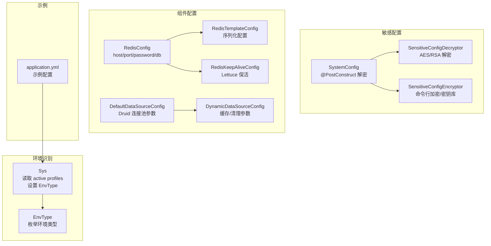
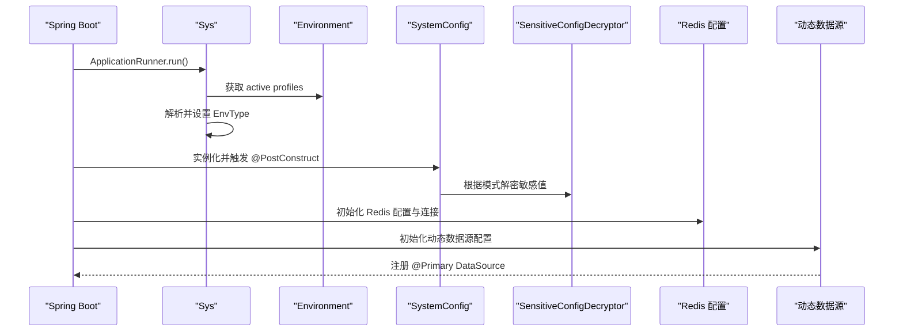
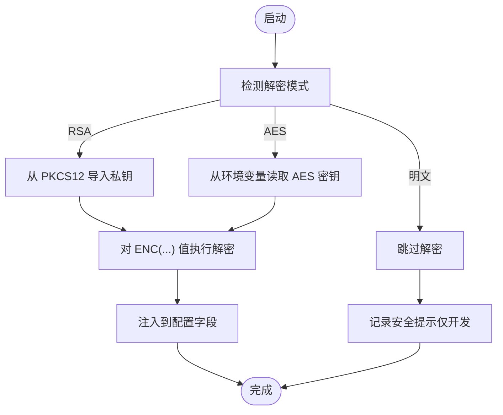
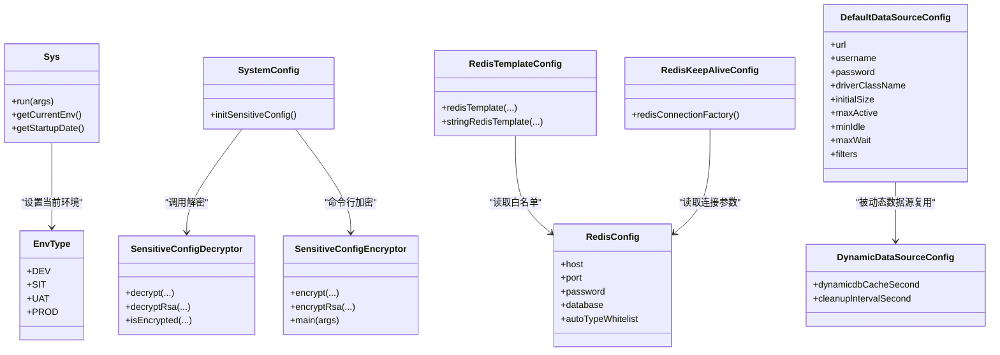

# 环境配置

<cite>
**本文引用的文件**
- [EnvType.java](file://sh-core/src/main/java/com/wkclz/core/enums/EnvType.java)
- [Sys.java](file://sh-spring/src/main/java/com/wkclz/spring/config/Sys.java)
- [SystemConfig.java](file://sh-spring/src/main/java/com/wkclz/spring/config/SystemConfig.java)
- [SensitiveConfigDecryptor.java](file://sh-spring/src/main/java/com/wkclz/spring/config/SensitiveConfigDecryptor.java)
- [SensitiveConfigEncryptor.java](file://sh-spring/src/main/java/com/wkclz/spring/config/SensitiveConfigEncryptor.java)
- [RedisConfig.java](file://sh-redis/src/main/java/com/wkclz/redis/config/RedisConfig.java)
- [RedisTemplateConfig.java](file://sh-redis/src/main/java/com/wkclz/redis/config/RedisTemplateConfig.java)
- [RedisKeepAliveConfig.java](file://sh-redis/src/main/java/com/wkclz/redis/config/RedisKeepAliveConfig.java)
- [DefaultDataSourceConfig.java](file://sh-dynamicdb/src/main/java/com/wkclz/dynamicdb/bean/DefaultDataSourceConfig.java)
- [DynamicDataSourceConfig.java](file://sh-dynamicdb/src/main/java/com/wkclz/dynamicdb/config/DynamicDataSourceConfig.java)
- [application.yml](file://sh-demo/src/main/resources/config/application.yml)
- [SKILL.md（sh-dynamicdb）](file://.agents/skills/sh-dynamicdb/SKILL.md)
</cite>

## 目录
1. [简介](#简介)
2. [项目结构](#项目结构)
3. [核心组件](#核心组件)
4. [架构总览](#架构总览)
5. [详细组件分析](#详细组件分析)
6. [依赖关系分析](#依赖关系分析)
7. [性能考量](#性能考量)
8. [故障排查指南](#故障排查指南)
9. [结论](#结论)
10. [附录](#附录)

## 简介
本指南面向 sh-framework 框架的环境配置与运维实践，覆盖开发、测试、预发布与生产四类环境的差异化配置与最佳实践；阐述敏感配置的加密存储与运行时解密流程；明确配置文件的层次结构与优先级规则；给出标准化配置模板与命名约定；介绍 Spring Profile 的使用与环境切换方法；详解数据库连接、缓存、消息中间件等关键组件在不同环境下的适配要点；并提供配置热更新与动态配置的可行方案以及配置验证与监控方法。

## 项目结构
sh-framework 将“环境配置”能力以模块化方式组织：
- 环境识别与全局状态：通过系统初始化器读取 Spring Profile 并设置当前环境类型，供全系统使用。
- 敏感配置保护：提供基于 RSA 密钥库与 AES 的双重解密方案，支持运行时自动解密。
- 组件配置：Redis、动态数据源等关键组件通过独立配置类读取环境变量与配置文件，实现环境适配。
- 示例与参考：示例模块提供基础的 application.yml 结构，便于对照与迁移。

图表来源
- [Sys.java:38-78](file://sh-spring/src/main/java/com/wkclz/spring/config/Sys.java#L38-L78)
- [EnvType.java:10-26](file://sh-core/src/main/java/com/wkclz/core/enums/EnvType.java#L10-L26)
- [SystemConfig.java:99-121](file://sh-spring/src/main/java/com/wkclz/spring/config/SystemConfig.java#L99-L121)
- [SensitiveConfigDecryptor.java:26-70](file://sh-spring/src/main/java/com/wkclz/spring/config/SensitiveConfigDecryptor.java#L26-L70)
- [SensitiveConfigEncryptor.java:52-97](file://sh-spring/src/main/java/com/wkclz/spring/config/SensitiveConfigEncryptor.java#L52-L97)
- [RedisConfig.java:16-31](file://sh-redis/src/main/java/com/wkclz/redis/config/RedisConfig.java#L16-L31)
- [RedisTemplateConfig.java:31-59](file://sh-redis/src/main/java/com/wkclz/redis/config/RedisTemplateConfig.java#L31-L59)
- [RedisKeepAliveConfig.java:22-50](file://sh-redis/src/main/java/com/wkclz/redis/config/RedisKeepAliveConfig.java#L22-L50)
- [DefaultDataSourceConfig.java:10-31](file://sh-dynamicdb/src/main/java/com/wkclz/dynamicdb/bean/DefaultDataSourceConfig.java#L10-L31)
- [DynamicDataSourceConfig.java:11-16](file://sh-dynamicdb/src/main/java/com/wkclz/dynamicdb/config/DynamicDataSourceConfig.java#L11-L16)
- [application.yml:1-26](file://sh-demo/src/main/resources/config/application.yml#L1-L26)

章节来源
- [Sys.java:38-78](file://sh-spring/src/main/java/com/wkclz/spring/config/Sys.java#L38-L78)
- [application.yml:1-26](file://sh-demo/src/main/resources/config/application.yml#L1-L26)

## 核心组件
- 环境识别与全局状态
  - Sys 在应用启动后读取 active profiles，解析并设置当前环境类型，供全系统使用。
  - EnvType 提供 DEV/SIT/UAT/PROD 枚举，便于条件化配置与日志输出。
- 敏感配置保护
  - SystemConfig 在 @PostConstruct 阶段根据配置选择解密模式：RSA 密钥库、AES 或明文。
  - SensitiveConfigDecryptor 提供统一的解密入口与格式校验。
  - SensitiveConfigEncryptor 提供命令行加密与密钥库管理能力。
- 组件配置
  - RedisConfig/RedisTemplateConfig/RedisKeepAliveConfig 组合实现 Redis 连接、序列化与保活。
  - DefaultDataSourceConfig/DynamicDataSourceConfig 组合实现连接池参数与动态数据源行为。

章节来源
- [Sys.java:38-78](file://sh-spring/src/main/java/com/wkclz/spring/config/Sys.java#L38-L78)
- [EnvType.java:10-26](file://sh-core/src/main/java/com/wkclz/core/enums/EnvType.java#L10-L26)
- [SystemConfig.java:99-121](file://sh-spring/src/main/java/com/wkclz/spring/config/SystemConfig.java#L99-L121)
- [SensitiveConfigDecryptor.java:26-70](file://sh-spring/src/main/java/com/wkclz/spring/config/SensitiveConfigDecryptor.java#L26-L70)
- [SensitiveConfigEncryptor.java:52-97](file://sh-spring/src/main/java/com/wkclz/spring/config/SensitiveConfigEncryptor.java#L52-L97)
- [RedisConfig.java:16-31](file://sh-redis/src/main/java/com/wkclz/redis/config/RedisConfig.java#L16-L31)
- [RedisTemplateConfig.java:31-59](file://sh-redis/src/main/java/com/wkclz/redis/config/RedisTemplateConfig.java#L31-L59)
- [RedisKeepAliveConfig.java:22-50](file://sh-redis/src/main/java/com/wkclz/redis/config/RedisKeepAliveConfig.java#L22-L50)
- [DefaultDataSourceConfig.java:10-31](file://sh-dynamicdb/src/main/java/com/wkclz/dynamicdb/bean/DefaultDataSourceConfig.java#L10-L31)
- [DynamicDataSourceConfig.java:11-16](file://sh-dynamicdb/src/main/java/com/wkclz/dynamicdb/config/DynamicDataSourceConfig.java#L11-L16)

## 架构总览
下图展示环境配置在启动阶段的关键交互：Profile 读取、环境类型设置、敏感配置解密、组件初始化与连接建立。

图表来源
- [Sys.java:38-78](file://sh-spring/src/main/java/com/wkclz/spring/config/Sys.java#L38-L78)
- [SystemConfig.java:99-121](file://sh-spring/src/main/java/com/wkclz/spring/config/SystemConfig.java#L99-L121)
- [SensitiveConfigDecryptor.java:26-70](file://sh-spring/src/main/java/com/wkclz/spring/config/SensitiveConfigDecryptor.java#L26-L70)
- [RedisConfig.java:16-31](file://sh-redis/src/main/java/com/wkclz/redis/config/RedisConfig.java#L16-L31)
- [DefaultDataSourceConfig.java:10-31](file://sh-dynamicdb/src/main/java/com/wkclz/dynamicdb/bean/DefaultDataSourceConfig.java#L10-L31)

## 详细组件分析

### 环境识别与切换（Spring Profile）
- Profile 读取与环境类型映射
  - Sys 在启动后读取 active profiles，将匹配到的环境关键字映射为 EnvType（DEV/SIT/UAT/PROD），并记录启动时间。
- 切换方法
  - 通过 spring.profiles.active 指定当前激活的 Profile；示例模块展示了 local Profile 的使用。
- 最佳实践
  - 不同环境使用不同的 Profile 名称，避免混淆；在 CI/CD 中通过 JVM 参数或容器环境变量注入 active profiles。

章节来源
- [Sys.java:38-78](file://sh-spring/src/main/java/com/wkclz/spring/config/Sys.java#L38-L78)
- [application.yml:7-8](file://sh-demo/src/main/resources/config/application.yml#L7-L8)

### 敏感配置保护（加密存储与运行时解密）
- 支持的解密模式
  - RSA 模式（推荐）：私钥保存于 PKCS12 密钥库，密钥库密码通过环境变量注入；敏感值采用混合加密格式。
  - AES 模式：对称密钥通过环境变量注入，适合简单场景。
  - 明文模式：不加密，仅限开发环境。
- 运行时解密流程
  - SystemConfig 在 @PostConstruct 阶段检测并加载密钥，随后对敏感字段执行解密。
  - SensitiveConfigDecryptor 提供统一解密入口与格式校验。
- 命令行加密与密钥库管理
  - SensitiveConfigEncryptor 提供命令行工具，支持 AES/RSA 加密与密钥库生成、公钥导出等。

图表来源
- [SystemConfig.java:99-121](file://sh-spring/src/main/java/com/wkclz/spring/config/SystemConfig.java#L99-L121)
- [SensitiveConfigDecryptor.java:26-70](file://sh-spring/src/main/java/com/wkclz/spring/config/SensitiveConfigDecryptor.java#L26-L70)
- [SensitiveConfigEncryptor.java:52-97](file://sh-spring/src/main/java/com/wkclz/spring/config/SensitiveConfigEncryptor.java#L52-L97)

章节来源
- [SystemConfig.java:99-121](file://sh-spring/src/main/java/com/wkclz/spring/config/SystemConfig.java#L99-L121)
- [SensitiveConfigDecryptor.java:26-70](file://sh-spring/src/main/java/com/wkclz/spring/config/SensitiveConfigDecryptor.java#L26-L70)
- [SensitiveConfigEncryptor.java:52-97](file://sh-spring/src/main/java/com/wkclz/spring/config/SensitiveConfigEncryptor.java#L52-L97)

### Redis 配置（连接、序列化与保活）
- 连接配置
  - RedisConfig 读取 host/port/password/database 等基础连接参数。
- 序列化配置
  - RedisTemplateConfig 使用 StringRedisSerializer 键序列化与 Fastjson2JsonRedisSerializer 值序列化，支持 AutoType 白名单扩展。
- 保活与超时
  - RedisKeepAliveConfig 通过 Lettuce 的 SocketOptions 与 ClientOptions 开启 TCP KeepAlive、禁用 Nagle，并设置连接与命令超时。
- 环境适配建议
  - 生产环境建议开启密码认证与网络隔离；根据延迟要求调整命令超时与连接池参数。

章节来源
- [RedisConfig.java:16-31](file://sh-redis/src/main/java/com/wkclz/redis/config/RedisConfig.java#L16-L31)
- [RedisTemplateConfig.java:31-59](file://sh-redis/src/main/java/com/wkclz/redis/config/RedisTemplateConfig.java#L31-L59)
- [RedisKeepAliveConfig.java:22-50](file://sh-redis/src/main/java/com/wkclz/redis/config/RedisKeepAliveConfig.java#L22-L50)

### 动态数据源配置（连接池参数与缓存清理）
- 默认连接池参数复用
  - DefaultDataSourceConfig 读取 spring.datasource.* 与 spring.datasource.druid.* 参数，作为动态创建数据源的默认模板。
- 动态数据源行为
  - DynamicDataSourceConfig 定义缓存过期时间与清理周期等行为参数。
- 环境适配建议
  - 生产环境适当提高连接池上限与超时阈值；结合清理调度降低资源泄露风险。

章节来源
- [DefaultDataSourceConfig.java:10-31](file://sh-dynamicdb/src/main/java/com/wkclz/dynamicdb/bean/DefaultDataSourceConfig.java#L10-L31)
- [DynamicDataSourceConfig.java:11-16](file://sh-dynamicdb/src/main/java/com/wkclz/dynamicdb/config/DynamicDataSourceConfig.java#L11-L16)
- [SKILL.md（sh-dynamicdb）:104-132](file://.agents/skills/sh-dynamicdb/SKILL.md#L104-L132)

### 配置文件层次结构与优先级规则
- 层次结构
  - application.yml 作为主配置文件，可按 Profile 划分（如 application-local.yml、application-prod.yml）。
  - 示例模块提供了基础结构，便于扩展。
- 优先级（从高到低）
  - 命令行参数 > 环境变量 > application.yml > Profile-specific 文件
  - 建议敏感配置通过环境变量注入，避免写入配置文件。
- 命名约定
  - 使用小写与点分层级，如 sh.config.keystore.path、spring.data.redis.host。
  - 不同模块使用前缀区分，如 sh.*、spring.*、mybatis.*、pagehelper.*。

章节来源
- [application.yml:1-26](file://sh-demo/src/main/resources/config/application.yml#L1-L26)

### 标准化配置模板与命名约定
- Redis
  - spring.data.redis.host/port/password/database
  - sh.redis.auto-type-whitelist
- 数据库（动态数据源）
  - spring.datasource.* 与 spring.datasource.druid.*
  - sh.dynamicdb.cache-second/cleanup-interval-second
- 敏感配置
  - sh.config.keystore.path/alias/password
  - SH_CONFIG_KEYSTORE_PASSWORD
  - SH_CONFIG_DECRYPT_AES_KEY
  - alarm.email.*（含 ENC(...)）

章节来源
- [RedisConfig.java:16-31](file://sh-redis/src/main/java/com/wkclz/redis/config/RedisConfig.java#L16-L31)
- [DefaultDataSourceConfig.java:10-31](file://sh-dynamicdb/src/main/java/com/wkclz/dynamicdb/bean/DefaultDataSourceConfig.java#L10-L31)
- [DynamicDataSourceConfig.java:11-16](file://sh-dynamicdb/src/main/java/com/wkclz/dynamicdb/config/DynamicDataSourceConfig.java#L11-L16)
- [SystemConfig.java:53-95](file://sh-spring/src/main/java/com/wkclz/spring/config/SystemConfig.java#L53-L95)

### Spring Profile 使用与环境切换
- 激活方式
  - 在 application.yml 中设置 spring.profiles.active，或通过 JVM 参数 -Dspring.profiles.active=prod。
- 切换策略
  - 开发：local
  - 测试：sit/uat
  - 生产：prod
- 建议
  - 将 Profile 与部署环境绑定，避免误切；CI/CD 中统一注入。

章节来源
- [application.yml:7-8](file://sh-demo/src/main/resources/config/application.yml#L7-L8)
- [Sys.java:50-68](file://sh-spring/src/main/java/com/wkclz/spring/config/Sys.java#L50-L68)

### 关键组件环境适配清单
- 数据库
  - 开发：本地 MySQL，连接池较小；测试：模拟或专用实例；生产：高可用集群 + 严格超时与连接池上限。
- 缓存（Redis）
  - 开发：本地或内网 Redis；测试：独立实例；生产：哨兵/集群 + 密码 + 网络隔离。
- 消息中间件
  - 建议通过独立配置类读取 broker 地址、认证与超时参数，按环境分别配置。

章节来源
- [DefaultDataSourceConfig.java:10-31](file://sh-dynamicdb/src/main/java/com/wkclz/dynamicdb/bean/DefaultDataSourceConfig.java#L10-L31)
- [RedisConfig.java:16-31](file://sh-redis/src/main/java/com/wkclz/redis/config/RedisConfig.java#L16-L31)

### 配置热更新与动态配置
- 可行方案
  - 使用 Spring Cloud Config 或 Nacos/Consul 等配置中心，结合 @RefreshScope 实现部分配置的动态刷新。
  - 对于连接参数（如 Redis/数据库），建议通过重新创建连接工厂或数据源 Bean 触发生效。
- 注意事项
  - 敏感配置解密通常发生在启动阶段，不适合热更新；可通过外部密钥服务配合运行时解密。
  - 对连接池、超时等参数的热更需谨慎评估，避免连接泄漏或抖动。

章节来源
- [SensitiveConfigDecryptor.java:26-70](file://sh-spring/src/main/java/com/wkclz/spring/config/SensitiveConfigDecryptor.java#L26-L70)
- [RedisKeepAliveConfig.java:22-50](file://sh-redis/src/main/java/com/wkclz/redis/config/RedisKeepAliveConfig.java#L22-L50)

### 配置验证与监控
- 启动验证
  - Sys 在启动完成后记录当前环境与启动时间，便于快速核验。
- 日志与告警
  - SystemConfig 在未配置解密密钥时发出安全警告；建议在生产环境启用告警邮箱（alarm.email.*）。
- 监控建议
  - 监控 Redis 连接数、命令耗时与错误率；监控数据库连接池活跃数与等待时间；对敏感配置访问进行审计。

章节来源
- [Sys.java:75-77](file://sh-spring/src/main/java/com/wkclz/spring/config/Sys.java#L75-L77)
- [SystemConfig.java:126-137](file://sh-spring/src/main/java/com/wkclz/spring/config/SystemConfig.java#L126-L137)

## 依赖关系分析
- 组件耦合
  - Sys 依赖 EnvType 与 Spring Environment；SystemConfig 依赖 SensitiveConfigDecryptor 与 SensitiveConfigEncryptor。
  - Redis 配置类之间松耦合，通过 @Bean 串联；动态数据源配置类与默认连接池参数配置相互独立。
- 外部依赖
  - Redis 使用 Lettuce 客户端；数据库连接池使用 Druid；序列化使用 fastjson2。

图表来源
- [Sys.java:38-78](file://sh-spring/src/main/java/com/wkclz/spring/config/Sys.java#L38-L78)
- [EnvType.java:10-26](file://sh-core/src/main/java/com/wkclz/core/enums/EnvType.java#L10-L26)
- [SystemConfig.java:99-121](file://sh-spring/src/main/java/com/wkclz/spring/config/SystemConfig.java#L99-L121)
- [SensitiveConfigDecryptor.java:26-70](file://sh-spring/src/main/java/com/wkclz/spring/config/SensitiveConfigDecryptor.java#L26-L70)
- [SensitiveConfigEncryptor.java:52-97](file://sh-spring/src/main/java/com/wkclz/spring/config/SensitiveConfigEncryptor.java#L52-L97)
- [RedisConfig.java:16-31](file://sh-redis/src/main/java/com/wkclz/redis/config/RedisConfig.java#L16-L31)
- [RedisTemplateConfig.java:31-59](file://sh-redis/src/main/java/com/wkclz/redis/config/RedisTemplateConfig.java#L31-L59)
- [RedisKeepAliveConfig.java:22-50](file://sh-redis/src/main/java/com/wkclz/redis/config/RedisKeepAliveConfig.java#L22-L50)
- [DefaultDataSourceConfig.java:10-31](file://sh-dynamicdb/src/main/java/com/wkclz/dynamicdb/bean/DefaultDataSourceConfig.java#L10-L31)
- [DynamicDataSourceConfig.java:11-16](file://sh-dynamicdb/src/main/java/com/wkclz/dynamicdb/config/DynamicDataSourceConfig.java#L11-L16)

## 性能考量
- Redis
  - 合理设置命令超时与连接池参数；开启 TCP KeepAlive 降低握手开销。
- 数据库
  - 根据环境调整连接池大小与超时；避免在高并发场景下频繁重建连接池。
- 敏感配置
  - 解密仅在启动阶段执行，避免运行时重复解密带来的开销。

章节来源
- [RedisKeepAliveConfig.java:22-50](file://sh-redis/src/main/java/com/wkclz/redis/config/RedisKeepAliveConfig.java#L22-L50)
- [DefaultDataSourceConfig.java:10-31](file://sh-dynamicdb/src/main/java/com/wkclz/dynamicdb/bean/DefaultDataSourceConfig.java#L10-L31)

## 故障排查指南
- 启动后环境识别异常
  - 检查 spring.profiles.active 是否正确；确认 Sys 是否成功解析并设置 EnvType。
- 敏感配置解密失败
  - 确认是否配置了 RSA 密钥库或 AES 密钥；检查环境变量注入是否生效；查看 SystemConfig 的安全警告日志。
- Redis 连接问题
  - 核对 host/port/password/database；确认命令超时与连接超时不冲突；检查网络连通性。
- 动态数据源异常
  - 检查默认连接池参数是否正确；确认缓存过期与清理调度配置合理。

章节来源
- [Sys.java:75-77](file://sh-spring/src/main/java/com/wkclz/spring/config/Sys.java#L75-L77)
- [SystemConfig.java:126-137](file://sh-spring/src/main/java/com/wkclz/spring/config/SystemConfig.java#L126-L137)
- [RedisConfig.java:16-31](file://sh-redis/src/main/java/com/wkclz/redis/config/RedisConfig.java#L16-L31)
- [DefaultDataSourceConfig.java:10-31](file://sh-dynamicdb/src/main/java/com/wkclz/dynamicdb/bean/DefaultDataSourceConfig.java#L10-L31)

## 结论
sh-framework 在环境配置方面提供了完善的基础设施：通过 Profile 与 Sys 实现环境识别与全局状态；通过 SystemConfig 与 SensitiveConfigEncryptor/Decryptor 实现敏感配置的加密存储与运行时解密；通过 Redis 与动态数据源配置实现关键组件的环境适配。建议在生产环境中优先采用 RSA 密钥库模式，并通过环境变量注入密钥；对连接参数与超时进行精细化调优；结合配置中心实现必要的热更新与动态配置能力。

## 附录
- 配置项速查
  - 环境：spring.profiles.active
  - Redis：spring.data.redis.host/port/password/database、sh.redis.auto-type-whitelist
  - 数据库（动态数据源）：spring.datasource.*、spring.datasource.druid.*、sh.dynamicdb.cache-second、sh.dynamicdb.cleanup-interval-second
  - 敏感配置：sh.config.keystore.path/alias/password、SH_CONFIG_KEYSTORE_PASSWORD、SH_CONFIG_DECRYPT_AES_KEY、alarm.email.*

章节来源
- [application.yml:1-26](file://sh-demo/src/main/resources/config/application.yml#L1-L26)
- [RedisConfig.java:16-31](file://sh-redis/src/main/java/com/wkclz/redis/config/RedisConfig.java#L16-L31)
- [DefaultDataSourceConfig.java:10-31](file://sh-dynamicdb/src/main/java/com/wkclz/dynamicdb/bean/DefaultDataSourceConfig.java#L10-L31)
- [DynamicDataSourceConfig.java:11-16](file://sh-dynamicdb/src/main/java/com/wkclz/dynamicdb/config/DynamicDataSourceConfig.java#L11-L16)
- [SystemConfig.java:53-95](file://sh-spring/src/main/java/com/wkclz/spring/config/SystemConfig.java#L53-L95)