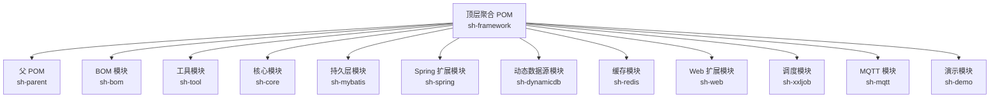
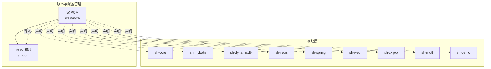
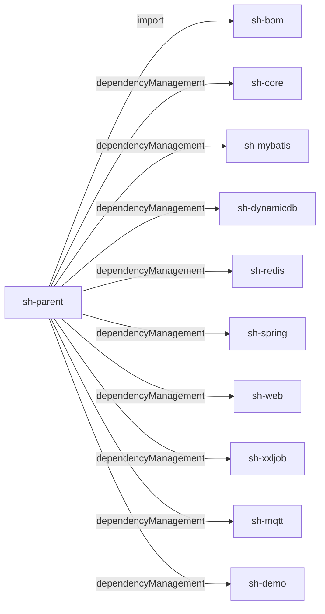

# 配置管理

<cite>
**本文引用的文件**
- [sh-bom/pom.xml](file://sh-bom/pom.xml)
- [sh-parent/pom.xml](file://sh-parent/pom.xml)
- [根级聚合POM](file://pom.xml)
- [示例模块配置](file://sh-demo/src/main/resources/config/application.yml)
- [系统配置类](file://sh-spring/src/main/java/com/wkclz/spring/config/SystemConfig.java)
</cite>

## 目录
1. [简介](#简介)
2. [项目结构](#项目结构)
3. [核心组件](#核心组件)
4. [架构总览](#架构总览)
5. [详细组件分析](#详细组件分析)
6. [依赖分析](#依赖分析)
7. [性能考虑](#性能考虑)
8. [故障排查指南](#故障排查指南)
9. [结论](#结论)
10. [附录](#附录)

## 简介
本文件面向 sh-framework 框架的配置管理，系统性阐述以下主题：
- 版本管理（BOM）：sh-bom 模块如何集中管理依赖版本与排除策略
- 父 POM 设计：sh-parent 的作用、继承链路与插件管理
- 模块依赖关系：模块间依赖约束与循环依赖规避策略
- 环境配置最佳实践：开发/测试/生产差异与敏感信息保护
- TRAE 规格与修复文档：安全修复跟踪与版本升级策略
- 配置文件标准化模板与配置项说明
- 配置变更审批与回滚策略

## 项目结构
sh-framework 采用多模块聚合结构，顶层聚合 POM 统一声明子模块；sh-parent 作为父 POM 提供统一的构建与依赖管理；sh-bom 以依赖管理方式集中版本号；各功能模块按领域拆分。

图表来源
- [根级聚合POM:21-34](file://pom.xml#L21-L34)
- [sh-parent/pom.xml:15-18](file://sh-parent/pom.xml#L15-L18)
- [sh-bom/pom.xml:13-14](file://sh-bom/pom.xml#L13-L14)

章节来源
- [根级聚合POM:21-34](file://pom.xml#L21-L34)
- [sh-parent/pom.xml:15-18](file://sh-parent/pom.xml#L15-L18)
- [sh-bom/pom.xml:13-14](file://sh-bom/pom.xml#L13-L14)

## 核心组件
- BOM 模块（sh-bom）
  - 通过 dependencyManagement 集中声明第三方依赖与框架依赖的版本占位符
  - 使用属性统一管理版本，便于跨模块一致升级
  - 对部分依赖进行排除（如微信相关模块对 Bouncy Castle 的排除），避免传递性冲突
- 父 POM（sh-parent）
  - 继承 spring-boot-starter-parent，统一构建行为与插件配置
  - 在 dependencyManagement 中导入 sh-bom，并声明各子模块 artifactId 与版本占位（${revision}）
  - 提供 flatten-maven-plugin 用于版本扁平化，以及编译器与注解处理器配置
  - 在 pluginManagement 中为 spring-boot-maven-plugin 配置需要解包的依赖（如 Bouncy Castle）
- 顶层聚合 POM（sh-framework）
  - 聚合所有子模块，形成统一的构建入口

章节来源
- [sh-bom/pom.xml:16-50](file://sh-bom/pom.xml#L16-L50)
- [sh-bom/pom.xml:53-280](file://sh-bom/pom.xml#L53-L280)
- [sh-parent/pom.xml:32-159](file://sh-parent/pom.xml#L32-L159)
- [sh-parent/pom.xml:164-243](file://sh-parent/pom.xml#L164-L243)
- [根级聚合POM:21-34](file://pom.xml#L21-L34)

## 架构总览
下图展示 sh-framework 的配置与版本管理架构，强调 BOM 与父 POM 的协作关系，以及模块如何继承这些配置。

图表来源
- [sh-parent/pom.xml:32-159](file://sh-parent/pom.xml#L32-L159)
- [sh-bom/pom.xml:53-280](file://sh-bom/pom.xml#L53-L280)
- [根级聚合POM:21-34](file://pom.xml#L21-L34)

## 详细组件分析

### BOM 模块（sh-bom）版本管理
- 属性集中管理
  - 在 properties 中统一声明第三方与框架依赖的版本占位符，例如 commons-collections4、guava、fastjson2、hutool、druid、mysql-connector-j、mybatis-spring-boot-starter、pagehelper、aop、lombok 等
  - 优点：一处修改，多模块受益；避免版本漂移
- 依赖管理
  - 在 dependencyManagement 中以占位符形式声明依赖坐标与版本
  - 对微信相关模块对 Bouncy Castle 的传递依赖进行排除，降低冲突风险
- 适用范围
  - 由 sh-parent 在 dependencyManagement 中 import，从而影响所有子模块

章节来源
- [sh-bom/pom.xml:16-50](file://sh-bom/pom.xml#L16-L50)
- [sh-bom/pom.xml:53-280](file://sh-bom/pom.xml#L53-L280)

### 父 POM（sh-parent）继承与插件管理
- 继承 spring-boot-starter-parent
  - 保持与 Spring Boot 生态一致的默认行为与版本策略
- 导入 BOM 并声明模块清单
  - 通过 import 方式导入 sh-bom，确保所有模块共享同一版本矩阵
  - 在 dependencyManagement 中显式声明各子模块 artifactId 与版本占位（${revision}），便于统一升级
- 构建插件
  - maven-source-plugin：打包源码
  - flatten-maven-plugin：在构建时将 ${revision} 展开为实际版本，便于发布与依赖解析
  - maven-compiler-plugin：指定 release 版本与注解处理器（如 Lombok）
  - spring-boot-maven-plugin：对特定依赖（如 Bouncy Castle）配置 requiresUnpack，解决 JCE 数字签名问题
- 版本占位
  - 父 POM 与聚合 POM 共同使用 ${revision} 作为版本占位，配合 flatten 插件实现“伪 SNAPSHOT”与稳定版本的平衡

章节来源
- [sh-parent/pom.xml:7-13](file://sh-parent/pom.xml#L7-L13)
- [sh-parent/pom.xml:32-159](file://sh-parent/pom.xml#L32-L159)
- [sh-parent/pom.xml:164-243](file://sh-parent/pom.xml#L164-L243)
- [根级聚合POM:15-19](file://pom.xml#L15-L19)

### 模块依赖关系管理策略
- 依赖约束
  - 通过 sh-parent 的 dependencyManagement 统一声明各模块坐标，避免子模块重复声明版本
  - sh-bom 的 dependencyManagement 作为“版本权威”，集中管理第三方依赖版本
- 循环依赖规避
  - sh-framework 采用单向依赖：上层模块（如 web、demo）依赖下层模块（core、mybatis、redis 等），不反向依赖
  - 功能模块按职责拆分，避免横向耦合
- 排除与传递性控制
  - sh-bom 对易产生冲突的传递依赖进行排除（如微信模块对 Bouncy Castle 的排除），降低冲突概率

章节来源
- [sh-parent/pom.xml:32-159](file://sh-parent/pom.xml#L32-L159)
- [sh-bom/pom.xml:75-81](file://sh-bom/pom.xml#L75-L81)
- [sh-bom/pom.xml:87-93](file://sh-bom/pom.xml#L87-L93)

### 环境配置最佳实践
- 开发/测试/生产差异
  - 使用 Spring Profile 切换不同环境配置，示例中演示了本地 profile 的激活方式
  - 数据源、日志、序列化等配置可按环境差异化
- 敏感信息保护
  - SystemConfig 支持三种解密模式：RSA 密钥库（推荐）、AES 对称密钥、明文（仅限开发）
  - RSA 模式：密钥库文件与密码通过环境变量注入，密文使用 ENC(...) 格式存储
  - AES 模式：密钥通过环境变量注入，避免与密文同处一文件
  - 明文模式：严格限制在开发环境使用，生产禁止
- 配置项要点
  - 应用名称、活动 profile、告警邮箱开关与凭据等通过 @Value 注入
  - 初始化阶段完成敏感配置解密，失败时抛出系统异常

章节来源
- [示例模块配置:7-8](file://sh-demo/src/main/resources/config/application.yml#L7-L8)
- [系统配置类:14-38](file://sh-spring/src/main/java/com/wkclz/spring/config/SystemConfig.java#L14-L38)
- [系统配置类:48-121](file://sh-spring/src/main/java/com/wkclz/spring/config/SystemConfig.java#L48-L121)
- [系统配置类:126-137](file://sh-spring/src/main/java/com/wkclz/spring/config/SystemConfig.java#L126-L137)

### TRAE 规格与修复文档管理
- TRAE 规格定位
  - 用于记录安全修复、性能优化与架构改进的规范化文档，包含规范说明、检查清单与执行任务
- 文档组织
  - 位于 .trae/specs 下，每个修复主题一个目录，包含 spec.md（规范）、checklist.md（检查清单）、tasks.md（任务）
- 跟踪与升级策略
  - 通过文档明确修复目标、验证步骤与回滚条件
  - 升级策略遵循“先评估、后验证、再上线”的流程，结合 BOM 与父 POM 的版本管理能力统一升级受影响依赖

章节来源
- [.trae/specs 目录结构](file://.trae/specs/fix-fastjson2-autotype-vuln/spec.md)
- [.trae/specs 目录结构](file://.trae/specs/fix-sensitive-config-plaintext/checklist.md)
- [.trae/specs 目录结构](file://.trae/specs/fix-sql-injection-updateby/tasks.md)

### 配置文件标准化模板与配置项说明
- application.yml 标准字段
  - server.port：服务端口
  - spring.application.name：应用名称
  - spring.profiles.active：当前激活的 profile
  - spring.datasource.driver-class-name：数据库驱动
  - jackson.default-property-inclusion：序列化策略
  - mybatis.mapper-locations：Mapper XML 路径
  - mybatis.configuration.map-underscore-to-camel-case：命名策略
  - pagehelper.*：分页插件配置项
- 环境差异化
  - 通过不同 profile 文件覆盖上述键值，实现开发/测试/生产的差异化配置
- 敏感配置
  - 建议将数据库密码、邮箱密码等放入 ENC(...) 并通过 SystemConfig 自动解密

章节来源
- [示例模块配置:1-26](file://sh-demo/src/main/resources/config/application.yml#L1-L26)
- [系统配置类:83-96](file://sh-spring/src/main/java/com/wkclz/spring/config/SystemConfig.java#L83-L96)

### 配置变更审批与回滚策略
- 变更审批
  - 关键配置（含敏感信息）变更需经双人复核与安全评审
  - 变更前在测试环境验证，形成检查清单与回归测试报告
- 回滚策略
  - 采用蓝绿/滚动回滚，保留上一版本配置与密钥
  - 若涉及依赖升级，结合 BOM 版本回退与 flatten 版本还原
- 发布节奏
  - 与父 POM 的 ${revision} 升级同步，确保版本一致性

章节来源
- [sh-parent/pom.xml:20-29](file://sh-parent/pom.xml#L20-L29)
- [sh-parent/pom.xml:182-202](file://sh-parent/pom.xml#L182-L202)

## 依赖分析
下图展示 sh-parent 与 sh-bom 的依赖导入关系，以及模块如何继承这些依赖管理。

图表来源
- [sh-parent/pom.xml:32-159](file://sh-parent/pom.xml#L32-L159)
- [sh-bom/pom.xml:53-280](file://sh-bom/pom.xml#L53-L280)

章节来源
- [sh-parent/pom.xml:32-159](file://sh-parent/pom.xml#L32-L159)
- [sh-bom/pom.xml:53-280](file://sh-bom/pom.xml#L53-L280)

## 性能考虑
- 版本统一带来的收益
  - 减少传递性依赖冲突引发的类加载与内存占用问题
  - 通过排除策略减少不必要的依赖引入
- 构建性能
  - flatten-maven-plugin 在构建期展开版本，避免 CI 缓存碎片化
  - spring-boot-maven-plugin 的 requiresUnpack 仅针对必要依赖，避免整体打包膨胀
- 运行时性能
  - SystemConfig 的解密在初始化阶段完成，避免运行时重复解密

章节来源
- [sh-bom/pom.xml:75-81](file://sh-bom/pom.xml#L75-L81)
- [sh-parent/pom.xml:182-202](file://sh-parent/pom.xml#L182-L202)
- [sh-parent/pom.xml:227-234](file://sh-parent/pom.xml#L227-L234)
- [系统配置类:99-121](file://sh-spring/src/main/java/com/wkclz/spring/config/SystemConfig.java#L99-L121)

## 故障排查指南
- 启动时报 JCE Provider 校验失败
  - 现象：启动报错提示无法验证 Bouncy Castle Provider
  - 处理：确认 spring-boot-maven-plugin 的 requiresUnpack 已包含 bcprov-jdk18on
- 敏感配置解密失败
  - 现象：应用启动时报敏感配置已加密但未配置解密密钥
  - 处理：配置 RSA 密钥库路径与密码，或通过环境变量注入 AES 密钥
- 版本不一致导致的类冲突
  - 现象：运行时报 NoSuchMethodError 或 NoClassDefFoundError
  - 处理：检查 sh-bom 中对应依赖版本是否正确，确认父 POM 已 import 该 BOM

章节来源
- [sh-parent/pom.xml:227-234](file://sh-parent/pom.xml#L227-L234)
- [系统配置类:115-121](file://sh-spring/src/main/java/com/wkclz/spring/config/SystemConfig.java#L115-L121)
- [sh-bom/pom.xml:164-183](file://sh-bom/pom.xml#L164-L183)

## 结论
sh-framework 的配置管理以 sh-parent 与 sh-bom 为核心，通过“父 POM + BOM + 模块依赖管理”的组合，实现了版本统一、构建一致与安全可控。配合 TRAE 规格文档与严格的变更流程，能够持续提升系统的稳定性与安全性。

## 附录
- 配置项速查
  - sh.config.keystore.path：RSA 密钥库路径
  - sh.config.keystore.alias：密钥别名
  - SH_CONFIG_KEYSTORE_PASSWORD：密钥库密码（环境变量）
  - sh.config.decrypt-aes-key：AES 解密密钥（建议通过环境变量注入）
  - alarm.email.enabled/password/host/from/to：告警邮箱配置
- 参考路径
  - [sh-bom/pom.xml](file://sh-bom/pom.xml)
  - [sh-parent/pom.xml](file://sh-parent/pom.xml)
  - [根级聚合POM](file://pom.xml)
  - [示例模块配置](file://sh-demo/src/main/resources/config/application.yml)
  - [系统配置类](file://sh-spring/src/main/java/com/wkclz/spring/config/SystemConfig.java)