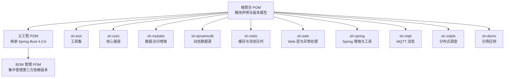
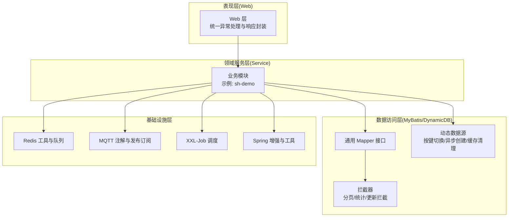
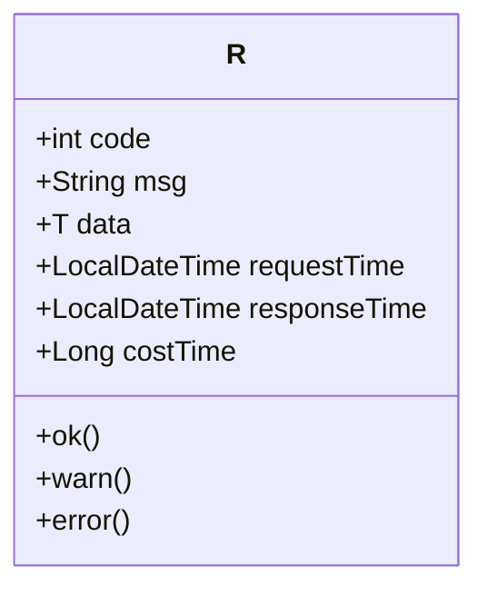
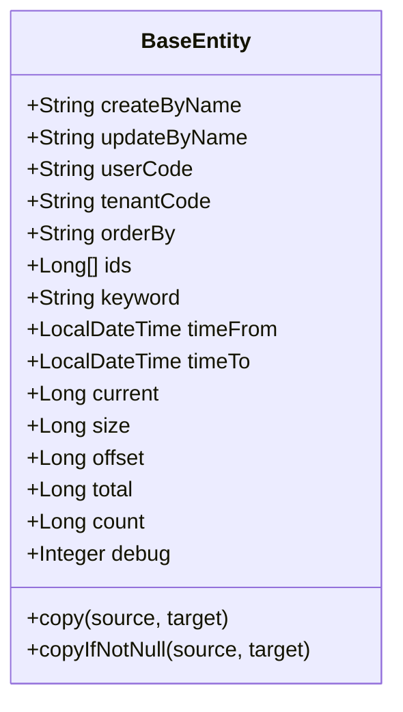
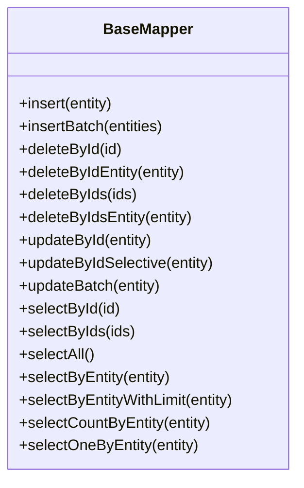
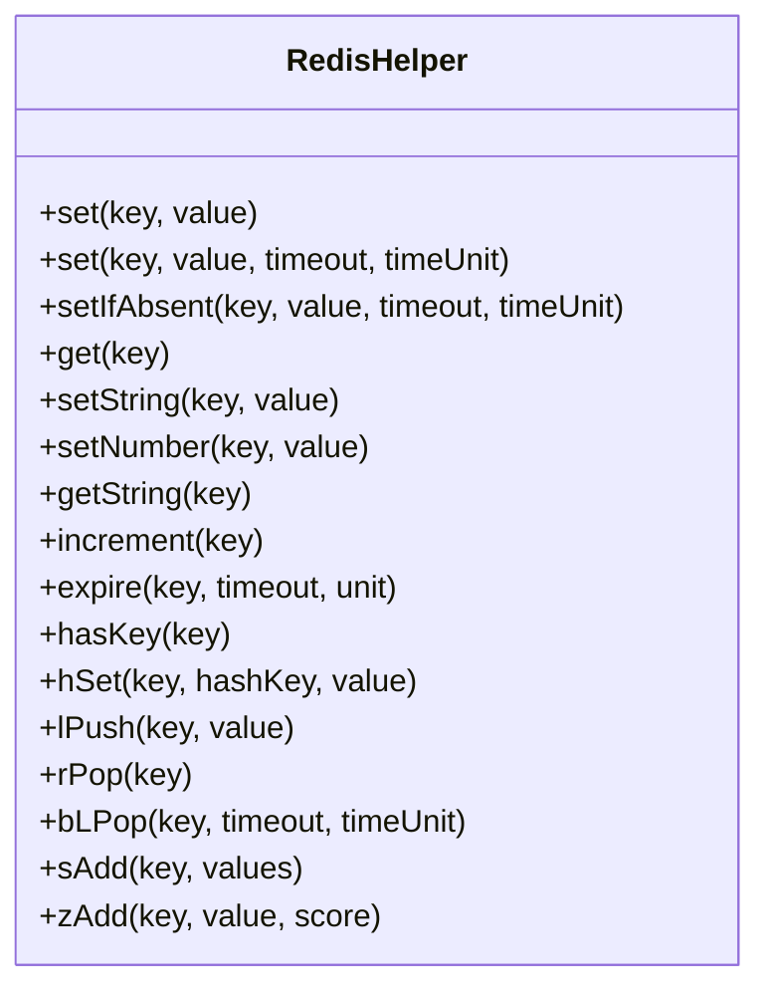
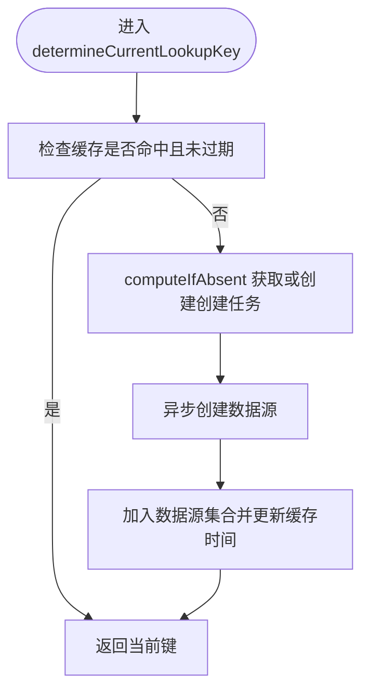
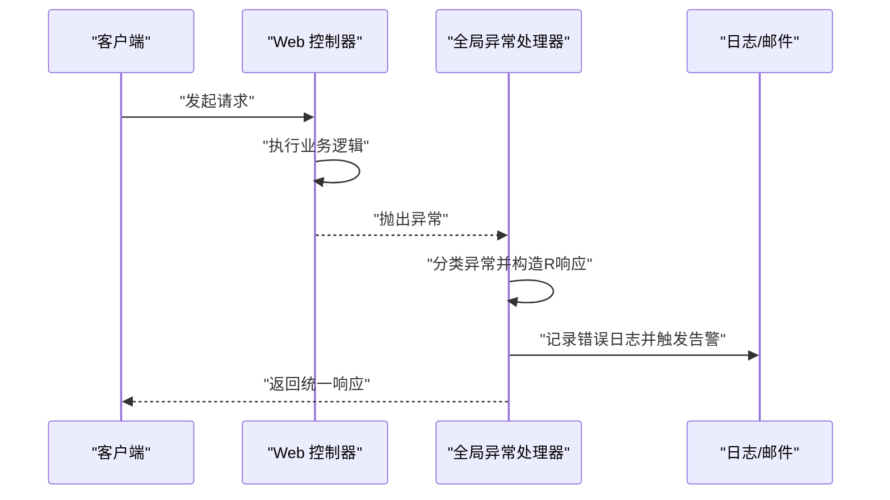
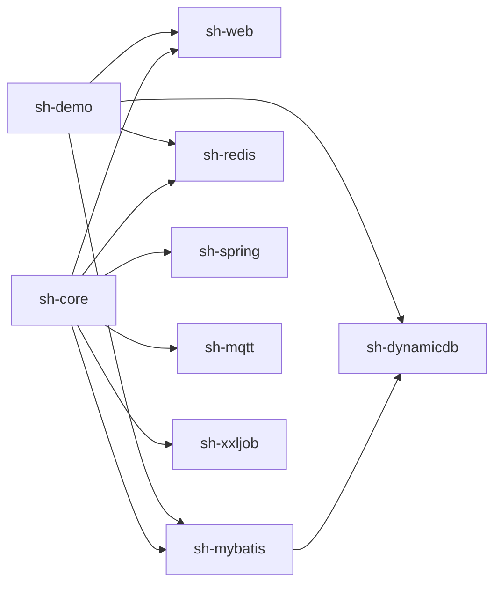

# 技术架构

<cite>
**本文引用的文件**
- [根聚合 POM](file://pom.xml)
- [父工程 POM](file://sh-parent/pom.xml)
- [BOM 管理 POM](file://sh-bom/pom.xml)
- [核心模块 BaseEntity](file://sh-core/src/main/java/com/wkclz/core/base/BaseEntity.java)
- [核心模块统一响应 R](file://sh-core/src/main/java/com/wkclz/core/base/R.java)
- [MyBatis 基础 Mapper](file://sh-mybatis/src/main/java/com/wkclz/mybatis/mapper/BaseMapper.java)
- [Redis 工具类 RedisHelper](file://sh-redis/src/main/java/com/wkclz/redis/helper/RedisHelper.java)
- [Web 全局异常处理器](file://sh-web/src/main/java/com/wkclz/web/rest/ErrorHandler.java)
- [动态数据源 DynamicDataSource](file://sh-dynamicdb/src/main/java/com/wkclz/dynamicdb/DynamicDataSource.java)
- [MQTT 自动装配入口](file://sh-mqtt/src/main/java/com/wkclz/mqtt/MqttAutoConfigure.java)
- [XXL-Job 自动装配入口](file://sh-xxljob/src/main/java/com/wkclz/xxljob/XxlJobAutoConfigure.java)
- [Spring 自动装配入口](file://sh-spring/src/main/java/com/wkclz/spring/ShSpringAutoConfig.java)
- [Web 自动装配入口](file://sh-web/src/main/java/com/wkclz/web/ShWebAutoConfig.java)
- [示例应用 DemoApplication](file://sh-demo/src/main/java/com/wkclz/demo/DemoApplication.java)
</cite>

## 目录
1. [简介](#简介)
2. [项目结构](#项目结构)
3. [核心组件](#核心组件)
4. [架构总览](#架构总览)
5. [详细组件分析](#详细组件分析)
6. [依赖分析](#依赖分析)
7. [性能考量](#性能考量)
8. [故障排查指南](#故障排查指南)
9. [结论](#结论)
10. [附录](#附录)

## 简介
本技术架构文档面向 sh-framework，围绕基于 Spring Boot 4.0 的分层架构展开，系统性阐述核心层、数据访问层、缓存层、消息层、Web 层的职责划分；说明 26 个核心模块的组织方式与相互依赖关系；总结关键设计模式的应用场景；并给出技术选型的考量因素、系统边界、组件交互与数据流向。

## 项目结构
sh-framework 采用 Maven 多模块聚合结构，顶层聚合工程管理模块生命周期与版本，父工程继承 Spring Boot Starter Parent，统一构建与插件配置，BOM 管理第三方依赖版本，各功能域模块按能力拆分，形成高内聚低耦合的模块化架构。

图表来源
- [根聚合 POM:21-34](file://pom.xml#L21-L34)
- [父工程 POM:7-13](file://sh-parent/pom.xml#L7-L13)
- [BOM 管理 POM:16-50](file://sh-bom/pom.xml#L16-L50)

章节来源
- [根聚合 POM:1-36](file://pom.xml#L1-L36)
- [父工程 POM:1-247](file://sh-parent/pom.xml#L1-L247)
- [BOM 管理 POM:1-285](file://sh-bom/pom.xml#L1-L285)

## 核心组件
- 统一响应模型 R：标准化接口返回结构，包含状态码、消息、数据与时间戳等，贯穿 Web 层与上层调用方。
- 基础实体 BaseEntity：统一实体字段与分页/查询辅助字段，支撑 MyBatis 通用 Mapper 与业务实体一致性。
- 数据访问增强：基于 MyBatis 提供通用 Mapper 接口与拦截器，覆盖单表 CRUD、分页、统计、乐观锁等。
- 缓存与消息：RedisHelper 提供多种数据类型的存取与原子操作，内置消息队列管理器与监听器抽象。
- 动态数据源：支持运行时按租户/业务键切换数据源，具备异步创建、缓存与定时清理能力。
- Web 异常处理：全局异常处理器，统一捕获各类异常并输出 R 格式响应，支持邮件告警。
- MQTT/XXL-Job/Spring/Web 自动装配：通过 AutoConfiguration 与组件扫描，按需启用对应能力。

章节来源
- [核心模块统一响应 R:11-76](file://sh-core/src/main/java/com/wkclz/core/base/R.java#L11-L76)
- [核心模块 BaseEntity:11-94](file://sh-core/src/main/java/com/wkclz/core/base/BaseEntity.java#L11-L94)
- [MyBatis 基础 Mapper:10-88](file://sh-mybatis/src/main/java/com/wkclz/mybatis/mapper/BaseMapper.java#L10-L88)
- [Redis 工具类 RedisHelper:18-513](file://sh-redis/src/main/java/com/wkclz/redis/helper/RedisHelper.java#L18-L513)
- [动态数据源 DynamicDataSource:22-274](file://sh-dynamicdb/src/main/java/com/wkclz/dynamicdb/DynamicDataSource.java#L22-L274)
- [Web 全局异常处理器:36-267](file://sh-web/src/main/java/com/wkclz/web/rest/ErrorHandler.java#L36-L267)

## 架构总览
整体采用“分层 + 模块化”的架构设计：
- 表现层（Web）：负责请求接入、参数校验、异常统一处理与响应封装。
- 领域服务层（Service）：由具体业务模块提供，依赖数据访问层完成持久化。
- 数据访问层（MyBatis + 动态数据源）：提供通用 Mapper 与拦截器，支持分页、统计、乐观锁与动态数据源切换。
- 基础设施层（Redis、MQTT、XXL-Job、Spring 增强）：提供缓存、消息、调度与通用工具。

图表来源
- [Web 全局异常处理器:36-267](file://sh-web/src/main/java/com/wkclz/web/rest/ErrorHandler.java#L36-L267)
- [MyBatis 基础 Mapper:10-88](file://sh-mybatis/src/main/java/com/wkclz/mybatis/mapper/BaseMapper.java#L10-L88)
- [动态数据源 DynamicDataSource:22-274](file://sh-dynamicdb/src/main/java/com/wkclz/dynamicdb/DynamicDataSource.java#L22-L274)
- [Redis 工具类 RedisHelper:18-513](file://sh-redis/src/main/java/com/wkclz/redis/helper/RedisHelper.java#L18-L513)
- [MQTT 自动装配入口:6-9](file://sh-mqtt/src/main/java/com/wkclz/mqtt/MqttAutoConfigure.java#L6-L9)
- [XXL-Job 自动装配入口:6-9](file://sh-xxljob/src/main/java/com/wkclz/xxljob/XxlJobAutoConfigure.java#L6-L9)
- [Spring 自动装配入口:7-9](file://sh-spring/src/main/java/com/wkclz/spring/ShSpringAutoConfig.java#L7-L9)
- [示例应用 DemoApplication:7-14](file://sh-demo/src/main/java/com/wkclz/demo/DemoApplication.java#L7-L14)

## 详细组件分析

### 统一响应模型 R
- 设计要点：统一返回结构，支持成功、警告、错误三类返回，内置时间戳与耗时统计，便于监控与排障。
- 使用场景：Web 层控制器与异常处理器均以 R 输出，保证前端契约一致。

图表来源
- [核心模块统一响应 R:11-76](file://sh-core/src/main/java/com/wkclz/core/base/R.java#L11-L76)

章节来源
- [核心模块统一响应 R:11-76](file://sh-core/src/main/java/com/wkclz/core/base/R.java#L11-L76)

### 基础实体 BaseEntity
- 设计要点：统一字段（创建人、更新人、用户/租户编码）、查询辅助（排序、ID 数组、关键词、时间区间）、分页辅助（current/size/offset/total/count）。
- 复用模式：与通用 Mapper 协作，简化实体与 SQL 映射。

图表来源
- [核心模块 BaseEntity:11-94](file://sh-core/src/main/java/com/wkclz/core/base/BaseEntity.java#L11-L94)

章节来源
- [核心模块 BaseEntity:11-94](file://sh-core/src/main/java/com/wkclz/core/base/BaseEntity.java#L11-L94)

### 通用 Mapper 接口 BaseMapper
- 设计要点：提供插入、批量插入、删除（单个/批量/按实体）、更新（全量/选择性/批量）、查询（单个/多个/全部/按实体/分页/统计/唯一）等能力。
- 应用模式：策略模式 + Provider 模式，不同 Provider 实现不同 SQL 生成策略，提升可扩展性。

图表来源
- [MyBatis 基础 Mapper:10-88](file://sh-mybatis/src/main/java/com/wkclz/mybatis/mapper/BaseMapper.java#L10-L88)

章节来源
- [MyBatis 基础 Mapper:10-88](file://sh-mybatis/src/main/java/com/wkclz/mybatis/mapper/BaseMapper.java#L10-L88)

### Redis 工具与消息队列
- 设计要点：提供对象/字符串/数字/Hash/List/Set/ZSet 等全类型操作，支持过期、自增、阻塞弹出等；内置消息队列管理器与监听器抽象，支持示例实现。
- 应用模式：模板方法 + 工厂模式（序列化器、队列实现），观察者模式（监听器回调）。

图表来源
- [Redis 工具类 RedisHelper:18-513](file://sh-redis/src/main/java/com/wkclz/redis/helper/RedisHelper.java#L18-L513)

章节来源
- [Redis 工具类 RedisHelper:18-513](file://sh-redis/src/main/java/com/wkclz/redis/helper/RedisHelper.java#L18-L513)

### 动态数据源 DynamicDataSource
- 设计要点：基于 Spring AbstractRoutingDataSource，按当前上下文键切换数据源；支持异步创建、Future 复用、缓存过期清理、优雅销毁。
- 应用模式：工厂模式（数据源工厂）、模板方法（创建流程）、观察者（清理任务）。

图表来源
- [动态数据源 DynamicDataSource:46-139](file://sh-dynamicdb/src/main/java/com/wkclz/dynamicdb/DynamicDataSource.java#L46-L139)

章节来源
- [动态数据源 DynamicDataSource:22-274](file://sh-dynamicdb/src/main/java/com/wkclz/dynamicdb/DynamicDataSource.java#L22-L274)

### Web 全局异常处理
- 设计要点：@RestControllerAdvice 统一捕获异常，区分业务异常与系统异常，构造 R 格式响应；支持邮件告警与请求详情记录。
- 应用模式：策略模式（异常分类处理）、观察者（邮件告警）。

图表来源
- [Web 全局异常处理器:36-267](file://sh-web/src/main/java/com/wkclz/web/rest/ErrorHandler.java#L36-L267)

章节来源
- [Web 全局异常处理器:36-267](file://sh-web/src/main/java/com/wkclz/web/rest/ErrorHandler.java#L36-L267)

### MQTT 与 XXL-Job 自动装配
- 设计要点：通过 AutoConfiguration 与组件扫描启用对应模块，降低接入成本。
- 应用模式：工厂模式（组件注册）、模板方法（装配流程）。

章节来源
- [MQTT 自动装配入口:6-9](file://sh-mqtt/src/main/java/com/wkclz/mqtt/MqttAutoConfigure.java#L6-L9)
- [XXL-Job 自动装配入口:6-9](file://sh-xxljob/src/main/java/com/wkclz/xxljob/XxlJobAutoConfigure.java#L6-L9)

## 依赖分析
- 版本与兼容性：父工程使用 Spring Boot 4.0.6，JDK 25，确保与 Spring 4.x 生态兼容；BOM 管理第三方依赖版本，避免冲突。
- 模块间依赖：核心模块 sh-core 为其他模块提供基础实体与统一响应；sh-web 依赖 sh-core 并提供异常处理；sh-mybatis 依赖 sh-core 与工具模块；sh-dynamicdb 依赖 sh-mybatis 与工具模块；sh-redis 依赖 Spring Data Redis 与工具模块；sh-mqtt/xxljob/spring 作为基础设施模块被业务模块按需引入。
- 自动装配：各模块通过 AutoConfiguration 与 spring.factories/spring.imports 机制自动装配，减少手动配置。

图表来源
- [根聚合 POM:21-34](file://pom.xml#L21-L34)
- [父工程 POM:32-158](file://sh-parent/pom.xml#L32-L158)
- [BOM 管理 POM:53-280](file://sh-bom/pom.xml#L53-L280)

章节来源
- [根聚合 POM:21-34](file://pom.xml#L21-L34)
- [父工程 POM:32-158](file://sh-parent/pom.xml#L32-L158)
- [BOM 管理 POM:53-280](file://sh-bom/pom.xml#L53-L280)

## 性能考量
- MyBatis 拦截器与通用 Mapper：通过拦截器实现分页、统计与更新增强，减少重复 SQL；建议结合分页查询与条件裁剪，避免一次性加载大结果集。
- 动态数据源：异步创建与缓存机制降低频繁切换开销；合理设置缓存时间与清理周期，避免资源泄漏。
- Redis：针对不同场景选择合适数据结构与过期策略；对阻塞操作与批量操作进行限流与超时控制。
- Web 层：统一异常处理与响应封装，减少重复判断与异常传播链路；开启必要的压缩与缓存策略。
- JDK 25 与 Spring Boot 4：充分利用新版本性能优化与内存模型改进，关注类加载与 JIT 优化。

## 故障排查指南
- 异常分类：优先识别业务异常（用户输入/权限等）与系统异常（数据库/网络等），分别走不同处理路径。
- 日志与告警：全局异常处理器记录请求详情与堆栈，必要时发送邮件告警；结合 R 的时间戳与耗时定位慢请求。
- 数据库问题：关注 SQL 语法错误、数据截断、连接池配置；动态数据源异常时检查键有效性与工厂创建流程。
- 缓存问题：确认键空间命名规范、过期策略与序列化器；对阻塞弹出与批量操作进行超时与熔断处理。
- 消息与调度：MQTT 断线重连与 SSL/TLS 配置；XXL-Job 任务幂等与失败重试策略。

章节来源
- [Web 全局异常处理器:36-267](file://sh-web/src/main/java/com/wkclz/web/rest/ErrorHandler.java#L36-L267)
- [动态数据源 DynamicDataSource:144-211](file://sh-dynamicdb/src/main/java/com/wkclz/dynamicdb/DynamicDataSource.java#L144-L211)
- [Redis 工具类 RedisHelper:345-352](file://sh-redis/src/main/java/com/wkclz/redis/helper/RedisHelper.java#L345-L352)

## 结论
sh-framework 以 Spring Boot 4.0 为基础，通过模块化与分层架构实现了高内聚、低耦合与可扩展的后端能力体系。核心层提供统一模型与异常处理，数据访问层与缓存层提供高性能持久化与缓存能力，消息与调度层满足异步与定时需求。设计模式贯穿其中，提升了代码复用性与维护性。建议在实际落地中结合业务场景细化配置与监控，持续优化性能与稳定性。

## 附录
- 示例应用 DemoApplication 展示了如何启用 MyBatis Mapper 扫描与 Spring Boot 启动，可作为新模块开发的参考模板。
- 自动装配入口（AutoConfiguration）与 spring.imports/spring.factories 机制降低了模块接入成本，建议遵循约定优于配置的原则。

章节来源
- [示例应用 DemoApplication:7-14](file://sh-demo/src/main/java/com/wkclz/demo/DemoApplication.java#L7-L14)
- [Spring 自动装配入口:7-9](file://sh-spring/src/main/java/com/wkclz/spring/ShSpringAutoConfig.java#L7-L9)
- [Web 自动装配入口:6-8](file://sh-web/src/main/java/com/wkclz/web/ShWebAutoConfig.java#L6-L8)