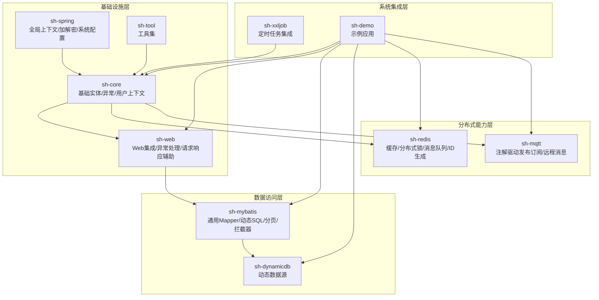
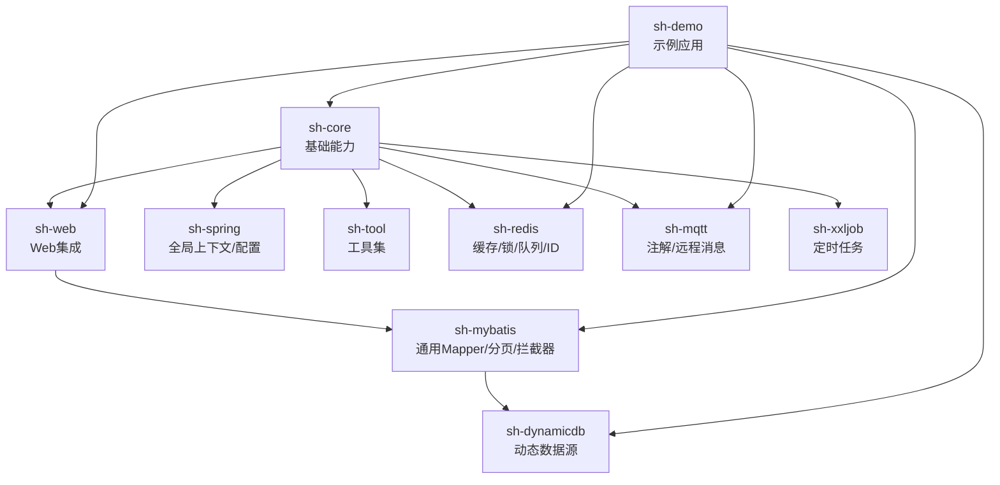
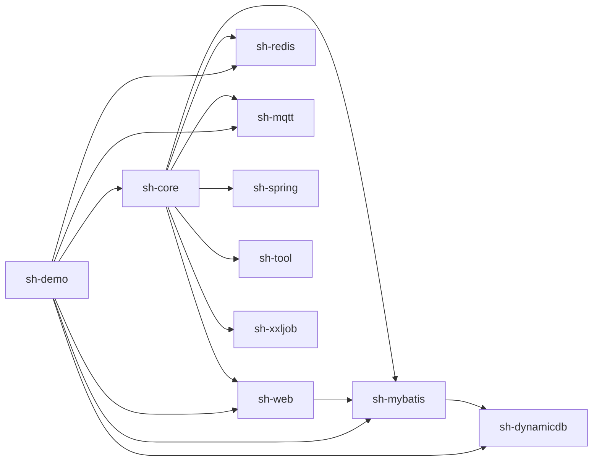

# 核心特性

<cite>
**本文引用的文件**
- [README.md](file://README.md)
- [sh-core 模块 pom.xml](file://sh-core/pom.xml)
- [sh-mybatis 模块 pom.xml](file://sh-mybatis/pom.xml)
- [sh-dynamicdb 模块 pom.xml](file://sh-dynamicdb/pom.xml)
- [sh-redis 模块 pom.xml](file://sh-redis/pom.xml)
- [sh-mqtt 模块 pom.xml](file://sh-mqtt/pom.xml)
- [sh-web 模块 pom.xml](file://sh-web/pom.xml)
- [sh-spring 模块 pom.xml](file://sh-spring/pom.xml)
- [sh-tool 模块 pom.xml](file://sh-tool/pom.xml)
- [sh-xxljob 模块 pom.xml](file://sh-xxljob/pom.xml)
- [sh-demo 模块 pom.xml](file://sh-demo/pom.xml)
- [sh-core 基础实体与上下文](file://sh-core/src/main/java/com/wkclz/core/base/BaseEntity.java)
- [sh-core 异常体系](file://sh-core/src/main/java/com/wkclz/core/exception/CommonException.java)
- [sh-core 用户上下文](file://sh-core/src/main/java/com/wkclz/core/user/UserContext.java)
- [sh-core 统一响应封装](file://sh-core/src/main/java/com/wkclz/core/base/R.java)
- [sh-web Web集成与异常处理](file://sh-web/src/main/java/com/wkclz/web/rest/ErrorHandler.java)
- [sh-web 请求/响应辅助](file://sh-web/src/main/java/com/wkclz/web/helper/RestHelper.java)
- [sh-mybatis 通用Mapper与动态SQL](file://sh-mybatis/src/main/java/com/wkclz/mybatis/mapper/BaseMapper.java)
- [sh-mybatis 分页查询](file://sh-mybatis/src/main/java/com/wkclz/mybatis/helper/PageQuery.java)
- [sh-mybatis MyBatis拦截器](file://sh-mybatis/src/main/java/com/wkclz/mybatis/interceptor/MyBatisQueryInterceptor.java)
- [sh-dynamicdb 动态数据源](file://sh-dynamicdb/src/main/java/com/wkclz/dynamicdb/DynamicDataSource.java)
- [sh-dynamicdb AOP切换](file://sh-dynamicdb/src/main/java/com/wkclz/dynamicdb/aop/DynamicDataSourceAop.java)
- [sh-redis 缓存与分布式锁](file://sh-redis/src/main/java/com/wkclz/redis/helper/RedisHelper.java)
- [sh-redis 消息队列](file://sh-redis/src/main/java/com/wkclz/redis/queue/RedisMessageQueue.java)
- [sh-redis ID生成器](file://sh-redis/src/main/java/com/wkclz/redis/helper/RedisIdGenerator.java)
- [sh-mqtt 注解与消息发布订阅](file://sh-mqtt/src/main/java/com/wkclz/mqtt/annotation/MqttController.java)
- [sh-mqtt 配置与客户端](file://sh-mqtt/src/main/java/com/wkclz/mqtt/config/MqttConfig.java)
- [sh-mqtt 远程消息模型](file://sh-mqtt/src/main/java/com/wkclz/mqtt/remote/MqttMessage.java)
- [sh-spring 全局上下文与雪花ID](file://sh-spring/src/main/java/com/wkclz/spring/config/SpringContextHolder.java)
- [sh-spring 加解密与系统配置](file://sh-spring/src/main/java/com/wkclz/spring/config/SystemConfig.java)
- [sh-tool 工具集](file://sh-tool/src/main/java/com/wkclz/tool/utils/StringUtil.java)
- [sh-xxljob 定时任务集成](file://sh-xxljob/src/main/java/com/wkclz/xxljob/config/XxlJobConfig.java)
- [sh-demo 示例应用](file://sh-demo/src/main/java/com/wkclz/demo/DemoApplication.java)
</cite>

## 目录
1. [简介](#简介)
2. [项目结构](#项目结构)
3. [核心组件](#核心组件)
4. [架构总览](#架构总览)
5. [详细组件分析](#详细组件分析)
6. [依赖分析](#依赖分析)
7. [性能考虑](#性能考虑)
8. [故障排查指南](#故障排查指南)
9. [结论](#结论)
10. [附录](#附录)

## 简介
本概览面向希望快速掌握 sh-framework 的开发者，系统梳理框架提供的26项核心特性，并按“基础能力”“数据持久化”“分布式能力”“系统集成”四大类分组说明。每项特性给出其解决的问题、提供的价值以及典型应用场景，帮助在实际项目中按需选型。

## 项目结构
sh-framework 采用多模块聚合设计，核心模块围绕“基础设施层”“数据访问层”“分布式能力层”“系统集成层”划分，配合示例模块演示标准用法。

图示来源
- [sh-core 模块 pom.xml](file://sh-core/pom.xml)
- [sh-web 模块 pom.xml](file://sh-web/pom.xml)
- [sh-spring 模块 pom.xml](file://sh-spring/pom.xml)
- [sh-tool 模块 pom.xml](file://sh-tool/pom.xml)
- [sh-mybatis 模块 pom.xml](file://sh-mybatis/pom.xml)
- [sh-dynamicdb 模块 pom.xml](file://sh-dynamicdb/pom.xml)
- [sh-redis 模块 pom.xml](file://sh-redis/pom.xml)
- [sh-mqtt 模块 pom.xml](file://sh-mqtt/pom.xml)
- [sh-xxljob 模块 pom.xml](file://sh-xxljob/pom.xml)
- [sh-demo 模块 pom.xml](file://sh-demo/pom.xml)

章节来源
- [README.md](file://README.md)
- [sh-core 模块 pom.xml](file://sh-core/pom.xml)
- [sh-web 模块 pom.xml](file://sh-web/pom.xml)
- [sh-spring 模块 pom.xml](file://sh-spring/pom.xml)
- [sh-tool 模块 pom.xml](file://sh-tool/pom.xml)
- [sh-mybatis 模块 pom.xml](file://sh-mybatis/pom.xml)
- [sh-dynamicdb 模块 pom.xml](file://sh-dynamicdb/pom.xml)
- [sh-redis 模块 pom.xml](file://sh-redis/pom.xml)
- [sh-mqtt 模块 pom.xml](file://sh-mqtt/pom.xml)
- [sh-xxljob 模块 pom.xml](file://sh-xxljob/pom.xml)
- [sh-demo 模块 pom.xml](file://sh-demo/pom.xml)

## 核心组件
- 基础能力
  - 实体体系：统一的实体基类、字段映射与审计字段约定，确保跨模块一致的数据模型。
  - 异常处理：分层异常体系与统一响应封装，简化错误传播与前端展示。
  - 用户上下文：全局用户信息持有与多租户隔离支持。
- 数据持久化
  - 通用Mapper：基于泛型的CRUD抽象，减少重复SQL与样板代码。
  - 动态SQL：通过拦截器与注解实现条件拼接、自动填充与安全策略。
  - 分页查询：统一分页入参/出参与PageData封装，屏蔽分页细节。
- 分布式能力
  - 动态数据源：运行时切换主从/多数据源，支持异步创建与一致性保障。
  - Redis缓存：全数据类型缓存操作、分布式锁、ID生成器与消息队列。
  - MQTT消息：注解驱动的消息发布/订阅，支持远程消息与断线重连。
- 系统集成
  - 定时任务：XXL-Job集成，提供配置与示例。
  - Web集成：全局异常处理、请求/响应辅助与REST元数据扫描。
  - 工具集：字符串、日期、加解密、Bean操作等常用工具。

章节来源
- [sh-core 基础实体与上下文](file://sh-core/src/main/java/com/wkclz/core/base/BaseEntity.java)
- [sh-core 异常体系](file://sh-core/src/main/java/com/wkclz/core/exception/CommonException.java)
- [sh-core 用户上下文](file://sh-core/src/main/java/com/wkclz/core/user/UserContext.java)
- [sh-core 统一响应封装](file://sh-core/src/main/java/com/wkclz/core/base/R.java)
- [sh-web Web集成与异常处理](file://sh-web/src/main/java/com/wkclz/web/rest/ErrorHandler.java)
- [sh-web 请求/响应辅助](file://sh-web/src/main/java/com/wkclz/web/helper/RestHelper.java)
- [sh-mybatis 通用Mapper与动态SQL](file://sh-mybatis/src/main/java/com/wkclz/mybatis/mapper/BaseMapper.java)
- [sh-mybatis 分页查询](file://sh-mybatis/src/main/java/com/wkclz/mybatis/helper/PageQuery.java)
- [sh-mybatis MyBatis拦截器](file://sh-mybatis/src/main/java/com/wkclz/mybatis/interceptor/MyBatisQueryInterceptor.java)
- [sh-dynamicdb 动态数据源](file://sh-dynamicdb/src/main/java/com/wkclz/dynamicdb/DynamicDataSource.java)
- [sh-dynamicdb AOP切换](file://sh-dynamicdb/src/main/java/com/wkclz/dynamicdb/aop/DynamicDataSourceAop.java)
- [sh-redis 缓存与分布式锁](file://sh-redis/src/main/java/com/wkclz/redis/helper/RedisHelper.java)
- [sh-redis 消息队列](file://sh-redis/src/main/java/com/wkclz/redis/queue/RedisMessageQueue.java)
- [sh-redis ID生成器](file://sh-redis/src/main/java/com/wkclz/redis/helper/RedisIdGenerator.java)
- [sh-mqtt 注解与消息发布订阅](file://sh-mqtt/src/main/java/com/wkclz/mqtt/annotation/MqttController.java)
- [sh-mqtt 配置与客户端](file://sh-mqtt/src/main/java/com/wkclz/mqtt/config/MqttConfig.java)
- [sh-mqtt 远程消息模型](file://sh-mqtt/src/main/java/com/wkclz/mqtt/remote/MqttMessage.java)
- [sh-spring 全局上下文与雪花ID](file://sh-spring/src/main/java/com/wkclz/spring/config/SpringContextHolder.java)
- [sh-spring 加解密与系统配置](file://sh-spring/src/main/java/com/wkclz/spring/config/SystemConfig.java)
- [sh-tool 工具集](file://sh-tool/src/main/java/com/wkclz/tool/utils/StringUtil.java)
- [sh-xxljob 定时任务集成](file://sh-xxljob/src/main/java/com/wkclz/xxljob/config/XxlJobConfig.java)

## 架构总览
下图展示核心模块间交互关系与职责边界，体现“基础能力”作为底座，“数据访问层”“分布式能力层”“系统集成层”围绕其协同工作。

图示来源
- [sh-core 模块 pom.xml](file://sh-core/pom.xml)
- [sh-web 模块 pom.xml](file://sh-web/pom.xml)
- [sh-spring 模块 pom.xml](file://sh-spring/pom.xml)
- [sh-tool 模块 pom.xml](file://sh-tool/pom.xml)
- [sh-mybatis 模块 pom.xml](file://sh-mybatis/pom.xml)
- [sh-dynamicdb 模块 pom.xml](file://sh-dynamicdb/pom.xml)
- [sh-redis 模块 pom.xml](file://sh-redis/pom.xml)
- [sh-mqtt 模块 pom.xml](file://sh-mqtt/pom.xml)
- [sh-xxljob 模块 pom.xml](file://sh-xxljob/pom.xml)
- [sh-demo 模块 pom.xml](file://sh-demo/pom.xml)

## 详细组件分析

### 基础能力

#### 实体体系（US-001）
- 解决的问题：不同模块实体字段不一致、缺少审计字段、跨库映射混乱。
- 提供的价值：统一基类与字段约定，降低跨模块耦合；内置审计字段减少重复开发。
- 典型场景：新建表结构设计、实体迁移与多租户字段注入。
- 参考路径
  - [sh-core 基础实体与上下文](file://sh-core/src/main/java/com/wkclz/core/base/BaseEntity.java)

章节来源
- [sh-core 基础实体与上下文](file://sh-core/src/main/java/com/wkclz/core/base/BaseEntity.java)

#### 异常处理（US-003）
- 解决的问题：异常类型分散、错误码不统一、异常传播链路复杂。
- 提供的价值：分层异常类与统一响应封装，简化异常处理与前端展示。
- 典型场景：接口层异常捕获、业务异常分类与日志脱敏。
- 参考路径
  - [sh-core 异常体系](file://sh-core/src/main/java/com/wkclz/core/exception/CommonException.java)
  - [sh-core 统一响应封装](file://sh-core/src/main/java/com/wkclz/core/base/R.java)

章节来源
- [sh-core 异常体系](file://sh-core/src/main/java/com/wkclz/core/exception/CommonException.java)
- [sh-core 统一响应封装](file://sh-core/src/main/java/com/wkclz/core/base/R.java)

#### 用户上下文（US-004）
- 解决的问题：多租户隔离、用户信息跨线程传递、上下文丢失。
- 提供的价值：全局用户上下文持有与清理机制，保障线程安全与租户隔离。
- 典型场景：审计日志、操作人记录、租户维度权限控制。
- 参考路径
  - [sh-core 用户上下文](file://sh-core/src/main/java/com/wkclz/core/user/UserContext.java)

章节来源
- [sh-core 用户上下文](file://sh-core/src/main/java/com/wkclz/core/user/UserContext.java)

### 数据持久化

#### 通用Mapper与动态SQL（US-007）
- 解决的问题：重复SQL与样板代码、条件拼接繁琐、字段更新不安全。
- 提供的价值：泛型Mapper抽象与动态SQL生成，提升开发效率与安全性。
- 典型场景：标准CRUD、按实体条件查询、批量插入/更新。
- 参考路径
  - [sh-mybatis 通用Mapper与动态SQL](file://sh-mybatis/src/main/java/com/wkclz/mybatis/mapper/BaseMapper.java)
  - [sh-mybatis MyBatis拦截器](file://sh-mybatis/src/main/java/com/wkclz/mybatis/interceptor/MyBatisQueryInterceptor.java)

章节来源
- [sh-mybatis 通用Mapper与动态SQL](file://sh-mybatis/src/main/java/com/wkclz/mybatis/mapper/BaseMapper.java)
- [sh-mybatis MyBatis拦截器](file://sh-mybatis/src/main/java/com/wkclz/mybatis/interceptor/MyBatisQueryInterceptor.java)

#### 分页查询（US-011）
- 解决的问题：分页参数不统一、SQL编写重复、结果封装不一致。
- 提供的价值：统一分页入参/出参与PageData封装，屏蔽分页细节。
- 典型场景：列表查询、后台管理分页、大数据量导出。
- 参考路径
  - [sh-mybatis 分页查询](file://sh-mybatis/src/main/java/com/wkclz/mybatis/helper/PageQuery.java)

章节来源
- [sh-mybatis 分页查询](file://sh-mybatis/src/main/java/com/wkclz/mybatis/helper/PageQuery.java)

#### 动态数据源（US-020/US-021）
- 解决的问题：主从切换复杂、连接池泄漏、热点数据集中。
- 提供的价值：运行时切换与异步创建机制，提升可用性与扩展性。
- 典型场景：读写分离、多租户数据库路由、临时切换备份库。
- 参考路径
  - [sh-dynamicdb 动态数据源](file://sh-dynamicdb/src/main/java/com/wkclz/dynamicdb/DynamicDataSource.java)
  - [sh-dynamicdb AOP切换](file://sh-dynamicdb/src/main/java/com/wkclz/dynamicdb/aop/DynamicDataSourceAop.java)

章节来源
- [sh-dynamicdb 动态数据源](file://sh-dynamicdb/src/main/java/com/wkclz/dynamicdb/DynamicDataSource.java)
- [sh-dynamicdb AOP切换](file://sh-dynamicdb/src/main/java/com/wkclz/dynamicdb/aop/DynamicDataSourceAop.java)

### 分布式能力

#### Redis缓存（US-016/US-017/US-018）
- 解决的问题：缓存穿透/击穿雪崩、分布式锁竞争、ID生成冲突。
- 提供的价值：全数据类型缓存、可靠分布式锁、高并发ID生成与消息队列。
- 典型场景：热点数据缓存、分布式限流、幂等性控制、订单号生成。
- 参考路径
  - [sh-redis 缓存与分布式锁](file://sh-redis/src/main/java/com/wkclz/redis/helper/RedisHelper.java)
  - [sh-redis 消息队列](file://sh-redis/src/main/java/com/wkclz/redis/queue/RedisMessageQueue.java)
  - [sh-redis ID生成器](file://sh-redis/src/main/java/com/wkclz/redis/helper/RedisIdGenerator.java)

章节来源
- [sh-redis 缓存与分布式锁](file://sh-redis/src/main/java/com/wkclz/redis/helper/RedisHelper.java)
- [sh-redis 消息队列](file://sh-redis/src/main/java/com/wkclz/redis/queue/RedisMessageQueue.java)
- [sh-redis ID生成器](file://sh-redis/src/main/java/com/wkclz/redis/helper/RedisIdGenerator.java)

#### MQTT消息（US-024/US-025）
- 解决的问题：设备/服务间通信协议复杂、断线重连与认证困难。
- 提供的价值：注解驱动发布订阅、远程消息模型与SSL/TLS安全。
- 典型场景：IoT设备消息采集、服务间事件通知、远程指令下发。
- 参考路径
  - [sh-mqtt 注解与消息发布订阅](file://sh-mqtt/src/main/java/com/wkclz/mqtt/annotation/MqttController.java)
  - [sh-mqtt 配置与客户端](file://sh-mqtt/src/main/java/com/wkclz/mqtt/config/MqttConfig.java)
  - [sh-mqtt 远程消息模型](file://sh-mqtt/src/main/java/com/wkclz/mqtt/remote/MqttMessage.java)

章节来源
- [sh-mqtt 注解与消息发布订阅](file://sh-mqtt/src/main/java/com/wkclz/mqtt/annotation/MqttController.java)
- [sh-mqtt 配置与客户端](file://sh-mqtt/src/main/java/com/wkclz/mqtt/config/MqttConfig.java)
- [sh-mqtt 远程消息模型](file://sh-mqtt/src/main/java/com/wkclz/mqtt/remote/MqttMessage.java)

### 系统集成

#### Web集成（US-002/US-012/US-013/US-014/US-015）
- 解决的问题：响应封装不一致、异常未统一处理、参数校验与元数据缺失。
- 提供的价值：统一响应、全局异常处理、用户名自动填充、REST元数据扫描与参数校验。
- 典型场景：前后端分离接口、统一错误提示、接口文档元数据生成。
- 参考路径
  - [sh-web Web集成与异常处理](file://sh-web/src/main/java/com/wkclz/web/rest/ErrorHandler.java)
  - [sh-web 请求/响应辅助](file://sh-web/src/main/java/com/wkclz/web/helper/RestHelper.java)

章节来源
- [sh-web Web集成与异常处理](file://sh-web/src/main/java/com/wkclz/web/rest/ErrorHandler.java)
- [sh-web 请求/响应辅助](file://sh-web/src/main/java/com/wkclz/web/helper/RestHelper.java)

#### 工具集（US-027/US-028/US-029）
- 解决的问题：重复造轮子、加解密与字符串处理分散。
- 提供的价值：加解密、字符串格式化、Bean操作、日期时间等常用工具。
- 典型场景：密码加密存储、日志脱敏、对象转换与格式化输出。
- 参考路径
  - [sh-tool 工具集](file://sh-tool/src/main/java/com/wkclz/tool/utils/StringUtil.java)

章节来源
- [sh-tool 工具集](file://sh-tool/src/main/java/com/wkclz/tool/utils/StringUtil.java)

#### 定时任务（US-026）
- 解决的问题：任务调度分散、配置复杂、监控困难。
- 提供的价值：XXL-Job集成，提供配置与示例，统一调度入口。
- 典型场景：定时清理、报表生成、数据同步。
- 参考路径
  - [sh-xxljob 定时任务集成](file://sh-xxljob/src/main/java/com/wkclz/xxljob/config/XxlJobConfig.java)

章节来源
- [sh-xxljob 定时任务集成](file://sh-xxljob/src/main/java/com/wkclz/xxljob/config/XxlJobConfig.java)

## 依赖分析
- 模块内聚与耦合
  - sh-core 为核心底座，被 sh-web、sh-mybatis、sh-dynamicdb、sh-redis、sh-mqtt、sh-spring、sh-tool 广泛依赖。
  - sh-web 依赖 sh-core 与 sh-tool，负责HTTP层面的统一处理。
  - sh-mybatis 依赖 sh-core，提供ORM能力；可选依赖 sh-dynamicdb 实现读写分离。
  - sh-redis/sh-mqtt/sh-xxljob 以可选方式接入，增强分布式与调度能力。
- 外部依赖
  - MyBatis、PageHelper、Redis、MQTT客户端、XXL-Job等由各模块引入，版本由 BOM 管控。

图示来源
- [sh-core 模块 pom.xml](file://sh-core/pom.xml)
- [sh-web 模块 pom.xml](file://sh-web/pom.xml)
- [sh-mybatis 模块 pom.xml](file://sh-mybatis/pom.xml)
- [sh-dynamicdb 模块 pom.xml](file://sh-dynamicdb/pom.xml)
- [sh-redis 模块 pom.xml](file://sh-redis/pom.xml)
- [sh-mqtt 模块 pom.xml](file://sh-mqtt/pom.xml)
- [sh-spring 模块 pom.xml](file://sh-spring/pom.xml)
- [sh-tool 模块 pom.xml](file://sh-tool/pom.xml)
- [sh-xxljob 模块 pom.xml](file://sh-xxljob/pom.xml)
- [sh-demo 模块 pom.xml](file://sh-demo/pom.xml)

章节来源
- [sh-core 模块 pom.xml](file://sh-core/pom.xml)
- [sh-web 模块 pom.xml](file://sh-web/pom.xml)
- [sh-mybatis 模块 pom.xml](file://sh-mybatis/pom.xml)
- [sh-dynamicdb 模块 pom.xml](file://sh-dynamicdb/pom.xml)
- [sh-redis 模块 pom.xml](file://sh-redis/pom.xml)
- [sh-mqtt 模块 pom.xml](file://sh-mqtt/pom.xml)
- [sh-spring 模块 pom.xml](file://sh-spring/pom.xml)
- [sh-tool 模块 pom.xml](file://sh-tool/pom.xml)
- [sh-xxljob 模块 pom.xml](file://sh-xxljob/pom.xml)
- [sh-demo 模块 pom.xml](file://sh-demo/pom.xml)

## 性能考虑
- ORM与SQL优化
  - 使用通用Mapper与拦截器避免手写重复SQL，结合分页与索引设计控制单次查询量。
- 动态数据源
  - 合理设置主从延迟阈值与读写权重，避免热点数据集中在只读实例。
- Redis
  - 对高频读取键设置合理TTL与预热策略；分布式锁使用超时与唯一标识避免死锁。
- MQTT
  - 控制消息QoS与批量发送大小，启用SSL/TLS与断线重连策略。
- Web层
  - 统一异常处理与响应封装，减少重复序列化开销；参数校验前置降低无效调用。

## 故障排查指南
- 异常处理
  - 使用分层异常类与统一响应，结合日志脱敏策略定位问题根因。
  - 参考路径
    - [sh-web Web集成与异常处理](file://sh-web/src/main/java/com/wkclz/web/rest/ErrorHandler.java)
- 动态数据源
  - 关注连接池泄漏与DCL阻塞问题，检查异步创建与切换流程。
  - 参考路径
    - [sh-dynamicdb AOP切换](file://sh-dynamicdb/src/main/java/com/wkclz/dynamicdb/aop/DynamicDataSourceAop.java)
- Redis
  - 分布式锁看门狗与过期策略，ID生成器并发冲突，消息队列消费幂等。
  - 参考路径
    - [sh-redis 缓存与分布式锁](file://sh-redis/src/main/java/com/wkclz/redis/helper/RedisHelper.java)
    - [sh-redis 消息队列](file://sh-redis/src/main/java/com/wkclz/redis/queue/RedisMessageQueue.java)
- MQTT
  - 认证失败与断线重连，确认SSL/TLS配置与订阅主题权限。
  - 参考路径
    - [sh-mqtt 配置与客户端](file://sh-mqtt/src/main/java/com/wkclz/mqtt/config/MqttConfig.java)
- XXL-Job
  - 任务执行失败与超时，检查调度中心配置与任务日志。
  - 参考路径
    - [sh-xxljob 定时任务集成](file://sh-xxljob/src/main/java/com/wkclz/xxljob/config/XxlJobConfig.java)

章节来源
- [sh-web Web集成与异常处理](file://sh-web/src/main/java/com/wkclz/web/rest/ErrorHandler.java)
- [sh-dynamicdb AOP切换](file://sh-dynamicdb/src/main/java/com/wkclz/dynamicdb/aop/DynamicDataSourceAop.java)
- [sh-redis 缓存与分布式锁](file://sh-redis/src/main/java/com/wkclz/redis/helper/RedisHelper.java)
- [sh-redis 消息队列](file://sh-redis/src/main/java/com/wkclz/redis/queue/RedisMessageQueue.java)
- [sh-mqtt 配置与客户端](file://sh-mqtt/src/main/java/com/wkclz/mqtt/config/MqttConfig.java)
- [sh-xxljob 定时任务集成](file://sh-xxljob/src/main/java/com/wkclz/xxljob/config/XxlJobConfig.java)

## 结论
sh-framework 通过“基础能力—数据持久化—分布式能力—系统集成”的分层设计，提供了从实体建模到分布式通信的一站式解决方案。开发者可依据业务场景选择相应模块，快速落地标准实践并降低维护成本。

## 附录
- 快速开始
  - 引入所需模块坐标，参考示例模块 sh-demo 的启动与配置。
  - 参考路径
    - [sh-demo 示例应用](file://sh-demo/src/main/java/com/wkclz/demo/DemoApplication.java)
- 文档与故事
  - 详细背景与设计故事见 docs/stories 下各 US 文档，涵盖实体、异常、缓存、MQTT、定时任务等主题。
  - 参考路径
    - [README.md](file://README.md)