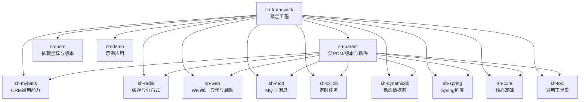
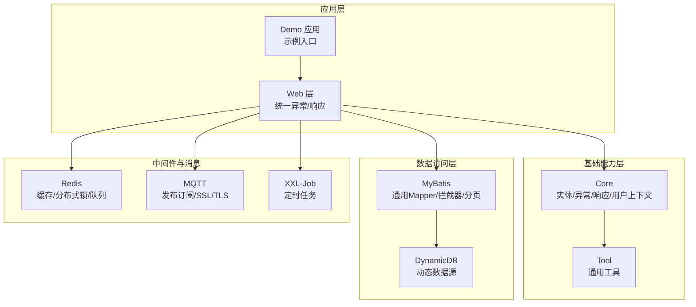
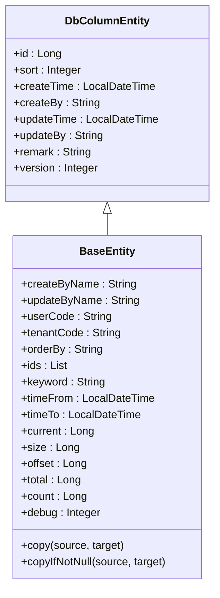
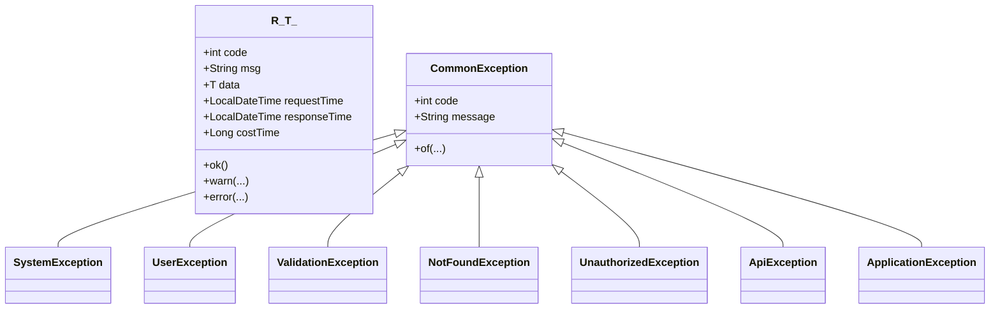
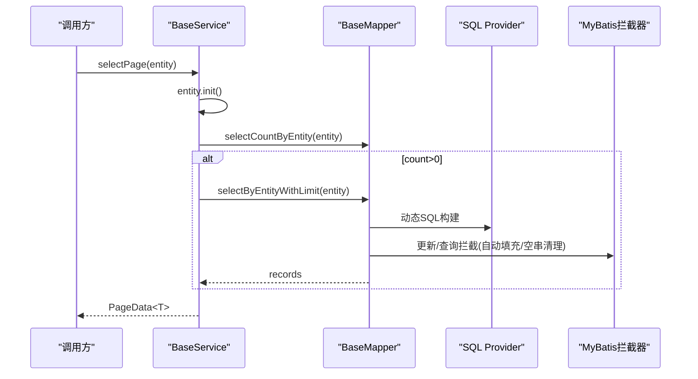
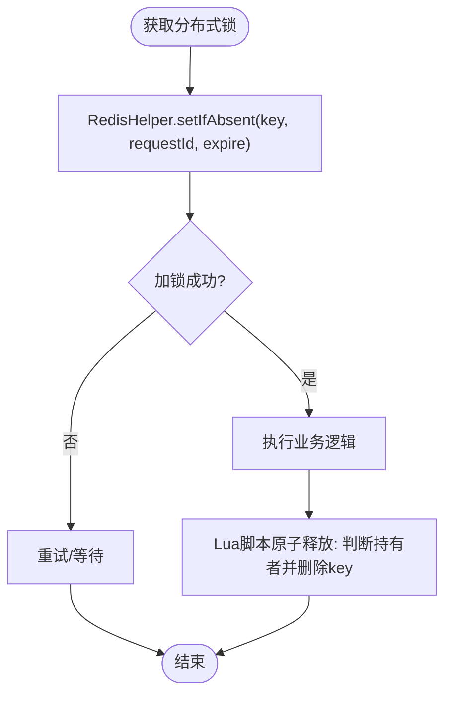
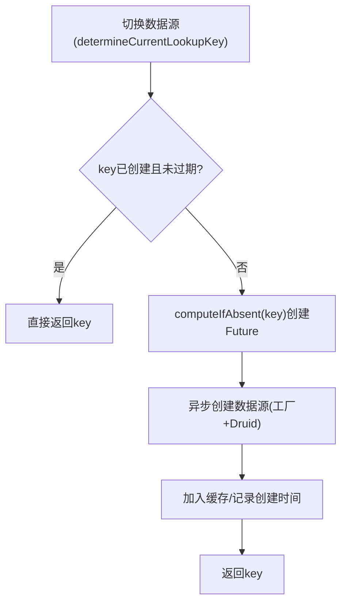
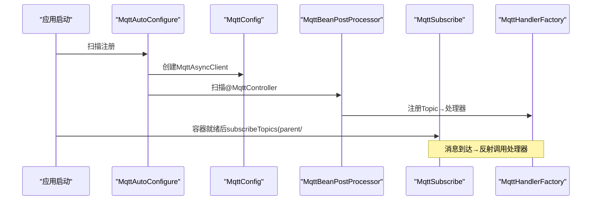
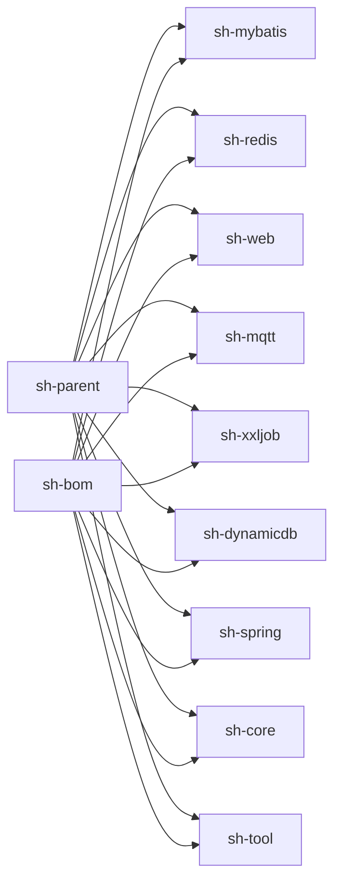

# 框架简介

<cite>
**本文引用的文件**
- [README.md](file://README.md)
- [pom.xml](file://pom.xml)
- [sh-parent/pom.xml](file://sh-parent/pom.xml)
- [sh-bom/pom.xml](file://sh-bom/pom.xml)
- [sh-core/src/main/java/com/wkclz/core/base/BaseEntity.java](file://sh-core/src/main/java/com/wkclz/core/base/BaseEntity.java)
- [sh-core/src/main/java/com/wkclz/core/base/R.java](file://sh-core/src/main/java/com/wkclz/core/base/R.java)
- [sh-web/src/main/java/com/wkclz/web/rest/ErrorHandler.java](file://sh-web/src/main/java/com/wkclz/web/rest/ErrorHandler.java)
- [sh-mybatis/src/main/java/com/wkclz/mybatis/ShMyBatisAutoConfig.java](file://sh-mybatis/src/main/java/com/wkclz/mybatis/ShMyBatisAutoConfig.java)
- [sh-redis/src/main/java/com/wkclz/redis/ShRedisAutoConfig.java](file://sh-redis/src/main/java/com/wkclz/redis/ShRedisAutoConfig.java)
- [sh-dynamicdb/src/main/java/com/wkclz/dynamicdb/DynamicDataSource.java](file://sh-dynamicdb/src/main/java/com/wkclz/dynamicdb/DynamicDataSource.java)
- [sh-mqtt/src/main/java/com/wkclz/mqtt/MqttAutoConfigure.java](file://sh-mqtt/src/main/java/com/wkclz/mqtt/MqttAutoConfigure.java)
- [sh-xxljob/src/main/java/com/wkclz/xxljob/XxlJobAutoConfigure.java](file://sh-xxljob/src/main/java/com/wkclz/xxljob/XxlJobAutoConfigure.java)
- [sh-demo/src/main/java/com/wkclz/demo/DemoApplication.java](file://sh-demo/src/main/java/com/wkclz/demo/DemoApplication.java)
- [.agents/skills/sh-core/SKILL.md](file://.agents/skills/sh-core/SKILL.md)
- [.agents/skills/sh-mybatis/SKILL.md](file://.agents/skills/sh-mybatis/SKILL.md)
- [.agents/skills/sh-redis/SKILL.md](file://.agents/skills/sh-redis/SKILL.md)
- [.agents/skills/sh-mqtt/SKILL.md](file://.agents/skills/sh-mqtt/SKILL.md)
</cite>

## 目录
1. [引言](#引言)
2. [项目结构](#项目结构)
3. [核心组件](#核心组件)
4. [架构总览](#架构总览)
5. [详细组件分析](#详细组件分析)
6. [依赖分析](#依赖分析)
7. [性能考量](#性能考量)
8. [故障排查指南](#故障排查指南)
9. [结论](#结论)
10. [附录](#附录)

## 引言
sh-framework 是一个面向企业级 Java 后端的“基础能力框架”，旨在通过提供开箱即用的基础设施能力，显著提升应用开发效率与一致性。框架以 Spring Boot 4.0 为核心底座，围绕“统一实体/异常/响应”、“ORM 通用能力”、“缓存与分布式能力”、“动态数据源”、“MQTT 消息”、“定时任务”等模块化能力，形成一套可复用、可扩展、可治理的工程化基座。

- 设计目标：降低重复造轮子成本，统一开发范式，加速落地微服务、分布式与高并发场景。
- 技术栈选择：Spring Boot 4.0、MyBatis、Redis、MQTT、XXL-Job 等，兼顾成熟度与现代化（如 JDK 25、Spring Boot 4.0、Lettuce、PageHelper 4.x 等）。
- 适用场景：微服务架构、分布式系统、高并发与实时通信（IoT）、多租户与动态数据源、统一异常与响应治理。

## 项目结构
sh-framework 采用多模块聚合工程组织，顶层通过 sh-parent 管理版本与插件，sh-bom 提供依赖坐标与版本对齐，各功能模块（core、mybatis、redis、dynamicdb、mqtt、xxljob、web、tool、demo 等）按职责拆分，彼此通过 BOM 与自动装配协同工作。

图表来源
- [pom.xml:21-34](file://pom.xml#L21-L34)
- [sh-parent/pom.xml:32-159](file://sh-parent/pom.xml#L32-L159)
- [sh-bom/pom.xml:53-280](file://sh-bom/pom.xml#L53-L280)

章节来源
- [pom.xml:1-36](file://pom.xml#L1-L36)
- [sh-parent/pom.xml:1-247](file://sh-parent/pom.xml#L1-L247)
- [sh-bom/pom.xml:1-285](file://sh-bom/pom.xml#L1-L285)

## 核心组件
- 实体与数据规范：统一的数据库规范字段与业务实体基类，确保表结构一致性与跨模块复用。
- 异常与响应：统一异常体系与统一响应封装，简化错误处理与对外输出。
- Web 统一异常：全局异常捕获与邮件告警，保障线上问题及时发现。
- ORM 通用能力：基于 MyBatis 的通用 Mapper、拦截器、动态 SQL Provider、分页与元数据查询。
- 缓存与分布式：Redis 全数据类型操作、分布式锁、ID 生成器、消息队列。
- 动态数据源：多数据源运行时切换、DCL 与异步创建、连接池生命周期管理。
- MQTT 消息：注解驱动的发布订阅、SSL/TLS、断线重连与自动重订阅。
- 定时任务：XXL-Job 集成，提供任务编排与调度能力。
- 工具集：字符串、日期、加密、Bean 操作等常用工具。

章节来源
- [sh-core/src/main/java/com/wkclz/core/base/BaseEntity.java:11-94](file://sh-core/src/main/java/com/wkclz/core/base/BaseEntity.java#L11-L94)
- [sh-core/src/main/java/com/wkclz/core/base/R.java:12-76](file://sh-core/src/main/java/com/wkclz/core/base/R.java#L12-L76)
- [sh-web/src/main/java/com/wkclz/web/rest/ErrorHandler.java:40-267](file://sh-web/src/main/java/com/wkclz/web/rest/ErrorHandler.java#L40-L267)
- [sh-mybatis/src/main/java/com/wkclz/mybatis/ShMyBatisAutoConfig.java:7-11](file://sh-mybatis/src/main/java/com/wkclz/mybatis/ShMyBatisAutoConfig.java#L7-L11)
- [sh-redis/src/main/java/com/wkclz/redis/ShRedisAutoConfig.java:6-9](file://sh-redis/src/main/java/com/wkclz/redis/ShRedisAutoConfig.java#L6-L9)
- [sh-dynamicdb/src/main/java/com/wkclz/dynamicdb/DynamicDataSource.java:23-274](file://sh-dynamicdb/src/main/java/com/wkclz/dynamicdb/DynamicDataSource.java#L23-L274)
- [sh-mqtt/src/main/java/com/wkclz/mqtt/MqttAutoConfigure.java:6-9](file://sh-mqtt/src/main/java/com/wkclz/mqtt/MqttAutoConfigure.java#L6-L9)
- [sh-xxljob/src/main/java/com/wkclz/xxljob/XxlJobAutoConfigure.java:6-9](file://sh-xxljob/src/main/java/com/wkclz/xxljob/XxlJobAutoConfigure.java#L6-L9)

## 架构总览
下图展示了框架在典型企业应用中的位置与交互：Web 层负责统一异常与请求处理，Core 提供实体/异常/响应与用户上下文，ORM 模块提供通用 CRUD 与拦截器，缓存与动态数据源支撑高可用与多租户，MQTT/XXL-Job 提供消息与任务能力，Demo 展示最小可运行示例。

图表来源
- [sh-web/src/main/java/com/wkclz/web/rest/ErrorHandler.java:40-267](file://sh-web/src/main/java/com/wkclz/web/rest/ErrorHandler.java#L40-L267)
- [sh-core/src/main/java/com/wkclz/core/base/BaseEntity.java:11-94](file://sh-core/src/main/java/com/wkclz/core/base/BaseEntity.java#L11-L94)
- [sh-mybatis/src/main/java/com/wkclz/mybatis/ShMyBatisAutoConfig.java:7-11](file://sh-mybatis/src/main/java/com/wkclz/mybatis/ShMyBatisAutoConfig.java#L7-L11)
- [sh-dynamicdb/src/main/java/com/wkclz/dynamicdb/DynamicDataSource.java:23-274](file://sh-dynamicdb/src/main/java/com/wkclz/dynamicdb/DynamicDataSource.java#L23-L274)
- [sh-redis/src/main/java/com/wkclz/redis/ShRedisAutoConfig.java:6-9](file://sh-redis/src/main/java/com/wkclz/redis/ShRedisAutoConfig.java#L6-L9)
- [sh-mqtt/src/main/java/com/wkclz/mqtt/MqttAutoConfigure.java:6-9](file://sh-mqtt/src/main/java/com/wkclz/mqtt/MqttAutoConfigure.java#L6-L9)
- [sh-xxljob/src/main/java/com/wkclz/xxljob/XxlJobAutoConfigure.java:6-9](file://sh-xxljob/src/main/java/com/wkclz/xxljob/XxlJobAutoConfigure.java#L6-L9)
- [sh-demo/src/main/java/com/wkclz/demo/DemoApplication.java:7-14](file://sh-demo/src/main/java/com/wkclz/demo/DemoApplication.java#L7-L14)

## 详细组件分析

### 统一实体与数据规范（BaseEntity）
- 设计要点：继承数据库规范字段基类，扩展业务实体基类，内置分页、查询辅助、用户/租户字段，提供拷贝工具方法。
- 价值：统一表结构字段、减少样板代码、便于拦截器自动填充与逻辑删除。

图表来源
- [sh-core/src/main/java/com/wkclz/core/base/BaseEntity.java:11-94](file://sh-core/src/main/java/com/wkclz/core/base/BaseEntity.java#L11-L94)

章节来源
- [sh-core/src/main/java/com/wkclz/core/base/BaseEntity.java:11-94](file://sh-core/src/main/java/com/wkclz/core/base/BaseEntity.java#L11-L94)
- [.agents/skills/sh-core/SKILL.md:43-87](file://.agents/skills/sh-core/SKILL.md#L43-L87)

### 统一响应与异常体系（R 与异常基类）
- 设计要点：统一响应封装 R<T>，内置成功/警告/错误多种工厂方法；异常体系以 CommonException 为基类，覆盖业务、系统、用户、参数校验等场景。
- 价值：对外输出一致、异常处理可追踪、告警自动化。

图表来源
- [sh-core/src/main/java/com/wkclz/core/base/R.java:12-76](file://sh-core/src/main/java/com/wkclz/core/base/R.java#L12-L76)
- [sh-web/src/main/java/com/wkclz/web/rest/ErrorHandler.java:124-148](file://sh-web/src/main/java/com/wkclz/web/rest/ErrorHandler.java#L124-L148)

章节来源
- [sh-core/src/main/java/com/wkclz/core/base/R.java:12-76](file://sh-core/src/main/java/com/wkclz/core/base/R.java#L12-L76)
- [sh-web/src/main/java/com/wkclz/web/rest/ErrorHandler.java:36-267](file://sh-web/src/main/java/com/wkclz/web/rest/ErrorHandler.java#L36-L267)
- [.agents/skills/sh-core/SKILL.md:89-133](file://.agents/skills/sh-core/SKILL.md#L89-L133)

### ORM 通用能力（MyBatis）
- 设计要点：通用 Mapper（14 个 CRUD 方法）、SQL Provider 动态 SQL、拦截器自动填充与空串清理、@Blob 大字段分离、逻辑删除、乐观锁、分页与表元数据查询。
- 价值：大幅减少 Mapper 与 XML，统一 CRUD 与查询规范，提升开发效率与一致性。

图表来源
- [.agents/skills/sh-mybatis/SKILL.md:159-181](file://.agents/skills/sh-mybatis/SKILL.md#L159-L181)
- [.agents/skills/sh-mybatis/SKILL.md:84-123](file://.agents/skills/sh-mybatis/SKILL.md#L84-L123)
- [sh-mybatis/src/main/java/com/wkclz/mybatis/ShMyBatisAutoConfig.java:7-11](file://sh-mybatis/src/main/java/com/wkclz/mybatis/ShMyBatisAutoConfig.java#L7-L11)

章节来源
- [.agents/skills/sh-mybatis/SKILL.md:44-83](file://.agents/skills/sh-mybatis/SKILL.md#L44-L83)
- [.agents/skills/sh-mybatis/SKILL.md:142-158](file://.agents/skills/sh-mybatis/SKILL.md#L142-L158)
- [.agents/skills/sh-mybatis/SKILL.md:159-181](file://.agents/skills/sh-mybatis/SKILL.md#L159-L181)
- [sh-mybatis/src/main/java/com/wkclz/mybatis/ShMyBatisAutoConfig.java:7-11](file://sh-mybatis/src/main/java/com/wkclz/mybatis/ShMyBatisAutoConfig.java#L7-L11)

### 缓存与分布式能力（Redis）
- 设计要点：RedisHelper 全数据类型操作、RedisLock 原子释放、RedisIdGenerator 时间戳+Redis 自增 ID、消息队列基于 List 的阻塞/非阻塞消费、Lettuce 保活配置。
- 价值：提供高可用缓存、可靠分布式锁、高性能短 ID 与消息队列能力。

图表来源
- [.agents/skills/sh-redis/SKILL.md:88-120](file://.agents/skills/sh-redis/SKILL.md#L88-L120)

章节来源
- [.agents/skills/sh-redis/SKILL.md:31-87](file://.agents/skills/sh-redis/SKILL.md#L31-L87)
- [.agents/skills/sh-redis/SKILL.md:88-153](file://.agents/skills/sh-redis/SKILL.md#L88-L153)
- [.agents/skills/sh-redis/SKILL.md:154-221](file://.agents/skills/sh-redis/SKILL.md#L154-L221)
- [sh-redis/src/main/java/com/wkclz/redis/ShRedisAutoConfig.java:6-9](file://sh-redis/src/main/java/com/wkclz/redis/ShRedisAutoConfig.java#L6-L9)

### 动态数据源（DynamicDB）
- 设计要点：基于 Druid 的动态数据源创建与缓存、线程池异步创建、DCL 与 Future 复用、定时清理过期连接池、优雅销毁。
- 价值：支持多租户/多账套/多库场景，降低连接池资源浪费与切换成本。

图表来源
- [sh-dynamicdb/src/main/java/com/wkclz/dynamicdb/DynamicDataSource.java:46-139](file://sh-dynamicdb/src/main/java/com/wkclz/dynamicdb/DynamicDataSource.java#L46-L139)

章节来源
- [sh-dynamicdb/src/main/java/com/wkclz/dynamicdb/DynamicDataSource.java:18-274](file://sh-dynamicdb/src/main/java/com/wkclz/dynamicdb/DynamicDataSource.java#L18-L274)

### MQTT 消息（注解驱动）
- 设计要点：@MqttController + @MqttTopicMapping 注解扫描注册、自动订阅、断线重连与重订阅、SSL/TLS 单向认证、延迟/批量发送。
- 价值：简化 IoT 与设备通信场景的消息处理，降低接入复杂度。

图表来源
- [.agents/skills/sh-mqtt/SKILL.md:44-74](file://.agents/skills/sh-mqtt/SKILL.md#L44-L74)
- [.agents/skills/sh-mqtt/SKILL.md:171-189](file://.agents/skills/sh-mqtt/SKILL.md#L171-L189)

章节来源
- [.agents/skills/sh-mqtt/SKILL.md:10-43](file://.agents/skills/sh-mqtt/SKILL.md#L10-L43)
- [.agents/skills/sh-mqtt/SKILL.md:124-156](file://.agents/skills/sh-mqtt/SKILL.md#L124-L156)
- [sh-mqtt/src/main/java/com/wkclz/mqtt/MqttAutoConfigure.java:6-9](file://sh-mqtt/src/main/java/com/wkclz/mqtt/MqttAutoConfigure.java#L6-L9)

### 定时任务（XXL-Job）
- 设计要点：自动配置入口，提供任务编排与调度能力，便于在微服务中统一管理定时任务。
- 价值：集中化任务治理，降低运维与监控成本。

章节来源
- [sh-xxljob/src/main/java/com/wkclz/xxljob/XxlJobAutoConfigure.java:6-9](file://sh-xxljob/src/main/java/com/wkclz/xxljob/XxlJobAutoConfigure.java#L6-L9)
- [.agents/skills/sh-xxljob/SKILL.md](file://.agents/skills/sh-xxljob/SKILL.md)

### 示例应用（Demo）
- 设计要点：最小可运行示例，演示 Spring Boot 与 Mapper 扫描。
- 价值：快速验证框架装配与基本能力。

章节来源
- [sh-demo/src/main/java/com/wkclz/demo/DemoApplication.java:7-14](file://sh-demo/src/main/java/com/wkclz/demo/DemoApplication.java#L7-L14)

## 依赖分析
- 版本与插件：sh-parent 继承 Spring Boot Starter Parent 4.0.6，统一 Maven 插件与 Java 25 编译目标。
- 依赖坐标：sh-bom 管理第三方依赖版本（MyBatis、PageHelper、Druid、Redis、MQTT、XXL-Job、Lombok 等），确保模块间一致性。
- 模块耦合：Core 为最基础模块，其余模块按需依赖；Web、MyBatis、Redis、DynamicDB、MQTT、XXL-Job 通过自动配置与 BOM 协同。

图表来源
- [sh-parent/pom.xml:32-159](file://sh-parent/pom.xml#L32-L159)
- [sh-bom/pom.xml:53-280](file://sh-bom/pom.xml#L53-L280)
- [pom.xml:21-34](file://pom.xml#L21-L34)

章节来源
- [sh-parent/pom.xml:7-13](file://sh-parent/pom.xml#L7-L13)
- [sh-bom/pom.xml:16-50](file://sh-bom/pom.xml#L16-L50)
- [pom.xml:15-36](file://pom.xml#L15-L36)

## 性能考量
- ORM 层：通过拦截器自动填充与空串清理减少脏数据与无效查询；动态 SQL Provider 缓存实体元数据，避免反射开销；分页查询与安全 ORDER BY 降低 SQL 风险。
- 缓存层：Redis 操作统一序列化与异常兜底，分布式锁采用 Lua 原子释放，ID 生成器考虑时间回拨与序列号溢出，消息队列使用有界队列与拒绝策略。
- 数据源层：动态数据源异步创建与缓存、DCL 与 Future 复用、定时清理过期连接池，避免频繁创建销毁带来的抖动。
- 消息层：MQTT 使用 Lettuce 保活与自动重连，延迟/批量发送优化网络与吞吐。

## 故障排查指南
- 统一异常处理：全局异常捕获将错误日志与请求上下文记录，并在系统配置允许时发送邮件告警，便于快速定位问题。
- 日志脱敏：核心模块提供日志脱敏布局器，可按正则规则屏蔽敏感信息。
- 数据库异常：针对 SQL 语法错误、参数绑定失败、数据截断等场景，统一返回标准化错误码与消息。
- 建议排查步骤：
  - 检查请求日志与异常堆栈，确认是否触发全局异常处理。
  - 核对实体字段与数据库字段映射，确认逻辑删除与乐观锁使用是否正确。
  - 检查 Redis 连接与锁释放脚本，确认 requestId 与持有者匹配。
  - 核对动态数据源 key 与工厂创建流程，关注过期与清理任务状态。
  - 检查 MQTT Broker 连接、SSL/TLS 证书与自动重连日志。

章节来源
- [sh-web/src/main/java/com/wkclz/web/rest/ErrorHandler.java:167-261](file://sh-web/src/main/java/com/wkclz/web/rest/ErrorHandler.java#L167-L261)
- [.agents/skills/sh-core/SKILL.md:184-187](file://.agents/skills/sh-core/SKILL.md#L184-L187)

## 结论
sh-framework 以“统一范式 + 开箱即用”的理念，为企业级 Java 后端开发提供坚实基础。通过 Core 的实体/异常/响应、ORM 通用能力、缓存与分布式、动态数据源、MQTT 与定时任务等模块，开发者可以快速搭建微服务、分布式与高并发系统，同时保持一致的工程实践与可观测性。

## 附录
- 适用场景补充：微服务网关前置、多租户隔离、动态数据源切换、IoT 设备通信、分布式锁与幂等、高并发缓存与队列、统一异常与告警。
- 技术栈选择理由：Spring Boot 4.0 与 JDK 25 代表现代化与性能；MyBatis 与 PageHelper 4.x 提供稳定 ORM 能力；Redis/Lettuce 适配现代连接模型；MQTT 与 XXL-Job 覆盖消息与任务两大高频场景。