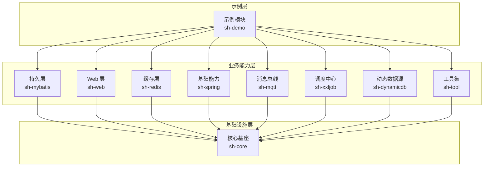
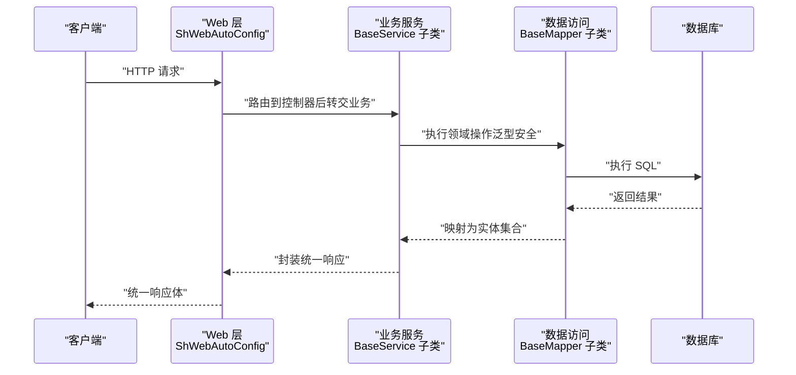
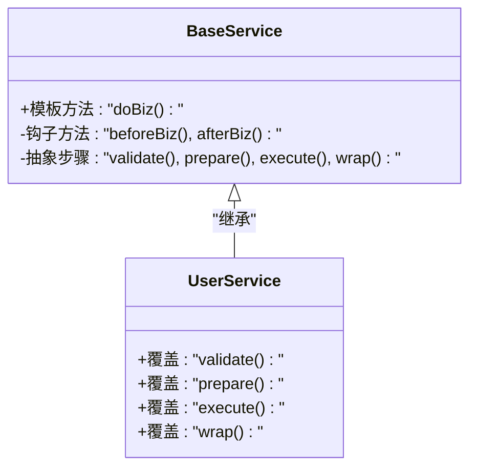
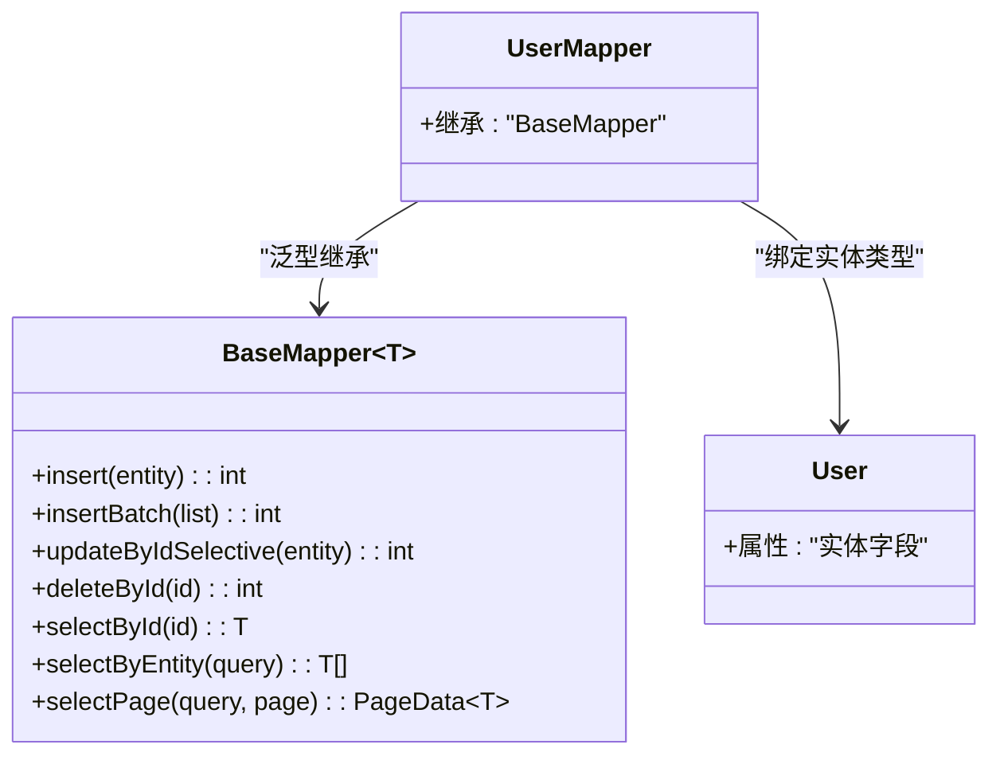
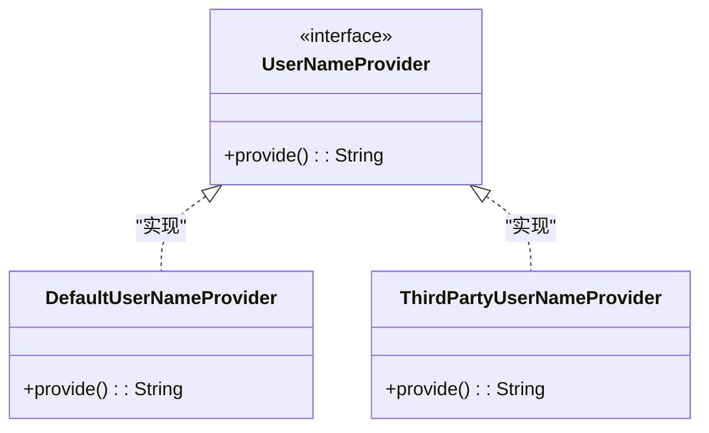
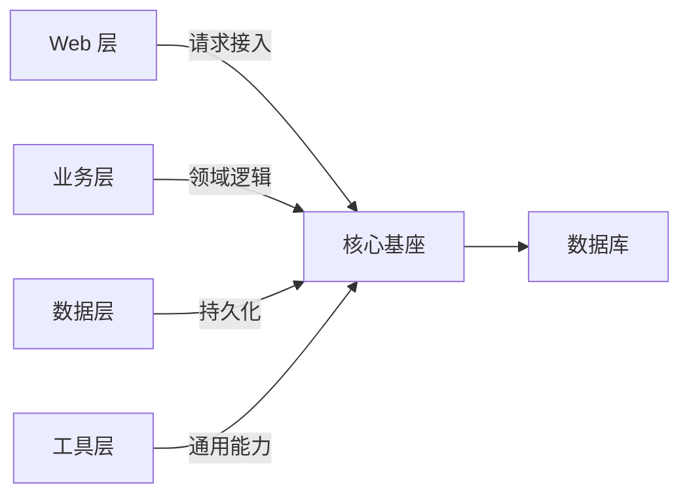
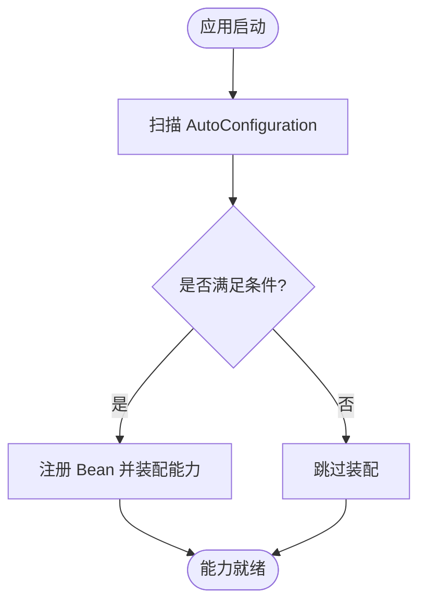
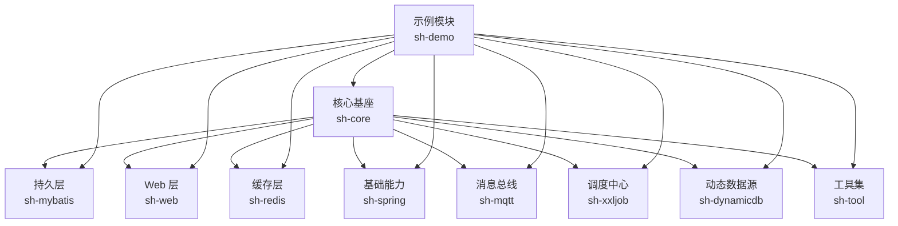

# 设计理念

<cite>
**本文引用的文件**
- [BaseService.java](file://sh-mybatis/src/main/java/com/wkclz/mybatis/service/BaseService.java)
- [BaseMapper.java](file://sh-mybatis/src/main/java/com/wkclz/mybatis/mapper/BaseMapper.java)
- [UserNameProvider.java](file://sh-core/src/main/java/com/wkclz/core/spi/UserNameProvider.java)
- [ShMyBatisAutoConfig.java](file://sh-mybatis/src/main/java/com/wkclz/mybatis/ShMyBatisAutoConfig.java)
- [ShSpringAutoConfig.java](file://sh-spring/src/main/java/com/wkclz/spring/ShSpringAutoConfig.java)
- [ShWebAutoConfig.java](file://sh-web/src/main/java/com/wkclz/web/ShWebAutoConfig.java)
- [ShRedisAutoConfig.java](file://sh-redis/src/main/java/com/wkclz/redis/ShRedisAutoConfig.java)
- [ShDynamicdbAutoConfig.java](file://sh-dynamicdb/src/main/java/com/wkclz/dynamicdb/ShDynamicdbAutoConfig.java)
- [MqttAutoConfigure.java](file://sh-mqtt/src/main/java/com/wkclz/mqtt/MqttAutoConfigure.java)
- [XxlJobAutoConfigure.java](file://sh-xxljob/src/main/java/com/wkclz/xxljob/XxlJobAutoConfigure.java)
- [ShMyBatisConfig.java](file://sh-mybatis/src/main/java/com/wkclz/mybatis/config/ShMyBatisConfig.java)
- [ShSpringAutoConfig.java](file://sh-spring/src/main/java/com/wkclz/spring/config/SpringContextHolder.java)
- [PageInterceptor.java](file://sh-mybatis/src/main/java/com/github/pagehelper/PageInterceptor.java)
- [PageQuery.java](file://sh-mybatis/src/main/java/com/wkclz/mybatis/helper/PageQuery.java)
- [R.java](file://sh-core/src/main/java/com/wkclz/core/base/R.java)
- [ApiException.java](file://sh-core/src/main/java/com/wkclz/core/exception/ApiException.java)
- [UserContext.java](file://sh-core/src/main/java/com/wkclz/core/user/UserContext.java)
- [UserInfo.java](file://sh-core/src/main/java/com/wkclz/core/base/UserInfo.java)
- [PageData.java](file://sh-core/src/main/java/com/wkclz/core/base/PageData.java)
- [Pageable.java](file://sh-core/src/main/java/com/wkclz/core/base/Pageable.java)
- [ResultCode.java](file://sh-core/src/main/java/com/wkclz/core/enums/ResultCode.java)
- [EnvType.java](file://sh-core/src/main/java/com/wkclz/core/enums/EnvType.java)
- [BaseEntity.java](file://sh-core/src/main/java/com/wkclz/core/base/BaseEntity.java)
- [DbColumnEntity.java](file://sh-core/src/main/java/com/wkclz/core/base/DbColumnEntity.java)
- [MaskingPatternLayout.java](file://sh-core/src/main/java/com/wkclz/core/log/MaskingPatternLayout.java)
- [SnowflakeHelper.java](file://sh-spring/src/main/java/com/wkclz/spring/helper/SnowflakeHelper.java)
- [RedisHelper.java](file://sh-redis/src/main/java/com/wkclz/redis/helper/RedisHelper.java)
- [RedisLock.java](file://sh-redis/src/main/java/com/wkclz/redis/helper/RedisLock.java)
- [RedisMessageQueueImpl.java](file://sh-redis/src/main/java/com/wkclz/redis/queue/RedisMessageQueueImpl.java)
- [MqttProducer.java](file://sh-mqtt/src/main/java/com/wkclz/mqtt/client/MqttProducer.java)
- [MqttHandlerFactory.java](file://sh-mqtt/src/main/java/com/wkclz/mqtt/handler/MqttHandlerFactory.java)
- [XxlJobDemo.java](file://sh-xxljob/src/main/java/com/wkclz/xxljob/demo/XxlJobDemo.java)
- [User.java](file://sh-demo/src/main/java/com/wkclz/demo/bean/entity/User.java)
- [UserMapper.java](file://sh-demo/src/main/java/com/wkclz/demo/mapper/UserMapper.java)
- [UserRest.java](file://sh-demo/src/main/java/com/wkclz/demo/rest/UserRest.java)
- [UserService.java](file://sh-demo/src/main/java/com/wkclz/demo/service/UserService.java)
</cite>

## 目录
1. 引言
2. 项目结构
3. 核心组件
4. 架构总览
5. 详细组件分析
6. 依赖关系分析
7. 性能考量
8. 故障排查指南
9. 结论
10. 附录

## 引言
本设计理念文档面向希望深入理解 sh-framework 的开发者与架构师，系统阐述框架的设计哲学与工程原则：约定优于配置、开箱即用、可扩展性优先、代码复用最大化。文档同时解析模板方法模式在 BaseService 中的应用、泛型编程在 BaseMapper 中的体现、SPI 机制对插件式扩展的支持，以及关注点分离在模块化设计中的落地方式。通过这些设计思想，开发者可以更高效地使用与扩展框架。

## 项目结构
sh-framework 采用多模块分层架构，围绕“基础设施层（core）+ 业务能力层（mybatis、web、redis、spring、mqtt、xxljob、dynamicdb、tool 等）+ 示例层（demo）”组织。各模块通过 Spring Boot 自动装配机制按需启用，形成“可插拔”的能力组合。

图中展示了模块间的依赖方向：示例模块依赖业务能力层，业务能力层再依赖基础设施层；每个能力模块均以自动装配的方式接入 Spring Boot。

章节来源
- [ShMyBatisAutoConfig.java](file://sh-mybatis/src/main/java/com/wkclz/mybatis/ShMyBatisAutoConfig.java)
- [ShWebAutoConfig.java](file://sh-web/src/main/java/com/wkclz/web/ShWebAutoConfig.java)
- [ShRedisAutoConfig.java](file://sh-redis/src/main/java/com/wkclz/redis/ShRedisAutoConfig.java)
- [ShSpringAutoConfig.java](file://sh-spring/src/main/java/com/wkclz/spring/ShSpringAutoConfig.java)
- [MqttAutoConfigure.java](file://sh-mqtt/src/main/java/com/wkclz/mqtt/MqttAutoConfigure.java)
- [XxlJobAutoConfigure.java](file://sh-xxljob/src/main/java/com/wkclz/xxljob/XxlJobAutoConfigure.java)
- [ShDynamicdbAutoConfig.java](file://sh-dynamicdb/src/main/java/com/wkclz/dynamicdb/ShDynamicdbAutoConfig.java)

## 核心组件
本节聚焦于支撑框架设计思想的关键构件：服务抽象基类、数据访问基类、SPI 扩展点、自动装配配置与统一响应模型。

- 服务抽象基类（BaseService）
  - 通过模板方法模式定义业务流程骨架，子类仅需实现具体步骤，从而约束实现细节、保证一致性。
  - 典型流程包含：入参校验、上下文准备、调用 Mapper、结果封装、异常处理等。
  - 参考路径：[BaseService.java](file://sh-mybatis/src/main/java/com/wkclz/mybatis/service/BaseService.java)

- 数据访问基类（BaseMapper）
  - 基于泛型编程，以实体类型作为参数，实现类型安全的 CRUD 操作，减少样板代码，提升复用度。
  - 提供常用方法如插入、更新、删除、批量操作、分页查询等。
  - 参考路径：[BaseMapper.java](file://sh-mybatis/src/main/java/com/wkclz/mybatis/mapper/BaseMapper.java)

- SPI 扩展点（UserNameProvider）
  - 定义用户名称解析的扩展接口，允许外部实现按需替换或增强默认行为，体现“可扩展性优先”。
  - 参考路径：[UserNameProvider.java](file://sh-core/src/main/java/com/wkclz/core/spi/UserNameProvider.java)

- 统一响应模型（R）
  - 封装统一的响应结构，配合结果码枚举与异常体系，确保前后端交互的一致性与可预期性。
  - 参考路径：[R.java](file://sh-core/src/main/java/com/wkclz/core/base/R.java)，[ResultCode.java](file://sh-core/src/main/java/com/wkclz/core/enums/ResultCode.java)，[ApiException.java](file://sh-core/src/main/java/com/wkclz/core/exception/ApiException.java)

- 自动装配配置（各模块 AutoConfig）
  - 各能力模块通过 AutoConfiguration 条件化装配，遵循“开箱即用”，降低接入成本。
  - 参考路径：[ShMyBatisAutoConfig.java](file://sh-mybatis/src/main/java/com/wkclz/mybatis/ShMyBatisAutoConfig.java)，[ShWebAutoConfig.java](file://sh-web/src/main/java/com/wkclz/web/ShWebAutoConfig.java)，[ShRedisAutoConfig.java](file://sh-redis/src/main/java/com/wkclz/redis/ShRedisAutoConfig.java)，[ShSpringAutoConfig.java](file://sh-spring/src/main/java/com/wkclz/spring/ShSpringAutoConfig.java)，[MqttAutoConfigure.java](file://sh-mqtt/src/main/java/com/wkclz/mqtt/MqttAutoConfigure.java)，[XxlJobAutoConfigure.java](file://sh-xxljob/src/main/java/com/wkclz/xxljob/XxlJobAutoConfigure.java)，[ShDynamicdbAutoConfig.java](file://sh-dynamicdb/src/main/java/com/wkclz/dynamicdb/ShDynamicdbAutoConfig.java)

章节来源
- [BaseService.java](file://sh-mybatis/src/main/java/com/wkclz/mybatis/service/BaseService.java)
- [BaseMapper.java](file://sh-mybatis/src/main/java/com/wkclz/mybatis/mapper/BaseMapper.java)
- [UserNameProvider.java](file://sh-core/src/main/java/com/wkclz/core/spi/UserNameProvider.java)
- [R.java](file://sh-core/src/main/java/com/wkclz/core/base/R.java)
- [ResultCode.java](file://sh-core/src/main/java/com/wkclz/core/enums/ResultCode.java)
- [ApiException.java](file://sh-core/src/main/java/com/wkclz/core/exception/ApiException.java)
- [ShMyBatisAutoConfig.java](file://sh-mybatis/src/main/java/com/wkclz/mybatis/ShMyBatisAutoConfig.java)
- [ShWebAutoConfig.java](file://sh-web/src/main/java/com/wkclz/web/ShWebAutoConfig.java)
- [ShRedisAutoConfig.java](file://sh-redis/src/main/java/com/wkclz/redis/ShRedisAutoConfig.java)
- [ShSpringAutoConfig.java](file://sh-spring/src/main/java/com/wkclz/spring/ShSpringAutoConfig.java)
- [MqttAutoConfigure.java](file://sh-mqtt/src/main/java/com/wkclz/mqtt/MqttAutoConfigure.java)
- [XxlJobAutoConfigure.java](file://sh-xxljob/src/main/java/com/wkclz/xxljob/XxlJobAutoConfigure.java)
- [ShDynamicdbAutoConfig.java](file://sh-dynamicdb/src/main/java/com/wkclz/dynamicdb/ShDynamicdbAutoConfig.java)

## 架构总览
下图从“请求-服务-数据访问-数据库”的视角，展示典型调用链路与模块边界，体现“关注点分离”与“可插拔扩展”。

图中体现了：
- Web 层负责请求接入与统一响应；
- 业务层通过模板方法约束流程；
- 数据层以泛型基类提供类型安全的 CRUD；
- 数据库层承载持久化。

图表来源
- [ShWebAutoConfig.java](file://sh-web/src/main/java/com/wkclz/web/ShWebAutoConfig.java)
- [BaseService.java](file://sh-mybatis/src/main/java/com/wkclz/mybatis/service/BaseService.java)
- [BaseMapper.java](file://sh-mybatis/src/main/java/com/wkclz/mybatis/mapper/BaseMapper.java)

## 详细组件分析

### 模板方法模式在 BaseService 中的应用
BaseService 通过“模板方法”定义业务处理的骨架，子类只需实现特定步骤，从而：
- 约束实现细节：固定流程、强制校验与封装；
- 保证一致性：统一异常处理与响应结构；
- 降低重复：复用通用逻辑，如上下文注入、分页处理、日志记录等。

图表来源
- [BaseService.java](file://sh-mybatis/src/main/java/com/wkclz/mybatis/service/BaseService.java)
- [UserService.java](file://sh-demo/src/main/java/com/wkclz/demo/service/UserService.java)

章节来源
- [BaseService.java](file://sh-mybatis/src/main/java/com/wkclz/mybatis/service/BaseService.java)
- [UserService.java](file://sh-demo/src/main/java/com/wkclz/demo/service/UserService.java)

### 泛型编程在 BaseMapper 中的运用
BaseMapper 以泛型参数承载实体类型，实现：
- 类型安全：编译期约束实体与表字段映射；
- 代码复用：同一套 CRUD 方法适配不同实体；
- 易于扩展：新增实体无需重复编写 CRUD 模板。

图表来源
- [BaseMapper.java](file://sh-mybatis/src/main/java/com/wkclz/mybatis/mapper/BaseMapper.java)
- [UserMapper.java](file://sh-demo/src/main/java/com/wkclz/demo/mapper/UserMapper.java)
- [User.java](file://sh-demo/src/main/java/com/wkclz/demo/bean/entity/User.java)

章节来源
- [BaseMapper.java](file://sh-mybatis/src/main/java/com/wkclz/mybatis/mapper/BaseMapper.java)
- [UserMapper.java](file://sh-demo/src/main/java/com/wkclz/demo/mapper/UserMapper.java)
- [User.java](file://sh-demo/src/main/java/com/wkclz/demo/bean/entity/User.java)

### SPI 机制的设计意图与实践
UserNameProvider 作为 SPI 接口，允许外部实现替换默认的用户名解析策略，体现“可扩展性优先”。通过 Spring 的条件化装配与自动发现机制，框架可在不修改核心代码的前提下引入新实现。

图表来源
- [UserNameProvider.java](file://sh-core/src/main/java/com/wkclz/core/spi/UserNameProvider.java)

章节来源
- [UserNameProvider.java](file://sh-core/src/main/java/com/wkclz/core/spi/UserNameProvider.java)

### 关注点分离在模块化设计中的体现
- 职责清晰：Web 层只负责请求接入与统一响应；业务层专注流程编排；数据层专注持久化；工具层提供通用能力。
- 边界明确：各模块通过 AutoConfiguration 条件化装配，避免不必要的依赖加载。
- 可插拔：模块间通过接口与 SPI 解耦，便于替换与扩展。

图表来源
- [ShWebAutoConfig.java](file://sh-web/src/main/java/com/wkclz/web/ShWebAutoConfig.java)
- [ShMyBatisAutoConfig.java](file://sh-mybatis/src/main/java/com/wkclz/mybatis/ShMyBatisAutoConfig.java)
- [ShSpringAutoConfig.java](file://sh-spring/src/main/java/com/wkclz/spring/ShSpringAutoConfig.java)

章节来源
- [ShWebAutoConfig.java](file://sh-web/src/main/java/com/wkclz/web/ShWebAutoConfig.java)
- [ShMyBatisAutoConfig.java](file://sh-mybatis/src/main/java/com/wkclz/mybatis/ShMyBatisAutoConfig.java)
- [ShSpringAutoConfig.java](file://sh-spring/src/main/java/com/wkclz/spring/ShSpringAutoConfig.java)

### 开箱即用与约定优于配置
- 自动装配：各模块提供 AutoConfiguration，在 Spring Boot 启动时按需装配，无需手动注册 Bean。
- 默认约定：分页、日志脱敏、统一响应、异常处理等均有默认实现，开发者可直接使用。
- 可定制扩展：当默认约定不满足需求时，可通过配置或 SPI 实现替换。

图表来源
- [ShMyBatisAutoConfig.java](file://sh-mybatis/src/main/java/com/wkclz/mybatis/ShMyBatisAutoConfig.java)
- [ShWebAutoConfig.java](file://sh-web/src/main/java/com/wkclz/web/ShWebAutoConfig.java)
- [ShRedisAutoConfig.java](file://sh-redis/src/main/java/com/wkclz/redis/ShRedisAutoConfig.java)
- [ShSpringAutoConfig.java](file://sh-spring/src/main/java/com/wkclz/spring/ShSpringAutoConfig.java)
- [MqttAutoConfigure.java](file://sh-mqtt/src/main/java/com/wkclz/mqtt/MqttAutoConfigure.java)
- [XxlJobAutoConfigure.java](file://sh-xxljob/src/main/java/com/wkclz/xxljob/XxlJobAutoConfigure.java)
- [ShDynamicdbAutoConfig.java](file://sh-dynamicdb/src/main/java/com/wkclz/dynamicdb/ShDynamicdbAutoConfig.java)

章节来源
- [ShMyBatisAutoConfig.java](file://sh-mybatis/src/main/java/com/wkclz/mybatis/ShMyBatisAutoConfig.java)
- [ShWebAutoConfig.java](file://sh-web/src/main/java/com/wkclz/web/ShWebAutoConfig.java)
- [ShRedisAutoConfig.java](file://sh-redis/src/main/java/com/wkclz/redis/ShRedisAutoConfig.java)
- [ShSpringAutoConfig.java](file://sh-spring/src/main/java/com/wkclz/spring/ShSpringAutoConfig.java)
- [MqttAutoConfigure.java](file://sh-mqtt/src/main/java/com/wkclz/mqtt/MqttAutoConfigure.java)
- [XxlJobAutoConfigure.java](file://sh-xxljob/src/main/java/com/wkclz/xxljob/XxlJobAutoConfigure.java)
- [ShDynamicdbAutoConfig.java](file://sh-dynamicdb/src/main/java/com/wkclz/dynamicdb/ShDynamicdbAutoConfig.java)

### 代码复用最大化
- 抽象基类：BaseService、BaseMapper 通过模板方法与泛型，将通用逻辑上提至基类，子类只需关注差异化部分。
- 统一模型：R、ResultCode、异常体系、分页模型等统一规范，减少重复实现。
- 工具集：Spring 上下文、雪花 ID、Redis 操作、MQTT 客户端等工具类，跨模块共享。

章节来源
- [BaseService.java](file://sh-mybatis/src/main/java/com/wkclz/mybatis/service/BaseService.java)
- [BaseMapper.java](file://sh-mybatis/src/main/java/com/wkclz/mybatis/mapper/BaseMapper.java)
- [R.java](file://sh-core/src/main/java/com/wkclz/core/base/R.java)
- [ResultCode.java](file://sh-core/src/main/java/com/wkclz/core/enums/ResultCode.java)
- [SnowflakeHelper.java](file://sh-spring/src/main/java/com/wkclz/spring/helper/SnowflakeHelper.java)
- [RedisHelper.java](file://sh-redis/src/main/java/com/wkclz/redis/helper/RedisHelper.java)

## 依赖关系分析
下图展示核心模块之间的依赖关系与装配顺序，体现“先基础设施、后业务能力、最后示例”的层次化组织。

图表来源
- [ShMyBatisAutoConfig.java](file://sh-mybatis/src/main/java/com/wkclz/mybatis/ShMyBatisAutoConfig.java)
- [ShWebAutoConfig.java](file://sh-web/src/main/java/com/wkclz/web/ShWebAutoConfig.java)
- [ShRedisAutoConfig.java](file://sh-redis/src/main/java/com/wkclz/redis/ShRedisAutoConfig.java)
- [ShSpringAutoConfig.java](file://sh-spring/src/main/java/com/wkclz/spring/ShSpringAutoConfig.java)
- [MqttAutoConfigure.java](file://sh-mqtt/src/main/java/com/wkclz/mqtt/MqttAutoConfigure.java)
- [XxlJobAutoConfigure.java](file://sh-xxljob/src/main/java/com/wkclz/xxljob/XxlJobAutoConfigure.java)
- [ShDynamicdbAutoConfig.java](file://sh-dynamicdb/src/main/java/com/wkclz/dynamicdb/ShDynamicdbAutoConfig.java)

章节来源
- [ShMyBatisAutoConfig.java](file://sh-mybatis/src/main/java/com/wkclz/mybatis/ShMyBatisAutoConfig.java)
- [ShWebAutoConfig.java](file://sh-web/src/main/java/com/wkclz/web/ShWebAutoConfig.java)
- [ShRedisAutoConfig.java](file://sh-redis/src/main/java/com/wkclz/redis/ShRedisAutoConfig.java)
- [ShSpringAutoConfig.java](file://sh-spring/src/main/java/com/wkclz/spring/ShSpringAutoConfig.java)
- [MqttAutoConfigure.java](file://sh-mqtt/src/main/java/com/wkclz/mqtt/MqttAutoConfigure.java)
- [XxlJobAutoConfigure.java](file://sh-xxljob/src/main/java/com/wkclz/xxljob/XxlJobAutoConfigure.java)
- [ShDynamicdbAutoConfig.java](file://sh-dynamicdb/src/main/java/com/wkclz/dynamicdb/ShDynamicdbAutoConfig.java)

## 性能考量
- 分页与拦截器：PageInterceptor 与 PageQuery 在查询阶段进行分页计算，避免一次性加载大结果集，降低内存压力。
- 缓存与锁：RedisHelper、RedisLock、RedisMessageQueue 提供高性能缓存与分布式锁，建议结合业务场景合理设置过期时间与序列化策略。
- 日志脱敏：MaskingPatternLayout 对敏感字段进行脱敏输出，兼顾可观测性与安全性。
- 雪花 ID：SnowflakeHelper 提供高吞吐的 ID 生成，适合写密集型场景。

章节来源
- [PageInterceptor.java](file://sh-mybatis/src/main/java/com/github/pagehelper/PageInterceptor.java)
- [PageQuery.java](file://sh-mybatis/src/main/java/com/wkclz/mybatis/helper/PageQuery.java)
- [MaskingPatternLayout.java](file://sh-core/src/main/java/com/wkclz/core/log/MaskingPatternLayout.java)
- [RedisHelper.java](file://sh-redis/src/main/java/com/wkclz/redis/helper/RedisHelper.java)
- [RedisLock.java](file://sh-redis/src/main/java/com/wkclz/redis/helper/RedisLock.java)
- [RedisMessageQueueImpl.java](file://sh-redis/src/main/java/com/wkclz/redis/queue/RedisMessageQueueImpl.java)
- [SnowflakeHelper.java](file://sh-spring/src/main/java/com/wkclz/spring/helper/SnowflakeHelper.java)

## 故障排查指南
- 统一异常与响应：通过 R 与 ResultCode 统一响应结构，结合 ApiException 快速定位问题类型与范围。
- 用户上下文：UserContext 与 UserInfo 提供当前用户信息，排查权限相关问题时可检查上下文注入是否正确。
- 分页与查询：若出现分页错乱或性能问题，检查 PageQuery 参数与 PageInterceptor 配置。
- 日志脱敏：确认 MaskingPatternLayout 是否正确配置，避免敏感信息泄露。
- Web 层：ShWebAutoConfig 负责统一异常处理与响应包装，排查接口异常时优先检查该层配置。

章节来源
- [R.java](file://sh-core/src/main/java/com/wkclz/core/base/R.java)
- [ResultCode.java](file://sh-core/src/main/java/com/wkclz/core/enums/ResultCode.java)
- [ApiException.java](file://sh-core/src/main/java/com/wkclz/core/exception/ApiException.java)
- [UserContext.java](file://sh-core/src/main/java/com/wkclz/core/user/UserContext.java)
- [UserInfo.java](file://sh-core/src/main/java/com/wkclz/core/base/UserInfo.java)
- [PageData.java](file://sh-core/src/main/java/com/wkclz/core/base/PageData.java)
- [Pageable.java](file://sh-core/src/main/java/com/wkclz/core/base/Pageable.java)
- [MaskingPatternLayout.java](file://sh-core/src/main/java/com/wkclz/core/log/MaskingPatternLayout.java)
- [ShWebAutoConfig.java](file://sh-web/src/main/java/com/wkclz/web/ShWebAutoConfig.java)

## 结论
sh-framework 以“约定优于配置、开箱即用、可扩展性优先、代码复用最大化”为核心设计思想，通过模板方法、泛型编程、SPI 与模块化自动装配，构建了高内聚、低耦合且易于扩展的工程基座。开发者在遵循框架约定的同时，可借助 SPI 与自动装配机制快速扩展能力，实现“即插即用”的开发体验。

## 附录
- 示例模块：sh-demo 提供完整的 CRUD 范式，可作为二次开发的起点。
- 配置参考：各模块 AutoConfiguration 提供默认配置项，必要时可通过配置文件或 SPI 进行定制。

章节来源
- [UserRest.java](file://sh-demo/src/main/java/com/wkclz/demo/rest/UserRest.java)
- [UserService.java](file://sh-demo/src/main/java/com/wkclz/demo/service/UserService.java)
- [UserMapper.java](file://sh-demo/src/main/java/com/wkclz/demo/mapper/UserMapper.java)
- [User.java](file://sh-demo/src/main/java/com/wkclz/demo/bean/entity/User.java)
- [ShMyBatisConfig.java](file://sh-mybatis/src/main/java/com/wkclz/mybatis/config/ShMyBatisConfig.java)