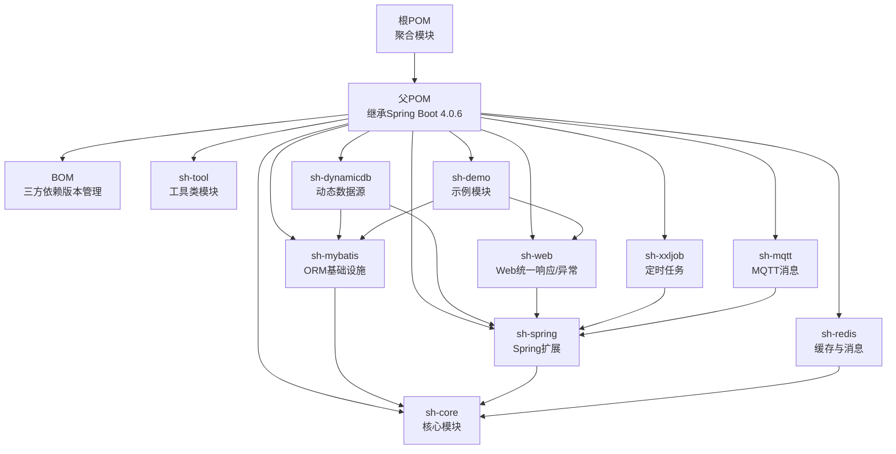
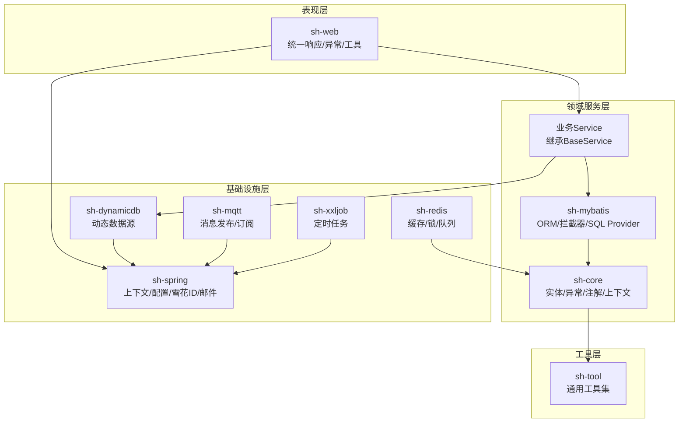
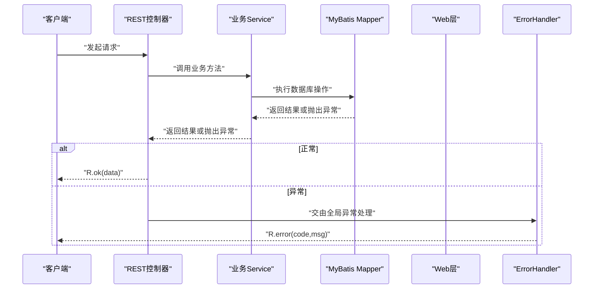
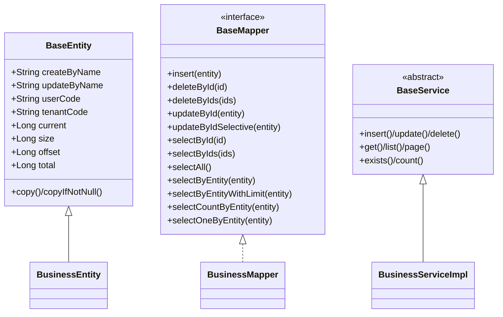
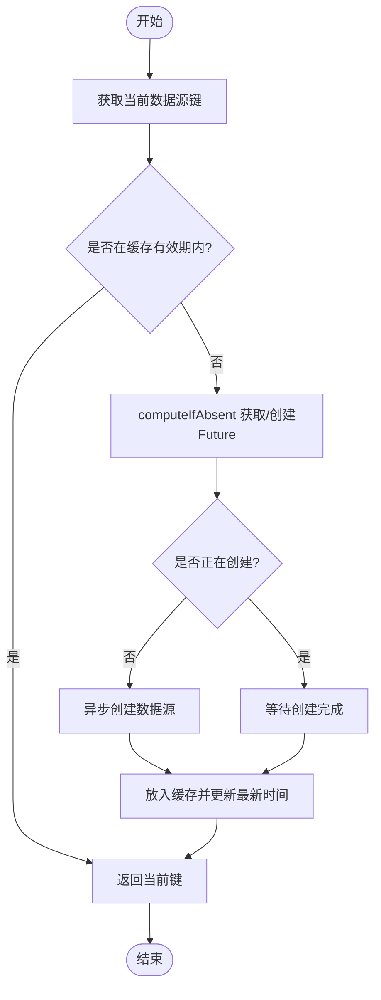
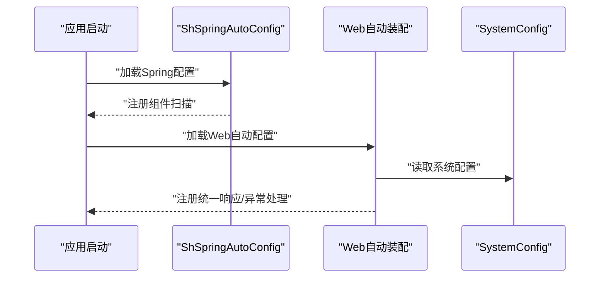
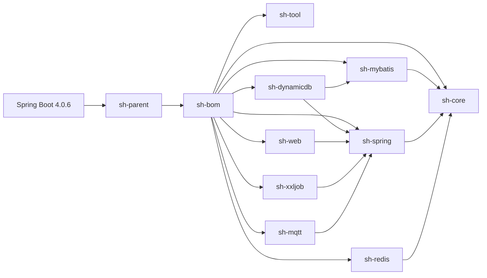

# 项目概述

<cite>
**本文档引用的文件**
- [根POM](file://pom.xml)
- [父POM](file://sh-parent/pom.xml)
- [BOM](file://sh-bom/pom.xml)
- [核心模块](file://sh-core/src/main/java/com/wkclz/core/base/BaseEntity.java)
- [统一响应模型](file://sh-core/src/main/java/com/wkclz/core/base/R.java)
- [MyBatis 基础Mapper](file://sh-mybatis/src/main/java/com/wkclz/mybatis/mapper/BaseMapper.java)
- [Web 全局异常处理](file://sh-web/src/main/java/com/wkclz/web/rest/ErrorHandler.java)
- [动态数据源核心实现](file://sh-dynamicdb/src/main/java/com/wkclz/dynamicdb/DynamicDataSource.java)
- [动态数据源配置](file://sh-dynamicdb/src/main/java/com/wkclz/dynamicdb/config/DynamicDataSourceConfig.java)
- [Spring 自动配置入口](file://sh-spring/src/main/java/com/wkclz/spring/ShSpringAutoConfig.java)
- [MyBatis 自动配置入口](file://sh-mybatis/src/main/resources/META-INF/spring.factories)
- [示例应用](file://sh-demo/src/main/java/com/wkclz/demo/DemoApplication.java)
- [AI协作指南](file://AGENTS.md)
</cite>

## 目录
1. [引言](#引言)
2. [项目结构](#项目结构)
3. [核心组件](#核心组件)
4. [架构总览](#架构总览)
5. [详细组件分析](#详细组件分析)
6. [依赖分析](#依赖分析)
7. [性能考量](#性能考量)
8. [故障排查指南](#故障排查指南)
9. [结论](#结论)
10. [附录](#附录)

## 引言
sh-framework 是一个面向企业级应用开发的 Java 后端基础框架，定位于 Spring Boot 4.0 生态下的“基础设施层”。项目以“开箱即用”为核心目标，通过标准化的实体、Mapper、Service 泛型体系，结合 MyBatis 拦截器链与 Spring Boot 自动装配机制，帮助业务开发者聚焦业务逻辑，显著提升研发效率。

框架采用 Maven 多模块架构，提供 26 个核心模块的能力覆盖，包括但不限于：ORM（MyBatis）、缓存（Redis）、动态数据源、Web 统一响应与异常处理、MQTT 消息、XXL-Job 定时任务、工具集等。同时，框架通过 BOM 统一管理第三方依赖版本，配合 sh-parent 的版本占位与扁平化插件，确保版本一致性与可维护性。

## 项目结构
项目采用分层与功能域相结合的模块化组织方式：
- 根 POM 聚合所有子模块
- sh-parent 继承 Spring Boot Starter Parent，统一依赖与构建配置
- sh-bom 提供三方依赖版本清单
- sh-tool 为最底层工具模块，无框架内部依赖
- sh-core 提供实体、异常、枚举、用户上下文、注解等基础能力
- sh-mybatis 提供 ORM 基础设施（BaseMapper、BaseService、拦截器、SQL Provider）
- sh-spring 提供 Spring 扩展（上下文、配置、雪花 ID、邮件等）
- sh-dynamicdb 提供动态数据源（运行时切换、DCL、异步创建、定时清理）
- sh-redis 提供缓存、分布式锁、ID 生成、消息队列
- sh-web 提供 Web 层统一响应、全局异常处理、请求/响应工具
- sh-xxljob 提供定时任务集成
- sh-mqtt 提供注解驱动的消息发布/订阅、SSL/TLS、断线重连
- sh-demo 提供标准 CRUD 使用范式的示例模块

图表来源
- [根POM:21-34](file://pom.xml#L21-L34)
- [父POM:7-13](file://sh-parent/pom.xml#L7-L13)
- [BOM:53-280](file://sh-bom/pom.xml#L53-L280)

章节来源
- [根POM:21-34](file://pom.xml#L21-L34)
- [父POM:7-13](file://sh-parent/pom.xml#L7-L13)
- [AI协作指南:41-132](file://AGENTS.md#L41-L132)

## 核心组件
- 统一响应模型 R：提供统一的响应结构与便捷构造方法，贯穿整个 Web 层输出。
- 基础实体 BaseEntity：内置审计字段、分页参数、查询辅助字段，支持拷贝工具方法。
- MyBatis 基础 Mapper：提供 14+ 常用单表操作方法，配合 SQL Provider 体系实现零样板代码 CRUD。
- 全局异常处理 ErrorHandler：集中捕获各类异常，统一返回 R 结构，并支持邮件告警。
- 动态数据源 DynamicDataSource：支持运行时数据源切换、DCL 防抖、异步创建与定时清理。
- Web 统一规范：统一请求/响应封装、IP/请求上下文工具、用户名自动填充等。
- Spring 扩展：上下文持有器、敏感配置加解密、雪花 ID、邮件模板等。
- Redis 基础设施：缓存、分布式锁、ID 生成器、消息队列抽象与实现。
- MQTT 消息：注解驱动发布/订阅、SSL/TLS、断线重连与异常处理。
- XXL-Job 集成：配置与任务示例，便于定时任务落地。

章节来源
- [统一响应模型:11-76](file://sh-core/src/main/java/com/wkclz/core/base/R.java#L11-L76)
- [核心模块:11-94](file://sh-core/src/main/java/com/wkclz/core/base/BaseEntity.java#L11-L94)
- [MyBatis 基础Mapper:10-88](file://sh-mybatis/src/main/java/com/wkclz/mybatis/mapper/BaseMapper.java#L10-L88)
- [Web 全局异常处理:36-267](file://sh-web/src/main/java/com/wkclz/web/rest/ErrorHandler.java#L36-L267)
- [动态数据源核心实现:33-67](file://sh-dynamicdb/src/main/java/com/wkclz/dynamicdb/DynamicDataSource.java#L33-L67)
- [动态数据源配置:7-17](file://sh-dynamicdb/src/main/java/com/wkclz/dynamicdb/config/DynamicDataSourceConfig.java#L7-L17)
- [Spring 自动配置入口:4-10](file://sh-spring/src/main/java/com/wkclz/spring/ShSpringAutoConfig.java#L4-L10)
- [MyBatis 自动配置入口:1-2](file://sh-mybatis/src/main/resources/META-INF/spring.factories#L1-L2)

## 架构总览
框架采用“分层 + 模块化”的架构理念：
- 表现层：sh-web 提供统一响应与异常处理，REST 控制器遵循统一规范。
- 领域服务层：sh-mybatis + sh-core 提供实体与服务骨架，业务 Service 继承 BaseService 即可获得完整 CRUD 能力。
- 基础设施层：sh-dynamicdb、sh-redis、sh-mqtt、sh-xxljob、sh-spring 等模块提供横切能力。
- 工具层：sh-tool 提供通用工具集，支撑上层业务。

图表来源
- [Web 全局异常处理:36-267](file://sh-web/src/main/java/com/wkclz/web/rest/ErrorHandler.java#L36-L267)
- [MyBatis 基础Mapper:10-88](file://sh-mybatis/src/main/java/com/wkclz/mybatis/mapper/BaseMapper.java#L10-L88)
- [动态数据源核心实现:33-67](file://sh-dynamicdb/src/main/java/com/wkclz/dynamicdb/DynamicDataSource.java#L33-L67)
- [Spring 自动配置入口:4-10](file://sh-spring/src/main/java/com/wkclz/spring/ShSpringAutoConfig.java#L4-L10)

## 详细组件分析

### 统一响应与异常处理
- 统一响应模型 R：提供成功/警告/错误三类便捷构造方法，统一携带 code、msg、data、时间戳与耗时信息。
- 全局异常处理 ErrorHandler：覆盖常见 Web 异常、SQL 异常、参数校验异常、业务异常等，统一返回 R 结构，并在系统异常时通过邮件告警通知。

图表来源
- [统一响应模型:37-76](file://sh-core/src/main/java/com/wkclz/core/base/R.java#L37-L76)
- [Web 全局异常处理:131-148](file://sh-web/src/main/java/com/wkclz/web/rest/ErrorHandler.java#L131-L148)

章节来源
- [统一响应模型:11-76](file://sh-core/src/main/java/com/wkclz/core/base/R.java#L11-L76)
- [Web 全局异常处理:36-267](file://sh-web/src/main/java/com/wkclz/web/rest/ErrorHandler.java#L36-L267)

### ORM 基础设施与 CRUD 零代码范式
- BaseMapper 接口：提供插入、删除、更新、查询等 14+ 常用方法，均通过 SQL Provider 生成动态 SQL。
- BaseService：基于模板方法模式，定义 CRUD 骨架，子类继承即可获得完整能力。
- 实体 BaseEntity：内置审计字段、分页参数、查询辅助字段，支持拷贝工具方法。

图表来源
- [核心模块:11-94](file://sh-core/src/main/java/com/wkclz/core/base/BaseEntity.java#L11-L94)
- [MyBatis 基础Mapper:10-88](file://sh-mybatis/src/main/java/com/wkclz/mybatis/mapper/BaseMapper.java#L10-L88)

章节来源
- [核心模块:11-94](file://sh-core/src/main/java/com/wkclz/core/base/BaseEntity.java#L11-L94)
- [MyBatis 基础Mapper:10-88](file://sh-mybatis/src/main/java/com/wkclz/mybatis/mapper/BaseMapper.java#L10-L88)

### 动态数据源：运行时切换、DCL 与异步创建
- DynamicDataSource：继承 Spring 的 AbstractRoutingDataSource，基于 ThreadLocal 维护当前数据源键。
- DCL 防抖：使用 ConcurrentHashMap + Future 实现 key 级别的互斥创建。
- 异步创建：通过线程池异步创建新数据源，避免阻塞请求线程。
- 定时清理：定期清理过期数据源，降低内存占用。

图表来源
- [动态数据源核心实现:33-67](file://sh-dynamicdb/src/main/java/com/wkclz/dynamicdb/DynamicDataSource.java#L33-L67)
- [动态数据源配置:7-17](file://sh-dynamicdb/src/main/java/com/wkclz/dynamicdb/config/DynamicDataSourceConfig.java#L7-L17)

章节来源
- [动态数据源核心实现:33-67](file://sh-dynamicdb/src/main/java/com/wkclz/dynamicdb/DynamicDataSource.java#L33-L67)
- [动态数据源配置:7-17](file://sh-dynamicdb/src/main/java/com/wkclz/dynamicdb/config/DynamicDataSourceConfig.java#L7-L17)

### Web 统一规范与自动装配
- Web 层通过 ShWebAutoConfig 与 spring.factories 实现自动装配。
- 统一响应、全局异常处理、请求/响应工具、用户名自动填充等能力在 Web 层集中提供。
- 与 sh-spring 的 SpringContextHolder、SystemConfig 等协作，实现配置与上下文能力。

图表来源
- [Spring 自动配置入口:4-10](file://sh-spring/src/main/java/com/wkclz/spring/ShSpringAutoConfig.java#L4-L10)
- [MyBatis 自动配置入口:1-2](file://sh-mybatis/src/main/resources/META-INF/spring.factories#L1-L2)

章节来源
- [Spring 自动配置入口:4-10](file://sh-spring/src/main/java/com/wkclz/spring/ShSpringAutoConfig.java#L4-L10)
- [MyBatis 自动配置入口:1-2](file://sh-mybatis/src/main/resources/META-INF/spring.factories#L1-L2)

## 依赖分析
- 版本管理：sh-parent 使用 ${revision} 占位符 + flatten-maven-plugin 管理版本，sh-bom 统一管理三方依赖版本。
- 技术栈选择：
  - Spring Boot 4.0.6：提供自动装配与容器能力
  - MyBatis 与 PageHelper：提供 ORM 与分页能力
  - Druid 与 MySQL Connector/J：提供连接池与驱动
  - Redis、Lettuce/Jedis：提供缓存与消息能力
  - MQTT 客户端、XXL-Job、邮件、加密库等：提供消息、调度、通信与安全能力
- 模块间依赖关系：sh-tool 无框架内部依赖；sh-core 依赖 sh-tool；sh-mybatis、sh-spring、sh-dynamicdb、sh-redis、sh-web、sh-xxljob、sh-mqtt 均依赖 sh-core 或其他模块，形成清晰的分层依赖。

图表来源
- [父POM:7-13](file://sh-parent/pom.xml#L7-L13)
- [BOM:53-280](file://sh-bom/pom.xml#L53-L280)

章节来源
- [父POM:7-13](file://sh-parent/pom.xml#L7-L13)
- [BOM:53-280](file://sh-bom/pom.xml#L53-L280)
- [AI协作指南:133-174](file://AGENTS.md#L133-L174)

## 性能考量
- 动态数据源：通过 DCL 与异步创建避免热点键竞争与阻塞；缓存有效期与定时清理降低资源占用。
- MyBatis：拦截器链在 SQL 执行前后注入审计字段与边界处理，建议合理使用 BoundSql 拦截器，避免过度解析影响性能。
- Redis：提供多种序列化策略与连接池配置，建议根据数据规模与访问模式选择合适的序列化与连接池参数。
- Web 层：统一异常处理减少重复逻辑，但需注意异常堆栈信息的安全输出，避免敏感信息泄露。

## 故障排查指南
- 统一异常处理：ErrorHandler 会记录请求方法、URI、异常摘要与堆栈，并在启用时发送邮件告警。可通过 SystemConfig 开关控制告警行为。
- 日志脱敏：MaskingPatternLayout 提供日志脱敏能力，建议在生产环境开启，避免敏感信息泄露。
- 参数校验：MethodArgumentNotValidException 与 BindException 会被统一转换为 R.error，便于前端展示友好提示。
- 数据库异常：BadSqlGrammarException、SQLSyntaxErrorException 等会被捕获并返回统一错误结构，便于快速定位问题。

章节来源
- [Web 全局异常处理:131-267](file://sh-web/src/main/java/com/wkclz/web/rest/ErrorHandler.java#L131-L267)

## 结论
sh-framework 以 Spring Boot 4.0 为基础，通过模块化的基础设施能力与标准化的开发范式，为企业级应用提供了“开箱即用”的研发底座。其核心价值体现在：
- 降低 CRUD 成本：BaseEntity + BaseMapper + BaseService 的泛型体系实现零样板代码 CRUD
- 统一输出与异常处理：R + ErrorHandler 规范 API 输出与异常处理
- 可扩展的横切能力：动态数据源、缓存、消息、定时任务等模块化能力
- 明确的版本与依赖管理：sh-bom 与 sh-parent 确保版本一致性与可维护性

对于初学者，建议从 sh-demo 的标准范式入手，理解实体、Mapper、Service、VO、Route、REST 控制器的完整链路；对于有经验的开发者，可深入研究动态数据源、MyBatis 拦截器链、Redis 消息队列等模块的实现细节，结合自身业务场景进行定制与扩展。

## 附录
- 版本兼容性：框架基于 Spring Boot 4.0.6，Java 编译版本为 25，建议在兼容的 JDK 与 Spring Boot 版本下使用。
- 未来规划：持续跟进 Spring Boot 4.x 生态演进，完善微服务配套能力（如网关、注册发现、链路追踪等），并根据用户反馈优化模块化与易用性。