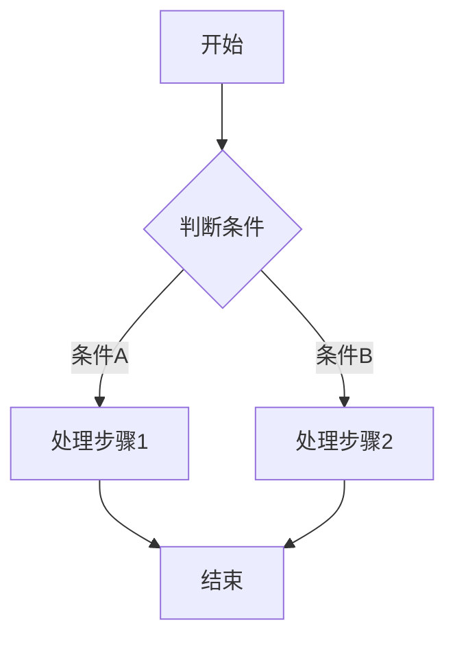

# 业务流程索引

最后更新：`2026-07-05`

## 流程列表

| 流程名 | 触发条件 | 业务价值 |
|--------|----------|----------|
| - | - | - |

## 核心流程详细描述

### 流程图规范

流程图使用 Mermaid 语法绘制，存储于 `docs/diagrams/` 目录。

### 主流程示例

### 流程命名规范

- 流程名采用 "动词 + 名词" 形式
- 流程ID采用小写下划线命名，如 `order_create_flow`

### 流程文档结构

每个业务流程文档应包含：

1. **流程概述** - 流程目的和范围
2. **触发条件** - 何时触发该流程
3. **参与者** - 涉及的角色或系统
4. **流程步骤** - 详细步骤说明
5. **异常处理** - 异常情况处理
6. **度量指标** - 流程性能指标

---

*本文件由系统自动生成，请勿直接修改*
