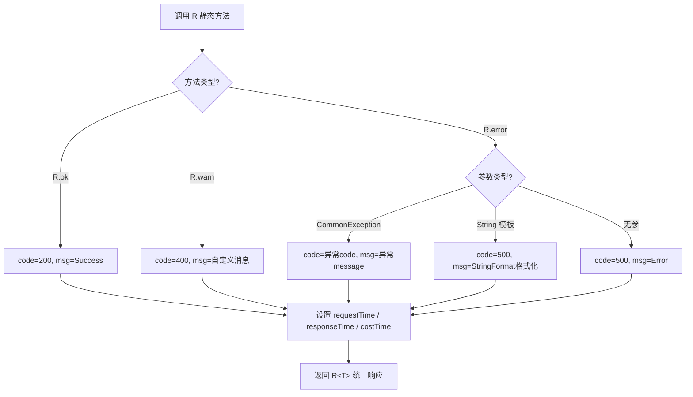

# 统一响应结果封装
- **所属模块**：sh-core
- **优先级**：高
- **故事ID**：US-002

## 1. 用户故事 (User Story)
**作为** 前端开发者，
**我希望** 所有 API 接口返回统一的 R<T> 响应格式，
**以便于** 前端可以用统一的方式处理成功、警告和错误响应，无需适配多种返回格式。

## 流程图

## 2. 验收标准 (Acceptance Criteria)
- [场景1] Given 业务处理成功, When 调用 R.ok(data), Then 返回 code=200, msg="Success", data=传入数据
- [场景2] Given 参数校验失败, When 调用 R.warn("用户名不能为空"), Then 返回 code=400, msg="用户名不能为空"
- [场景3] Given 业务异常发生, When 调用 R.error(commonException), Then 返回 code=异常的code, msg=异常的message
- [异常场景] Given 使用模板参数, When 调用 R.error("用户 {} 不存在", "admin"), Then msg 被格式化为 "用户 admin 不存在"

## 3. 涉及代码与上下文 (AI开发关键)
为了完成或修改此故事，AI 需要重点阅读以下核心代码文件：
- `sh-core/src/main/java/com/wkclz/core/base/R.java` (统一响应结果类，封装code/msg/data/time)
- `sh-core/src/main/java/com/wkclz/core/enums/ResultCode.java` (结果码枚举，定义30个标准状态码)
- `sh-tool/src/main/java/com/wkclz/tool/utils/StringFormat.java` (字符串格式化工具，支撑模板参数)
