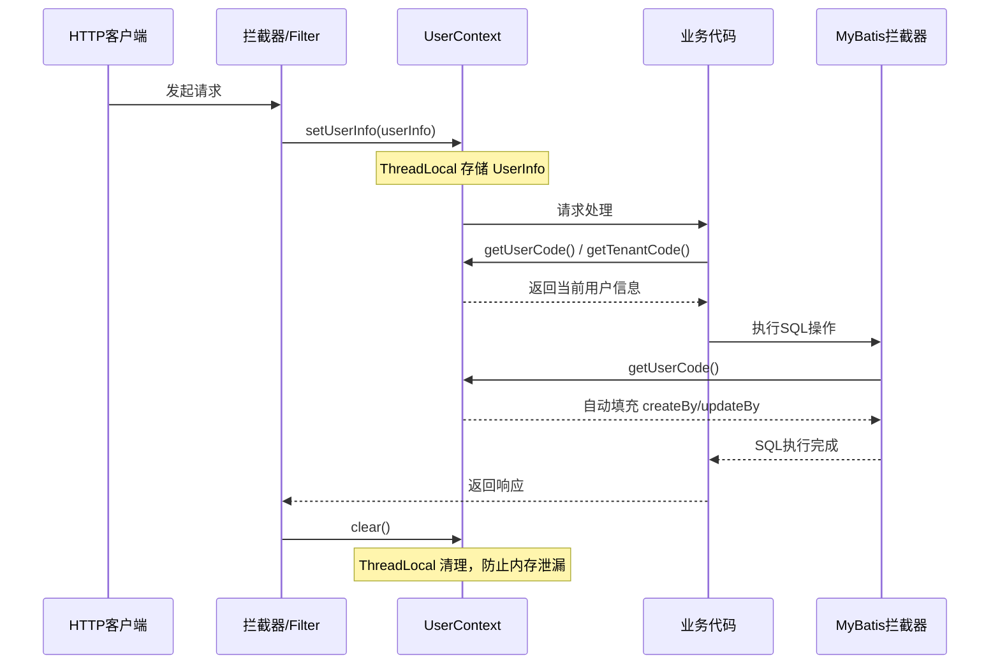

# 用户上下文与多租户隔离
- **所属模块**：sh-core
- **优先级**：高
- **故事ID**：US-004

## 1. 用户故事 (User Story)
**作为** 业务开发者，
**我希望** 通过 UserContext 在任意代码位置获取当前登录用户信息（userCode、tenantCode），
**以便于** 实现数据权限隔离、自动填充操作人等跨层功能，无需在方法间传递用户参数。

## 流程图

## 2. 验收标准 (Acceptance Criteria)
- [场景1] Given 拦截器已设置 UserInfo, When 调用 UserContext.getUserCode(), Then 返回当前用户的 userCode
- [场景2] Given 拦截器已设置多租户信息, When 调用 UserContext.getTenantCode(), Then 返回当前租户编码
- [场景3] Given 请求处理完毕, When 调用 UserContext.clear(), Then ThreadLocal 被清理，防止内存泄漏
- [异常场景] Given 未设置 UserInfo, When 调用 UserContext.getUserCode(), Then 返回 null 而不抛出异常

## 3. 涉及代码与上下文 (AI开发关键)
为了完成或修改此故事，AI 需要重点阅读以下核心代码文件：
- `sh-core/src/main/java/com/wkclz/core/user/UserContext.java` (ThreadLocal用户上下文，提供get/set/clear)
- `sh-core/src/main/java/com/wkclz/core/base/UserInfo.java` (用户信息实体，包含userCode/tenantCode等)
- `sh-mybatis/src/main/java/com/wkclz/mybatis/interceptor/MyBatisUpdateInterceptor.java` (更新拦截器，自动填充createBy/updateBy)
- `sh-core/src/main/java/com/wkclz/core/spi/UserNameProvider.java` (SPI接口，用户名称查询扩展点)
