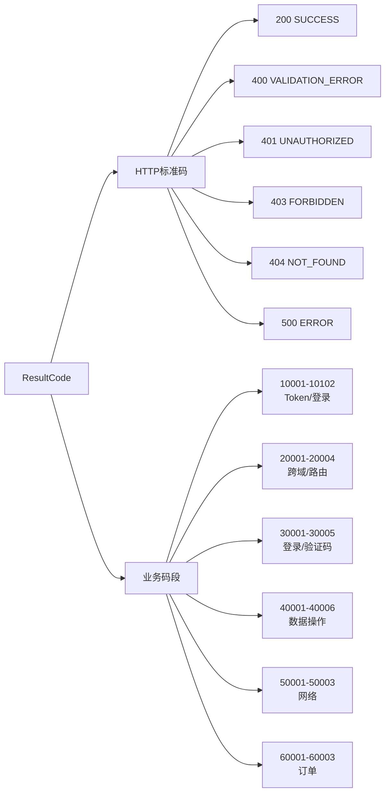

# 结果码与业务错误码体系
- **所属模块**：sh-core
- **优先级**：中
- **故事ID**：US-005

## 1. 用户故事 (User Story)
**作为** 系统架构师，
**我希望** 框架定义标准化的结果码枚举（ResultCode），覆盖 HTTP 标准码和 6 大业务码段，
**以便于** 前后端通过 code 精确识别错误类型，实现差异化的用户提示和错误处理。

## 流程图

## 2. 验收标准 (Acceptance Criteria)
- [场景1] Given 业务成功, When 使用 ResultCode.SUCCESS, Then code=200, message="Success"
- [场景2] Given Token 失效, When 使用 ResultCode.LOGIN_TIMEOUT, Then code=10007, message="登录已失效，请重新登录！"
- [场景3] Given 数据重复, When 使用 ResultCode.RECORD_DUPLICATE, Then code=40006, message="数据重复，唯一性校验失败！"
- [异常场景] Given 需要新增业务码段, When 在 ResultCode 中添加枚举值, Then 不与现有码段冲突（10000/20000/30000/40000/50000/60000 已占用）

## 3. 涉及代码与上下文 (AI开发关键)
为了完成或修改此故事，AI 需要重点阅读以下核心代码文件：
- `sh-core/src/main/java/com/wkclz/core/enums/ResultCode.java` (结果码枚举，6大类30个码)
- `sh-core/src/main/java/com/wkclz/core/base/R.java` (统一响应类，使用ResultCode构建响应)
- `sh-core/src/main/java/com/wkclz/core/exception/CommonException.java` (异常基类，支持ResultCode构造)
