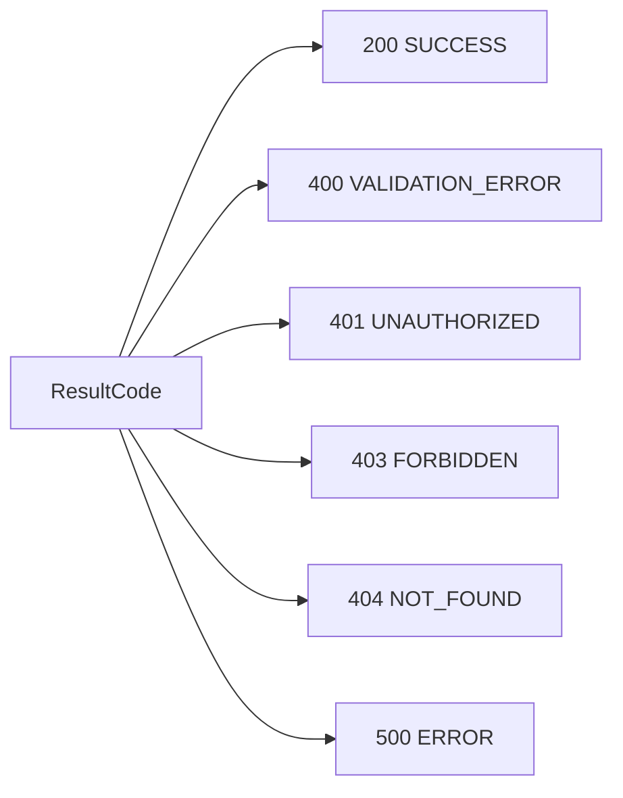

# 结果码与业务错误码体系
- **所属模块**：sh-core
- **优先级**：中
- **故事ID**：US-005

## 1. 用户故事 (User Story)
**作为** 系统架构师，
**我希望** 框架仅定义 HTTP 标准语义结果码（ResultCode），业务异常使用字符串消息描述，
**以便于** 返回码语义清晰、前端按 HTTP 语义统一处理，业务提示信息由业务侧灵活定义。

## 流程图

```mermaid
flowchart LR
    A[ResultCode] --> B1[200 SUCCESS]
    A --> B2[400 VALIDATION_ERROR]
    A --> B3[401 UNAUTHORIZED]
    A --> B4[403 FORBIDDEN]
    A --> B5[404 NOT_FOUND]
    A --> B6[500 ERROR]
```

## 2. 验收标准 (Acceptance Criteria)
- [场景1] Given 业务成功, When 使用 ResultCode.SUCCESS, Then code=200, message="Success"
- [场景2] Given 参数校验失败, When 使用 ValidationException, Then code=400（字符串构造默认码）
- [场景3] Given 未授权, When 使用 UnauthorizedException, Then code=401；鉴权拦截由会话过滤器返回 HTTP 401 + `{"message"}`
- [场景4] Given 资源不存在, When 使用 NotFoundException, Then code=404
- [异常场景] Given 业务提示, When 使用 `UserException.of("消息")` 等字符串异常, Then 消息直接透传给前端，不依赖预定义数字码
- [异常场景] Given 需要自定义数字码, When 使用 `CommonException.of(code, msg)`, Then 保留 (int, String) 构造能力

## 3. 涉及代码与上下文 (AI开发关键)
为了完成或修改此故事，AI 需要重点阅读以下核心代码文件：
- `sh-core/src/main/java/com/wkclz/core/enums/ResultCode.java` (结果码枚举，仅 HTTP 标准语义码 6 个)
- `sh-core/src/main/java/com/wkclz/core/base/R.java` (统一响应类，使用ResultCode构建响应)
- `sh-core/src/main/java/com/wkclz/core/exception/CommonException.java` (异常基类，支持ResultCode与(int, String)构造)
- `sh-web/src/main/java/com/wkclz/web/rest/ErrorHandler.java` (全局异常处理，各异常专属 handler 保留原码)
- `iam-session/src/main/java/com/wkclz/iam/session/filter/SessionAuthFilter.java` (鉴权拦截，401 裸结构响应)
- `iam-session/src/main/java/com/wkclz/iam/session/filter/RequestControlFilter.java` (限流拦截，429)

## 4. 历史说明
原设计包含 6 大业务码段（10001~60003，共 30 个码），因业务代码中绝大多数零引用、且鉴权/登录已由会话过滤器与 LoginStatus 体系接管，2026-09-29 起精简为仅 HTTP 标准语义码。业务错误提示统一使用异常字符串消息。
