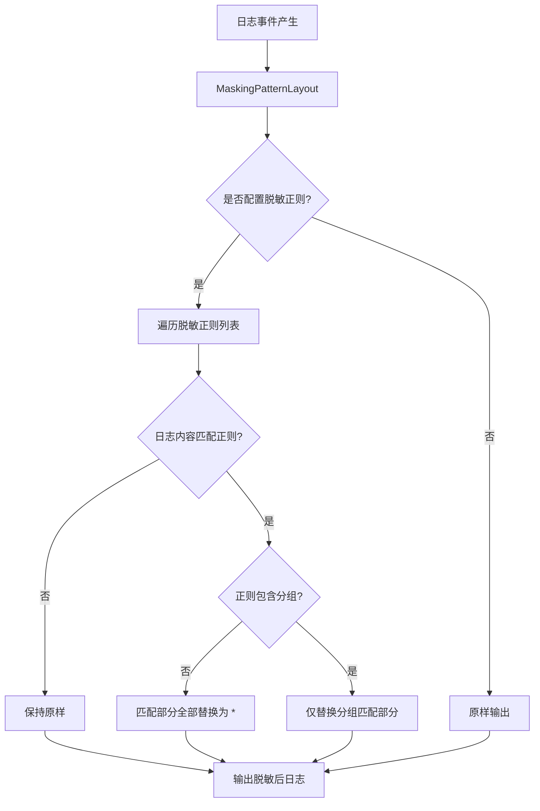

# 日志脱敏与安全输出
- **所属模块**：sh-core
- **优先级**：中
- **故事ID**：US-006

## 1. 用户故事 (User Story)
**作为** 运维人员，
**我希望** 日志输出时自动对敏感数据（手机号、身份证号等）进行脱敏处理，
**以便于** 防止敏感信息泄露到日志文件中，满足数据安全合规要求。

## 流程图

## 2. 验收标准 (Acceptance Criteria)
- [场景1] Given 配置了手机号脱敏正则, When 日志中包含手机号 13812345678, Then 输出为 138****5678（全部替换为*）
- [场景2] Given 配置了多个脱敏规则, When 日志匹配多个模式, Then 所有匹配部分均被替换为*
- [场景3] Given 未配置脱敏规则, When 日志输出, Then 内容原样输出不受影响
- [异常场景] Given 脱敏正则包含分组, When 匹配到分组内容, Then 仅替换分组匹配部分，非分组部分保持原样

## 3. 涉及代码与上下文 (AI开发关键)
为了完成或修改此故事，AI 需要重点阅读以下核心代码文件：
- `sh-core/src/main/java/com/wkclz/core/log/MaskingPatternLayout.java` (Logback脱敏布局，正则替换敏感数据)
- `sh-core/src/main/java/com/wkclz/core/enums/EnvType.java` (环境类型枚举，区分DEV/SIT/UAT/PROD)
