# 通用 Mapper 与动态 SQL 生成
- **所属模块**：sh-mybatis
- **优先级**：高
- **故事ID**：US-007

## 1. 用户故事 (User Story)
**作为** 业务开发者，
**我希望** 定义实体类后，继承 BaseMapper 即可自动获得 14 个通用 CRUD 方法，
**以便于** 无需手写任何 SQL 即可完成单表的增删改查操作，大幅提升开发效率。

## 流程图

```mermaid
flowchart TD
    A[BaseMapper&lt;T&gt;] --> B[插入操作]
    A --> C[删除操作]
    A --> D[更新操作]
    A --> E[查询操作]

    B --> B1[insert → InsertMapperProvider]
    B --> B2[insertBatch → InsertBatchMapperProvider]

    C --> C1[deleteById → DeleteByIdMapperProvider]
    C --> C2[deleteByIdEntity → DeleteByIdEntityMapperProvider]
    C --> C3[deleteByIds → DeleteByIdsMapperProvider]
    C --> C4[deleteByIdsEntity → DeleteByIdsEntityMapperProvider]

    D --> D1[updateById → UpdateByIdMapperProvider<br/>全字段+乐观锁]
    D --> D2[updateByIdSelective → UpdateByIdSelectiveMapperProvider<br/>非空字段+乐观锁]
    D --> D3[updateBatch → UpdateBatchMapperProvider<br/>批量无乐观锁]

    E --> E1[selectById → SelectByIdMapperProvider]
    E --> E2[selectByIds → SelectByIdsMapperProvider]
    E --> E3[selectAll → SelectAllMapperProvider]
    E --> E4[selectByEntity → SelectByEntityMapperProvider]
    E --> E5[selectByEntityWithLimit → SelectByEntityWithLimitMapperProvider]
    E --> E6[selectCountByEntity → SelectCountByEntityMapperProvider]
    E --> E7[selectOneByEntity → SelectOneByEntityMapperProvider]

    B1 & B2 & C1 & C2 & C3 & C4 --> F[BaseMapperProvider<br/>getDbEntityProperty + buildWhereClause]
    D1 & D2 & D3 --> F
    E4 & E5 & E6 & E7 --> F
    F --> G[DbEntityProperty<br/>字段分组/缓存/元数据]
```

## 2. 验收标准 (Acceptance Criteria)
- [场景1] Given 定义 UserMapper extends BaseMapper<User>, When 注入 UserMapper, Then 自动拥有 insert/insertBatch/deleteById/deleteByIds/updateById/updateByIdSelective/updateBatch/selectById/selectByIds/selectAll/selectByEntity/selectByEntityWithLimit/selectCountByEntity/selectOneByEntity 共 14 个方法
- [场景2] Given 调用 insert(entity), When 实体 id 为 null, Then 插入后 id 自动回填（useGeneratedKeys=true）
- [场景3] Given 调用 insertBatch(entities), When 列表超过 1000 条, Then BaseService 自动分批插入，每批最多 1000 条
- [异常场景] Given 实体中 @FieldDesc(notNull=true) 的字段为 null, When 调用 insert, Then 抛出 ValidationException

## 3. 涉及代码与上下文 (AI开发关键)
为了完成或修改此故事，AI 需要重点阅读以下核心代码文件：
- `sh-mybatis/src/main/java/com/wkclz/mybatis/mapper/BaseMapper.java` (通用Mapper接口，14个CRUD方法声明)
- `sh-mybatis/src/main/java/com/wkclz/mybatis/mapper/impl/BaseMapperProvider.java` (SQL Provider基类，缓存/WHERE/ORDER BY构建)
- `sh-mybatis/src/main/java/com/wkclz/mybatis/mapper/impl/InsertMapperProvider.java` (插入SQL生成，notNull校验)
- `sh-mybatis/src/main/java/com/wkclz/mybatis/mapper/impl/InsertBatchMapperProvider.java` (批量插入SQL生成)
- `sh-mybatis/src/main/java/com/wkclz/mybatis/bean/DbEntityProperty.java` (实体元数据，字段分组与缓存)
