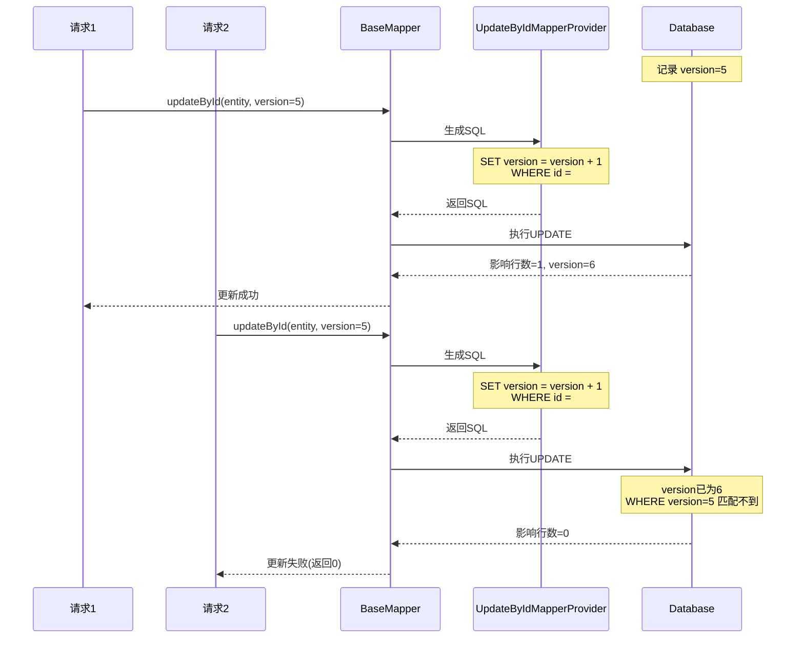

# 乐观锁与并发控制
- **所属模块**：sh-mybatis
- **优先级**：高
- **故事ID**：US-009

## 1. 用户故事 (User Story)
**作为** 业务开发者，
**我希望** 更新操作自动支持乐观锁（version 字段校验），
**以便于** 防止并发场景下的数据覆盖，保证数据一致性。

## 流程图

## 2. 验收标准 (Acceptance Criteria)
- [场景1] Given 调用 updateById(entity) 且 entity.version=5, When 生成 SQL, Then SET 子句包含 version = version + 1，WHERE 子句包含 AND version = 5
- [场景2] Given 调用 updateByIdSelective(entity) 且 entity.version 为 null, When 生成 SQL, Then SET 子句包含 version = version + 1，但 WHERE 不包含 version 条件
- [场景3] Given 调用 updateBatch(entity), When 生成 SQL, Then SET 子句包含 version = version + 1，但 WHERE 不包含 version 校验（批量更新不做乐观锁校验）
- [异常场景] Given 两个请求同时更新同一条记录(version=5), When 第一个请求成功后version变为6, Then 第二个请求因 WHERE version=5 匹配不到数据而更新失败(返回0)

## 3. 涉及代码与上下文 (AI开发关键)
为了完成或修改此故事，AI 需要重点阅读以下核心代码文件：
- `sh-mybatis/src/main/java/com/wkclz/mybatis/mapper/impl/UpdateByIdMapperProvider.java` (全字段更新+乐观锁SQL)
- `sh-mybatis/src/main/java/com/wkclz/mybatis/mapper/impl/UpdateByIdSelectiveMapperProvider.java` (选择性更新+乐观锁SQL)
- `sh-mybatis/src/main/java/com/wkclz/mybatis/mapper/impl/UpdateBatchMapperProvider.java` (批量更新SQL，version自增但不校验)
- `sh-mybatis/src/main/java/com/wkclz/mybatis/bean/DbEntityProperty.java` (VERSION_FIELD常量定义)
