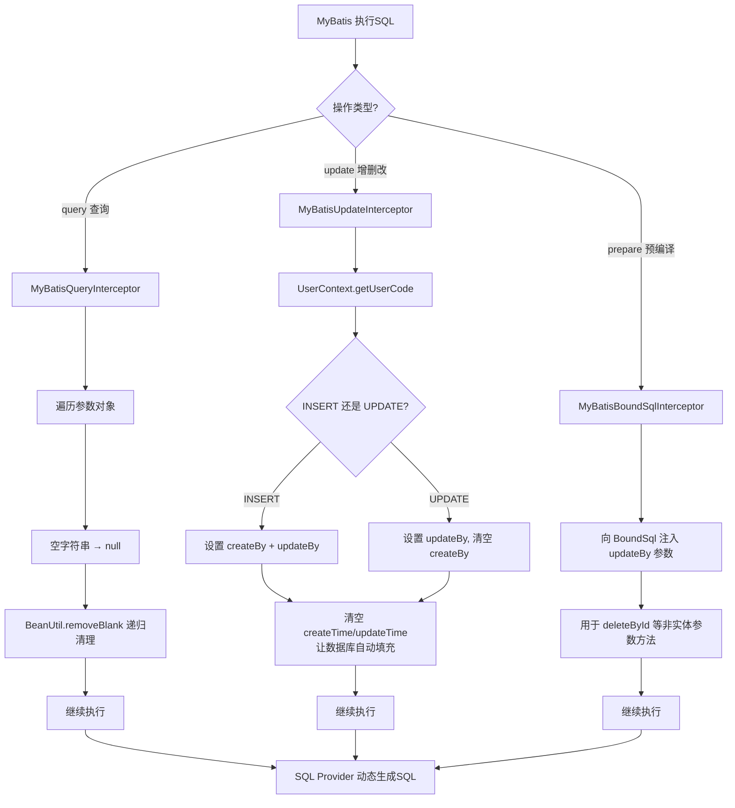

# MyBatis 拦截器与自动填充
- **所属模块**：sh-mybatis
- **优先级**：高
- **故事ID**：US-010

## 1. 用户故事 (User Story)
**作为** 业务开发者，
**我希望** MyBatis 拦截器自动填充 createBy/updateBy 字段并清理空字符串，
**以便于** 无需在业务代码中手动设置操作人和处理空字符串查询条件。

## 流程图

## 2. 验收标准 (Acceptance Criteria)
- [场景1] Given UserContext 已设置 userCode="U001", When 执行 INSERT 操作, Then 实体的 createBy 和 updateBy 均被设置为 "U001"
- [场景2] Given UserContext 已设置 userCode="U001", When 执行 UPDATE 操作, Then 实体的 updateBy 被设置为 "U001"，createBy 被清空（避免覆盖原值）
- [场景3] Given 查询参数中某字段为空字符串 "", When MyBatisQueryInterceptor 处理, Then 空字符串被替换为 null，Provider 跳过该条件
- [异常场景] Given UserContext 未设置 userCode, When 执行 INSERT 操作, Then createBy 和 updateBy 为 null，不抛出异常

## 3. 涉及代码与上下文 (AI开发关键)
为了完成或修改此故事，AI 需要重点阅读以下核心代码文件：
- `sh-mybatis/src/main/java/com/wkclz/mybatis/interceptor/MyBatisUpdateInterceptor.java` (更新拦截器，自动填充createBy/updateBy)
- `sh-mybatis/src/main/java/com/wkclz/mybatis/interceptor/MyBatisQueryInterceptor.java` (查询拦截器，空字符串替换为null)
- `sh-core/src/main/java/com/wkclz/core/user/UserContext.java` (用户上下文，提供getUserCode)
- `sh-tool/src/main/java/com/wkclz/tool/utils/BeanUtil.java` (removeBlank方法，清理空字符串属性)
