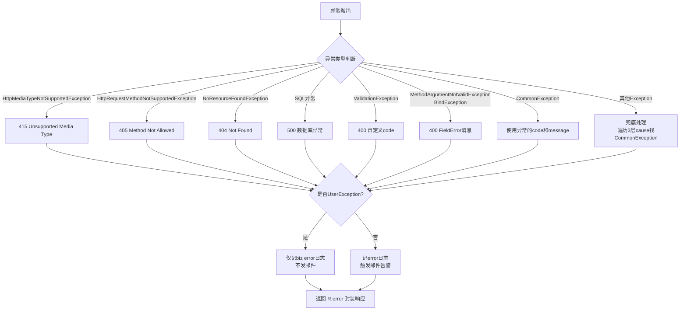

# 全局异常处理与邮件告警
- **所属模块**：sh-web
- **优先级**：高
- **故事ID**：US-012

## 1. 用户故事 (User Story)
**作为** 系统运维人员，
**我希望** 所有未捕获的异常被全局异常处理器统一拦截并分类处理，
**以便于** 用户获得友好的错误提示，同时系统异常自动触发邮件告警，便于快速定位问题。

## 流程图

## 2. 验收标准 (Acceptance Criteria)
- [场景1] Given 抛出 MethodArgumentNotValidException, When 全局异常处理器拦截, Then 返回 HTTP 400 和字段错误消息
- [场景2] Given 抛出 NoResourceFoundException, When 全局异常处理器拦截, Then 返回 HTTP 404
- [场景3] Given 抛出 SystemException(非UserException), When 全局异常处理器拦截, Then 返回 HTTP 500 且触发邮件告警（包含系统名、时间、URL、请求详情、异常堆栈）
- [异常场景] Given 异常被多层包装(最多3层cause), When 兜底异常处理器遍历cause链, Then 能穿透找到被包装的 CommonException 并使用其 code 和 message

## 3. 涉及代码与上下文 (AI开发关键)
为了完成或修改此故事，AI 需要重点阅读以下核心代码文件：
- `sh-web/src/main/java/com/wkclz/web/rest/ErrorHandler.java` (全局异常处理器，8种特定异常+兜底)
- `sh-spring/src/main/java/com/wkclz/spring/config/SystemConfig.java` (系统配置，邮件告警参数)
- `sh-spring/src/main/java/com/wkclz/spring/utils/MailUtil.java` (邮件发送工具，SSL加密+HTML格式)
- `sh-web/src/main/java/com/wkclz/web/helper/LocalThreadHelper.java` (线程上下文，传递异常信息给Filter)
