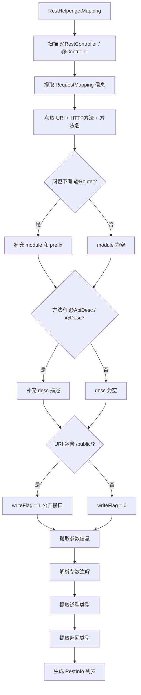

# REST 接口元数据扫描
- **所属模块**：sh-web
- **优先级**：中
- **故事ID**：US-014

## 1. 用户故事 (User Story)
**作为** 系统管理员，
**我希望** 框架自动扫描所有 REST 接口并生成元数据（URI、方法、描述、模块、参数、返回类型），
**以便于** 实现接口权限自动注册、API 文档生成和接口审计。

## 流程图

## 2. 验收标准 (Acceptance Criteria)
- [场景1] Given 定义了 @RestController 类和 @GetMapping 方法, When 调用 RestHelper.getMapping(), Then 返回包含 URI、HTTP 方法、接口名称的 RestInfo 列表
- [场景2] Given 定义了 @Router(module="用户管理", prefix="/user") 的类, When 扫描接口, Then 同包下的接口自动补充 module 和 desc 信息
- [场景3] Given URI 包含 /public/ 路径, When 扫描接口, Then writeFlag 标记为 1（公开接口）
- [场景4] Given 方法参数使用 @RequestBody 注解, When 扫描接口, Then RestInfo.parameters 包含参数名称、类型、注解类型、是否必需等信息
- [场景5] Given 方法参数使用 @RequestParam(required=false) 注解, When 扫描接口, Then RestParam.required 为 false
- [场景6] Given 方法返回类型为 R<List<UserResp>>, When 扫描接口, Then RestInfo.returnType 为 R 类名, returnGenericInfo 包含泛型信息
- [异常场景] Given 接口未添加 @ApiDesc 或 @Desc 注解, When 扫描接口, Then desc 字段为空但不影响扫描
- [异常场景] Given 方法参数没有注解, When 扫描接口, Then annotationType 为 "Parameter", required 为 false

## 3. 涉及代码与上下文 (AI开发关键)
为了完成或修改此故事，AI 需要重点阅读以下核心代码文件：
- `sh-web/src/main/java/com/wkclz/web/helper/RestHelper.java` (REST接口扫描工具，提取元数据、参数信息、返回类型)
- `sh-web/src/main/java/com/wkclz/web/bean/RestInfo.java` (接口元数据Bean，包含URI/方法/描述/模块/参数/返回类型)
- `sh-web/src/main/java/com/wkclz/web/bean/RestParam.java` (参数元数据Bean，包含参数名称/类型/注解/必需性/默认值/泛型)
- `sh-core/src/main/java/com/wkclz/core/annotation/Router.java` (路由注解，声明模块和前缀)
- `sh-core/src/main/java/com/wkclz/core/annotation/ApiDesc.java` (API描述注解)

## 4. 参数提取逻辑说明
RestHelper.getRest() 方法会提取以下参数信息：
- **参数名称**：使用 Parameter.getName() 获取（需要编译时使用 -parameters 选项）
- **参数类型**：使用 Parameter.getType() 获取完整类名
- **参数注解类型**：识别 @RequestBody、@PathVariable、@RequestParam 等注解
- **是否必需**：根据注解的 required 属性判断
- **默认值**：提取 @RequestParam 的 defaultValue 属性
- **泛型类型**：解析参数的泛型信息（如 List<UserResp>）

支持的参数注解：
- `@RequestBody`：请求体参数，required 默认为 true
- `@PathVariable`：路径变量参数，required 默认为 true
- `@RequestParam`：请求参数，可设置 required 和 defaultValue
- 无注解参数：annotationType 为 "Parameter"，required 为 false

## 5. 返回类型提取逻辑说明
RestHelper.getRest() 方法会提取以下返回类型信息：
- **返回类型**：使用 Method.getReturnType() 获取完整类名
- **泛型信息**：解析返回类型的泛型信息（如 R<List<UserResp>>）
- **特殊类型处理**：处理 void、TypeVariable、WildcardType 等特殊类型