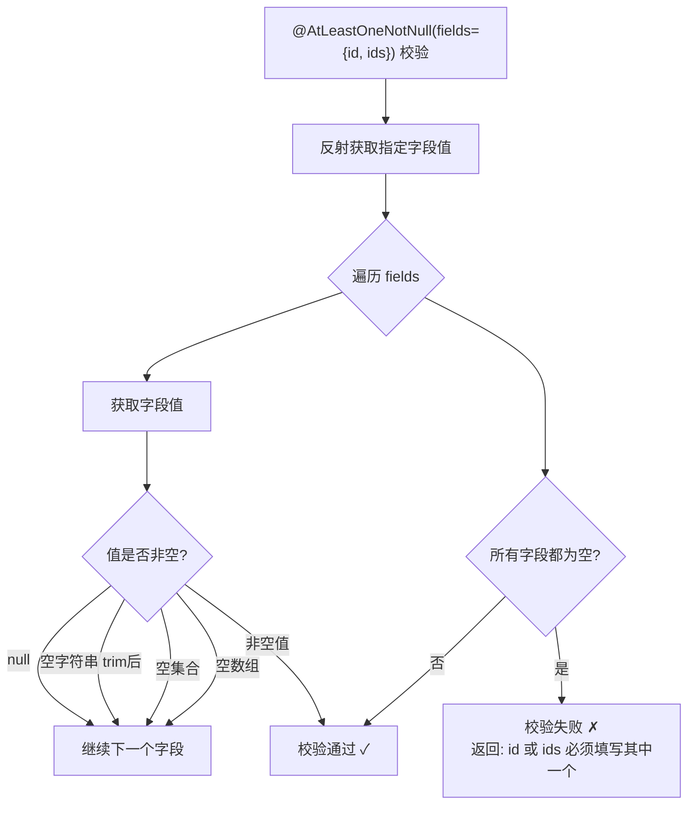

# 自定义参数校验与标准请求 Bean
- **所属模块**：sh-web
- **优先级**：中
- **故事ID**：US-015

## 1. 用户故事 (User Story)
**作为** 业务开发者，
**我希望** 使用框架提供的标准请求 Bean（IdReq/PageReq/RemoveReq/UpdateReq）和自定义校验注解（@AtLeastOneNotNull），
**以便于** 统一请求参数格式，减少重复的参数校验代码。

## 流程图

## 2. 验收标准 (Acceptance Criteria)
- [场景1] Given 使用 @AtLeastOneNotNull(fields={"id", "ids"}) 标注 RemoveReq, When id 和 ids 均为 null, Then 校验失败返回 "id 或 ids 必须填写其中一个"
- [场景2] Given 使用 @AtLeastOneNotNull(fields={"id", "ids"}) 标注 RemoveReq, When id 不为 null 但 ids 为 null, Then 校验通过
- [场景3] Given 使用 UpdateReq 且 version 为 null, When 校验执行, Then 返回 "数据版本version不能为空"
- [异常场景] Given 被校验对象中字段值为空字符串或空集合, When @AtLeastOneNotNull 校验, Then 空字符串(trim后)、空集合、空数组均视为"空"

## 3. 涉及代码与上下文 (AI开发关键)
为了完成或修改此故事，AI 需要重点阅读以下核心代码文件：
- `sh-web/src/main/java/com/wkclz/web/annotation/AtLeastOneNotNull.java` (类级别校验注解)
- `sh-web/src/main/java/com/wkclz/web/annotation/validator/AtLeastOneNotNullValidator.java` (校验器实现，反射+空值细化判断)
- `sh-web/src/main/java/com/wkclz/web/bean/RemoveReq.java` (删除请求VO，@AtLeastOneNotNull典型使用)
- `sh-web/src/main/java/com/wkclz/web/bean/UpdateReq.java` (更新请求VO，id+version必填)
- `sh-web/src/main/java/com/wkclz/web/bean/PageReq.java` (分页请求VO，current+size)
