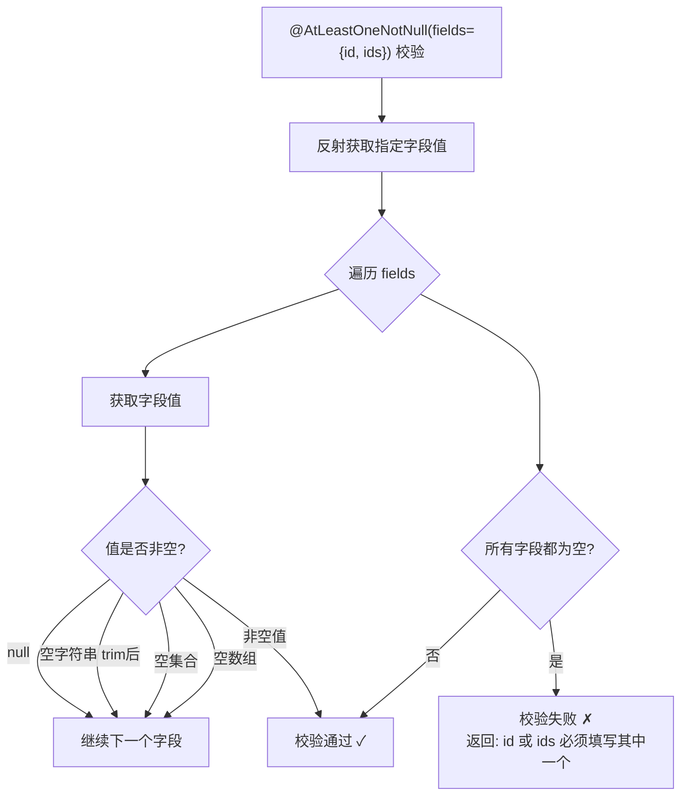

# 自定义参数校验与标准请求 Bean
- **所属模块**：sh-web
- **优先级**：中
- **故事ID**：US-015

## 1. 用户故事 (User Story)
**作为** 业务开发者，
**我希望** 使用框架提供的标准请求 Bean（IdReq/PageReq/RemoveReq/UpdateReq）和自定义校验注解（@AtLeastOneNotNull），
**以便于** 统一请求参数格式，减少重复的参数校验代码。

## 流程图



## 2. 验收标准 (Acceptance Criteria)
- [场景1] Given 使用 @AtLeastOneNotNull(fields={"id", "ids"}) 标注 RemoveReq, When id 和 ids 均为 null, Then 校验失败返回 "id 或 ids 必须填写其中一个"
- [场景2] Given 使用 @AtLeastOneNotNull(fields={"id", "ids"}) 标注 RemoveReq, When id 不为 null 但 ids 为 null, Then 校验通过
- [场景3] Given 使用 UpdateReq 且 version 为 null, When 校验执行, Then 返回 "数据版本version不能为空"
- [异常场景] Given 被校验对象中字段值为空字符串或空集合, When @AtLeastOneNotNull 校验, Then 空字符串(trim后)、空集合、空数组均视为"空"

## 3. 涉及代码与上下文 (AI开发关键)
为了完成或修改此故事，AI 需要重点阅读以下核心代码文件：
- `sh-web/src/main/java/com/wkclz/web/annotation/AtLeastOneNotNull.java` (类级别校验注解)
- `sh-web/src/main/java/com/wkclz/web/annotation/validator/AtLeastOneNotNullValidator.java` (校验器实现，反射+空值细化判断)
- `sh-web/src/main/java/com/wkclz/web/bean/RemoveReq.java` (删除请求VO，@AtLeastOneNotNull典型使用)
- `sh-web/src/main/java/com/wkclz/web/bean/UpdateReq.java` (更新请求VO，id+version必填)
- `sh-web/src/main/java/com/wkclz/web/bean/PageReq.java` (分页请求VO，current+size)

## 4. 常见错误用法

### 错误：同时使用字段级 @NotNull 和类级 @AtLeastOneNotNull

**问题示例：**
```java
@AtLeastOneNotNull(fields = {"id", "ids"}, message = "id 或 ids 必须填写其中一个")
public class RemoveReq {
    @NotNull(message = "主键ID不能为空")  // ❌ 错误：与 @AtLeastOneNotNull 冲突
    private Long id;

    @NotNull(message = "主键ID清单不能为空")  // ❌ 错误：与 @AtLeastOneNotNull 冲突
    private List<Long> ids;
}
```

**问题原因：**
字段级别的 `@NotNull` 校验会先执行，导致即使有一个字段有值，另一个字段为 null 时也会触发校验失败，使得类级别的 `@AtLeastOneNotNull` 无法按预期工作。

**正确做法：**
```java
@AtLeastOneNotNull(fields = {"id", "ids"}, message = "id 或 ids 必须填写其中一个")
public class RemoveReq {
    @Schema(description = "主键ID（与 ids 二选一）")  // ✅ 正确：移除 @NotNull
    private Long id;

    @Schema(description = "主键ID清单（与 id 二选一）")  // ✅ 正确：移除 @NotNull
    private List<Long> ids;
}
```

**最佳实践：**
- 使用 `@AtLeastOneNotNull` 时，被校验的字段不应添加 `@NotNull` 注解
- 使用 `@Schema` 注解描述字段的业务含义和互斥关系
- 在 message 中清晰说明校验规则，如 "id 或 ids 必须填写其中一个"
