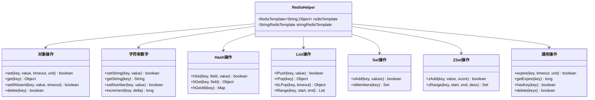

# Redis 全数据类型缓存操作
- **所属模块**：sh-redis
- **优先级**：高
- **故事ID**：US-016

## 1. 用户故事 (User Story)
**作为** 业务开发者，
**我希望** 通过 RedisHelper 统一操作 Redis 的所有数据类型（String/Hash/List/Set/ZSet），
**以便于** 无需直接操作 RedisTemplate，以简洁的 API 完成缓存读写。

## 流程图

## 2. 验收标准 (Acceptance Criteria)
- [场景1] Given 调用 redisHelper.set("key", value, 30, TimeUnit.MINUTES), When 设置成功, Then 返回 true 且 key 在 30 分钟后自动过期
- [场景2] Given 调用 redisHelper.hSet("user:001", "name", "张三"), When 调用 redisHelper.hGet("user:001", "name"), Then 返回 "张三"
- [场景3] Given 调用 redisHelper.zAdd("rank", "player1", 95.5), When 调用 redisHelper.zRange("rank", 0, -1, true), Then 返回按分数降序排列的集合
- [异常场景] Given Redis 连接异常, When 调用 redisHelper.set(), Then 返回 false 而不向上抛出异常（写操作均 try-catch 包裹）

## 3. 涉及代码与上下文 (AI开发关键)
为了完成或修改此故事，AI 需要重点阅读以下核心代码文件：
- `sh-redis/src/main/java/com/wkclz/redis/helper/RedisHelper.java` (全数据类型操作工具，String/Hash/List/Set/ZSet)
- `sh-redis/src/main/java/com/wkclz/redis/config/RedisTemplateConfig.java` (RedisTemplate配置，Key用String/Value用fastjson2)
- `sh-redis/src/main/java/com/wkclz/redis/serializer/Fastjson2JsonRedisSerializer.java` (fastjson2序列化器，保留类型信息)
- `sh-redis/src/main/java/com/wkclz/redis/config/RedisKeepAliveConfig.java` (Lettuce保活配置，TCP KeepAlive+TcpNoDelay)
