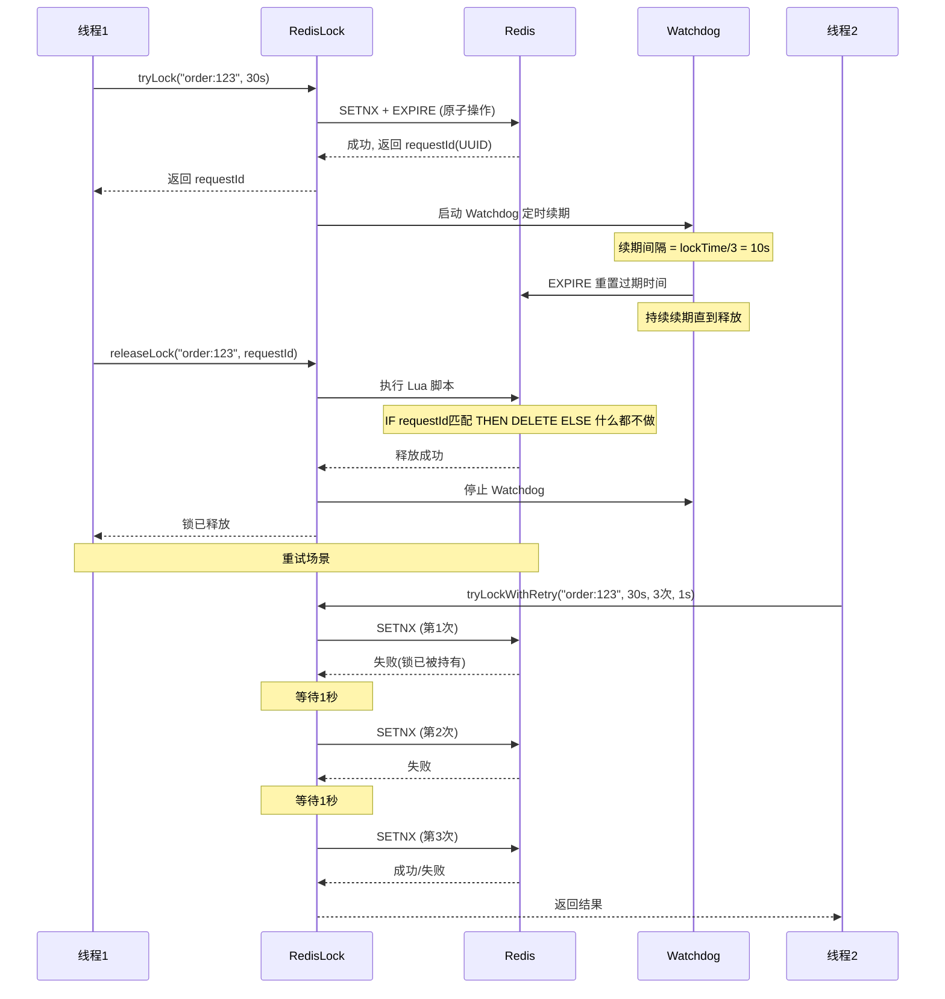

# Redis 分布式锁
- **所属模块**：sh-redis
- **优先级**：高
- **故事ID**：US-017

## 1. 用户故事 (User Story)
**作为** 业务开发者，
**我希望** 使用 RedisLock 实现分布式锁（SETNX + Lua 原子释放），
**以便于** 在分布式环境下安全地控制共享资源的并发访问。

## 流程图

## 2. 验收标准 (Acceptance Criteria)
- [场景1] Given 调用 redisLock.tryLock("order:123", 30, TimeUnit.SECONDS), When 获取锁成功, Then 返回 UUID 作为 requestId
- [场景2] Given 锁的持有者调用 redisLock.releaseLock("order:123", requestId), When Lua 脚本执行, Then 只有 requestId 匹配时才删除锁，防止误删其他线程的锁
- [场景3] Given 锁已被其他线程持有, When 调用 redisLock.tryLockWithRetry("order:123", 30s, 3次, 1秒间隔), Then 最多重试 3 次，每次间隔 1 秒
- [异常场景] Given 锁持有者未释放锁但锁已过期, When 其他线程获取锁, Then 成功获取（SETNX + EXPIRE 原子操作防止死锁）

## 3. 涉及代码与上下文 (AI开发关键)
为了完成或修改此故事，AI 需要重点阅读以下核心代码文件：
- `sh-redis/src/main/java/com/wkclz/redis/helper/RedisLock.java` (分布式锁，SETNX+Lua原子释放+重试)
- `sh-redis/src/main/java/com/wkclz/redis/helper/RedisHelper.java` (setIfAbsent方法，SETNX原子操作)
