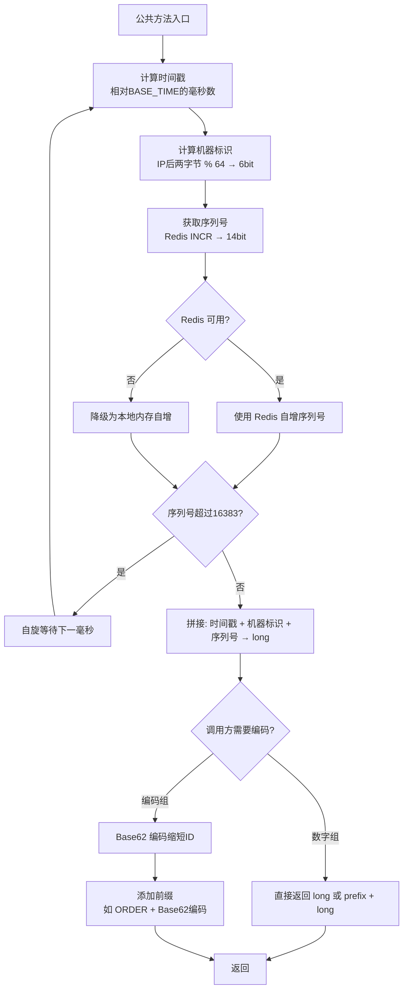

# Redis ID 生成器
- **所属模块**：sh-redis
- **优先级**：中
- **故事ID**：US-018

## 1. 用户故事 (User Story)
**作为** 业务开发者，
**我希望** 通过 RedisIdGenerator 生成全局唯一、有序且可读的 ID，
**以便于** 在分布式环境下为业务数据生成唯一标识，且 ID 包含时间信息便于排序。

## 对外方法

| 方法 | 返回类型 | 说明 |
|------|----------|------|
| `generateNumericId(type)` | `long` | 纯数字 ID（压缩前） |
| `generateNumericIdWithPrefix(prefix)` | `String` | prefix + 纯数字（压缩前） |
| `generateBase62Id(type)` | `String` | Base62 编码（压缩后） |
| `generateBase62IdWithPrefix(prefix)` | `String` | prefix + Base62 编码（压缩后） |
| ~~`generateIdWithType(type)`~~ | `String` | @Deprecated，委托 `generateBase62Id` |
| ~~`generateIdWithPrefix(prefix)`~~ | `String` | @Deprecated，委托 `generateBase62IdWithPrefix` |

## 流程图

## 2. 验收标准 (Acceptance Criteria)
- [场景1] Given 调用 generateBase62IdWithPrefix("ORDER"), When 生成 ID, Then 格式为 "ORDER" + 62进制编码字符串
- [场景2] Given 调用 generateNumericIdWithPrefix("ORDER"), When 生成 ID, Then 格式为 "ORDER" + 纯数字字符串（与场景1同一原始 ID 的编码前后形态）
- [场景3] Given 调用 generateNumericId("order"), When 生成 ID, Then 返回 long 类型纯数字
- [场景4] Given 同一毫秒内多次调用, When 序列号未超过 16383, Then 每次返回唯一 ID
- [场景5] Given Redis 不可用, When 调用 ID 生成, Then 自动降级到本地生成（内存序列号自增），返回类型与正常路径一致
- [场景6] Given 同一原始 ID, When 分别调用数字组与编码组方法, Then 编码组结果为数字组结果的 Base62 编码
- [异常场景] Given 同一毫秒内序列号超过 16383, When 继续生成 ID, Then 自旋等待下一毫秒

## 3. 涉及代码与上下文 (AI开发关键)
为了完成或修改此故事，AI 需要重点阅读以下核心代码文件：
- `sh-redis/src/main/java/com/wkclz/redis/helper/RedisIdGenerator.java` (ID生成器，4 个公共方法 + 私有 generateRawId 核心方法，时间戳+机器标识+序列号+62进制)
- `sh-redis/src/main/java/com/wkclz/redis/helper/RedisHelper.java` (increment方法，Redis自增序列号)
- `sh-tool/src/main/java/com/wkclz/tool/utils/NetworkUtil.java` (获取服务器IP，计算机器标识)
