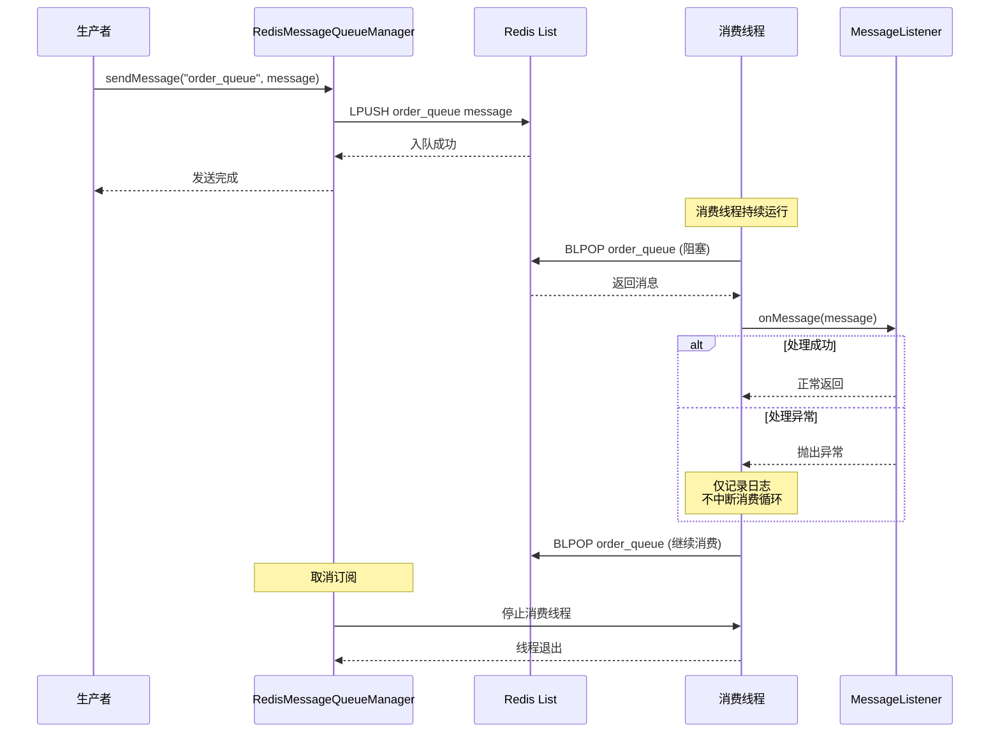

# Redis 消息队列
- **所属模块**：sh-redis
- **优先级**：中
- **故事ID**：US-019

## 1. 用户故事 (User Story)
**作为** 业务开发者，
**我希望** 使用 Redis 实现轻量级消息队列（基于 List 的 FIFO 模型），
**以便于** 在不需要引入专业 MQ 的场景下实现异步消息处理。

## 流程图

## 2. 验收标准 (Acceptance Criteria)
- [场景1] Given 调用 messageQueueManager.sendMessage("order_queue", orderMessage), When 消息发送, Then 消息被 lPush 到 Redis List
- [场景2] Given 已订阅 order_queue, When 消息到达, Then 消费线程通过 BLPOP 阻塞接收并调用 listener.onMessage()
- [场景3] Given 调用 messageQueueManager.unsubscribe("order_queue"), When 取消订阅, Then 消费线程自动退出
- [异常场景] Given 消费线程处理消息时抛出异常, When onMessage() 失败, Then 仅记录日志不中断消费循环

## 3. 涉及代码与上下文 (AI开发关键)
为了完成或修改此故事，AI 需要重点阅读以下核心代码文件：
- `sh-redis/src/main/java/com/wkclz/redis/queue/RedisMessageQueueManager.java` (队列管理器，统一管理多队列+消费线程)
- `sh-redis/src/main/java/com/wkclz/redis/queue/RedisMessageQueueImpl.java` (队列实现，lPush/bLPop)
- `sh-redis/src/main/java/com/wkclz/redis/queue/MessageListener.java` (消息监听器接口，业务方实现)
- `sh-redis/src/main/java/com/wkclz/redis/queue/RedisMessageQueue.java` (队列接口定义)
