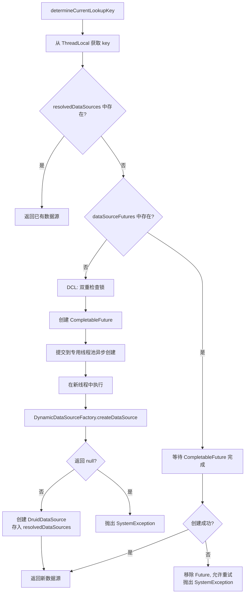

# 动态数据源 DCL 与异步创建
- **所属模块**：sh-dynamicdb
- **优先级**：中
- **故事ID**：US-021

## 1. 用户故事 (User Story)
**作为** 框架开发者，
**我希望** 动态数据源创建使用 DCL 双重检查锁 + CompletableFuture 异步创建，
**以便于** 避免并发重复创建数据源，同时防止默认数据源管理元信息时的递归死循环。

## 流程图

## 2. 验收标准 (Acceptance Criteria)
- [场景1] Given 多线程并发请求同一数据源 key, When 第一个线程加锁创建, Then 其他线程通过 DCL 检查直接使用已创建的数据源
- [场景2] Given 默认数据源管理第三方数据源元信息, When 当前线程查询元信息, Then CompletableFuture 在新线程中执行，新线程 ThreadLocal 为空，自动回退到默认数据源
- [场景3] Given 数据源创建失败, When CompletableFuture.get() 抛出异常, Then 向上传播 SystemException
- [异常场景] Given 数据源 key 对应的 DynamicDataSourceFactory.createDataSource() 返回 null, When 异步创建执行, Then 抛出 SystemException("can not find dataSource by key")

## 3. 涉及代码与上下文 (AI开发关键)
为了完成或修改此故事，AI 需要重点阅读以下核心代码文件：
- `sh-dynamicdb/src/main/java/com/wkclz/dynamicdb/DynamicDataSource.java` (determineCurrentLookupKey核心方法，DCL+异步)
- `sh-dynamicdb/src/main/java/com/wkclz/dynamicdb/AbstractShrimpRoutingDataSource.java` (路由数据源基类，ConcurrentHashMap支持)
- `sh-dynamicdb/src/main/java/com/wkclz/dynamicdb/bean/DefaultDataSourceConfig.java` (默认数据源配置，复用连接池参数)
- `sh-dynamicdb/src/main/java/com/wkclz/dynamicdb/config/DynamicDataSourceConfig.java` (缓存时间配置)
