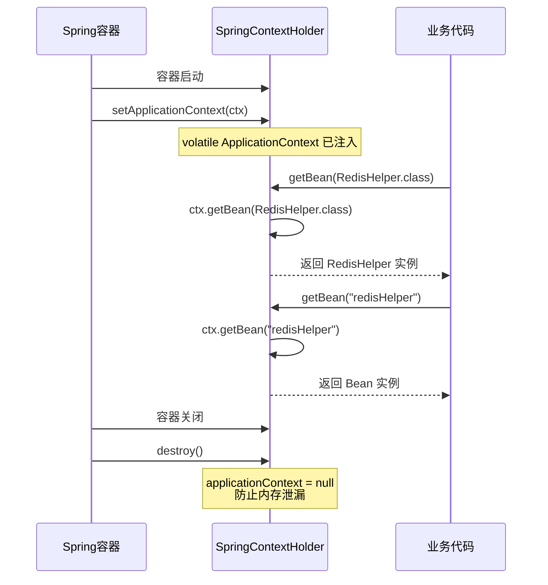

# Spring 上下文全局持有器
- **所属模块**：sh-spring
- **优先级**：高
- **故事ID**：US-022

## 1. 用户故事 (User Story)
**作为** 框架开发者，
**我希望** 通过 SpringContextHolder 在任意位置获取 Spring Bean，
**以便于** 非Spring管理的类（如工具类、拦截器内部）也能访问容器中的 Bean。

## 流程图

## 2. 验收标准 (Acceptance Criteria)
- [场景1] Given Spring 容器已启动, When 调用 SpringContextHolder.getBean(RedisHelper.class), Then 返回 RedisHelper 实例
- [场景2] Given Spring 容器已启动, When 调用 SpringContextHolder.getBean("redisHelper"), Then 返回名为 redisHelper 的 Bean
- [场景3] Given Spring 容器关闭, When DisposableBean.destroy() 被调用, Then applicationContext 被置为 null 防止内存泄漏
- [异常场景] Given applicationContext 未注入, When 调用 getBean(), Then 抛出 RuntimeException("applicationContext属性未注入")

## 3. 涉及代码与上下文 (AI开发关键)
为了完成或修改此故事，AI 需要重点阅读以下核心代码文件：
- `sh-spring/src/main/java/com/wkclz/spring/config/SpringContextHolder.java` (ApplicationContext持有器，getBean/destroy)
- `sh-spring/src/main/java/com/wkclz/spring/config/Sys.java` (系统初始化器，使用SpringContextHolder获取Environment)
- `sh-spring/src/main/java/com/wkclz/spring/config/SystemConfig.java` (系统配置，集中管理配置项)
