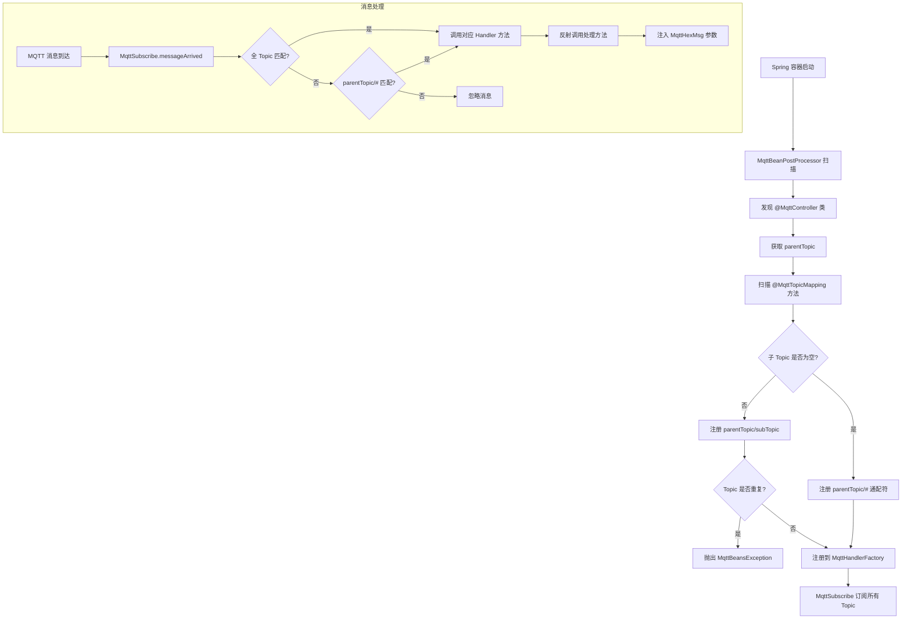

# MQTT 注解驱动消息发布/订阅
- **所属模块**：sh-mqtt
- **优先级**：高
- **故事ID**：US-024

## 1. 用户故事 (User Story)
**作为** IoT 业务开发者，
**我希望** 通过 @MqttController + @MqttTopicMapping 注解开发 MQTT 消息处理器，
**以便于** 像 Spring MVC 开发 REST 接口一样简洁地开发 MQTT 消息收发功能。

## 流程图

## 2. 验收标准 (Acceptance Criteria)
- [场景1] Given 定义 @MqttController("device") + @MqttTopicMapping("status"), When MQTT 消息到达 Topic "device/status", Then 对应方法被反射调用，自动注入 MqttHexMsg
- [场景2] Given @MqttTopicMapping 未指定 value, When BeanPostProcessor 扫描, Then 订阅 Topic 为 "parentTopic/#"（通配符）
- [场景3] Given 调用 mqttProducer.send("device/status", data), When 消息发送, Then data 被 JSON 序列化后通过 MqttAsyncClient 发布
- [异常场景] Given 两个类定义了相同的 Topic, When BeanPostProcessor 扫描, Then 抛出 MqttBeansException("topic 重复定义")

## 3. 涉及代码与上下文 (AI开发关键)
为了完成或修改此故事，AI 需要重点阅读以下核心代码文件：
- `sh-mqtt/src/main/java/com/wkclz/mqtt/annotation/MqttController.java` (类级注解，声明父级Topic)
- `sh-mqtt/src/main/java/com/wkclz/mqtt/annotation/MqttTopicMapping.java` (方法级注解，声明子级Topic)
- `sh-mqtt/src/main/java/com/wkclz/mqtt/config/MqttBeanPostProcessor.java` (注解扫描处理器，注册Topic->Handler映射)
- `sh-mqtt/src/main/java/com/wkclz/mqtt/config/MqttSubscribe.java` (消息订阅与分发，两级Topic匹配+反射调用)
- `sh-mqtt/src/main/java/com/wkclz/mqtt/client/MqttProducer.java` (消息生产者，即时/延时/批量发送)
- `sh-mqtt/src/main/java/com/wkclz/mqtt/handler/MqttHandlerFactory.java` (处理器注册中心，Topic->Method/Bean映射)
