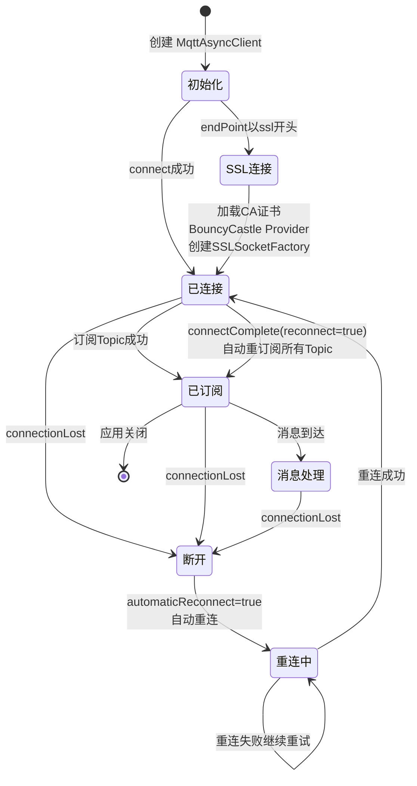

# MQTT SSL/TLS 认证与断线重连
- **所属模块**：sh-mqtt
- **优先级**：中
- **故事ID**：US-025

## 1. 用户故事 (User Story)
**作为** IoT 运维人员，
**我希望** MQTT 连接支持 SSL/TLS 单向认证和断线自动重连重订阅，
**以便于** 保证通信安全，同时网络抖动时自动恢复连接和订阅，无需人工干预。

## 流程图

## 2. 验收标准 (Acceptance Criteria)
- [场景1] Given endPoint 以 "ssl" 开头且配置了 ca-path, When 创建 MqttAsyncClient, Then 加载 CA 证书创建 SSLSocketFactory，使用 BouncyCastle Provider
- [场景2] Given MQTT 连接断开, When MqttReconnectCallback.connectionLost() 触发, Then 记录错误日志，automaticReconnect=true 自动重连
- [场景3] Given 重连成功, When MqttReconnectCallback.connectComplete(reconnect=true) 触发, Then 自动调用 MqttSubscribe.subscribeTopics() 重新订阅所有 Topic
- [异常场景] Given CA 证书文件不存在, When 加载证书, Then 抛出 RuntimeException

## 3. 涉及代码与上下文 (AI开发关键)
为了完成或修改此故事，AI 需要重点阅读以下核心代码文件：
- `sh-mqtt/src/main/java/com/wkclz/mqtt/config/MqttConfig.java` (MQTT核心配置，SSL/TLS+断线重连回调)
- `sh-mqtt/src/main/java/com/wkclz/mqtt/config/MqttSubscribe.java` (订阅管理，重连后重新订阅)
- `sh-mqtt/src/main/java/com/wkclz/mqtt/config/MqttApplicationListener.java` (启动监听器，容器刷新后触发订阅)
