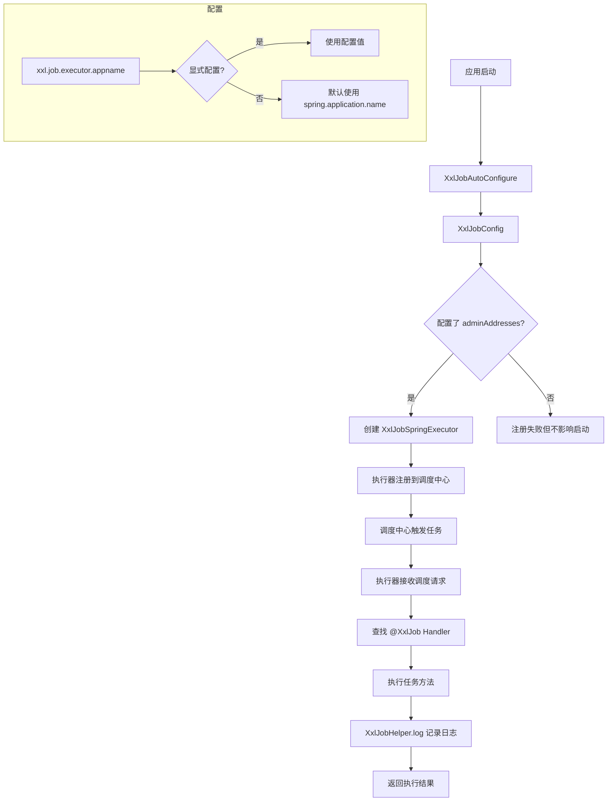

# XXL-Job 定时任务集成
- **所属模块**：sh-xxljob
- **优先级**：中
- **故事ID**：US-026

## 1. 用户故事 (User Story)
**作为** 业务开发者，
**我希望** 通过 @XxlJob 注解开发定时任务处理器，且执行器自动注册到调度中心，
**以便于** 在 XXL-Job 调度中心统一管理和监控定时任务。

## 流程图

## 2. 验收标准 (Acceptance Criteria)
- [场景1] Given 定义 @XxlJob("demoJobHandler") 方法, When 调度中心触发任务, Then 方法被执行且日志通过 XxlJobHelper.log() 记录
- [场景2] Given 配置了 xxl.job.executor.appname, When 未显式配置, Then 默认使用 spring.application.name 作为 appName
- [场景3] Given XxlJobSpringExecutor 初始化, When 应用启动, Then 执行器自动注册到调度中心（adminAddresses）
- [异常场景] Given 调度中心地址未配置, When 执行器初始化, Then 注册失败但不影响应用启动

## 3. 涉及代码与上下文 (AI开发关键)
为了完成或修改此故事，AI 需要重点阅读以下核心代码文件：
- `sh-xxljob/src/main/java/com/wkclz/xxljob/config/XxlJobConfig.java` (执行器配置，创建XxlJobSpringExecutor)
- `sh-xxljob/src/main/java/com/wkclz/xxljob/demo/XxlJobDemo.java` (任务处理器示例，@XxlJob注解使用)
- `sh-xxljob/src/main/java/com/wkclz/xxljob/XxlJobAutoConfigure.java` (自动配置入口)
