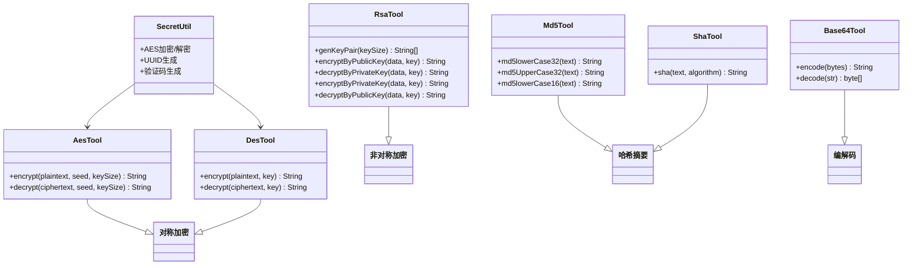

# 加密工具集（AES/DES/RSA/MD5/SHA/Base64）
- **所属模块**：sh-tool
- **优先级**：高
- **故事ID**：US-027

## 1. 用户故事 (User Story)
**作为** 业务开发者，
**我希望** 框架提供统一的加密工具集（对称/非对称加密、哈希摘要、编解码），
**以便于** 在业务代码中安全便捷地处理数据加密、签名验证和密码存储。

## 流程图

## 2. 验收标准 (Acceptance Criteria)
- [场景1] Given 调用 AesTool.encrypt("hello", "seed", 128), When 加密成功, Then 返回 Base64 编码的密文；调用 AesTool.decrypt 可还原原文
- [场景2] Given 调用 RsaTool.genKeyPair(2048), When 生成密钥对, Then 返回 [publicKey, privateKey] 数组，支持公钥加密私钥解密和私钥加密公钥解密
- [场景3] Given 调用 Md5Tool.md5lowerCase32("hello"), When 计算摘要, Then 返回 32 位小写十六进制字符串
- [异常场景] Given SHA 算法名不在白名单(SHA-1/256/384/512), When 调用 ShaTool.sha(), Then 抛出 IllegalArgumentException

## 3. 涉及代码与上下文 (AI开发关键)
为了完成或修改此故事，AI 需要重点阅读以下核心代码文件：
- `sh-tool/src/main/java/com/wkclz/tool/tools/AesTool.java` (AES对称加密，支持128/192/256位)
- `sh-tool/src/main/java/com/wkclz/tool/tools/RsaTool.java` (RSA非对称加密，基于Hutool实现)
- `sh-tool/src/main/java/com/wkclz/tool/tools/Md5Tool.java` (MD5哈希摘要，32位/16位/大小写)
- `sh-tool/src/main/java/com/wkclz/tool/tools/ShaTool.java` (SHA系列摘要，算法白名单校验)
- `sh-tool/src/main/java/com/wkclz/tool/tools/DesTool.java` (DES对称加密，56位密钥)
- `sh-tool/src/main/java/com/wkclz/tool/tools/Base64Tool.java` (Base64编解码)
