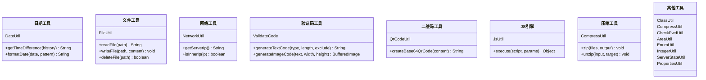

# 综合工具集（日期/文件/网络/验证码/二维码/JS引擎）
- **所属模块**：sh-tool
- **优先级**：中
- **故事ID**：US-029

## 1. 用户故事 (User Story)
**作为** 业务开发者，
**我希望** 框架提供日期处理、文件IO、网络IP、验证码生成、二维码生成、JS脚本引擎等常用工具，
**以便于** 在业务开发中直接调用，无需重复造轮子。

## 流程图

## 2. 验收标准 (Acceptance Criteria)
- [场景1] Given 调用 DateUtil.getTimeDifference(history), When history 为 2 天前, Then 返回 "2天 0时 0分 0秒"
- [场景2] Given 调用 QrCodeUtil.createBase64QrCode("https://example.com"), When 生成二维码, Then 返回 Base64 编码的二维码图片
- [场景3] Given 调用 ValidateCode.generateTextCode(TYPE_ALL_MIXED, 6, null), When 生成验证码, Then 返回 6 位字母数字混合字符串
- [异常场景] Given JsUtil 执行恶意脚本, When 脚本包含 System.exit(), Then Rhino 沙箱限制，无法执行系统操作

## 3. 涉及代码与上下文 (AI开发关键)
为了完成或修改此故事，AI 需要重点阅读以下核心代码文件：
- `sh-tool/src/main/java/com/wkclz/tool/utils/DateUtil.java` (日期工具，时间差计算)
- `sh-tool/src/main/java/com/wkclz/tool/utils/FileUtil.java` (文件工具，读写/删除/临时目录)
- `sh-tool/src/main/java/com/wkclz/tool/utils/NetworkUtil.java` (网络工具，服务器IP/内网判断)
- `sh-tool/src/main/java/com/wkclz/tool/utils/QrCodeUtil.java` (二维码工具，基于ZXing)
- `sh-tool/src/main/java/com/wkclz/tool/utils/ValidateCode.java` (验证码生成器，7种类型+图片生成)
- `sh-tool/src/main/java/com/wkclz/tool/utils/JsUtil.java` (JS脚本引擎，基于Rhino+MD5缓存)
- `sh-tool/src/main/java/com/wkclz/tool/utils/CompressUtil.java` (ZIP压缩解压，防ZipSlip)
- `sh-tool/src/main/java/com/wkclz/tool/utils/SecretUtil.java` (安全工具，AES密码加解密+UUID+验证码)
