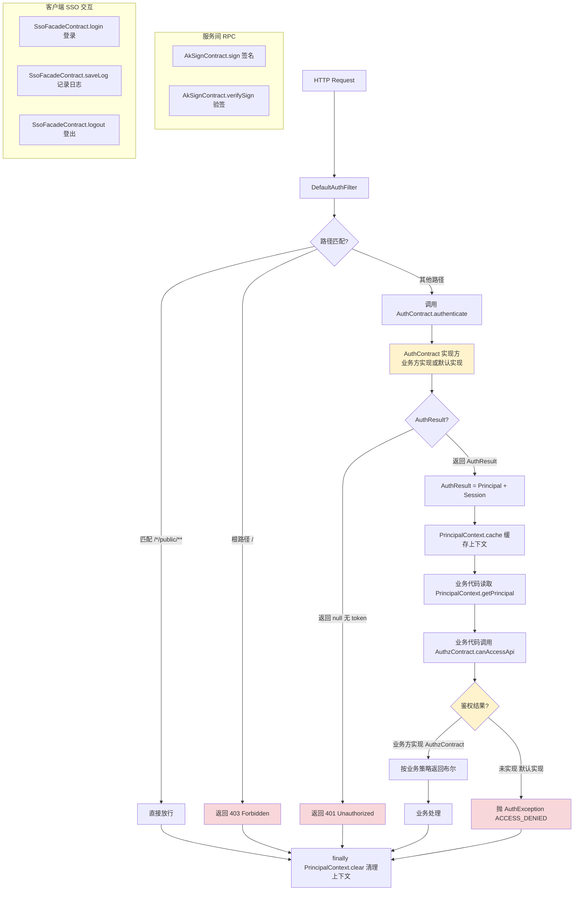

# IAM 契约层（认证/鉴权/AK 签名/SSO 门面）
- **所属模块**：sh-iam-contract
- **优先级**：高
- **故事ID**：US-031

## 1. 用户故事 (User Story)
**作为** 需要集成认证鉴权能力的业务系统开发者，
**我希望** 引入轻量级的 IAM 契约层（API 模块零业务依赖，Default 模块提供读宽容验证严格的默认实现），
**以便于** 业务系统按需引入或替换实现，避免强制依赖 JWT/Redis/HTTP Client 等重依赖。

## 流程图

> **说明**：
> - `AuthContract` / `AuthzContract` / `AkSignContract` / `SsoFacadeContract` 四契约由业务方实现，通过 `@ConditionalOnMissingBean` 替换默认实现。
> - `DefaultAuthContract` 读宽容（无 token 返回 null），`DefaultAuthzContract` 验证严格（`canAccessApi` 抛 `ACCESS_DENIED`）。

## 2. 验收标准 (Acceptance Criteria)
- [场景1] Given 业务系统引入 iam-contract-default 依赖, When Spring Boot 启动, Then IamContractAutoConfig 通过 @ConditionalOnMissingBean 注册四个默认实现 + DefaultAuthFilter
- [场景2] Given 业务系统实现 AuthContract 接口并声明 @Component, When Spring 启动, Then 业务实现 Bean 替换 DefaultAuthContract（@ConditionalOnMissingBean 阻止默认 Bean 注册）
- [场景3] Given DefaultAuthFilter 拦截请求, When 请求路径匹配 `/*/public/**`, Then 直接放行（不调用认证）
- [场景4] Given DefaultAuthFilter 拦截请求, When 请求路径为 `/`（根路径）, Then 返回 403 Forbidden
- [场景5] Given DefaultAuthFilter 拦截请求, When AuthContract.authenticate() 返回 null（无 token）, Then 返回 401 Unauthorized
- [异常场景] Given DefaultAuthzContract.canAccessApi() 被调用, When 业务系统未实现 AuthzContract, Then 抛出 AuthException(ACCESS_DENIED) 防止裸奔
- [登录失败场景1] Given SsoFacadeContract 实现方处理登录, When 用户名或密码错误, Then 返回 LoginResp.fail(USERNAME_OR_PASSWORD_ERROR)（用户名错误与密码错误合并，防用户枚举攻击；login() 永不抛业务失败异常）
- [登录失败场景2] Given SsoFacadeContract 实现方处理登录, When 账号锁定/禁用/凭据过期/验证码错误等, Then 返回 LoginResp.fail(对应 LoginFailType, 可选 failReason 动态详情)
- [登录失败场景3] Given SsoFacadeContract 默认实现被调用, When 未配置业务实现, Then 抛 UnsupportedOperationException（系统级错误，非业务登录失败）
- [登录失败场景4] Given LoginFailType 枚举, When 调用 getMessage(), Then 返回枚举内携带的中文含义（翻译在枚举内完成，不带数字 code）

## 2.1 登录失败建模

`SsoFacadeContract.login()` 的返回 `LoginResp` 同时建模登录成功与失败，login() 永不抛业务登录失败异常，由调用方判断 `LoginResp.success`。

### LoginFailType 枚举

位于 `com.wkclz.iam.contract.enums.LoginFailType`，纯枚举 + `private final String message` + `getMessage()`，**枚举内完成翻译**，不带数字 code（保持契约层中性定位）。共 10 个值：

| 枚举值 | 中文 message | 覆盖场景 |
|--------|-------------|---------|
| `USERNAME_OR_PASSWORD_ERROR` | 用户名或密码错误 | 密码登录 / LDAP 49 凭据无效；用户名错误与密码错误合并，防用户枚举 |
| `ACCOUNT_DISABLED` | 账号已禁用 | LDAP 533 账号禁用 / 管理员停用 |
| `ACCOUNT_LOCKED` | 账号已锁定 | LDAP 775 登录次数超限锁定 / 人工锁定 |
| `CREDENTIALS_EXPIRED` | 凭据已过期 | LDAP 532/773 密码过期需修改 |
| `CAPTCHA_REQUIRED` | 需要验证码 | 风控触发要求图形 / 短信验证码 |
| `CAPTCHA_ERROR` | 验证码错误 | 图形 / 短信 / 邮箱验证码校验失败 |
| `TENANT_INVALID` | 租户无效 | 租户不存在或已停用 |
| `AUTH_TYPE_UNSUPPORTED` | 认证类型不支持 | authType 不在支持列表 |
| `AUTH_IDENTIFIER_INVALID` | 三方标识无效 | authIdentifier 对应的三方账号无效 |
| `UNKNOWN` | 登录失败 | 兜底，无法归类的失败 |

### LoginResp 失败建模

在原有 5 个成功字段（token/userCode/username/nickname/avatar）基础上增加 3 个失败字段 + 3 个静态工厂：

- **字段**：`Boolean success`（是否成功）、`LoginFailType failType`（失败类型，成功时为 null）、`String failReason`（失败动态详情，成功时为 null）
- **静态工厂**：
  - `success(token, userCode, username, nickname, avatar)` → success=true，失败字段为 null
  - `fail(failType)` → success=false，failReason 为 null
  - `fail(failType, failReason)` → success=false，含动态详情（如"请 300 秒后重试"）

**语义不变量**：成功时失败字段必为 null，失败时成功字段必为 null。`failType.getMessage()` 提供固定中文标签，`failReason` 提供运行时补充——前端可优先展示 failReason，为空时回退到 failType.getMessage()。

### SsoFacadeContract.login() 语义边界

| 失败性质 | 传达方式 | 示例 |
|---------|---------|------|
| 业务登录失败 | `LoginResp.fail(failType, failReason)` 返回 | 密码错误、账号锁定、验证码错误 |
| 系统级错误 | 抛 RuntimeException | SSO 不可达、未配置实现、序列化失败 |

`DefaultSsoFacadeContract.login()` 保持抛 `UnsupportedOperationException`（系统级错误，非业务登录失败），不返回 `LoginResp.fail(UNKNOWN)`。

## 3. 涉及代码与上下文 (AI开发关键)
为了完成或修改此故事，AI 需要重点阅读以下核心代码文件：

契约 API 模块（sh-iam-contract/iam-contract-api）：
- `sh-iam-contract/iam-contract-api/src/main/java/com/wkclz/iam/contract/bean/Principal.java` (用户主体，JWT claims 映射)
- `sh-iam-contract/iam-contract-api/src/main/java/com/wkclz/iam/contract/bean/Session.java` (会话信息，含 authType/authIdentifier)
- `sh-iam-contract/iam-contract-api/src/main/java/com/wkclz/iam/contract/bean/AuthResult.java` (认证结果 = Principal + Session)
- `sh-iam-contract/iam-contract-api/src/main/java/com/wkclz/iam/contract/bean/resp/LoginResp.java` (登录响应，含失败建模：success + failType + failReason + 静态工厂)
- `sh-iam-contract/iam-contract-api/src/main/java/com/wkclz/iam/contract/enums/LoginFailType.java` (登录失败类型枚举，10 值 + 中文 message)
- `sh-iam-contract/iam-contract-api/src/main/java/com/wkclz/iam/contract/context/PrincipalContext.java` (Principal 读取上下文，基于 RequestContextHolder + ThreadLocal 双存储)
- `sh-iam-contract/iam-contract-api/src/main/java/com/wkclz/iam/contract/config/ContractSettings.java` (静态配置持有器，供 default 方法访问)
- `sh-iam-contract/iam-contract-api/src/main/java/com/wkclz/iam/contract/service/AuthContract.java` (认证契约 SPI)
- `sh-iam-contract/iam-contract-api/src/main/java/com/wkclz/iam/contract/service/AuthzContract.java` (鉴权契约 SPI，六维度重载)
- `sh-iam-contract/iam-contract-api/src/main/java/com/wkclz/iam/contract/service/AkSignContract.java` (AK 签名契约 SPI)
- `sh-iam-contract/iam-contract-api/src/main/java/com/wkclz/iam/contract/facade/SsoFacadeContract.java` (SSO 门面契约 SPI)
- `sh-iam-contract/iam-contract-api/src/main/java/com/wkclz/iam/contract/exception/AuthException.java` (契约层异常 + AuthErrorType 枚举)

默认实现模块（sh-iam-contract/iam-contract-default）：
- `sh-iam-contract/iam-contract-default/src/main/java/com/wkclz/iam/contract/defaults/service/DefaultAuthContract.java` (认证默认实现：读宽容验证严格)
- `sh-iam-contract/iam-contract-default/src/main/java/com/wkclz/iam/contract/defaults/service/DefaultAuthzContract.java` (鉴权默认实现：读返回空列表，canAccessApi 抛 ACCESS_DENIED)
- `sh-iam-contract/iam-contract-default/src/main/java/com/wkclz/iam/contract/defaults/service/DefaultAkSignContract.java` (AK 签名默认实现：sign/verifySign 抛异常)
- `sh-iam-contract/iam-contract-default/src/main/java/com/wkclz/iam/contract/defaults/facade/DefaultSsoFacadeContract.java` (SSO 门面默认实现：login 抛异常，saveLog/logout 静默)
- `sh-iam-contract/iam-contract-default/src/main/java/com/wkclz/iam/contract/defaults/filter/DefaultAuthFilter.java` (鉴权过滤器：根路径拒绝/public 放行/调用 SPI/缓存上下文/finally 清理)
- `sh-iam-contract/iam-contract-default/src/main/java/com/wkclz/iam/contract/defaults/config/ContractConfig.java` (@Value 配置绑定 + @PostConstruct 同步 ContractSettings)
- `sh-iam-contract/iam-contract-default/src/main/java/com/wkclz/iam/contract/defaults/config/IamContractAutoConfig.java` (@AutoConfiguration + @ConditionalOnMissingBean 注册默认实现)
- `sh-iam-contract/iam-contract-default/src/main/resources/META-INF/spring/org.springframework.boot.autoconfigure.AutoConfiguration.imports` (自动配置注册)
